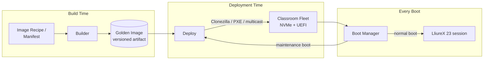
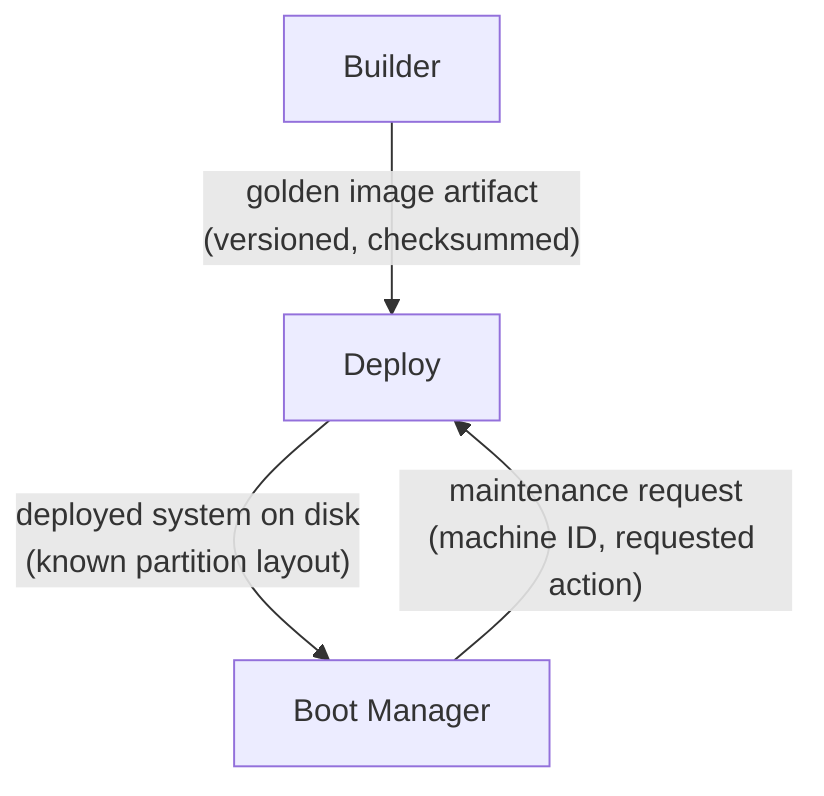

# Architecture

This document describes the system architecture of Batoi Classroom Suite (BCS): the components it is made of, the responsibilities and boundaries of each, how they exchange data, and the key architectural decisions behind that shape.

For requirements-level detail, see [SPECIFICATION.md](SPECIFICATION.md). For the reasoning behind individual decisions, see the [Architecture Decision Records](docs/decisions/).

## 1. Problem Statement

A LliureX computer classroom is a room of physically identical (or near-identical) PCs that must:

1. Boot into a known-good, consistent operating environment every session, regardless of what the previous group of students did to the machine.
2. Be re-imaged quickly and reliably at scale (a whole classroom, or a whole centre) when the golden environment changes — a new school year, a new LliureX release, a new set of subject-specific software.
3. Be recoverable by a single technician without a truck roll to every machine, using commodity hardware: UEFI firmware and NVMe storage.

No single existing tool covers all three concerns end-to-end for this target platform. BCS is the integration layer that makes them work together as one system, split into three independently-versioned components.

## 2. System Overview

The three components map directly onto the three phases of a classroom PC's lifecycle:

| Phase | Component | Question it answers |
|---|---|---|
| Build time | **Builder** | "What, exactly, should every classroom PC run?" |
| Deployment time | **Deploy** | "How does that get onto 20–30 physical machines at once?" |
| Every boot | **Boot Manager** | "What does this specific machine do the moment it is powered on?" |

## 3. Components

### 3.1 Boot Manager

**Responsibility:** own everything that happens between power-on and a usable LliureX session (or a deliberate maintenance action).

- Manages UEFI boot entries and presents a themed boot menu (branding assets live in [`assets/`](assets/)).
- Provides a "normal" path straight into the installed LliureX 23 system.
- Provides a "maintenance" path that hands control to **Deploy** — e.g., to request re-imaging, join a scheduled classroom-wide deployment session, or boot into a recovery/diagnostic environment — without the technician touching UEFI firmware settings by hand.
- Is defensive by design: it must degrade to a safe, bootable fallback if its own configuration is missing or corrupted, since it is the one component that runs unattended on every single boot of every single machine.

Detail: [docs/architecture/boot-manager.md](docs/architecture/boot-manager.md), [docs/specifications/boot-manager.md](docs/specifications/boot-manager.md).

### 3.2 Builder

**Responsibility:** turn a declarative description of "what a classroom PC should be" into a versioned, reproducible disk image.

- Consumes a declarative recipe — the `spec.builder`/`spec.packages` sections of the unified [BCS configuration](docs/CONFIGURATION.md) (package sets, configuration, branding, per-subject software) — targeting LliureX 23 on Ubuntu 24.04 LTS.
- Produces a golden image in a format consumable by the deployment engine (Clonezilla / partclone-compatible partition images), including a correctly laid out UEFI ESP (EFI System Partition) for NVMe targets.
- Is the single point where package versions, base OS version, and classroom customisation are pinned — so that two builds from the same recipe produce the same result.
- Publishes build artifacts with a version identifier consistent with [`VERSION`](VERSION) and [`CHANGELOG.md`](CHANGELOG.md).

Detail: [docs/architecture/builder.md](docs/architecture/builder.md), [docs/specifications/builder.md](docs/specifications/builder.md).

### 3.3 Deploy

**Responsibility:** get a Builder-produced golden image onto a fleet of physical machines, and confirm it arrived intact.

- Orchestrates Clonezilla-based imaging sessions (unicast for one machine, multicast for a whole classroom) over the classroom network.
- Integrates with PXE network boot so machines can be brought into a deployment session without local media.
- Restores the full disk layout expected by Boot Manager on NVMe targets, including the UEFI ESP and any recovery partition.
- Verifies deployed images (checksums / integrity checks) and produces a deployment report per machine and per session.
- Is the counterpart Boot Manager calls into when a machine requests re-imaging from its maintenance path.

Detail: [docs/architecture/deploy.md](docs/architecture/deploy.md), [docs/specifications/deploy.md](docs/specifications/deploy.md).

## 4. Component Boundaries

The three components are deliberately decoupled and independently versioned. This is an explicit design choice — see [ADR-0002](docs/decisions/0002-three-component-separation.md) — motivated by the fact that they change on different cadences and have different operators:

- **Builder** changes when the curriculum, package set, or base OS changes (roughly once per school term/year).
- **Deploy** changes when classroom network topology or imaging strategy changes (rare, infrastructure-level).
- **Boot Manager** changes when the on-machine boot/maintenance experience changes, and it is the only component whose code runs on every classroom PC at every boot.

They communicate through **artifacts and well-defined interfaces**, not shared code or shared runtime state:

| Interface | Producer | Consumer | Contract |
|---|---|---|---|
| Golden image artifact | Builder | Deploy | Versioned, checksummed image in a Clonezilla-compatible format; see [docs/specifications/builder.md](docs/specifications/builder.md) |
| Deployed disk layout | Deploy | Boot Manager | Partition layout (ESP + root + recovery) that Boot Manager can discover at boot; see [docs/specifications/deploy.md](docs/specifications/deploy.md) |
| Maintenance request | Boot Manager | Deploy | Trigger for re-imaging or joining a scheduled deployment session; see [docs/specifications/boot-manager.md](docs/specifications/boot-manager.md) |

## 5. Cross-Cutting Concerns

- **Security & integrity.** Golden images are checksummed by Builder and verified by Deploy; UEFI Secure Boot compatibility is a first-class constraint on Boot Manager. See [SECURITY.md](SECURITY.md).
- **Localisation.** LliureX serves a bilingual (Valencian/Spanish) audience; Boot Manager's UI and Builder's default recipe must support both, with English as the documentation and code-comment language.
- **Observability.** Deploy must produce per-machine, per-session logs/reports usable by a single technician managing many classrooms; this is a non-functional requirement, not an afterthought.
- **Hardware scope.** All three components target UEFI + NVMe as the primary supported hardware profile. Legacy BIOS and spinning-disk support are explicitly out of scope for v1.0 (see [SPECIFICATION.md](SPECIFICATION.md)).

## 6. What BCS Is Not

- Not a general-purpose configuration management tool (no attempt to replace Ansible/Puppet/etc. for arbitrary fleets).
- Not a replacement for Clonezilla — Deploy orchestrates Clonezilla rather than reimplementing disk cloning.
- Not a curriculum or educational-content project — BCS is infrastructure that delivers whatever LliureX and centre-specific software is defined in the Builder recipe.

## 7. Architecture Decision Records

Significant, hard-to-reverse decisions are recorded as ADRs in [docs/decisions/](docs/decisions/), following the process in [docs/decisions/README.md](docs/decisions/README.md). Start with:

- [ADR-0001 — Record architecture decisions](docs/decisions/0001-record-architecture-decisions.md)
- [ADR-0002 — Three-component separation](docs/decisions/0002-three-component-separation.md)
- [ADR-0003 — Clonezilla as the deployment engine](docs/decisions/0003-clonezilla-as-deployment-engine.md)
- [ADR-0004 — Bash as the primary implementation language](docs/decisions/0004-bash-as-primary-implementation-language.md)
- [ADR-0005 — YAML as the unified configuration format](docs/decisions/0005-yaml-as-unified-configuration-format.md)
- [ADR-0006 — `bcs` as a unified CLI, not three component CLIs](docs/decisions/0006-bcs-unified-cli-architecture.md)

## 8. Operator Interface

Sections 3–7 describe the three components as they relate to *each other*. A human still needs one thing to type. That's [`bcs`](docs/CLI.md), a single command-line tool that dispatches to whichever component owns a given command (`build` → Builder; `install`/`deploy`/`backup`/`restore` → Deploy; `doctor`/`validate`/`version`/`config`/`update` are cross-cutting CLI concerns owned by none of the three) without becoming a fourth component itself — `bcs` contains no business logic of its own, only dispatch, environment diagnostics, and configuration validation. See [ADR-0006](docs/decisions/0006-bcs-unified-cli-architecture.md) for why one CLI rather than one per component, and [docs/CLI.md](docs/CLI.md) for the complete design: commands, global options, exit codes, and the plugin mechanism third parties use to extend it without modifying `bcs` itself.
