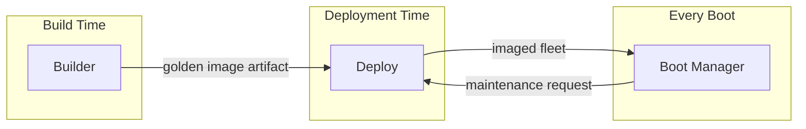

# Batoi Classroom Suite (BCS)

**An enterprise-grade deployment platform for LliureX computer classrooms.**

[](LICENSE)
[](CHANGELOG.md)
[](ROADMAP.md)
[](.github/workflows/ci.yml)
[](CONTRIBUTING.md)
[](CODE_OF_CONDUCT.md)

---

## Mission

Batoi Classroom Suite (BCS) exists to make it possible for a single technician to **build, boot, and deploy** a fleet of educational computer labs, reliably and repeatably, without manual per-machine intervention.

It is developed at **CIPFP Batoi** to solve a real, recurring problem in Valencian public education: keeping hundreds of classroom PCs running a consistent, up-to-date [LliureX](https://lliurex.net/) environment across school years, hardware refresh cycles, and student "creative" use of the machines.

## Target Environment

BCS is designed and specified against a concrete, opinionated target platform rather than a generic "any Linux, any hardware" abstraction:

| Dimension | Target |
|---|---|
| Operating system | LliureX 23 |
| Base distribution | Ubuntu 24.04 LTS |
| Firmware | UEFI (Secure Boot aware) |
| Storage | NVMe (M.2) solid-state drives |
| Deployment engine | Clonezilla |
| Deployment context | Shared, multi-seat educational computer classrooms |

See [SPECIFICATION.md](SPECIFICATION.md) for the full compatibility matrix and requirements.

## Components

BCS is composed of three cooperating components, each with a single, well-defined responsibility:

| Component | Responsibility | Docs |
|---|---|---|
| **[Boot Manager](boot-manager/)** | Owns the boot-time experience on each classroom PC: UEFI boot entries, boot menu, and the recovery/maintenance path back into deployment. | [Architecture](docs/architecture/boot-manager.md) · [Specification](docs/specifications/boot-manager.md) |
| **[Builder](builder/)** | Produces the versioned, reproducible "golden image" of LliureX 23 that gets deployed to classrooms. | [Architecture](docs/architecture/builder.md) · [Specification](docs/specifications/builder.md) |
| **[Deploy](deploy/)** | Distributes golden images from Builder onto classroom fleets using Clonezilla, and verifies the result. | [Architecture](docs/architecture/deploy.md) · [Specification](docs/specifications/deploy.md) |

A technician reaches all three through one tool, [`bcs`](docs/CLI.md) — see [ARCHITECTURE.md §8](ARCHITECTURE.md#8-operator-interface). Its framework (`--help`, `version`, `doctor`, `validate`) is implemented, in Python, under [cli/](cli/); `build`/`install`/`deploy`/`backup`/`restore`/`update`/`config` are stubs pending the components below.

A full description of how these three components fit together — including data flow and lifecycle diagrams — is in [ARCHITECTURE.md](ARCHITECTURE.md).



Boot Manager, Builder, and Deploy are independently versioned and communicate only through the artifacts and interfaces shown above — see [ARCHITECTURE.md §4](ARCHITECTURE.md#4-component-boundaries) and [ADR-0002](docs/decisions/0002-three-component-separation.md) for why.

## Project Status

BCS is primarily in its **architecture and specification phase**: Boot Manager, Builder, and Deploy remain documentation only, so the three components can be built independently, later, without integration surprises. The one implemented exception is the **`bcs` CLI framework** (see [cli/](cli/)) — global options, logging, configuration loading/validation, and the `version`/`doctor`/`validate` commands, with automated tests, linting, type-checking, and CI already in place.

Track progress in [ROADMAP.md](ROADMAP.md) and [CHANGELOG.md](CHANGELOG.md).

## Documentation

| Document | Purpose |
|---|---|
| [ARCHITECTURE.md](ARCHITECTURE.md) | System design, component boundaries, data flow |
| [SPECIFICATION.md](SPECIFICATION.md) | Functional and non-functional requirements |
| [ROADMAP.md](ROADMAP.md) | Phased delivery plan and current milestone |
| [CONTRIBUTING.md](CONTRIBUTING.md) | How to propose changes, ADRs, and contribution workflow |
| [SECURITY.md](SECURITY.md) | Supported versions and vulnerability reporting |
| [CODE_OF_CONDUCT.md](CODE_OF_CONDUCT.md) | Community standards |
| [AGENTS.md](AGENTS.md) / [CLAUDE.md](CLAUDE.md) | Working agreement for AI coding agents contributing to this repo |
| [docs/](docs/) | Deep-dive architecture, specifications, ADRs, standards, processes, guides, and glossary |
| [docs/repository-organization.md](docs/repository-organization.md) | Canonical explanation of this repository's folder structure |
| [docs/standards/](docs/standards/) | Coding, Bash, Markdown, and naming conventions |
| [docs/processes/](docs/processes/) | Development workflow and release process |
| [docs/CONFIGURATION.md](docs/CONFIGURATION.md) | The unified YAML configuration format that drives all three components |
| [docs/CLI.md](docs/CLI.md) | Complete design of `bcs`, the command-line interface into all three components |
| [cli/README.md](cli/README.md) | `bcs` CLI implementation: setup, layout, and quality-gate commands |
| [.github/DISCUSSIONS.md](.github/DISCUSSIONS.md) | GitHub Discussions category guide |
| [REVIEW.md](REVIEW.md) | Independent architecture review and open findings |

## Repository Layout

```
batoi-classroom-suite/
├── boot-manager/     # UEFI boot menu & recovery path (see boot-manager/README.md)
├── builder/          # Golden image build pipeline (see builder/README.md)
├── deploy/           # Fleet deployment via Clonezilla (see deploy/README.md)
├── cli/              # bcs CLI — implemented, Python (see cli/README.md, docs/CLI.md)
├── config/           # Unified YAML configuration: schema + reference example
│   ├── schema.yaml       # Normative JSON Schema (docs/CONFIGURATION.md)
│   └── examples/         # default.yaml — copy this to start a new classroom
├── docs/             # Architecture deep-dives, specifications, ADRs, standards, processes, guides
│   ├── architecture/     # Per-component design
│   ├── specifications/   # Per-component requirements
│   ├── decisions/        # Architecture Decision Records
│   ├── standards/        # Coding, Bash, Markdown, naming conventions
│   ├── processes/        # Development workflow, release process
│   └── guides/           # Getting started, FAQ
├── assets/           # Branding assets shared across components (logos, icons, fonts, backgrounds)
├── scripts/          # Maintainer/CI helper scripts (placeholder, see scripts/README.md)
├── tools/            # Developer tooling (placeholder, see tools/README.md)
├── tests/            # Cross-component test strategy (placeholder, see tests/README.md)
└── .github/          # Issue templates, PR template, label taxonomy, Discussions guide
```

See [docs/repository-organization.md](docs/repository-organization.md) for the full reasoning behind this layout.

## Contributing

Contributions are welcome, especially during this documentation-first phase: reviewing the architecture, challenging assumptions in the specification, and proposing [Architecture Decision Records](docs/decisions/) are as valuable as code will be later.

Please read [CONTRIBUTING.md](CONTRIBUTING.md) before opening an issue or pull request, and note that this project is governed by our [Code of Conduct](CODE_OF_CONDUCT.md). For open-ended questions and design conversation, see [GitHub Discussions](https://github.com/nino79/batoi-classroom-suite/discussions) and its [category guide](.github/DISCUSSIONS.md).

## Development & Release

The full development workflow (branching, review, CI expectations) and release process (versioning, checklist) are documented in [docs/processes/](docs/processes/). Coding conventions — including [Bash style](docs/standards/bash-style-guide.md), [Markdown style](docs/standards/markdown-style-guide.md), and [naming conventions](docs/standards/naming-conventions.md) — live in [docs/standards/](docs/standards/).

## Security

If you believe you have found a security vulnerability, please **do not** open a public issue. Follow the responsible disclosure process described in [SECURITY.md](SECURITY.md).

## License

Batoi Classroom Suite is released under the [MIT License](LICENSE).

## Maintained by

[CIPFP Batoi](https://www.cipfpbatoi.es/) — a vocational training centre in Alcoi (Valencian Community, Spain), for the benefit of the wider [LliureX](https://lliurex.net/) community.
