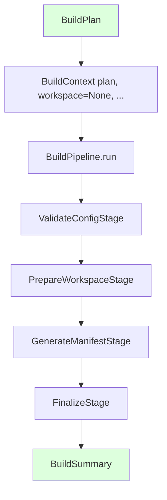

# Builder Architecture — Software Design for `bcs build`

**Status:** Proposed, pending design review. **This document describes `cli/src/bcs/builder/` as it actually exists in the repository as of 2026-07-09**, not an independently-designed proposal — see [§ Documentation Note](#documentation-note-a-concurrent-implementation) for why, and [§ Findings](#findings-worth-a-maintainer-decision) for concrete issues found while writing this description that are not this document's to fix.

**Scope:** this document is the *software architecture* — the Python types, interfaces, and control flow behind `cli/src/bcs/builder/`. It does not replace or restate [docs/BUILDER_PIPELINE.md](BUILDER_PIPELINE.md) (the 8-stage pipeline definition, stage contracts, and exit-code table) or [docs/architecture/builder.md](architecture/builder.md) (the component-level design rationale, `BLD-00x` mapping) — it sits on top of both. Read those two documents first; this one assumes them, and — see § Findings — is not fully reconciled with the first of the two.

---

## Documentation Note: A Concurrent Implementation

This document was originally drafted as an independent design proposal (frozen `BuildContext`, a fail-fast `BuildPipeline` modeled on `HostDiscoveryOrchestrator`'s coordination shape, minimal Protocol-only scaffolding). While that first draft was being written, a **separate, concurrent session** built a complete, functioning `cli/src/bcs/builder/` package directly in the same files — a different, mutable-`BuildContext`, non-fail-fast architecture, with real file-I/O logic (directory creation, SHA-256 checksums, JSON serialization), not scaffolding. That package's own module docstring (`stages.py`) states explicitly: *"Stages are real implementations — they validate, create directories, generate manifests, and finalise output — not TODOs or stubs."*

Per an explicit decision from the user (lead engineer for this session): **`cli/src/bcs/builder/`'s actual `.py` files are left exactly as that concurrent session wrote them — nothing in this pass modifies, reverts, or extends them.** This document was rewritten to accurately describe that existing code instead of proposing a competing design that had already been overwritten twice during drafting. Anyone reading this document should treat it as **descriptive of current code**, not as this pass's own architectural proposal — the actual design decisions embedded below (mutability, error-isolation-vs-fail-fast, JSON provenance format) were made by that other session, not derived or endorsed here.

---

## Builder Responsibilities

Restated from [docs/architecture/builder.md § Responsibilities](architecture/builder.md#responsibilities) and [ARCHITECTURE.md § 3.2](../ARCHITECTURE.md#32-builder) — unchanged by this pass:

- Accept a declarative recipe (`spec.builder`/`spec.packages` in a `ClassroomConfig` document, `BLD-001`).
- Produce a versioned, traceable image artifact (`BLD-002`).
- Produce Clonezilla/partclone-compatible output (`BLD-003`).
- Lay out a UEFI-compatible (GPT + ESP) partition scheme for NVMe targets (`BLD-004`).
- Produce reproducible builds from the same recipe and pinned inputs (`BLD-005`).
- Record build provenance (`BLD-006`).
- **Not** distribute images (Deploy's job) or decide *when* a classroom gets re-imaged.

**As implemented today, `cli/src/bcs/builder/` does not yet touch any of `BLD-002`–`BLD-006` directly** — its own package docstring scopes itself to "pipeline orchestration, workspace management, manifest handling, and stage execution... does **not** implement image creation, Clonezilla integration, or Deploy interaction." It is infrastructure the eventual `BLD-00x`-satisfying stages will run on top of, not those stages themselves (yet).

---

## Build Pipeline (as implemented)



**This is 4 stages, not the 8 defined in `docs/BUILDER_PIPELINE.md`** (`ValidateConfigStage`, `PrepareWorkspaceStage`, `GenerateManifestStage`, `FinalizeStage` — no separate Resolve Assets, Generate Metadata, Copy Boot Resources, Generate Artifacts, or Cleanup stage classes exist as of this writing). See [§ Findings](#findings-worth-a-maintainer-decision) — whether this is an intentional first-slice subset of the 8, or a divergent stage model, is not resolved by any commit message or doc this pass could find.

**Coordination model — a real, documented divergence from `docs/BUILDER_PIPELINE.md`'s own design:** `BuildPipeline.run()`'s own docstring states: *"The pipeline does **not** stop on a stage failure: subsequent stages still execute (callers inspect `BuildSummary.success` to determine overall outcome)."* This is the opposite of `docs/BUILDER_PIPELINE.md`'s own per-stage exit-code table, where nearly every stage's failure behavior is "Stop immediately" or "Stop, keep workspace." It is also the opposite of what an earlier draft of this document (see § Documentation Note) proposed, reasoning by analogy from `HostDiscoveryOrchestrator`'s isolate-and-continue model — reasoning this document no longer endorses, since the actual code took the isolate-and-continue shape for a *sequential, dependent* pipeline where later stages generally need earlier stages' output, an even less obviously appropriate fit than for HDO's independent-domains case. This is flagged, not resolved, here.

---

## BuildContext

**As implemented, `BuildContext` is mutable** (`@dataclass`, not `frozen=True`) — an accumulator threaded through the whole pipeline, explicitly contrasted in its own docstring with `bcs.context.RuntimeContext` ("unlike `RuntimeContext`... `BuildContext` accumulates state as the pipeline progresses").

| Field | Type | Purpose |
|---|---|---|
| `plan` | `BuildPlan` | Set at construction, never changed. |
| `workspace` | `BuildWorkspace \| None` | `None` until `PrepareWorkspaceStage` runs. |
| `metadata` | `BuildMetadata \| None` | `None` until `FinalizeStage` runs. |
| `stage_results` | `list[BuildStageResult]` | Append-only; every stage appends its own result. |
| `artifacts` | `list[BuildArtifact]` | Append-only; cumulative across all stages. |

Contract (per the module's own docstring): stages may append to `stage_results`/`artifacts` and set `metadata`, and read `plan`/`workspace`, but should not overwrite fields set by earlier stages — a convention, not something the type system enforces (nothing prevents a stage from reassigning `context.workspace`; the mutability is real, not append-only at the type level).

`BuildContext` does not hold a `bcs.context.RuntimeContext` at all — no `console`, no `command_runner`, no `config_loader` reuse from the enclosing CLI invocation. Whatever eventually constructs a `BuildContext` (no `bcs.commands.build` exists yet) will need to bridge from `RuntimeContext` itself; that bridging code doesn't exist yet either.

---

## BuildPlan

An immutable (`frozen=True`) Pydantic model — the one genuinely frozen type in this package, standing in contrast to the mutable `BuildContext` it seeds.

| Field | Type | Purpose |
|---|---|---|
| `config_path` | `Path` | The `ClassroomConfig` YAML driving this build. |
| `workspace_root` | `Path \| None` | Override; `None` means the workspace manager picks a default. |
| `stages` | `tuple[str, ...]` | Explicit stage names to run; empty means all registered stages, in registration order. |
| `keep_workspace` | `bool` | Mirrors `docs/BUILDER_PIPELINE.md`'s `--keep-workspace`. |
| `verbose` | `bool` | Verbosity flag for stage output. |

Notably: `config_path` is a raw `Path`, not a parsed `ClassroomConfig`/`bcs.config.models` object — `BuildPlan` does not itself validate or resolve the recipe; that's `ValidateConfigStage`'s job at pipeline run time, not something available before the pipeline runs. This differs from `docs/BUILDER_PIPELINE.md`'s own framing of Stage 1 producing a "resolved configuration" *before* the rest of the pipeline consumes it — here, the plan carries only the unresolved path, and resolution happens inside the pipeline's first stage instead of gating entry to it.

---

## BuildManifest

| Field | Type | Purpose |
|---|---|---|
| `manifest_version` | `str` | e.g. `"bcs-build-manifest/v1alpha1"`. |
| `plan` | `BuildPlan` | The plan this build executed against. |
| `artifacts` | `tuple[BuildArtifact, ...]` | Every artifact produced, in insertion order. |
| `stage_results` | `tuple[BuildStageResult, ...]` | Every stage's result, in execution order. |

Serialized/deserialized via `bcs.builder.manifest.save_manifest`/`load_manifest`, which wrap `model_dump(mode="json", by_alias=True)`/`model_validate` — consistent with the `camelCase`-JSON convention `ADR-0008` established for Host Inventory, applied here independently (this package does not import anything from `bcs.inventory`).

This is a materially different shape from `docs/BUILDER_PIPELINE.md`'s own Stage 4 definition of "manifests" (three separate files: `packages.yaml`, `layout.yaml`, `boot-entries.yaml`, describing what to *build* — package lists, disk layout, boot entries). The implemented `BuildManifest` instead describes what a build *did* — artifacts produced and stage outcomes — closer in spirit to `docs/BUILDER_PIPELINE.md`'s Stage 5 "provenance record" than its Stage 4 "manifests." No package-list/disk-layout/boot-entry model exists yet anywhere in this package.

---

## Artifact Model

`BuildArtifact` — per-file metadata for one file produced during a build (not a whole golden image; the package's own docstring explicitly excludes image creation from its current scope):

| Field | Type | Purpose |
|---|---|---|
| `path` | `str` | Relative path from the workspace root. |
| `artifact_type` | `str` | Free-text category: `'manifest'`, `'provenance'`, `'log'`, `'version'`, `'layout'`, `'boot-config'`. |
| `checksum_sha256` | `str \| None` | `None` until computed via `bcs.builder.execution.compute_file_checksum`. |
| `size_bytes` | `int \| None` | `None` until the file is written. |

`BuildMetadata` (provenance fields: `build_timestamp`, `tool_version`, `git_commit`, `recipe_path`, `recipe_checksum`) and `BuildSummary` (the whole-invocation aggregate: `plan`, `stage_results`, `success`, `elapsed_seconds`) round out the model set. There is **no single "golden image artifact" type** yet — matching the package's own stated scope boundary ("no image creation"), but meaning `BLD-002`/`BLD-003`/`BLD-004` (versioned artifact, Clonezilla output, GPT/ESP layout) have no modeled representation anywhere in this package today.

---

## Build Stages (as implemented)

`BuildStage` is a `@runtime_checkable` `Protocol` (`name: str` property, `run(context: BuildContext) -> BuildStageResult`), matching `bcs.platform.execution.CommandRunner`'s own structural-typing convention. Four concrete implementations exist in `bcs.builder.stages`: `ValidateConfigStage`, `PrepareWorkspaceStage`, `GenerateManifestStage`, `FinalizeStage` — each, per that module's own docstring, "real implementations... not TODOs or stubs."

`BuildPipeline` (`bcs.builder.pipeline`) holds an ordered `Sequence[BuildStage]`, filters by `BuildPlan.stages` if non-empty, and runs each selected stage — see [§ Build Pipeline](#build-pipeline-as-implemented) above for its actual (non-fail-fast) execution semantics.

**A specific inconsistency found while describing this, not fixed here:** `BuildPipeline.run()`'s own docstring states *"exceptions that are not `BuilderError` subclasses are **not** caught — they propagate immediately and terminate the pipeline"* — but its actual implementation wraps every stage call in a bare `except Exception as exc: # noqa: BLE001`, which catches everything, contradicting that docstring claim outright. See [§ Findings](#findings-worth-a-maintainer-decision).

---

## Validation Stages

`ValidateConfigStage` is the one implemented validation stage. This document cannot yet describe its exact validation rules in more detail than that class's own docstring already states — a full read of `stages.py`'s `ValidateConfigStage` implementation is out of scope for this pass, which is documenting the package's shape, not auditing every line of a still-actively-changing file (this package's contents changed multiple times during this document's own drafting; see § Documentation Note).

---

## Error Handling (as implemented)

```
BuilderError (base)
├── WorkspaceError    — workspace creation/cleanup failures
├── ManifestError      — manifest read/write/validation failures
├── PipelineError       — orchestration errors (empty stage list, etc.)
├── ValidationError      — config/plan validation failures
└── ArtifactError         — artifact production/verification failures
```

Every subclass carries `message` plus an optional `details: dict[str, object]` for structured context (e.g. `WorkspaceError`'s `details={"path": ..., "error": ...}`) — a different shape from an earlier draft of this document, which proposed a `stage_code: int` tied directly to `docs/BUILDER_PIPELINE.md`'s own per-stage exit-code numbers. The implemented `details` dict is more flexible (arbitrary structured context per error) but does not carry a machine-readable link back to BUILDER_PIPELINE.md's exit-code table at all — nothing in this hierarchy currently reconciles the two documents' differing failure-classification schemes. That reconciliation (this document's earlier draft attempted one) remains undone.

`BuilderError` is independent of `bcs.platform.errors.PlatformError` and `bcs.errors.BcsError`, matching the precedent `ADR-0009` set for the Platform Layer — confirmed by direct inspection: `bcs.builder` imports nothing from either.

---

## Rollback Philosophy

**Implemented today: none, explicitly.** `BuildWorkspaceManager.clean()` performs an unconditional `shutil.rmtree()` of the entire workspace root on request — a full discard, never a partial repair, consistent with the "discard and retry wholesale" philosophy an earlier draft of this document proposed by analogy to `ADR-0008`'s immutable-snapshot reasoning. Nothing in the implemented stages attempts to resume or repair a partially-completed workspace; `BuildWorkspaceManager.create()` raises `WorkspaceError` outright if the target root already exists and is non-empty, rather than reusing or merging into it. This much of the earlier draft's proposed philosophy does hold, as an observation about the actual code rather than a design recommendation.

No stage implemented so far performs privileged operations (`mount`, `losetup`, `debootstrap`) — `docs/BUILDER_PIPELINE.md`'s Stage 7 (the one stage with genuine partial-completion risk) has no implementation counterpart in this package yet, so the harder rollback question that stage would raise remains entirely theoretical at this point.

---

## Future Deploy Integration

Unchanged from architectural first principles regardless of which draft of this document you're reading: per [ARCHITECTURE.md § 4 Component Boundaries](../ARCHITECTURE.md#4-component-boundaries) and [AGENTS.md Hard Constraint 3](../AGENTS.md#hard-constraints), Deploy should depend on whatever `bcs.builder` eventually designates as its stable output boundary — today, that would be `BuildManifest`/`BuildSummary`, since no golden-image `Artifact` type exists yet (see [§ Artifact Model](#artifact-model)). This is very likely to change once Stage 7-equivalent (image assembly) and Stage 5-equivalent (full provenance) functionality exists; this document does not attempt to lock in today's `BuildManifest` shape as that eventual boundary, since it demonstrably describes "what a build did" (an audit record) more than "what Deploy consumes" (an artifact + verifiable provenance).

---

## Minimum Python Package Layout (as implemented)

```
cli/src/bcs/builder/
├── __init__.py       # Re-exports every public name below.
├── context.py         # BuildContext (mutable dataclass, accumulator pattern).
├── models.py           # BuildPlan, BuildArtifact, BuildManifest, BuildWorkspace,
│                        # BuildStageResult, BuildSummary, BuildMetadata — all frozen Pydantic.
├── errors.py             # BuilderError hierarchy (WorkspaceError, ManifestError,
│                          # PipelineError, ValidationError, ArtifactError).
├── execution.py            # Real file-I/O helpers: ensure_directory, compute_file_checksum,
│                            # copy_file, read_json, write_json. Not scaffolding — functional.
├── workspace.py              # BuildWorkspaceManager — real directory create/clean logic.
├── manifest.py                 # save_manifest/load_manifest — real JSON serialization.
├── protocols.py                  # BuildStage Protocol (structural, @runtime_checkable).
├── pipeline.py                     # BuildPipeline coordinator — real orchestration logic.
└── stages.py                        # ValidateConfigStage, PrepareWorkspaceStage,
                                     # GenerateManifestStage, FinalizeStage — real implementations.
```

**This is a real, mostly-functional package, not scaffolding** — contrary to this session's own original instruction ("Do not implement functionality yet... No feature implementation"), which this document's earlier draft honored and which the concurrent session's actual commits did not. See [§ Findings](#findings-worth-a-maintainer-decision).

---

## Findings Worth a Maintainer Decision

Collected while writing this document, none acted on — all are for a human maintainer to resolve, not this pass:

1. **Scope mismatch against this session's own explicit instruction.** This session's own instructions for producing `docs/BUILDER_ARCHITECTURE.md` were explicit: *"Do not implement functionality yet... No feature implementation."* The concurrent session's code — real directory creation/deletion, real checksum computation, real JSON I/O, four stage classes its own docstring calls "real implementations... not TODOs or stubs" — appears to exceed that bound substantially, though it may have been operating under different, more permissive instructions this document has no visibility into. Worth confirming directly with whoever is driving that session.
2. **`BuildPipeline`'s stage-failure semantics contradict `docs/BUILDER_PIPELINE.md`.** Non-fail-fast (implemented) vs. fail-fast, stop-and-keep-workspace (documented, already committed at `docs/BUILDER_PIPELINE.md`, itself part of commit `4332872`). One of the two needs to change, or the divergence needs to be an explicit, justified design decision recorded somewhere — right now it exists only as an unremarked contradiction between two documents/artifacts.
3. **`BuildPipeline.run()`'s docstring contradicts its own implementation.** Documented: "exceptions that are not `BuilderError` subclasses... propagate immediately." Implemented: a bare `except Exception`. A real, small, low-risk bug (or a stale docstring) either way — flagged, not fixed, per this pass's own "touch production code only if you discover a genuine defect" instruction interacting with the user's separate "stop touching `cli/src/bcs/builder/` entirely" decision for this specific pass.
4. **Stage count mismatch.** 4 implemented stages vs. 8 documented in `docs/BUILDER_PIPELINE.md`. Unclear whether this is an intentional first slice (with the remaining 4 to follow) or a genuinely different stage model — no commit message or code comment this pass found states which.
5. **`ADR-0004` is still unresolved.** Everything in [§ Documentation Note](#documentation-note-a-concurrent-implementation) happened without a superseding ADR for Builder's primary-language choice existing — this document's earlier draft flagged this as a gap to close before real implementation began; real implementation began anyway, concurrently with that flag being written. The ADR gap is now more urgent, not less.

---

## Related Documents

- [docs/architecture/builder.md](architecture/builder.md) — component-level design rationale, `BLD-00x` requirement mapping.
- [docs/specifications/builder.md](specifications/builder.md) — normative requirement detail.
- [docs/BUILDER_PIPELINE.md](BUILDER_PIPELINE.md) — the 8-stage pipeline definition; see § Findings for where the implemented code now diverges from it.
- [docs/decisions/0004-bash-as-primary-implementation-language.md](decisions/0004-bash-as-primary-implementation-language.md) — the ADR Builder's Python-primary, CLI-embedded implementation still has not formally superseded.
- [docs/decisions/0008-host-inventory-ports-and-adapters.md](decisions/0008-host-inventory-ports-and-adapters.md) — the immutability/JSON-canonical precedent `BuildPlan`/`BuildManifest`/etc. follow (`BuildContext` itself deliberately does not).
- [docs/decisions/0009-platform-layer-command-runner.md](decisions/0009-platform-layer-command-runner.md) — the `Protocol`-over-`ABC` and core/adapter error-independence precedents `BuildStage`/`BuilderError` follow.
- [ROADMAP.md § Phase 2](../ROADMAP.md#phase-2--builder-golden-image-pipeline) — the phase this implementation belongs to.
