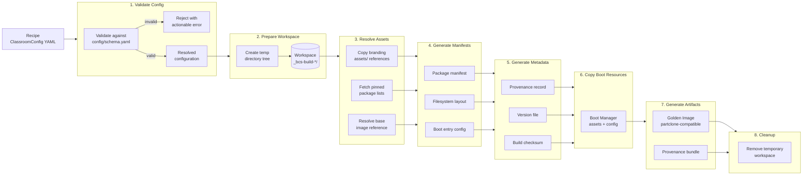

# Builder Pipeline

The Builder turns a declarative recipe into a versioned, reproducible golden image. This document describes every stage of the build pipeline, the artifacts each stage produces, and the contracts between stages.

See [ARCHITECTURE.md](../ARCHITECTURE.md#32-builder) for the system-level role of Builder, [docs/architecture/builder.md](architecture/builder.md) for the design rationale, [docs/specifications/builder.md](specifications/builder.md) for the normative requirements (`BLD-001`–`BLD-006`), and [docs/CONFIGURATION.md](CONFIGURATION.md) for the recipe format (`spec.builder` and `spec.packages` sections).

**Status:** Pre-implementation. Pipeline definition, stage contracts, and helper scripts only — no Builder code exists yet (Phase 2 of [ROADMAP.md](../ROADMAP.md)). The `bcs build` CLI stub is registered but unimplemented.

---

## Pipeline Overview



---

## Stage 1 — Validate Config

**Input:** Path to a `ClassroomConfig` YAML file.

**Output:** Resolved configuration dictionary, or rejection with an actionable error message.

**Behaviour:**

1. Load the YAML file and parse it against `config/schema.yaml`.
2. Validate structural correctness: all required fields present, no unknown fields (except the sanctioned `x-`-prefixed extension keys).
3. Validate semantic correctness:
   - `spec.builder.baseImage` references a known, accessible base OS version.
   - `spec.packages.profiles` named groups exist (if referenced by `spec.builder.packageProfiles`).
   - `spec.bootManager` fields are internally consistent (menu entries reference valid boot targets).
4. Resolve defaults: any field with a schema `default` that is absent in the file is filled in.
5. Fail fast — reject at step 1 rather than partway through assembly.

| Condition | Exit Code | Behaviour |
|---|---|---|
| File not found | 1 | Print error, stop. |
| Invalid YAML | 2 | Print parse error, stop. |
| Schema violation | 3 | Print field-level validation errors, stop. |
| Semantic error | 4 | Print semantic error, stop. |
| Valid | 0 | Return resolved config dict to next stage. |

**Design references:** `BLD-001`, `SPEC-001`, `CLI-009`, [ADR-0005](decisions/0005-yaml-as-unified-configuration-format.md).

---

## Stage 2 — Prepare Workspace

**Input:** Resolved configuration from Stage 1.

**Output:** Temporary workspace directory at a configurable path (default `.bcs-build-<timestamp>-<random>/`).

**Behaviour:**

1. Create the workspace root directory.
2. Create the standard subdirectory tree:

```
.bcs-build-<ts>-<rand>/
├── manifests/           ← Stage 4 output
├── metadata/            ← Stage 5 output
├── boot/                ← Stage 6 output
├── artifacts/           ← Stage 7 output
├── assets/              ← Stage 3 staging
└── tmp/                 ← staging for intermediate files
```

3. Record workspace path in a well-known location (`$BUILD_WORKSPACE`) for subsequent stages.
4. Ensure the workspace is on a filesystem with sufficient free space (heuristic: at least 3× the base image size, or a configurable minimum).

| Condition | Exit Code | Behaviour |
|---|---|---|
| Workspace exists and is not empty | 0 | Warn and reuse (controlled rebuild). |
| Cannot create workspace (permissions, disk full) | 10 | Print error, stop. |
| Created fresh | 0 | Continue. |

---

## Stage 3 — Resolve Assets

**Input:** Resolved configuration, workspace path.

**Output:** Populated `assets/` subdirectory in workspace. Resolved references for branding files and base image.

**Behaviour:**

1. **Branding assets:** Copy files referenced by `spec.branding.*` paths from the repository's `assets/` directory into the workspace `assets/`. Any path that does not exist in `assets/` is a hard error — the recipe is invalid.
2. **Base image reference:** Resolve `spec.builder.baseImage` to a concrete version identifier. This may involve:
   - Looking up a named release (e.g. `liurex-23.0`) in a local or remote index.
   - Reading a pinned checksum from `spec.builder.baseImage.pinnedSha256` if present.
3. **Package lists:** If `spec.builder.resolvedPackageLists` is set to `true`, fetch the current package lists for the base OS version and store them in `assets/packages/` for reproducibility.
4. **External references:** Any URL reference (`spec.build.timeouts`, `spec.build.mirrors`) is validated for reachability, not fetched — fetching belongs in the assembly phase, not here.

| Condition | Exit Code | Behaviour |
|---|---|---|
| All assets resolved | 0 | Continue. |
| Branding file missing in `assets/` | 20 | Print missing path, stop. |
| Base image reference cannot be resolved | 21 | Print resolution failure, stop. |
| Package list fetch fails (when enabled) | 22 | Print error, continue with warning. |

**Design references:** `BLD-001`, `CLI-014`, `CONFIG-007`.

---

## Stage 4 — Generate Manifests

**Input:** Resolved configuration, resolved assets.

**Output:** Machine-readable manifest files in `workspace/manifests/`.

**Behaviour:**

1. **Package manifest** (`manifests/packages.yaml`): A flat list of all packages to install, derived from:
   - `spec.packages.base` (mandatory base packages).
   - `spec.packages.extra` (classroom-specific additions).
   - Resolved `spec.builder.packageProfiles` (named profile groups).
   - Deduplicated, sorted alphabetically.
   - Pinned to exact version strings where `spec.builder.pinPackageVersions` is `true`.

2. **Filesystem layout** (`manifests/layout.yaml`): Describes the target partition scheme:
   - GPT partition table with at minimum: ESP (`vfat`, 512 MiB), root (`ext4`, remainder of disk).
   - Partition sizes, labels, filesystem types, mount points.
   - Derived from `spec.builder.diskLayout` with schema defaults applied.

3. **Boot entry configuration** (`manifests/boot-entries.yaml`):
   - EFI boot entries derived from `spec.bootManager.menu.entries`.
   - Default boot entry, timeout, and one-shot boot target.
   - UEFI firmware variables are not touched — these manifests describe what `Boot Manager` expects at boot time, not what `efibootmgr` does now.

4. All manifests are valid YAML, human-readable, and diffable across builds.

| Condition | Exit Code | Behaviour |
|---|---|---|
| Manifests generated | 0 | Continue. |
| Duplicate package name with conflicting version | 30 | Print conflict, stop. |
| Disk layout has insufficient space for ESP + root | 31 | Print size analysis, stop. |
| Boot menu has no default entry | 32 | Print warning, apply first entry as default. |

**Design references:** `BLD-001`, `BLD-004`, `BLD-005`, `BM-002`, `BM-003`.

---

## Stage 5 — Generate Metadata

**Input:** Resolved configuration, workspace path, intermediate results from Stages 3–4.

**Output:** Provenance record in `workspace/metadata/`.

**Behaviour:**

1. **Provenance record** (`metadata/provenance.json`):

```json
{
  "apiVersion": "bcs/v1alpha1",
  "kind": "BuildProvenance",
  "build": {
    "tool": "bcs-build",
    "version": "<from VERSION>",
    "commit": "<git commit hash>",
    "timestamp": "2026-07-09T12:00:00Z",
    "duration_seconds": 1234
  },
  "recipe": {
    "source": "path/to/classroom-config.yaml",
    "checksum_sha256": "<recipe file checksum>",
    "resolved": { }
  },
  "baseImage": {
    "reference": "liurex-23.0",
    "version": "23.0.20260701",
    "checksum_sha256": "<base image checksum>"
  },
  "packages": {
    "total_count": 1234,
    "pinned": true,
    "manifest_checksum_sha256": "<packages.yaml checksum>"
  },
  "artifact": {
    "filename": "bcs-golden-image-v1.2.3.img",
    "size_bytes": 8589934592,
    "checksum_sha256": "<computed in Stage 7>",
    "format": "partclone"
  }
}
```

2. **Version file** (`metadata/VERSION`): The single version identifier for this build, consistent with the project's [VERSION](../VERSION) scheme.
3. **Build log** (`metadata/build.log`): A copy of every stage's stdout/stderr output, with stage markers.
4. Fields marked `<computed in Stage 7>` are left as placeholders and filled in during artifact finalisation.

| Condition | Exit Code | Behaviour |
|---|---|---|
| Metadata written | 0 | Continue. |
| Git state is dirty (uncommitted changes) | 40 | Print warning, continue with dirty flag in provenance. |

**Design references:** `BLD-002`, `BLD-006`, `DEP-004`, `NFR-004`.

---

## Stage 6 — Copy Boot Resources

**Input:** Manifests from Stage 4, branding assets from Stage 3, workspace path.

**Output:** Populated `workspace/boot/` directory with resources consumable by Boot Manager.

**Behaviour:**

1. Copy Boot Manager branding assets (splash screen, theme files) from `assets/` into `boot/branding/`.
2. Generate Boot Manager configuration files from `spec.bootManager`:
   - Menu layout, entries, default boot target, timeout.
   - Secure Boot fallback behaviour (`spec.security.secureBoot.mode`).
3. Write a machine-readable `boot/boot-manager-config.yaml` that Boot Manager's own startup script can source at boot time — Boot Manager itself never parses the original `ClassroomConfig` YAML.
4. All files are laid out exactly as Boot Manager expects them, relative to the ESP root that Deploy will restore.

| Condition | Exit Code | Behaviour |
|---|---|---|
| Boot resources staged | 0 | Continue. |
| Required Boot Manager asset missing | 50 | Print missing path, stop. |

**Design references:** `BLD-004`, `BM-001`, `BM-002`, `BM-003`, `BM-004`.

---

## Stage 7 — Generate Artifacts

**Input:** Complete workspace (Stages 1–6 outputs), metadata placeholders from Stage 5.

**Output:** Final golden image artifact and completed provenance bundle in `workspace/artifacts/`.

**Behaviour:**

1. Assemble the root filesystem:
   - Base OS (debootstrap or equivalent from resolved base image reference).
   - Package installation from `manifests/packages.yaml`.
   - Configuration overlays (from `spec.localization`, `spec.security`, `spec.network`).
   - Branding assets placed in correct system paths.
2. Lay out the disk image:
   - GPT partition table (per `manifests/layout.yaml`).
   - ESP formatted as vfat with boot flag.
   - Root partition formatted as ext4.
   - Both partitions populated from the assembled root filesystem.
3. Produce Clonezilla-compatible output:
   - Partclone images for each partition (`partclone.ext4`, `partclone.vfat`).
   - Clonezilla image directory structure (`ImageName/` with `ImageName-{partition}.{ext4,vfat}.{clonezilla,ptf,timestamps}`).
4. Finalise the provenance record:
   - Compute `checksum_sha256` of every artifact file.
   - Fill placeholder fields in `metadata/provenance.json`.
   - Write `metadata/checksums.sha256`.
5. Produce a **provenance bundle** (`artifacts/bcs-provenance-<version>.tar.gz`): a standalone archive containing `metadata/` and `manifests/` — this is what Deploy fetches and verifies at deployment time, independent of the full image artifact.

| Condition | Exit Code | Behaviour |
|---|---|---|
| Artifact generated and checksummed | 0 | Exit successfully. |
| Package installation fails | 60 | Print first package error, stop. Keep workspace for debugging. |
| Disk image assembly fails | 61 | Print error, stop. Keep workspace for debugging. |
| Disk space exhausted | 62 | Print usage, stop. |
| Provenance checksum mismatch | 63 | Print mismatch, stop. Treat as build corruption. |

**Design references:** `BLD-002`, `BLD-003`, `BLD-004`, `BLD-005`, `BLD-006`, `DEP-004`.

---

## Stage 8 — Cleanup

**Input:** Workspace path.

**Output:** Workspace directory removed (unless `--keep-workspace` is set).

**Behaviour:**

1. Remove the workspace directory tree.
2. If `--keep-workspace` was specified, print the workspace path for inspection.
3. If any stage produced a non-zero exit code, the workspace is **always** kept for debugging regardless of `--keep-workspace`.

| Condition | Exit Code | Behaviour |
|---|---|---|
| Workspace cleaned | 0 | Done. |
| Cleanup fails (permissions, in-use files) | 70 | Print warning, exit 0. |

---

## Stage Exit Codes Summary

| Stage | Code Range | Success | Failure Behaviour |
|---|---|---|---|
| 1 — Validate Config | 1–4 | 0 | Stop immediately. |
| 2 — Prepare Workspace | 10 | 0 | Stop immediately. |
| 3 — Resolve Assets | 20–22 | 0 | Stop on missing asset; warn on optional failure. |
| 4 — Generate Manifests | 30–32 | 0 | Stop on hard error; warn on recoverable. |
| 5 — Generate Metadata | 40 | 0 | Warn on dirty git; never stops. |
| 6 — Copy Boot Resources | 50 | 0 | Stop on missing asset. |
| 7 — Generate Artifacts | 60–63 | 0 | Stop, keep workspace. |
| 8 — Cleanup | 70 | 0 | Warn, never fails the build. |

---

## Invocation Contract

```
bcs build [OPTIONS] <config-path>
```

| Option | Effect |
|---|---|
| `--workspace PATH` | Override default workspace location. |
| `--keep-workspace` | Preserve workspace after build. |
| `--output PATH` | Copy artifacts to `PATH` after successful build. |
| `--no-clean` | Skip Stage 8. Implied by `--keep-workspace`. |
| `--verbose` | Print every stage's output to stderr in real time. |

The `bcs build` command does not exist yet — it is registered as a stub in the CLI. When implemented, it will orchestrate these 8 stages sequentially, passing the resolved config as a context object through each stage.

---

## Design Constraints

These constraints apply across every stage. They are not repeated per stage.

| Constraint | Applies To |
|---|---|
| **No network in Stages 2, 4, 5, 6, 8** — only Stages 1 (schema validation has no network), 3 (asset resolution), and 7 (package fetch) may reach external resources. | All stages |
| **Every stage must be idempotent** — running it twice on the same input produces the same output. | Stages 1–6 |
| **Stages must be independently invocable** — a developer can run `bcs build --stage 4` to re-generate manifests without re-validating the config. | All stages |
| **No root required for Stages 1–6** — only Stage 7 (disk image assembly, `mount`, `losetup`, `debootstrap`) may require elevated privileges. | Stages 1–6 |
| **Provenance is append-only** — once written in Stage 5, no field is overwritten except the explicitly placeholder fields filled in Stage 7. | Stages 5, 7 |
| **Rejection is always actionable** — every error message includes the field path, the expected constraint, and the actual value. | Stage 1, error messages throughout |
