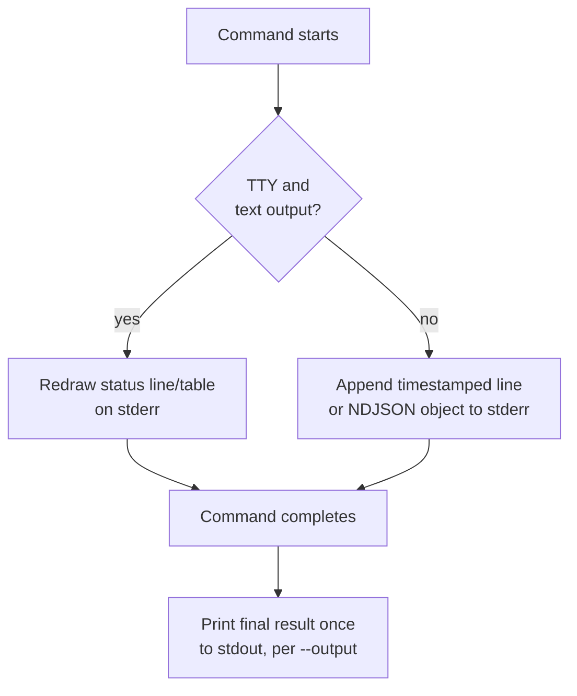
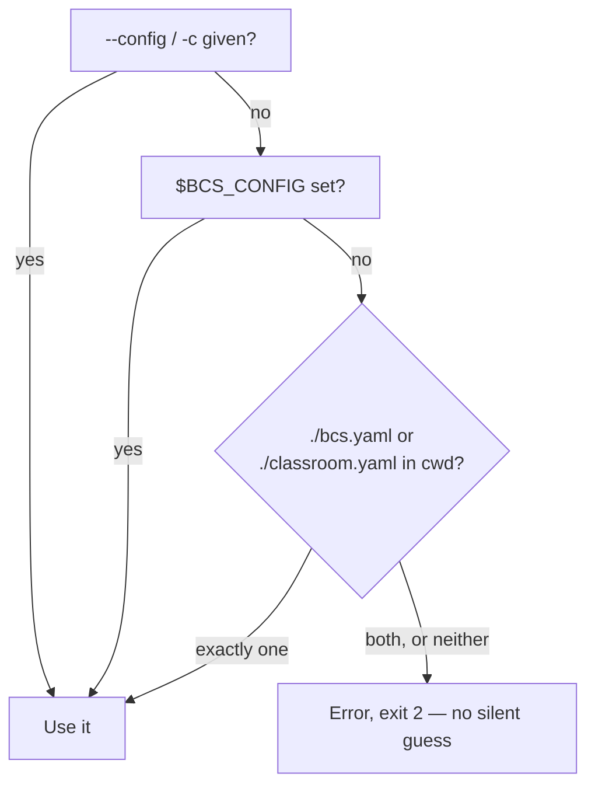
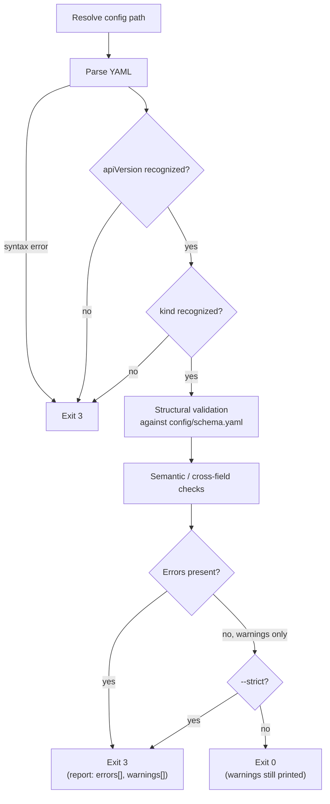
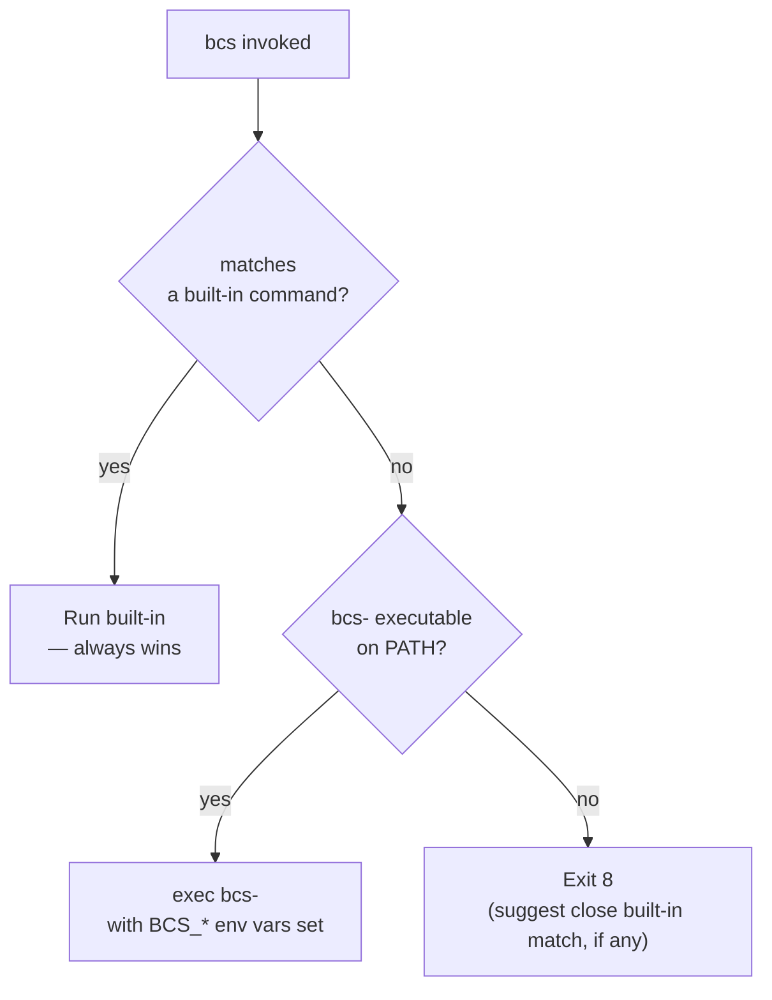

# CLI Reference — `bcs`

`bcs` is the single command-line entry point into Batoi Classroom Suite: the tool a technician runs to check a machine's readiness, validate a classroom's configuration, build a golden image, put it on a machine or a classroom, back up and roll back a classroom, and manage the CLI itself. This document is its complete design.

This document was written as design and interface documentation before any code existed, so that an engineer could implement `bcs` from it alone, without further design decisions. That implementation has since begun: the CLI framework — global options, logging, configuration loading/validation, the Host Inventory subsystem, and the `version`, `doctor`, `inventory`, and `validate` commands (with placeholder check logic where noted) — is implemented in Python under [cli/](../cli/), per [ADR-0007](decisions/0007-python-for-the-bcs-cli.md). `build`, `install`, `deploy`, `backup`, `restore`, `update`, and `config` remain unimplemented stubs; no Boot Manager, Builder, or Deploy logic exists yet (see [ROADMAP.md](../ROADMAP.md)). This document remains the normative design reference — where the implementation and this document disagree on anything other than what's noted above, that's a bug to fix, not a sign the document is stale.

**A deliberate exception to how this repository normally organizes documentation:** Boot Manager, Builder, and Deploy each split their documentation across `ARCHITECTURE.md`/`SPECIFICATION.md` (condensed, normative) and `docs/architecture/*.md`/`docs/specifications/*.md` (detailed). This document does not — it is the single, complete expansion of [SPECIFICATION.md §2.4](../SPECIFICATION.md#24-cli), covering both design rationale and implementation-level detail in one place. Splitting the CLI across a fourth pair of files would have repeated the four-layer duplication problem identified in [REVIEW.md §3](../REVIEW.md#3-duplicated-concepts) for a surface smaller than any one component — so it isn't.

## Design Philosophy

`bcs` borrows deliberately from four established CLIs rather than inventing conventions from scratch, because the people running it already know these tools:

| Borrowed from | What |
|---|---|
| **git** | External plugin dispatch (`bcs-<name>` on `PATH`), flexible `help` invocation, `config get`/`set` dotted-path style. |
| **docker** | `--output`/`-o` format switch, per-target progress reporting, `system`-style diagnostic command (→ `doctor`). |
| **kubectl** | Composable `-v` verbosity levels, `--dry-run`, explicit `--context`-like resolution (→ `--config`/`$BCS_CONFIG`). |
| **terraform** | `-auto-approve`-style confirmation bypass (→ `--yes`), `-input=false`-style non-interactive mode (→ `--no-input`), plan/apply-style dry runs. |

Three principles govern every design choice below:

1. **Stdout is data, stderr is everything else.** Every command's actual result (or `--dry-run` plan, or `--output json` payload) goes to stdout. Logs, progress, and diagnostics go to stderr. This is what makes `bcs config show -o json | jq .` and similar pipelines reliable regardless of verbosity.
2. **Never guess when the answer is "which classroom."** `bcs` reimages real machines. Where a generic CLI might search upward through parent directories for a config file (`git`, `npm`) or fall back to a "current context" (`kubectl`), `bcs` refuses to guess — see [Configuration Loading](#configuration-loading).
3. **Non-interactive is not the same as consenting.** `--no-input` disables prompts; it does not imply "yes" to a destructive operation. Only `--yes` does. See [Security Considerations](#security-considerations).

## Requirements

This table is identical to [SPECIFICATION.md §2.4](../SPECIFICATION.md#24-cli); it is repeated here because this document is that section's sole expansion.

| ID | Requirement | Expanded in |
|---|---|---|
| CLI-001 | Provide the eleven commands listed in [Command Tree](#command-tree). | [Command Reference](#command-reference) |
| CLI-002 | Universal `--help`; no/unknown command prints top-level help, exit `2`. | [Invocation Grammar](#invocation-grammar) |
| CLI-003 | Consistent global options across commands. | [Global Options](#global-options) |
| CLI-004 | One shared exit code scheme. | [Exit Codes](#exit-codes) |
| CLI-005 | Stdout = result, stderr = logs/progress. | (this document, throughout) |
| CLI-006 | Destructive ops require confirmation or `--yes`. | [Security Considerations](#security-considerations) |
| CLI-007 | Validate before `build`/`install`/`deploy`/`restore`. | [Validation Flow](#validation-flow) |
| CLI-008 | No silent config guessing. | [Configuration Loading](#configuration-loading) |
| CLI-009 | Plugin loading; built-ins win. | [Plugin System](#plugin-system) |
| CLI-010 | No telemetry. | [Security Considerations](#security-considerations) |
| CLI-011 | Additive-only within a MAJOR version. | [Extensibility & Versioning](#extensibility--versioning) |
| CLI-012 | `schemaVersion` in JSON output. | [Extensibility & Versioning](#extensibility--versioning) |
| CLI-013 | Composable verbosity. | [Logging & Verbosity](#logging--verbosity) |
| CLI-014 | Auto-detected, overridable color. | [Color Output](#color-output) |
| CLI-015 | Versioned, immutable Host Inventory (`bcs inventory`) as the single source of truth for host facts. | [`bcs inventory`](#bcs-inventory) |

## Command Tree

```
bcs [global options] <command> [subcommand] [command options] [args]

  doctor      Diagnose host and configuration readiness
  inventory   Show the Host Inventory: the single source of truth for this machine
  validate    Validate one or more ClassroomConfig documents
  build       Build a golden image from a ClassroomConfig recipe
  install     Image a single machine (unicast)
  deploy      Deploy a golden image to a classroom fleet (multicast/PXE)
    ├─ start    Begin a deployment session (default action)
    ├─ status   Show a session's progress/outcome
    ├─ list     List recent/active sessions
    └─ cancel   Cancel an in-progress session
  backup      Capture a restorable snapshot reference for a classroom
  restore     Roll back a classroom to a previous backup or image version
    └─ list     List available backups for a classroom
  update      Update the bcs CLI itself
  version     Show version and build information
  config      Manage ClassroomConfig documents
    ├─ init      Scaffold a new ClassroomConfig
    ├─ show      Print the effective (optionally resolved) config
    ├─ get       Read one field by dotted path
    ├─ set       Write one field by dotted path
    ├─ diff      Structurally diff two ClassroomConfig documents
    └─ validate  Alias for `bcs validate` scoped to the loaded config
  help        Show help for any command
```

**Reserved, not shipped in v1alpha1** (see [Extensibility & Versioning](#extensibility--versioning)): `bcs completion` (shell completion scripts), `bcs plugin` (list discovered plugins), `bcs x <name>` (experimental namespace). These names are reserved so a future built-in can't collide with a third-party plugin of the same name.

### Command Ownership

Not every command's logic lives in the same place. This mapping matters for implementers deciding where code goes, and preserves the component boundaries from [ARCHITECTURE.md §4](../ARCHITECTURE.md#4-component-boundaries) — `bcs` is a dispatcher, not a fourth component:

| Command | Invokes | Because |
|---|---|---|
| `build` | Builder | `BLD-001`–`BLD-006` |
| `install`, `deploy`, `backup`, `restore` | Deploy | `DEP-001`–`DEP-007` (see [Why `install` and `deploy` Are Separate](#why-install-and-deploy-are-separate)) |
| `doctor`, `validate`, `inventory`, `version`, `config`, `update` | CLI itself | Cross-cutting; no single component owns environment checks, schema validation, host inventory, self-version, config editing, or self-update |

Boot Manager has no direct `bcs` command: it is configured by Builder baking `spec.bootManager` into the image (see [docs/CONFIGURATION.md](CONFIGURATION.md#how-the-file-is-consumed)) and is invoked only by firmware at boot, never by an operator typing `bcs`.

### The Host Inventory Subsystem

`bcs inventory` is backed by a dedicated subsystem (`bcs.inventory` in the implementation — see [cli/README.md](../cli/README.md)), not just another command's private logic, because its output is meant to be **the single source of truth describing the current machine**. The full design — package structure, Pydantic models, dependency graph, sequence diagrams, interaction with the CLI/future REST API/future Web UI, serialization strategy, and testing strategy — is documented separately in **[docs/HOST_INVENTORY.md](HOST_INVENTORY.md)**, alongside its supporting [ADR-0008](decisions/0008-host-inventory-ports-and-adapters.md); this section stays limited to what a `bcs` CLI user specifically needs to know.

In short: `bcs doctor`'s checks evaluate pass/fail *against* Host Inventory facts rather than probing the host a second time, so `doctor` and `inventory` can never disagree about what the machine looks like; Boot Manager, Builder, and Deploy are each expected to consume the same `bcs inventory --output json` payload rather than re-implementing detection; and the subsystem's models are immutable and carry their own `schemaVersion` (`bcs-inventory/v1alpha1`), independent of `bcs-cli/v1alpha1` (`bcs`'s own output schema) and `bcs/v1alpha1` (ClassroomConfig) — see [Extensibility & Versioning](#extensibility--versioning).

Any future collector that needs to shell out to an external tool (rather than reading `/proc`/`/sys` directly) is expected to do so through the Platform Layer's `CommandRunner`, never a direct `subprocess` call — see [docs/PLATFORM_LAYER.md](PLATFORM_LAYER.md) and [ADR-0009](decisions/0009-platform-layer-command-runner.md) (Accepted, not yet implemented).

The `identity` section (primary MAC address, DMI product UUID) exists specifically to narrow — not resolve — the open `deploy.maintenanceRequests.machineIdentity` question from [`spec.deploy`](CONFIGURATION.md#specdeploy) and [docs/architecture/deploy.md](architecture/deploy.md#open-questions): it records what identity data is actually available on a real host, without deciding the maintenance request's wire format.

## Invocation Grammar

- Global options may appear before or after the command name (`bcs -v build` and `bcs build -v` are equivalent) — `bcs` uses a manual argument-parsing loop, not raw `getopts`, specifically so long options and this flexible ordering work (see [Implementation Notes](#implementation-notes) and [docs/standards/bash-style-guide.md](standards/bash-style-guide.md)).
- Options for a specific subcommand (e.g., `deploy start`'s `--classroom`) must appear after the (sub)command they belong to.
- `--` ends option parsing; anything after it is treated as a positional argument even if it looks like a flag.
- Help is invocable three equivalent ways: `bcs help build`, `bcs build help`, `bcs build --help`/`-h`.
- Bare `bcs` (no arguments) is equivalent to `bcs help` and exits `0`. `bcs <unrecognized>` with no matching plugin exits `2` (`CLI-002`) and, if a built-in name is a close match, suggests it (`bcs biuld` → `unknown command 'biuld' — did you mean 'build'?`).

## Global Options

Apply to every command unless that command's own reference says otherwise.

| Option | Default | Description |
|---|---|---|
| `--config, -c <path>` | *(resolved, see below)* | Path to a ClassroomConfig YAML document. |
| `--set <path>=<value>` | — | Ad hoc config override, repeatable. Highest precedence — see [Configuration Loading](#configuration-loading). |
| `--output, -o <fmt>` | `text` | Result format: `text`, `json`, or `yaml` (not every command supports all three; each command's reference states which). |
| `--color <mode>` | `auto` | `auto`, `always`, or `never`. See [Color Output](#color-output). |
| `--verbose, -v` | — | Increase verbosity; repeatable (`-v`, `-vv`, `-vvv`). See [Logging & Verbosity](#logging--verbosity). |
| `--quiet, -q` | — | Errors only. Mutually exclusive with `-v` (last one wins if both given; `bcs` warns on stderr when it does). |
| `--log-level <lvl>` | — | Explicit `silent\|error\|warn\|info\|debug\|trace`. Overrides `-v`/`-q` entirely when given. |
| `--log-format <fmt>` | `text` | `text` or `json` (NDJSON) for log/progress lines on stderr. Independent of `--output`. |
| `--log-file <path>` | — | Additionally write logs (in the selected `--log-format`) to this file. |
| `--no-input` | `false` | Disable interactive prompts; commands that would prompt fail with exit `5` instead, unless `--yes` is also given. |
| `--yes, -y` | `false` | Pre-confirm destructive operations. See [Security Considerations](#security-considerations). |
| `--dry-run` | `false` | Perform all read/validate steps and print the plan; skip write/destructive effects. Supported by `build`, `install`, `deploy`, `backup`, `restore`. |
| `--timeout <duration>` | command-specific | Overall wall-clock budget for the invocation (e.g. `45m`, `90s`). On expiry: exit `7`. |
| `--help, -h` | — | Show help for the current command. |
| `--version` | — | Shorthand for `bcs version` at the root only (`bcs --version`, not valid after a subcommand). |

Global options not listed as accepting a value are boolean flags. Boolean flags do not take `=value`; valued options accept either `--option value` or `--option=value`.

## Exit Codes

One scheme, shared by every command (`CLI-004`). A command's own reference lists which of these it can realistically produce.

| Code | Meaning | Example trigger |
|---|---|---|
| `0` | Success | Command completed; for `validate`/`doctor`, also "completed with warnings but not `--strict`." |
| `1` | General/unexpected error | An unhandled failure not covered by a more specific code below. |
| `2` | Usage error | Unknown command/flag, missing required flag, malformed flag value. |
| `3` | Config invalid | YAML syntax error, unrecognized `apiVersion`/`kind`, schema violation, or failed semantic check (`--strict` warnings included). |
| `4` | Precondition failed | `doctor`-class environment check failed (missing firmware feature, missing tool, insufficient permissions); or `build`/`install`/`deploy` refuses to start because a `PLAT-xxx` prerequisite isn't met. |
| `5` | Aborted | User declined a confirmation prompt; or a prompt was required but `--no-input` was set without `--yes`. |
| `6` | Partial failure | A multi-target operation (`deploy`, `restore` across a classroom) where some but not all targets succeeded — see each machine's own outcome in the result/report. |
| `7` | Timeout | `--timeout` (or a command-specific default budget, e.g. `deploy`'s session timeout, `DEP-007`) elapsed before completion. |
| `8` | Plugin error | `bcs <name>` matched no built-in and no `bcs-<name>` executable was found on `PATH`, or the plugin could not be executed (not found after matching, not executable, etc.). |
| `130` | Interrupted | `SIGINT` (Ctrl-C) — standard `128 + 2`. |
| `143` | Terminated | `SIGTERM` — standard `128 + 15`. |

**Rule for `2` vs. `3`:** a mistake in how you invoked `bcs` (bad flag, unknown command) is `2`; a problem with the *content* of a ClassroomConfig document (however it was reached — bad YAML, bad schema, bad cross-field value) is always `3`. This distinction is deliberate so scripts can tell "you're using the CLI wrong" apart from "your classroom config needs fixing."

## Logging & Verbosity

Every log line, regardless of format, carries a timestamp, a level, an invocation ID (a ULID generated once per `bcs` invocation, shared by every line and by any session report the invocation produces — this is what makes a `deploy` session traceable end to end per `NFR-004`), and a message.

**Text format** (default):

```
2026-07-06T10:15:32Z INFO  [01J8Z3K7N4R2Q9X5W1V6T0M8YC] Building golden image from cipfp-batoi-aula-201
2026-07-06T10:15:34Z WARN  [01J8Z3K7N4R2Q9X5W1V6T0M8YC] pinnedSnapshot not set; reproducibility (BLD-005) not guaranteed
```

**JSON format** (`--log-format json`), one object per line (NDJSON), to stderr:

```json
{"ts":"2026-07-06T10:15:32Z","level":"info","invocationId":"01J8Z3K7N4R2Q9X5W1V6T0M8YC","command":"build","message":"Building golden image from cipfp-batoi-aula-201"}
```

### Verbosity Levels

| Level | How to select | Shows |
|---|---|---|
| `silent` | `--log-level silent` | Nothing on stderr at all, even errors. Exit code is the only signal. Use with caution. |
| `error` | `-q` / `--quiet` | Errors only. |
| `warn` | *(between default and quiet — `--log-level warn` only)* | Warnings and errors. |
| `info` | *(default)* | High-level step-by-step narration (one line per pipeline stage, per machine, etc.). |
| `debug` | `-v` | `info` plus what files were read, which config values were resolved from where, which external commands are about to run. |
| `trace` | `-vv` | `debug` plus full argument lists and output of every external command invoked. |
| *(shell trace)* | `-vvv` | `trace` plus the underlying implementation's own `set -x` shell trace, passed through verbatim — intended for support bundles, not routine use. |

**Precedence:** `--log-level` (explicit) always wins if given. Otherwise, count `-v` occurrences (each raises the level by one step from `info`) and `-q` (drops straight to `error`); if both `-v` and `-q` are given, `bcs` uses whichever appeared last on the command line and prints a one-line warning to stderr noting the conflict.

## Color Output

- **`auto` (default):** color is enabled only if *all* of: stdout is a TTY, the `NO_COLOR` environment variable is unset or empty, `TERM` is not `dumb`, and `--output` is `text`. Colorizing `json`/`yaml` output would corrupt machine parsing, so it never happens regardless of TTY state.
- **`always` / `never`:** force the mode regardless of TTY/`NO_COLOR` detection.
- **Precedence:** `--color` flag > `BCS_COLOR` environment variable > `NO_COLOR` environment variable (per the [no-color.org](https://no-color.org/) convention: any non-empty value disables color) > auto-detection.
- **Palette:** red = error, yellow = warning, green = success/OK, cyan = section headers/stage names, dim/gray = secondary detail (timestamps, paths). No other colors are used, keeping the palette legible under common colorblind-friendly terminal themes.

## Progress Reporting

- **Interactive TTY, `--output text`:** single-line, carriage-return-redrawn status for simple operations (`build`'s current pipeline stage); a small redrawn table, one row per target, for multi-target operations (`deploy`, mirroring `docker compose up`'s per-service status table) — gated on `tput` being available; falls back to the non-TTY behavior below if not.
- **Non-TTY (piped/CI) or `--log-format json`:** no cursor movement, ever — each progress update is one appended, timestamped line (text) or one NDJSON object (json) on stderr. This is deliberate: redrawing a line with `\r` corrupts a redirected log file.
- **Progress event fields (`--log-format json`):** `ts`, `event` (`stage_start` \| `stage_progress` \| `stage_complete` \| `machine_status`), `stage` or `machine`, `percent` (optional), `message`.
- **Final result vs. progress:** progress events are always on stderr, regardless of format. The command's final result (a summary, or the full `--output json` payload) is printed to stdout exactly once, at completion — a script watching only stdout gets a clean, single answer; a script watching stderr gets the play-by-play.



## Configuration Loading

`bcs` distinguishes two configuration layers that are never merged into one file, mirroring the boundary already drawn between `~/.gitconfig` and a repository's tracked files:

- **ClassroomConfig** — the platform configuration (`config/schema.yaml`, see [docs/CONFIGURATION.md](CONFIGURATION.md)): what gets built and deployed, checked into version control, shared by a team.
- **CLI preferences** — personal workstation ergonomics (color, default output format, a convenience default config path), never versioned with the classroom's own files.

### ClassroomConfig Resolution (highest precedence first)

1. `--config <path>` / `-c <path>`
2. `$BCS_CONFIG` environment variable
3. Exactly one of `./bcs.yaml` or `./classroom.yaml` present in the current directory
4. **Otherwise: error, exit `2`** — `no ClassroomConfig found; pass --config or set $BCS_CONFIG`. If *both* `./bcs.yaml` and `./classroom.yaml` exist, that also is an error (`ambiguous: both bcs.yaml and classroom.yaml present; pass --config`), not a silent pick.

There is deliberately **no upward directory search** (unlike `git` walking up to find `.git`, or `npm` finding the nearest `package.json`). A technician may have several classrooms' configs on disk at once; guessing which one is "the" config for an ambiguous invocation is a safety risk in a tool that reimages real machines (`CLI-008`), not a convenience worth adding.



### Value Overrides Within a Resolved ClassroomConfig

Once the file is resolved, values may be overridden, highest precedence first:

1. `--set <path>=<value>` (repeatable; applied in the order given)
2. `BCS_CFG_<PATH>` environment variables — `.` in the path becomes `_`, all uppercase, e.g. `BCS_CFG_SPEC_SECURITY_SECUREBOOT_MODE=disabled` overrides `spec.security.secureBoot.mode`
3. The value in the file
4. The schema's own `default` (per `config/schema.yaml`)

`<path>` in both `--set` and `bcs config get`/`set` (see [Command Reference](#bcs-config)) is a full, dotted path from the document root, including `spec.` or `metadata.` — e.g. `spec.security.secureBoot.mode`, `metadata.name`. Array elements are addressed by numeric index: `spec.bootManager.menu.entries.0.label.ca_ES`.

### CLI Preferences File

Location: `$XDG_CONFIG_HOME/bcs/cli.yaml`, falling back to `~/.config/bcs/cli.yaml`. Entirely optional — every field has a built-in default.

```yaml
# ~/.config/bcs/cli.yaml
color: auto            # auto | always | never
output: text            # text | json | yaml
logLevel: info
noInput: false
defaultConfig: ~/classrooms/aula201.yaml   # convenience only; still overridden by --config/$BCS_CONFIG
```

Precedence for these preferences: CLI flag > environment variable (`BCS_COLOR`, `BCS_OUTPUT`, `BCS_LOG_LEVEL`, `BCS_NO_INPUT`) > this file > built-in default. `defaultConfig` sits *below* `./bcs.yaml`/`./classroom.yaml` in the ClassroomConfig resolution order above — it is a fallback for working outside any classroom directory, not an override of a directory-local file.

## Validation Flow

`bcs validate` (and the implicit pre-flight validation `CLI-007` requires before `build`/`install`/`deploy`/`restore`) runs the same pipeline:



**Structural validation** is exactly `config/schema.yaml`: types, `required`, `enum`, `const`, `pattern`, `additionalProperties`. All violations are collected before reporting — `bcs validate` never stops at the first error.

**Semantic checks** are rules the JSON Schema can't express on its own, each with a stable rule ID for scripting/suppression:

| Rule ID | Severity | Check |
|---|---|---|
| `label-locale-coverage` | error | Every locale used as a key in `spec.bootManager.menu.entries[].label` must appear in `spec.localization.supportedLocales`. |
| `default-entry-exists` | error | `spec.bootManager.menu.defaultEntry` must reference an existing `spec.bootManager.menu.entries[].id`. |
| `checksum-algorithm-match` | warning | `spec.deploy.verification.checksumAlgorithm` should match `spec.builder.provenance.checksumAlgorithm`. |
| `static-assignments-present` | warning | `spec.network.addressing.mode: static` with an empty `staticAssignments` list is almost always a mistake. |

Warnings never fail validation unless `--strict` is given (same flag, same meaning, as `bcs doctor --strict`).

**Report shape** (`--output json`):

```json
{
  "schemaVersion": "bcs-cli/v1alpha1",
  "valid": false,
  "errors": [
    {"rule": "default-entry-exists", "path": "spec.bootManager.menu.defaultEntry", "message": "references unknown entry id 'normal-bot'"}
  ],
  "warnings": []
}
```

## Command Reference

### `bcs doctor`

Diagnoses whether the current host meets BCS's platform prerequisites (`PLAT-001`–`PLAT-007`) and whether required tooling is present. Modeled on `flutter doctor`/`brew doctor`.

```
bcs doctor [--check <name>]... [--fix] [--strict] [--output text|json]
```

| Flag | Description |
|---|---|
| `--check <name>` | Run only the named check(s); repeatable. Default: all checks. |
| `--fix` | Attempt safe, reversible remediations only (e.g., installing a missing *optional* tool). Never performs destructive or system-level changes — those are reported, not applied. |
| `--strict` | Treat `warn` results as failures for the purpose of the exit code. |

**Checks:** `firmware` (UEFI present, `PLAT-003`), `secure-boot` (state vs. `spec.security.secureBoot.mode` if a config is loaded), `esp` (EFI System Partition present and mounted, `BLD-004`/`DEP-003`/`CLI-016`), `storage` (NVMe present, `PLAT-005`), `usb-storage` (USB storage devices suitable for booting/deployment, `CLI-016`; informational — absence is not a failure), `network` (PXE/multicast reachability, `PLAT-007` — Deploy hosts only), `tooling` (Clonezilla suite, `partclone`, a YAML/JSON-Schema processor present), `config` (a ClassroomConfig is resolvable and passes `bcs validate`), `permissions` (required device/privilege access).

**Exit codes:** `0` (all OK, or only warnings without `--strict`), `4` (any check `fail`, or any `warn` under `--strict`).

**Example:**

```
$ bcs doctor
[ OK ]   firmware        UEFI detected
[ WARN]  secure-boot      Secure Boot is disabled; config requests enforce
[ OK ]   storage         1 NVMe device found: /dev/nvme0n1
[ FAIL]  tooling         clonezilla not found on PATH
2 ok, 1 warning, 1 failure
```

### `bcs inventory`

```
bcs inventory [--output text|json|yaml]
```

Prints the current Host Inventory snapshot — see [The Host Inventory Subsystem](#the-host-inventory-subsystem) for what it's for and who consumes it. Unlike every other command's JSON output, the payload is **not** wrapped in `bcs`'s own `schemaVersion` (`bcs-cli/v1alpha1`); it carries its own (`bcs-inventory/v1alpha1`), since the data is meant to be read directly by Boot Manager, Builder, Deploy, or a future REST API — not just by another invocation of `bcs`.

Takes no flags beyond the global `--output`; there is nothing to configure about *which* facts are collected in v1alpha1.

**Exit codes:** always `0` — `inventory` describes what it finds, including absent/unsupported facts (`null`, `unknown`, empty lists); it never fails just because a fact couldn't be determined. (Contrast `bcs doctor`, which evaluates the same facts against pass/fail expectations and can exit `4`.)

**Example (`--output json`, abbreviated):**

```json
{
  "schemaVersion": "bcs-inventory/v1alpha1",
  "collectedAt": "2026-07-06T14:52:14Z",
  "identity": {"primaryMacAddress": "aa:bb:cc:dd:ee:ff", "dmiProductUuid": null},
  "firmware": {"uefi": true, "secureBoot": "enabled", "vendor": null, "version": null},
  "operatingSystem": {"name": "LliureX 23", "version": null, "kernel": "6.8.0", "architecture": "x86_64"},
  "cpu": {"architecture": "x86_64", "model": "Intel(R) Core(TM) i5", "logicalCores": 8},
  "memory": {"totalBytes": 17179869184, "availableBytes": 9663676416},
  "storage": [{"name": "nvme0n1", "path": "/dev/nvme0n1", "isNvme": true, "sizeBytes": null, "model": null}],
  "network": [{"name": "eth0", "macAddress": "aa:bb:cc:dd:ee:ff", "ipAddresses": [], "isUp": true, "isLoopback": false}],
  "tooling": [{"name": "clonezilla", "found": false, "path": null}]
}
```

### `bcs validate`

```
bcs validate [<file>...] [--strict] [--output text|json]
```

Validates one or more ClassroomConfig documents (see [Validation Flow](#validation-flow)). With no `<file>` arguments, resolves one config per [Configuration Loading](#configuration-loading). Accepts globs (`bcs validate classrooms/*.yaml`) for reviewing every classroom in a centre at once.

**Exit codes:** `0` (valid, or warnings only without `--strict`), `3` (invalid, or warnings under `--strict`).

### `bcs build`

```
bcs build [--tag <name>] [--output-dir <path>] [--push [<destination>]] [--dry-run]
```

Invokes Builder (`BLD-001`–`BLD-006`) to produce a golden image from the resolved ClassroomConfig's `spec.builder`/`spec.packages`. Runs the full [Validation Flow](#validation-flow) first and aborts (exit `3`) on failure — "a bad recipe should fail fast," per [docs/architecture/builder.md](architecture/builder.md#build-pipeline).

| Flag | Description |
|---|---|
| `--tag <name>` | Human label for this build, independent of the config's own version (like `docker build -t`). |
| `--output-dir <path>` | Where to write the artifact locally. Default: current directory. |
| `--push [<destination>]` | Publish the artifact to an artifact store. **Open question:** the artifact storage/hosting architecture is not yet designed (see [REVIEW.md §1.2](../REVIEW.md#12-no-storagehosting-architecture-for-the-golden-image-artifact) and [docs/architecture/builder.md](architecture/builder.md#open-questions)) — `<destination>` is therefore a required argument to `--push` in v1alpha1 (no implicit default target) until that design lands. |
| `--dry-run` | Validate and print the build plan (stages, resolved package list, output path) without building. |

Progress is reported per pipeline stage (validate → fetch packages → assemble → partition → checksum → artifact, matching the flowchart in [docs/architecture/builder.md](architecture/builder.md#build-pipeline)).

**Exit codes:** `0`, `3` (invalid config), `4` (build host missing prerequisites, e.g. insufficient disk space, per `bcs doctor`'s `tooling`/`storage` checks), `1` (build failure not covered above).

### `bcs install`

```
bcs install --target <device> [--image <artifact>] [--yes] [--dry-run]
```

Images a **single machine** — the unicast path of `DEP-001`. This is the counterpart to `deploy`, not a synonym for it; see [below](#why-install-and-deploy-are-separate).

| Flag | Description |
|---|---|
| `--target <device>` | **Required.** The block device (or, in a virtualized/dev context, image file) to write to. No default — an implicit target for a disk-destroying operation is not acceptable. |
| `--image <artifact>` | Golden image artifact to install. Default: the most recent artifact `bcs build` produced in the current `--output-dir`. |

Destructive — see [Security Considerations](#security-considerations) for the confirmation flow.

**Exit codes:** `0`, `3` (invalid config), `4` (target doesn't meet `PLAT-003`/`PLAT-005`, i.e. not UEFI/NVMe), `5` (declined confirmation), `1` (imaging failure).

### `bcs deploy`

```
bcs deploy [start] --classroom <name> [--image <artifact>] [--mode multicast|unicast] [--max-concurrent <n>] [--yes] [--dry-run]
bcs deploy status [<session-id>] [--output text|json]
bcs deploy list [--output text|json]
bcs deploy cancel <session-id>
```

Orchestrates a **classroom-wide** deployment session — the multicast path of `DEP-001`, via PXE (`DEP-002`), targeting the reference classroom size and timeout in `spec.deploy.session` (`NFR-002`, `DEP-007`). `start` is the default subcommand: `bcs deploy --classroom aula201` is shorthand for `bcs deploy start --classroom aula201`.

Sessions are long-running and identified by a session ID (printed on `start`), so `status`/`list`/`cancel` exist for checking back on or aborting a session already underway — modeled on `kubectl rollout status`.

| Flag | Description |
|---|---|
| `--classroom <name>` | **Required** for `start`. Matches `metadata.labels.centre`/`metadata.name` conventions in [docs/CONFIGURATION.md](CONFIGURATION.md). |
| `--image <artifact>` | Default: as `install`. |
| `--mode` | Default: `spec.deploy.transport.multicast.enabled ? multicast : unicast`. |
| `--max-concurrent <n>` | Caps simultaneous per-machine imaging within a session; default is unbounded (whole classroom at once). |

Per-machine progress and per-machine failure isolation follow [docs/architecture/deploy.md](architecture/deploy.md#multicast-deployment-sequence) and `NFR-001` directly — one machine's failure never aborts the session.

**Exit codes:** `0` (every machine succeeded), `3` (invalid config), `4` (classroom-level precondition failed, e.g. no reachable PXE clients), `5` (declined confirmation), `6` (**partial failure** — some machines succeeded, some didn't; inspect `bcs deploy status <id>` for per-machine detail), `7` (session timeout, `DEP-007`), `1` (total failure).

**Example (`--output json`):**

```json
{
  "schemaVersion": "bcs-cli/v1alpha1",
  "sessionId": "dep-2026-07-06-aula201-01",
  "classroom": "cipfp-batoi-aula-201",
  "imageVersion": "0.4.2",
  "state": "completed-with-failures",
  "machines": [
    {"id": "aa:bb:cc:dd:ee:01", "status": "verified"},
    {"id": "aa:bb:cc:dd:ee:02", "status": "verified"},
    {"id": "aa:bb:cc:dd:ee:03", "status": "failed", "error": "checksum mismatch"}
  ]
}
```

#### Why `install` and `deploy` Are Separate

They are not two names for the same thing. `install` is the unicast primitive (`DEP-001`'s single-machine path) — immediate, interactive, one `--target`. `deploy` is the multicast/classroom primitive (`DEP-001`'s fleet path, `DEP-007`'s class-period target) — session-based, background-capable, with its own `status`/`list`/`cancel` lifecycle. Collapsing them into one command with a `--fleet` flag was considered and rejected: the two have different failure models (`install` either succeeds or fails; `deploy` can *partially* succeed, hence exit code `6`) and different operator postures (stand there and watch vs. start it and check back), which is exactly the kind of difference this project's [naming conventions](standards/naming-conventions.md) treat as worth a distinct name rather than a flag.

### `bcs backup`

```
bcs backup --classroom <name> [--target <path>] [--include-user-data] [--dry-run]
```

Captures a restorable reference point for a classroom: the currently-deployed golden image version and the ClassroomConfig used, sufficient for `bcs restore` to put things back.

| Flag | Description |
|---|---|
| `--classroom <name>` | **Required.** |
| `--target <path>` | Where to store the backup record. **Open question**, same as `build --push`: no centralized backup storage architecture is designed yet, so this is required rather than defaulted. |
| `--include-user-data` | **Off by default, deliberately.** Including per-machine user data in a backup is an explicit opt-in, not a default — see [Security Considerations](#security-considerations) for why. |

Prints the new backup's ID to stdout on success.

**Exit codes:** `0`, `3` (invalid config), `4` (classroom/target unreachable), `1` (backup failure).

### `bcs restore`

```
bcs restore --classroom <name> (--backup <id> | --image-version <version>) [--yes] [--dry-run]
bcs restore list --classroom <name> [--output text|json]
```

Rolls a classroom back to a prior `bcs backup` snapshot or an explicit prior golden image version, re-invoking Deploy's imaging path (`DEP-001`, `DEP-003`). Exactly one of `--backup`/`--image-version` is required for the default action; `restore list` shows what's available for a classroom.

Destructive — same confirmation flow as `install`/`deploy`.

**Exit codes:** `0`, `3` (invalid config or unknown backup ID), `4` (classroom precondition failed), `5` (declined confirmation), `6` (partial failure across a classroom), `1` (failure).

### `bcs update`

```
bcs update [--check] [--channel stable|beta]
```

Self-updates the `bcs` CLI to the latest release, per [docs/processes/release-process.md](processes/release-process.md).

**This does not update golden images or deployed classrooms** — that's `bcs build`/`bcs deploy`. `bcs update` only ever changes the `bcs` binary/scripts on the machine it's run on. This disambiguation is called out explicitly because "update" is exactly the kind of word that invites the wrong assumption.

| Flag | Description |
|---|---|
| `--check` | Report whether a newer version exists; do not apply it. |
| `--channel` | `stable` (default) or `beta`. |

**Exit codes:** `0` (up to date, or successfully updated), `4` (update unavailable/unreachable), `1` (update failed).

### `bcs version`

```
bcs version [--output text|json]
```

Prints CLI version (from [VERSION](../VERSION)), build metadata, the config `apiVersion`(s) this build of `bcs` understands, and — if a ClassroomConfig resolves — its `apiVersion` and whether it's compatible. Modeled on `terraform version`.

```json
{
  "schemaVersion": "bcs-cli/v1alpha1",
  "version": "0.1.0",
  "commit": "3d95935",
  "buildDate": "2026-07-06",
  "supportedConfigApiVersions": ["bcs/v1alpha1"],
  "loadedConfig": {"path": "/home/tech/classrooms/aula201.yaml", "apiVersion": "bcs/v1alpha1", "compatible": true}
}
```

**Exit codes:** always `0` (version info is printed even for an incompatible/unresolvable config — `loadedConfig` reflects that instead).

### `bcs config`

Subcommand group for authoring and inspecting ClassroomConfig documents — no destructive machine operations happen under `config`.

```
bcs config init [--output <path>] [--from <template>]
bcs config show [--resolved] [--output text|yaml|json]
bcs config get <path>
bcs config set <path> <value>
bcs config diff <fileA> <fileB>
bcs config validate    # alias, see below
```

| Subcommand | Description |
|---|---|
| `init` | Scaffold a new document from [config/examples/default.yaml](../config/examples/default.yaml) (or `--from <template>` for a different starting point). Writes to `--output <path>` (default: `./bcs.yaml`) and refuses to overwrite an existing file without `--yes`. |
| `show` | Print the loaded document as-is, or, with `--resolved`, fully materialized: schema defaults filled in, `BCS_CFG_*` env overrides and `--set` applied — the same "effective config" concept as `docker compose config`. |
| `get <path>` | Print one field's value at a dotted path (see [Configuration Loading](#value-overrides-within-a-resolved-classroomconfig) for path syntax). |
| `set <path> <value>` | Write one field, in place, preserving comments where the underlying YAML library allows it (not guaranteed — see [Implementation Notes](#implementation-notes)). Runs [Validation Flow](#validation-flow) after writing and refuses to leave the file in an invalid state (rolls back on failure). |
| `diff <fileA> <fileB>` | Structural (not textual) diff between two ClassroomConfig documents — useful for comparing two classrooms or two revisions. |
| `validate` | **Alias only.** Invokes the exact same validation engine as top-level `bcs validate`, scoped to the resolved config; it is not a second implementation, and any change to validation rules changes both. |

**Exit codes:** `0`, `2` (bad path syntax in `get`/`set`), `3` (config invalid, or `set` would make it invalid).

## Plugin System

Any executable literally named `bcs-<name>` found on `$PATH` becomes invocable as `bcs <name>`, exactly as `git` and `kubectl` do it. No in-process plugin API, no manifest, no registry.



- **Built-ins always win** (`CLI-009`): a `bcs-deploy` executable on `PATH` can never shadow the built-in `deploy` — a deliberate security choice, since `deploy` is destructive.
- `bcs` replaces its own process with the plugin (`exec`, not a subshell) and passes through every argument after `<name>` unchanged.
- Cooperating env vars exported to the plugin: `BCS_VERSION`, `BCS_CONFIG` (the resolved path, if any), `BCS_LOG_LEVEL`, `BCS_COLOR`, `BCS_OUTPUT`. A plugin may ignore all of them.
- **No sandboxing.** A plugin is exactly as trusted as anything else on `PATH`. This is stated explicitly, not left implicit, per this project's general security posture (see [SECURITY.md](../SECURITY.md#security-relevant-design-areas)).
- Reserved for later, not shipped now: `bcs plugin list` to enumerate discovered `bcs-*` executables for visibility.

## Extensibility & Versioning

- **SemVer applies to the CLI's own interface**, not just the software release: a MINOR version may add commands, flags, or `--output json` fields; only a MAJOR version may remove or change the meaning of an existing one (`CLI-011`).
- **`schemaVersion` in every JSON payload** (`CLI-012`) — e.g. `"bcs-cli/v1alpha1"` — mirrors the `apiVersion` pattern already established for ClassroomConfig (see [ADR-0005](decisions/0005-yaml-as-unified-configuration-format.md)) so scripts can detect a breaking change in `bcs`'s own output independently of the ClassroomConfig format changing.
- **`bcs x <name>`** is reserved as an experimental namespace (mirroring `spec.extensions`/`x-` keys in ClassroomConfig, per [docs/CONFIGURATION.md](CONFIGURATION.md#extensibility-model)) for staging a command before it's stable; anything under it may change or vanish without a MAJOR bump.
- **Plugins are the primary path for centre-specific or third-party commands** without modifying `bcs` core — see [Plugin System](#plugin-system).
- **Shell completion** (`bcs completion bash|zsh|fish`) is a reserved name, not a v1alpha1 deliverable.
- **Multi-classroom orchestration** (a future `FleetConfig` `kind`, per [docs/CONFIGURATION.md](CONFIGURATION.md#future-kinds)) would surface as `--config` accepting a `FleetConfig` and `build`/`deploy` fanning out across the classrooms it references. This is *not* designed further here — per the proportionality concern in [REVIEW.md §7](../REVIEW.md#7-a-meta-concern-proportionality), designing for a scope that isn't scheduled yet is exactly the premature ceremony this project should keep avoiding.

## Security Considerations

- **No telemetry, ever** (`CLI-010`). The only network activity `bcs` performs is what the invoked command obviously implies: `update` checking a release channel, `deploy`/`install` talking to classroom machines. Nothing phones home about usage.
- **`--no-input` is not consent.** If a destructive operation would normally prompt and `--no-input` is set without `--yes`, `bcs` fails closed with exit `5` — it never silently treats "can't ask" as "yes." This is stated as its own rule because conflating the two is a realistic and dangerous implementation mistake for a tool that reimages real machines.
- **User data in backups is opt-in, not default** (`bcs backup --include-user-data`). Given the unresolved data-protection questions noted in [REVIEW.md §2](../REVIEW.md#2-documentation-gaps) for this education-sector deployment, `bcs` does not capture student/staff data by default — only the image version and config reference needed to roll back the *platform*, not its contents.
- **Plugins are an unsandboxed trust boundary**, stated explicitly in [Plugin System](#plugin-system) rather than left implicit.
- **Secrets are redacted from `debug`/`trace` logs.** Anything a config value's key name suggests is sensitive (matching common patterns like `*password*`, `*secret*`, `*token*`, `*key*` — excluding `signingKey`/`keyRef`, which are paths, not secrets themselves) is masked as `***` in log output at every verbosity level, not just default. This exists independently of `NFR-003`'s ban on embedded shared credentials — it protects whatever secrets *are* legitimately injected at deploy time (per `NFR-003`'s own guidance) from ending up in a log file or support bundle.

## Non-Interactive / Scripting Usage

A CI pipeline building and deploying a classroom end to end, with no human present:

```bash
bcs validate --config classrooms/aula201.yaml --strict
bcs build    --config classrooms/aula201.yaml --tag ci-$(date +%Y%m%d) --output-dir ./out
bcs deploy   --config classrooms/aula201.yaml --classroom cipfp-batoi-aula-201 \
             --image ./out/*.img --yes --no-input --output json > deploy-result.json
```

Notes on why each flag is there: `--strict` on `validate` so warnings block the pipeline the same way errors do; `--yes` because `deploy` is destructive and nothing is present to answer an interactive prompt; `--no-input` as defense in depth (if some other, unexpected prompt were ever added to a code path, this guarantees the pipeline fails loudly instead of hanging); `--output json` so `deploy-result.json` is a stable, parseable artifact regardless of how much the human-readable text output evolves.

## Implementation Notes

**This section originally specified a planned Bash implementation, per ADR-0004/ADR-0006. `bcs` is instead implemented in Python 3.12 (Typer, Rich, Pydantic, PyYAML) — see [ADR-0007](decisions/0007-python-for-the-bcs-cli.md) for why, and why this doesn't reopen ADR-0004 for Boot Manager, Builder, or Deploy.** The design in the rest of this document (commands, exit codes, config precedence, plugin dispatch, etc.) is unchanged by that switch; only this section's implementation-level detail is updated to match reality.

Actual layout, under [cli/](../cli/):

```
cli/
├── pyproject.toml         # packaging + ruff/mypy/pytest configuration
├── src/bcs/
│   ├── app.py              # root Typer app: global options, plugin dispatch, command registration
│   ├── __main__.py          # process entry point (the `bcs` console script)
│   ├── argv_normalize.py    # hoists global options placed after the subcommand (see Invocation Grammar)
│   ├── context.py           # RuntimeContext - the run's dependency-injection container
│   ├── exit_codes.py        # the ExitCode enum, exactly matching the table above
│   ├── errors.py            # BcsError hierarchy, one subclass per exit code
│   ├── logging_setup.py     # verbosity levels, text/JSON log formatting, secret redaction
│   ├── color.py              # NO_COLOR/TTY-aware Rich console construction
│   ├── output.py            # schemaVersion-tagged JSON/YAML result printing
│   ├── plugins.py           # bcs-<name> PATH discovery and dispatch
│   ├── ulid.py                # stdlib-only ULID generator (invocation IDs)
│   ├── config/                # ClassroomConfig loading, Pydantic models, semantic validation
│   └── commands/              # one module per command (version.py, doctor.py, validate.py, stubs.py)
└── tests/                    # pytest suite, one file per module/command
```

Two implementation choices worth calling out because they weren't obvious from the design alone:

- **Global-option hoisting is a real preprocessing pass** (`bcs.argv_normalize.normalize_argv`), not just a parser setting — Click/Typer only recognize a parent command's options *before* the subcommand name by default, so `bcs build -v` requires rewriting `argv` before Typer ever sees it, run once in `__main__.main()`.
- **Error-to-exit-code translation happens in exactly one place**: `bcs.__main__.main()`'s `try`/`except`, which catches `BcsError` and maps it to its `exit_code`. Command functions (`run_doctor`, `run_validate`, etc.) only ever *raise*; they never format an exit code themselves, so `CliRunner`-based tests of the Typer app object (which bypass this wrapper) are not the right layer to assert on printed error messages — see `cli/tests/test_end_to_end.py`, which exercises the real entry point instead.

See [cli/README.md](../cli/README.md) for setup/run/test instructions and quality-gate commands (Ruff, mypy, pytest), and [.github/workflows/ci.yml](../.github/workflows/ci.yml) for how they're enforced in CI.

## Related Documents

- [SPECIFICATION.md §2.4](../SPECIFICATION.md#24-cli) — the condensed, normative requirement IDs this document expands.
- [docs/decisions/0006-bcs-unified-cli-architecture.md](decisions/0006-bcs-unified-cli-architecture.md) — why one unified CLI, git-style plugins, and this exit code scheme.
- [docs/decisions/0007-python-for-the-bcs-cli.md](decisions/0007-python-for-the-bcs-cli.md) — why Python/Typer/Rich/Pydantic/PyYAML implements this design.
- [docs/CONFIGURATION.md](CONFIGURATION.md) — the ClassroomConfig format this CLI reads, validates, and writes.
- [ARCHITECTURE.md §8](../ARCHITECTURE.md#8-operator-interface) — how `bcs` fits alongside Boot Manager, Builder, and Deploy.
- [cli/README.md](../cli/README.md) — implementation setup, layout, and quality-gate commands.
- [SECURITY.md](../SECURITY.md) — the broader security posture [Security Considerations](#security-considerations) draws on.
