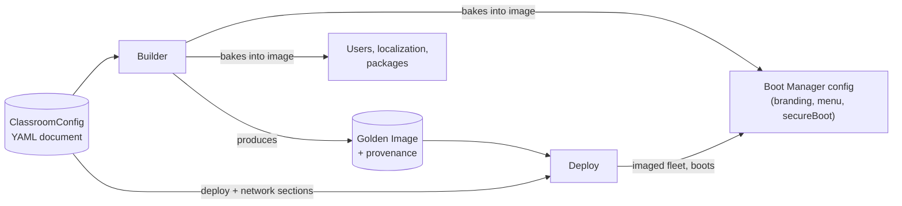

# Configuration

This document describes the unified BCS configuration format: a single YAML document that drives Boot Manager, Builder, and Deploy for one classroom. It is the field-by-field companion to [config/schema.yaml](../config/schema.yaml) (the normative contract) and [config/examples/default.yaml](../config/examples/default.yaml) (a fully populated reference instance).

This design is documentation and schema only — no validator, no Builder ingestion, and no Deploy consumption exist yet (see [ROADMAP.md](../ROADMAP.md)). What follows is the target contract that implementation will build against.

## Why a Single File

Historically, `SPECIFICATION.md` referred to Builder's input ambiguously as a "recipe/manifest" with the exact format left as an open question (see `BLD-001` and the open questions in [docs/architecture/builder.md](architecture/builder.md)). This document resolves that: **the recipe *is* this configuration file** — specifically its `spec.builder` and `spec.packages` sections. There is no separate "manifest" format; the term is retired in favor of "configuration" (the whole document) and "recipe" (informally, the subset Builder reads). See [docs/decisions/0005-yaml-as-unified-configuration-format.md](decisions/0005-yaml-as-unified-configuration-format.md) for the reasoning behind choosing one file, one format, for all three components.

A single file is deliberate, not just convenient: a classroom's entire intended state — branding, packages, network, users, security posture — is reviewable, diffable, and versionable as one unit, the same way a Kubernetes manifest or a `docker-compose.yaml` describes a whole application's desired state in one place.

## How the File Is Consumed

Not all three components read the live YAML file at their own runtime — only Builder does. Builder is the single ingestion point; it is responsible for carrying the relevant slices forward into the artifact and into Deploy's session parameters.

- **Builder** reads the entire document at build time: `project`, `branding`, `bootManager`, `builder`, `packages`, `users`, `localization`, and `security` are all consumed and baked into the golden image (`BLD-001`). Builder is also responsible for extracting the `bootManager` and `branding` sections into whatever local, on-disk form Boot Manager actually reads at boot time — Boot Manager itself never parses this YAML document; it reads whatever Builder materialized from it (this keeps Boot Manager's boot-time dependencies minimal, consistent with [ADR-0004](decisions/0004-bash-as-primary-implementation-language.md)'s reasoning about constrained boot environments).
- **Deploy** reads only `spec.deploy` and `spec.network` (plus `metadata` and `spec.project` for reporting/labeling) at deployment time — it has no reason to parse `spec.packages` or `spec.users`, since those are already baked into the artifact it received from Builder.
- **Boot Manager** never reads this file directly at all, for the reasons above.

## Design Principles

1. **Kubernetes-style envelope.** `apiVersion` + `kind` + `metadata` + `spec` — chosen specifically so the schema itself can evolve (new `apiVersion`s) and so new document types can be introduced later (new `kind`s) without redesigning the format. See [apiVersion versioning](#1-apiversion--for-schema-breaking-evolution).
2. **One concept, one field.** Where earlier documents used "recipe/manifest" ambiguously, this format picks one name per concept. If you find a second name for something this file already models, that's a documentation bug — file it.
3. **Traceable to requirements.** Every field that exists to satisfy a requirement says so in its schema description (e.g., `BM-001`, `DEP-007`). A field with no requirement or explicit rationale attached is a candidate for removal, not an accepted default.
4. **Secure and safe by default.** Defaults favor the safer choice (`security.secureBoot.mode: enforce`, `security.credentials.embedSharedCredentials` is `const: false` and cannot be set to `true` at all — see [`spec.security`](#specsecurity)).
5. **Explicit extensibility, not implicit permissiveness.** Unknown fields are rejected (`additionalProperties: false`) everywhere *except* the two sanctioned escape hatches described in [Extensibility Model](#extensibility-model). A format that silently accepts anything can't tell a typo from an intentional new feature; one that rejects everything can't evolve. This format does neither by accident.

## The Envelope

| Field | Type | Required | Description |
|---|---|---|---|
| `apiVersion` | string (enum) | Yes | Schema group and version. Only `bcs/v1alpha1` exists today. See [apiVersion versioning](#1-apiversion--for-schema-breaking-evolution). |
| `kind` | string (enum) | Yes | Document type. Only `ClassroomConfig` exists today. See [Future Kinds](#future-kinds). |
| `metadata.name` | string | Yes | Machine-readable, unique identifier for this document (kebab-case, e.g. `cipfp-batoi-aula-201`). This is *not* the human-facing name — see `spec.project.displayName`. |
| `metadata.labels` | map[string]string | No | Free-form key/value pairs for future grouping/selection (e.g. by centre, building, floor). Not interpreted by any v1alpha1 tooling — reserved for future fleet-level tooling (see [Future Kinds](#future-kinds)). |
| `metadata.annotations` | map[string]string | No | Free-form, non-identifying metadata: contact links, ticket references. Never used for matching or selection, unlike `labels`. |

`metadata` is intentionally separate from `spec.project`: `metadata` is for *tooling* (identity, future selection), `spec.project` is for *people* (what a technician reading a report sees). Kubernetes draws the same line between `metadata` and a resource's descriptive fields; Compose draws a similar one between its top-level `name:` and a service's `labels:`.

## Field Reference

Each table below mirrors the corresponding block in [config/schema.yaml](../config/schema.yaml) exactly — if the two ever disagree, the schema is normative and this document has a bug.

### `spec.project`

Human-facing project metadata. Required.

| Field | Type | Required | Default | Description |
|---|---|---|---|---|
| `displayName` | string | Yes | — | Human-readable name shown in reports and logs. |
| `centre` | string | Yes | — | Name of the educational centre operating this configuration. |
| `academicYear` | string (`YYYY-YYYY`) | No | — | Academic year this configuration is current for. |
| `contact` | string (email) | No | — | Owner contact address. |
| `description` | string | No | — | Free-text notes on this configuration's purpose or scope. |

### `spec.branding`

Optional. Visual identity for Boot Manager's menu (`BM-004`). Omitted fields fall back to BCS's own default branding. All paths are relative to [`assets/`](../assets/README.md).

| Field | Type | Required | Default | Description |
|---|---|---|---|---|
| `logo` | string (path) | No | — | e.g. `logos/cipfp-batoi.svg`. |
| `icon` | string (path) | No | — | e.g. `icons/cipfp-batoi.png`. |
| `background` | string (path) | No | — | e.g. `backgrounds/default.png`. |
| `font` | string (path) | No | — | e.g. `fonts/NotoSans-Regular.ttf`. |
| `colors.primary` | string (hex color) | No | — | Primary theme color, e.g. `#0057B8`. |
| `colors.accent` | string (hex color) | No | — | Accent theme color, e.g. `#FDB913`. |

### `spec.bootManager`

Required. Boot-time menu and behavior; see [docs/specifications/boot-manager.md](specifications/boot-manager.md).

| Field | Type | Required | Default | Description |
|---|---|---|---|---|
| `enabled` | boolean | No | `true` | Whether Boot Manager's menu is installed at all. |
| `menu.timeoutSeconds` | integer | No | `10` | Seconds before `defaultEntry` is taken automatically (`BM-001`). |
| `menu.defaultEntry` | string | Yes | — | `id` of the `entries[]` item taken on timeout or no input. |
| `menu.entries[]` | array of object | Yes | — | Available boot paths (`BM-002`), at least one. |
| `menu.entries[].id` | string | Yes | — | Stable identifier, referenced by `defaultEntry`. |
| `menu.entries[].label` | map[locale]string | Yes | — | Per-locale display text; must cover every locale in `spec.localization.supportedLocales` (`BM-007`). |
| `menu.entries[].action` | enum | Yes | — | One of `boot-installed-os`, `request-deploy-maintenance`, `boot-recovery`. |
| `fallback.onConfigError` | const | No | `boot-installed-os` | **Not actually configurable.** Fixed to satisfy `BM-005`'s safety guarantee; present in the schema only so the guarantee is visible and auditable in every classroom's config, not because a different value is ever valid. |

**Why `fallback.onConfigError` is a `const` and not a real setting:** allowing an administrator to point the fallback at anything other than the installed OS would let a single config mistake turn `BM-005`'s safety net into a bricked classroom. This field trades a small amount of flexibility for making an important safety property impossible to accidentally disable — the same reasoning Kubernetes applies to certain immutable fields (e.g., a Pod's namespace).

### `spec.builder`

Required. Golden image build parameters — together with `spec.packages`, this is what `BLD-001` calls Builder's "recipe." See [docs/specifications/builder.md](specifications/builder.md).

| Field | Type | Required | Default | Description |
|---|---|---|---|---|
| `baseImage.distro` | const `lliurex` | Yes | — | Fixed by `PLAT-001`; present for explicitness and so a future second distro is a visible schema change, not a silent one. |
| `baseImage.distroVersion` | string | Yes | `"23"` | LliureX version. |
| `baseImage.baseDistribution` | const `ubuntu` | Yes | — | Fixed by `PLAT-002`. |
| `baseImage.baseDistributionVersion` | string | Yes | `"24.04"` | Ubuntu base version. |
| `baseImage.pinnedSnapshot` | string (`YYYY-MM-DD`) | No, but strongly recommended | — | Date of the upstream package mirror snapshot to build against. Without this, `BLD-005`'s reproducibility claim is undermined by ordinary upstream point-release drift — see [REVIEW.md §4](../REVIEW.md#4-scalability-risks). |
| `partitioning.scheme` | const `gpt` | No | `gpt` | Fixed by `BLD-004`/`PLAT-003`. |
| `partitioning.espSizeMiB` | integer | No | `512` | EFI System Partition size. |
| `partitioning.recoveryPartition.enabled` | boolean | No | `true` | Whether to lay out a recovery partition. |
| `partitioning.recoveryPartition.sizeMiB` | integer | No | `8192` | Recovery partition size. |
| `provenance.checksumAlgorithm` | enum | No | `sha256` | `sha256` or `sha512`, used for `BLD-006` provenance recording. |
| `output.format` | const `partclone` | No | `partclone` | Fixed by `BLD-003`. |
| `output.compression` | enum | No | `zstd` | `none`, `gzip`, or `zstd`. |

### `spec.packages`

Required. Package selection consumed by Builder alongside `spec.builder`.

| Field | Type | Required | Default | Description |
|---|---|---|---|---|
| `base[]` | array of string | Yes (≥1 item) | — | Packages installed on every machine, regardless of profile. |
| `profiles.<name>[]` | map of array of string | No | — | Named, additive package groups (e.g. `informatica`, `disseny`). **Selection of which profile applies to which machine/classroom is not modeled by v1alpha1** — see [Open Questions](#open-questions). |
| `remove[]` | array of string | No | — | Packages explicitly excluded from the base distro/LliureX defaults. |
| `repositories[]` | array of object | No | — | Additional trusted APT repositories. |
| `repositories[].name` | string | Yes (within item) | — | Repository name. |
| `repositories[].uri` | string (URI) | Yes (within item) | — | Repository URI. |
| `repositories[].signingKey` | string (path) | Yes (within item) | — | Path to the repository's signing key, relative to `assets/` — required for every custom repository, not optional, as a direct response to the supply-chain trust gap flagged in [REVIEW.md §2](../REVIEW.md#2-documentation-gaps). |

### `spec.deploy`

Required. Fleet deployment behavior; see [docs/specifications/deploy.md](specifications/deploy.md).

| Field | Type | Required | Default | Description |
|---|---|---|---|---|
| `transport.pxe.enabled` | boolean | No | `true` | Whether PXE network boot is offered (`DEP-002`). |
| `transport.pxe.serverAddress` | string (IPv4) | No | — | PXE/Deploy server address. |
| `transport.multicast.enabled` | boolean | No | `true` | Whether classroom-wide multicast sessions are used. |
| `transport.multicast.addressRange` | string (CIDR) | No | `232.10.10.0/24` | Multicast address range for sessions. |
| `session.referenceClassroomSize` | integer | No | `30` | Assumed machines per session, for capacity planning (`NFR-002`). |
| `session.timeoutMinutes` | integer | No | `50` | Target upper bound for a full-classroom session, tied to a class period (`DEP-007`). |
| `session.retry.maxAttempts` | integer | No | `3` | Per-machine retry attempts (`NFR-001`). |
| `session.retry.backoffSeconds` | integer | No | `30` | Delay between retry attempts. |
| `verification.checksumAlgorithm` | enum | No | `sha256` | Must match `spec.builder.provenance.checksumAlgorithm` for `DEP-004` to be meaningful. |
| `verification.onMismatch` | enum | No | `abort-machine` | `abort-machine` (isolate the failing machine, per `NFR-001`) or `abort-session` (stop the whole classroom). |
| `reporting.format` | enum | No | `json` | `json` or `text`, for `DEP-005` session reports. |
| `reporting.retentionDays` | integer | No | `90` | How long session reports are retained. |
| `maintenanceRequests.enabled` | boolean | No | `true` | Whether Deploy accepts `BM-006` requests from Boot Manager. |
| `maintenanceRequests.machineIdentity` | enum | No | `mac-address` | `mac-address`, `dmi-uuid`, or `custom` — see note below. |

**On `maintenanceRequests.machineIdentity`:** this field declares *which* identity strategy a deployment uses; it does not, by itself, resolve the open question in [docs/architecture/deploy.md §Open Questions](architecture/deploy.md#open-questions) about the exact wire format of a maintenance request. That transport/schema design is still pending. This field exists so that decision, once made, has somewhere to be configured per classroom rather than being hard-coded.

### `spec.users`

Optional. Default OS-level accounts baked into the golden image.

| Field | Type | Required | Default | Description |
|---|---|---|---|---|
| `defaultProfile.shell` | string | No | `/bin/bash` | Default login shell. |
| `defaultProfile.groups[]` | array of string | No | `[]` | Groups applied to accounts using the default profile. |
| `accounts[].name` | string | Yes (within item) | — | Account name (lowercase, `_`/`-` allowed). |
| `accounts[].role` | enum | Yes (within item) | — | `teacher`, `student`, or `technician`. |
| `accounts[].groups[]` | array of string | No | — | Additional groups for this account. |
| `accounts[].sudo` | boolean | No | `false` | Whether this account has administrative privileges. |
| `authentication.method` | enum | No | `local` | `local`, `ldap`, or `none`. |
| `authentication.ldap.uri` / `.baseDn` | string | No | — | Reserved for future centre directory integration — not implemented by any component yet. |
| `session.autologin` | boolean | No | `false` | Whether a session starts without a login prompt. |
| `session.guestSession` | boolean | No | `true` | Whether a guest session is offered. |

### `spec.network`

Required. Configuration for the **deployed machine's own network identity** — not to be confused with `spec.deploy.transport`, which configures the *deployment mechanism* (see [`network` vs. `deploy.transport`](#network-vs-deploytransport) below).

| Field | Type | Required | Default | Description |
|---|---|---|---|---|
| `hostnamePattern` | string | No | `{centre}-pc{index}` | Template for the deployed machine's hostname. |
| `domain` | string | No | — | DNS domain suffix. |
| `dns[]` | array of string (IPv4) | No | — | DNS resolver addresses. |
| `proxy.http` / `.https` | string | No | — | Proxy URLs, if the centre requires one. |
| `proxy.noProxy[]` | array of string | No | — | Addresses/ranges excluded from proxying. |
| `addressing.mode` | enum | Yes | `dhcp` | `dhcp` or `static`. |
| `addressing.staticAssignments[]` | array of object | No | — | Only meaningful when `mode: static`; each entry maps a `hostname` + `mac` to a fixed `ip`. |

#### `network` vs. `deploy.transport`

These two sections look similar (both mention IP addresses) but configure different things, and this distinction is deliberate rather than accidental duplication:

- **`spec.network`** describes what the *deployed machine* becomes after imaging — its hostname, DNS, proxy, and address assignment once it's running LliureX 23.
- **`spec.deploy.transport`** describes the *infrastructure Deploy itself uses* to get bits onto the machine in the first place — the PXE server's address and the multicast range a session runs over. That infrastructure typically doesn't share IP space or lifecycle with the deployed machines' own network configuration.

If a field seems like it could go in either place, ask: "is this true about the machine after deployment, or true about how deployment happens?" — the former is `network`, the latter is `deploy.transport`.

### `spec.localization`

Required. See `BM-007` and `NFR-006`.

| Field | Type | Required | Default | Description |
|---|---|---|---|---|
| `defaultLocale` | enum | Yes | `ca_ES` | `ca_ES` or `es_ES`. |
| `supportedLocales[]` | array of enum | No | `[ca_ES, es_ES]` | Locales Boot Manager's menu must provide labels for (values from `ca_ES`, `es_ES`, `en_US`). |
| `timezone` | string | No | `Europe/Madrid` | IANA timezone name. |
| `keyboardLayout` | string | No | `es` | Keyboard layout code. |

### `spec.security`

Required. See `NFR-003`, `PLAT-004`, and [SECURITY.md](../SECURITY.md).

| Field | Type | Required | Default | Description |
|---|---|---|---|---|
| `secureBoot.mode` | enum | Yes | `enforce` | `enforce`, `permissive`, or `disabled` (`PLAT-004`). This is the **only** place Secure Boot posture is configured — Boot Manager's boot chain honors this value rather than repeating it under `spec.bootManager` (see [§4](#duplication-avoided-secureboot)). |
| `credentials.embedSharedCredentials` | const `false` | No | `false` | **Cannot be set to `true`.** Present for auditability, not because embedding shared credentials is ever permitted (`NFR-003`). |
| `updates.autoSecurityUpdates` | boolean | No | `true` | Whether the deployed system applies security updates automatically. |
| `imageSigning.enabled` | boolean | No | `false` | Reserved. Builder does not implement image signing yet (`ROADMAP.md` Phase 5); setting this to `true` today has no effect. |
| `imageSigning.keyRef` | string | No | — | Reserved, paired with `enabled`. |
| `networkTrust.allowedDeployServers[]` | array of string (IPv4) | No | — | Explicit allowlist of legitimate Deploy servers — a partial, configuration-level mitigation for the network trust gap noted in [SECURITY.md](../SECURITY.md#security-relevant-design-areas); enforcement is a Deploy implementation responsibility, not yet built. |

#### Duplication Avoided: `secureBoot`

An earlier draft of this design placed a `secureBoot.mode` field under both `spec.bootManager` and `spec.security`. That was rejected during design specifically because it repeats the four-layer-duplication problem identified in [REVIEW.md §3](../REVIEW.md#3-duplicated-concepts) — two fields that must always agree are one bug away from disagreeing. Secure Boot posture is a security decision (`PLAT-004`) that Boot Manager must *honor*, not a Boot Manager setting in its own right; it lives once, under `spec.security`.

### `spec.extensions`

Optional (defaults to `{}`). See [Extensibility Model](#extensibility-model).

## Extensibility Model

The brief for this design explicitly called for thinking about extensibility over a 10-year horizon. Three independent mechanisms exist, deliberately for different kinds of change:

### 1. `apiVersion` — for schema-breaking evolution

`apiVersion` follows the Kubernetes API group/version convention: `bcs/v1alpha1` today. When a change to the schema would break existing configuration files (removing a field, changing a type, changing required-ness), it ships as a new version — `bcs/v1beta1`, then eventually `bcs/v1` — rather than mutating `v1alpha1`'s meaning under existing files. Tooling is expected to support reading multiple `apiVersion`s during a deprecation window, mirroring Kubernetes' own API deprecation policy. This policy should be formalized as part of [docs/processes/release-process.md](processes/release-process.md) once a validator exists to enforce it.

### 2. `spec.extensions` — for structured, not-yet-formal fields

A free-form object (`additionalProperties: true`) that validators must always accept without error. This is the sanctioned home for a field a centre needs today that hasn't been generalized into the formal schema yet — e.g., a site-specific deployment parameter. Fields that prove broadly useful should graduate out of `extensions` into a proper schema field (with its own requirement or rationale) in a future `apiVersion`, not live in `extensions` indefinitely.

### 3. `x-` prefixed keys — for ad hoc tooling metadata

Following the Docker Compose convention, any key prefixed with `x-`, at any level of the document, is ignored by schema validation (`patternProperties: "^x-"` at both the document root and inside `spec`). This is for tooling annotations that don't warrant a structured field at all — e.g., a local script attaching its own bookkeeping to a config file without needing schema changes.

**When to use which:** if the value has real structure and might matter to more than one tool, use `spec.extensions`. If it's a one-off annotation for a single piece of tooling, use an `x-` key. If it's identity or selection metadata, it probably belongs in `metadata.labels`/`metadata.annotations` instead of either.

### Future Kinds

`kind: ClassroomConfig` describes one classroom's complete desired state. It deliberately does *not* attempt to solve multi-classroom or multi-centre orchestration — see the scope gap identified in [REVIEW.md §1.4](../REVIEW.md#14-the-mission-statement-and-the-specification-describe-two-different-systems). The envelope is designed so that a future `kind: FleetConfig` (composing or overlaying multiple `ClassroomConfig` documents) can be introduced as an additive change — a new `kind`, not a redesign of this one — when that scope is actually tackled (`ROADMAP.md` Phase 5). This is intentionally not designed further here: per the proportionality concern in [REVIEW.md §7](../REVIEW.md#7-a-meta-concern-proportionality), speculative design for a scope that isn't scheduled yet is exactly the kind of premature ceremony this project should be avoiding now.

## Open Questions

Documented rather than silently assumed, per this project's own convention:

- **Package profile selection.** `spec.packages.profiles` defines named package groups, but nothing in v1alpha1 says which profile applies to which machine or classroom subset within a single `ClassroomConfig`. Today, a config implicitly applies all listed profiles to every machine it describes. Per-machine profile assignment (if ever needed) is deferred, not designed.
- **Maintenance request wire format.** As noted under `spec.deploy.maintenanceRequests`, this config declares an identity *strategy*, not the request's actual transport/schema — that remains open in [docs/architecture/deploy.md](architecture/deploy.md#open-questions).
- **Cross-file composition.** Nothing in this design defines how one centre might share a common base configuration across many classrooms (a `docker-compose.override.yaml`-style mechanism, or Kustomize-style overlays). This is genuinely useful for a centre with many similar classrooms, but is explicitly deferred rather than designed speculatively here, for the same proportionality reason as [Future Kinds](#future-kinds).

## Validation

[config/schema.yaml](../config/schema.yaml) is a [JSON Schema](https://json-schema.org/) (Draft-07) document, expressed in YAML. It is the normative contract — this document explains it, but the schema file is authoritative if the two ever disagree.

No validator tool exists yet. Once Builder implementation begins, validating a `ClassroomConfig` document against this schema (e.g., with a standard JSON Schema library) should be one of the first things Builder does, and should also run as its own check under [tools/](../tools/README.md) and in CI, per [docs/processes/development-workflow.md](processes/development-workflow.md#ci-expectations-once-implemented).

## Authoring a New Classroom Configuration

Until tooling exists, the manual process is:

1. Copy [config/examples/default.yaml](../config/examples/default.yaml) to a new file.
2. Update `metadata.name` and `spec.project` for the new classroom/centre.
3. Adjust `spec.branding`, `spec.packages`, `spec.network`, and `spec.users` as needed; leave sections that don't need to differ untouched.
4. Check the result against [config/schema.yaml](../config/schema.yaml) by hand (or with a general-purpose JSON Schema validator pointed at both files) until BCS ships its own tooling.

## Related Documents

- [config/schema.yaml](../config/schema.yaml) — the normative schema.
- [config/examples/default.yaml](../config/examples/default.yaml) — the reference instance.
- [docs/decisions/0005-yaml-as-unified-configuration-format.md](decisions/0005-yaml-as-unified-configuration-format.md) — why YAML and this envelope, over the alternatives.
- [SPECIFICATION.md](../SPECIFICATION.md) — the requirements every field traces back to.
- [docs/architecture/builder.md](architecture/builder.md), [docs/architecture/deploy.md](architecture/deploy.md), [docs/architecture/boot-manager.md](architecture/boot-manager.md) — component designs this configuration feeds.
- [REVIEW.md](../REVIEW.md) — the architecture review this design directly responds to in several places.
