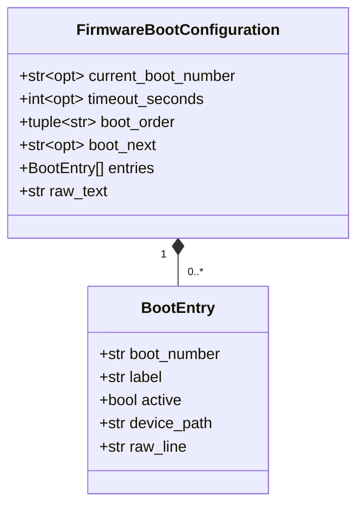
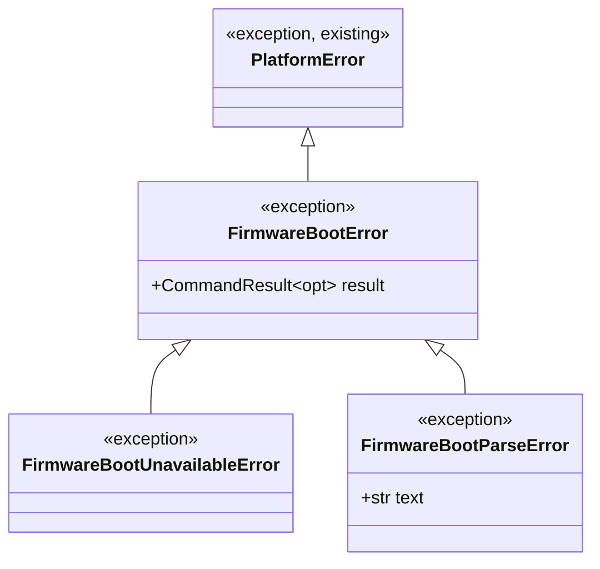

# EFI Adapter — Design Proposal (Firmware Boot Configuration, Host Discovery)

> **Status: Accepted; models and parser implemented.** The architecture below (as amended during review — see [§ Amendments Incorporated](#amendments-incorporated-during-review)) is approved. **Implemented so far:** `BootEntry`/`FirmwareBootConfiguration` (`cli/src/bcs/platform/adapters/efi/models.py`) and `parse_firmware_boot_configuration` (`cli/src/bcs/platform/adapters/efi/parser.py`) — a pure function, no `subprocess`, no `CommandRunner`, no adapter, no CLI integration, per this document's own module boundaries. **Not yet implemented:** `adapter.py`, `errors.py`, and everything in [§ Adapter Responsibilities](#adapter-responsibilities)/[§ Error Mapping](#error-mapping) that depends on them — those remain gated on a separate, explicit go-ahead before any further `.py` file is written.

## Amendments Incorporated During Review

The design below already reflects these; listed here for traceability against the original proposal:

1. **Package renamed:** `bcs.platform.adapters.efibootmgr` → `bcs.platform.adapters.efi`. The package represents the EFI *domain*, not `efibootmgr` the current implementation technology — a future reimplementation (`efivarfs` sysfs reads, `libefivar` bindings, or anything else) could replace today's `efibootmgr`-shelling-out internals without changing the public package name or any model name.
2. **Models renamed away from tool-specific names**: `EfiBootConfiguration` → `FirmwareBootConfiguration`. `BootEntry` is unchanged — it was already domain-named. See [§ Pydantic Models](#pydantic-models) for the full renaming rationale, including a real naming collision this avoids.
3. **The parser's independence from the execution layer is now an explicit, load-bearing property**, not just an implementation detail: it accepts only `text: str`, never imports `CommandRunner` or `subprocess`, and never knows where its input came from. See [§ Parser Architecture](#parser-architecture).
4. **A new project-wide architectural rule** — domain-driven naming for packages, adapters, and models — is recorded in [docs/standards/naming-conventions.md](standards/naming-conventions.md#domain-driven-naming) and [docs/standards/coding-standards.md](standards/coding-standards.md#domain-driven-naming), not just applied locally here.
5. **The locale policy (`LANG=C`/`LC_ALL=C`) is now a Platform Layer-wide rule**, not an EFI-specific detail — see [docs/PLATFORM_LAYER.md § Locale Policy](PLATFORM_LAYER.md#locale-policy). This document only states that this adapter follows it.
6. **Command execution metadata was evaluated and does not belong on `FirmwareBootConfiguration`** — see [§ Command Metadata](#command-metadata), which also documents a considered-but-deferred reusable `CommandMetadata`/envelope concept for future adapters in general.

**Compatibility with Platform-001:** none of the above touches `bcs.platform.models.CommandResult`, `bcs.platform.errors.PlatformError` (the base class), `bcs.platform.execution.CommandRunner`/`SubprocessCommandRunner`, or `RuntimeContext.command_runner` — all four already implemented and unchanged by this document. This design only adds new, adapter-scoped names underneath the already-accepted public architecture; see [§ Backward Compatibility](#backward-compatibility-with-platform-001) for the explicit check.

## Purpose

This is the first of BCS's **Host Discovery** adapters — read-only Platform Layer adapters that turn a Linux system-inspection tool's output into a typed, immutable BCS model, per [docs/PLATFORM_LAYER.md § How Future Adapters Use It](PLATFORM_LAYER.md#how-future-adapters-use-it). This one currently wraps `efibootmgr`, the standard Linux tool for inspecting (and, in general, managing) UEFI NVRAM boot variables — but the package it lives in is named after the **domain it represents (EFI firmware boot configuration)**, not after that current implementation choice; see [§ Amendments Incorporated](#amendments-incorporated-during-review), item 1.

Two needs motivate it:

1. **Host Inventory's own documented gap.** `FirmwareInfo.uefi`/`FirmwareInfo.secure_boot` ([docs/HOST_INVENTORY.md](HOST_INVENTORY.md)) can report *whether* a machine is UEFI-capable, but nothing today can report *what boot entries actually exist* — `bcs doctor`/`bcs inventory` have no visibility into `BootOrder`, `BootCurrent`, or the individual `Boot####` entries.
2. **Boot Manager's own open question.** [docs/architecture/boot-manager.md § Open Questions](architecture/boot-manager.md#open-questions) already flags "exact mechanism for UEFI NVRAM boot entry management... reliability varies significantly by vendor" (`BM-003`) as unresolved. A read-only inspection adapter is the natural first step before any *write* capability is even considered — it lets BCS observe real boot-entry data across real hardware before designing how to change it.

## Read-Only Guarantee

This is a hard, non-negotiable constraint on this adapter's scope, not a style preference:

- **This adapter never modifies EFI variables.**
- **This adapter never changes boot order.**
- **This adapter never installs rEFInd** (or any other boot loader/manager).
- **It only converts `efibootmgr` output into immutable models.** No code path in this design invokes any `efibootmgr` flag that mutates firmware state (`-o`/`--bootorder`, `-n`/`--bootnext`, `-N`/`--delete-bootnext`, `-b`/`--bootnum` combined with `-B`/`--delete-bootnum`, `-c`/`--create`, `-A`/`--active`/`-a`/`--inactive`, `-t`/`--timeout`, `-E`/`--esp`, or any other write/create/delete/activate flag). The only flag this adapter ever passes is `-v` (verbose, read-only) — see [§ Adapter Responsibilities](#adapter-responsibilities).
- If UEFI boot-entry *management* (writing) is ever pursued, it is a **separate adapter, a separate design document, and a separate ADR** — never a silent extension of this one. This document does not design that capability, does not name it, and takes no position on whether it should ever exist.

## Package Structure

```
cli/src/bcs/platform/adapters/
└── efi/                          # the EFI domain - see naming note below.
    │                              # NOT named "efibootmgr": the package survives
    │                              # a future backend swap (efivarfs, libefivar, ...)
    ├── __init__.py                  # [implemented] currently re-exports
    │                              # FirmwareBootConfiguration/BootEntry/
    │                              # parse_firmware_boot_configuration; will also
    │                              # re-export read_firmware_boot_configuration and
    │                              # this adapter's own exceptions once they exist
    ├── models.py                    # [implemented] BootEntry, FirmwareBootConfiguration
    │                              # (frozen, JSON-serializable) - see § Pydantic Models
    ├── parser.py                    # [implemented] parse_firmware_boot_configuration(text: str) ->
    │                              # FirmwareBootConfiguration - a pure function; see
    │                              # § Parser Architecture for its independence guarantees
    ├── adapter.py                    # [not yet implemented] read_firmware_boot_configuration(runner: CommandRunner) -> ...
    │                              # - the only place this package calls CommandRunner.run(),
    │                              # and the only place that knows the backend is efibootmgr
    └── errors.py                    # [not yet implemented] FirmwareBootError(PlatformError) and its two subclasses
```

**A structural refinement, flagged rather than silently done:** [docs/PLATFORM_LAYER.md § Package Structure](PLATFORM_LAYER.md#package-structure) shows adapters as flat files (`adapters/efibootmgr.py`, `adapters/lsblk.py`, ...). This design proposes organizing `efi` internally as a small subpackage instead, because it has enough internal structure to benefit from separation (a model schema, a pure parser, an I/O-performing adapter function, and adapter-specific exceptions — four concerns, not one). The **public import surface** is unaffected: `from bcs.platform.adapters.efi import read_firmware_boot_configuration, FirmwareBootConfiguration, BootEntry` works identically whether `efi` is a module or a package, since Python does not distinguish the two at the import-statement level. Nothing outside this adapter needs to know or care which it is. Other future adapters (`lsblk`, `blkid`, `mount`, `rsync` — still placeholder tool-names in `docs/PLATFORM_LAYER.md`, not yet individually designed or renamed) may or may not need the same treatment; that is each one's own design exercise, and each is also expected to receive a domain-appropriate name of its own under the rule in [§ Amendments Incorporated](#amendments-incorporated-during-review), item 4, when its turn comes — not decided here.

## Pydantic Models

**Implemented** (`cli/src/bcs/platform/adapters/efi/models.py`; see `cli/tests/test_platform_adapters_efi_models.py` for the corresponding test coverage). Both models additionally validate the four-hexadecimal-digit boot-number format described in the field table below (`boot_number`, `current_boot_number`, `boot_next`, and every `boot_order` entry), and `FirmwareBootConfiguration` rejects `entries` containing duplicate `boot_number` values — both are narrow, direct implementations of constraints already implied by this document's own field descriptions, not new design decisions.



**Naming rationale (why `FirmwareBootConfiguration`, not `EfiBootConfiguration` or `BootConfiguration`):** the bare name `BootConfiguration` was considered and rejected — it collides with an *already-existing, unrelated* concept: `ClassroomConfig`'s own `spec.bootManager.menu` structure ([docs/CONFIGURATION.md](CONFIGURATION.md)) is also, informally, "the boot configuration" (Boot Manager's *menu* — what a technician sees at power-on), a completely different thing from what UEFI firmware reports about its NVRAM boot entries. `FirmwareBootConfiguration` is unambiguous against that existing term while still being a domain name, not a tool name. `BootEntry` needed no change — it was already domain-named. `BootOption` (the UEFI specification's own term for the same concept) was considered as an alternative and is equally valid; `BootEntry` is kept because it avoids a *different* collision — "boot option" is common shorthand for a kernel/bootloader command-line option (as in GRUB), an unrelated concept this model has nothing to do with.

| Model | Field | JSON alias | Type | Notes |
|---|---|---|---|---|
| `FirmwareBootConfiguration` | `current_boot_number` | `currentBootNumber` | `str \| None` | The boot entry the firmware actually used for *this* boot (`efibootmgr`'s `BootCurrent:` line, today). `None` if absent from the source text (defensive; not expected on a real UEFI system, but never fabricated). |
| | `timeout_seconds` | `timeoutSeconds` | `int \| None` | The firmware's boot-menu timeout, in seconds (`Timeout:` line). `None` if absent — meaning "firmware default," not "zero." |
| | `boot_order` | `bootOrder` | `tuple[str, ...]` | The ordered list of boot numbers the firmware will try (`BootOrder:`, split on commas). Empty tuple if absent. |
| | `boot_next` | `bootNext` | `str \| None` | A one-time next-boot override (`BootNext:`), present only when set. |
| | `entries` | `entries` | `tuple[BootEntry, ...]` | Every boot entry found, **in the order the source text presented them** — not reordered to match `boot_order`. A consumer wanting "the entry currently first in the boot order" cross-references `boot_order[0]` against `entries[].boot_number` itself; this model does not duplicate that lookup as a convenience field, matching the minimalism already established for `bcs.platform.models.CommandResult` (no field is added purely to save a caller one lookup, unless explicitly requested). |
| | `raw_text` | `rawText` | `str` | The complete, unparsed source text, verbatim. Kept for audit/debugging and so nothing the permissive parser (see [§ Parser Architecture](#parser-architecture)) chose not to interpret is ever actually lost. Named `raw_text`, not `raw_output`, precisely because this model has no concept of "output" — see [§ Parser Architecture](#parser-architecture)'s independence guarantees. |
| `BootEntry` | `boot_number` | `bootNumber` | `str` | The four-hex-digit boot ID, e.g. `"0000"` — kept as a string (not parsed as an integer), since it is always referenced and displayed as a fixed-width hex code, never arithmetically. |
| | `label` | `label` | `str` | The human-readable label, e.g. `"ubuntu"`, `"Windows Boot Manager"`. |
| | `active` | `active` | `bool` | Whether this entry is active/enabled in the firmware's boot process. |
| | `device_path` | `devicePath` | `str` | The UEFI device path text as reported (e.g. `HD(1,GPT,...)/File(\EFI\ubuntu\shimx64.efi)`) — an official UEFI specification concept, not a tool-specific one — kept **opaque and verbatim**; this design does not parse it into a disk/partition/file-path structure. See [§ Future Extensibility](#future-extensibility). Empty string if the entry had no path segment. |
| | `raw_line` | `rawLine` | `str` | The entry's complete original source line, verbatim — the per-entry equivalent of `FirmwareBootConfiguration.raw_text`, for the same reason. |

Both models are **frozen** (`frozen=True, extra="forbid"`), matching every other model in `bcs.platform`/`bcs.inventory`. Neither carries its own `schemaVersion` — like `CommandResult`, neither model is ever the top-level payload of a `bcs` command's output; both are always embedded inside something else's result (a future Host Inventory section, a future `bcs` command's JSON), so versioning is that container's responsibility. See [§ Open Questions](#open-questions) for the still-undecided question of what that container actually is.

## Parser Architecture

`parser.parse_firmware_boot_configuration(text: str) -> FirmwareBootConfiguration` is a **pure function**, and its independence from the execution layer is a load-bearing design property, not an incidental detail:

- It accepts **only `text: str`** — a parameter named `text`, deliberately not `stdout` (that would itself be a naming leak: it would presuppose the text came from a captured process output).
- It produces only immutable Pydantic models.
- It **never imports `CommandRunner`, `bcs.platform.execution`, or `subprocess`** — there is no code path by which this module could execute anything.
- It **never knows where the text came from** — a live `efibootmgr -v` invocation, a fixture file read in a test, a cached blob, a value typed at a REPL — the function's behavior and contract are identical regardless. Nothing in its signature or implementation is allowed to assume a specific provenance.
- Treat it as a **standalone library**: it could be extracted into its own package with zero changes and no new dependencies, and it is tested that way (see [§ Testing Strategy](#testing-strategy)) — fixture text goes in, a model comes out, with no mocking of anything.

**Implemented** (`cli/src/bcs/platform/adapters/efi/parser.py`; see `cli/tests/test_platform_adapters_efi_parser.py`). **Line-by-line parsing, with two distinct permissiveness rules** (of the text `efibootmgr -v` currently produces — a fact about today's backend, not about the parser's own contract):

| Pattern | Extracted into |
|---|---|
| `BootCurrent: <hex>` | `current_boot_number` |
| `Timeout: <N> seconds` (or `second`) | `timeout_seconds` |
| `BootOrder: <hex>,<hex>,...` | `boot_order` (split on `,`) |
| `BootNext: <hex>` | `boot_next` |
| `Boot<hex4><*or space><tab-separated label and device path>` | one `BootEntry` — the `*` immediately after the four hex digits (no space before it) sets `active`; everything after the first tab is `device_path` (empty string if there is no tab, i.e. a label with no path segment) |
| anything else | **ignored, not an error** |

The parser distinguishes two failure modes, matching the same "degrade gracefully, never crash, never fabricate" philosophy already established for `bcs.inventory.collectors` ([docs/HOST_INVENTORY.md § Design Principles](HOST_INVENTORY.md#design-principles)) while still catching genuinely broken data:

1. **A line matching no recognized pattern at all** (a future `efibootmgr` version adds a new field this design doesn't know about; a firmware-specific quirk line) is **silently skipped, never an error** — `raw_text`/`raw_line` mean nothing is actually lost, only left unstructured. Text with *no* recognized lines at all is a legitimate result (every field takes its default), not a parser-level failure — see [§ Error Mapping](#error-mapping) for why detecting "this doesn't look like `efibootmgr` output at all" is an adapter-level concern, not this function's.
2. **A line matching a recognized prefix but failing the value format that prefix implies** (e.g. `BootCurrent: not-hex`, `Timeout: not-a-number seconds`, a non-hex entry in `BootOrder:`) is a **malformed mandatory field**, rejected with a `ValueError` naming the field, the 1-based line number, and the offending line verbatim, so a broken fixture or a genuinely corrupt firmware report is never silently swallowed. Two entries sharing the same `boot_number` raise `pydantic.ValidationError` instead, via `FirmwareBootConfiguration`'s own uniqueness check — the parser does not duplicate that cross-entry validation itself.

## Adapter Responsibilities

`adapter.read_firmware_boot_configuration(runner: CommandRunner) -> FirmwareBootConfiguration` is the only place this package calls `CommandRunner.run()`, and the **only** place that knows the current backend is `efibootmgr` at all. It is a thin orchestration layer, not where any parsing logic lives:

1. Build the command: **always exactly `["efibootmgr", "-v"]`** — no other flag is ever passed, per [§ Read-Only Guarantee](#read-only-guarantee).
2. Build the locale-forced environment required by every Platform Layer adapter — see [docs/PLATFORM_LAYER.md § Locale Policy](PLATFORM_LAYER.md#locale-policy) for the platform-wide rule and rationale; this adapter does not restate it.
3. Call `runner.run(["efibootmgr", "-v"], timeout_seconds=<a short default>, env=<locale-forced env>, check=False)`. `check` is deliberately **false** — the adapter inspects `result.exit_code`/`result.stdout`/`result.stderr` itself to choose the right typed exception (see [§ Error Mapping](#error-mapping)) rather than accepting whatever generic `CommandExecutionError` `check=True` would produce.
4. On a zero exit, pass `result.stdout` to `parser.parse_firmware_boot_configuration` (as `text`) and return its `FirmwareBootConfiguration`.
5. On a non-zero exit or an unparseable zero-exit result, raise one of this adapter's own exceptions (see [§ Error Mapping](#error-mapping)).

`timeout_seconds` defaults to a short, conservative budget (proposed: **5 seconds** — reading NVRAM is normally near-instant; this is headroom for a slow/quirky firmware, not a real workload budget) and is never omitted, matching [docs/PLATFORM_LAYER.md § CommandRunner API](PLATFORM_LAYER.md#commandrunner-api)'s guidance that adapters should always pass an explicit value.

## Interaction with `CommandRunner`

- Received via dependency injection (a function parameter) — never constructed inline, never a module-level default, per [docs/PLATFORM_LAYER.md § Dependency Injection](PLATFORM_LAYER.md#dependency-injection).
- Exactly **one** `CommandRunner.run()` call per `read_firmware_boot_configuration()` invocation. No retries (a future consideration, not designed here).
- `check=False` always (see [§ Adapter Responsibilities](#adapter-responsibilities), point 3).
- `timeout_seconds` always explicit.
- `env` always explicit — locale-forced, per [docs/PLATFORM_LAYER.md § Locale Policy](PLATFORM_LAYER.md#locale-policy).
- `cwd` and `input_text` are never passed — irrelevant to this tool.
- This is the **only** module in this adapter that imports anything from `bcs.platform.execution` — `models.py` and `parser.py` do not, per [§ Parser Architecture](#parser-architecture).

## Error Mapping

| Condition | Exception raised | Notes |
|---|---|---|
| `efibootmgr` not on `PATH` | `bcs.platform.errors.CommandNotFoundError` | Raised automatically by `CommandRunner` itself; the adapter does no translation — it already is a clean, typed exception. |
| `runner.run()` exceeds its timeout | `bcs.platform.errors.CommandTimeoutError` | Same — raised automatically by `CommandRunner`, propagated unchanged. |
| Non-zero exit, `stderr` recognizably indicates EFI variables are unavailable (not a UEFI system, insufficient permission to read `/sys/firmware/efi/efivars`, etc.) | `errors.FirmwareBootUnavailableError` | The *semantic* failure — "this environment cannot answer this question" — kept distinct from "the tool itself is broken." |
| Non-zero exit, not recognizable as the above | `errors.FirmwareBootError` (the base class itself) | Carries the full `CommandResult` (mirroring `CommandExecutionError`'s own `result` attribute) for diagnosis; an unanticipated failure mode, not yet given its own subclass. |
| Zero exit, but the text contains none of the recognized patterns at all (see [§ Parser Architecture](#parser-architecture)) | `errors.FirmwareBootParseError` | Distinguishes "a real, if very unusual, output the parser tolerates" from "this isn't `efibootmgr`-shaped output at all" — a version incompatibility worth surfacing distinctly, not silently returning a suspiciously-empty model. |



`FirmwareBootError` extends `bcs.platform.errors.PlatformError` directly — not a new, separate hierarchy — so a caller can `except PlatformError` once and catch every Platform Layer failure (core or adapter) uniformly, per the hierarchy `docs/PLATFORM_LAYER.md#exception-hierarchy` already established. Naming these exceptions after the domain (`FirmwareBoot*`) rather than the tool (`Efibootmgr*`) follows the same rule as the models — see [§ Amendments Incorporated](#amendments-incorporated-during-review), item 4.

## Locale Policy

This adapter follows the Platform Layer's locale policy in full — see [docs/PLATFORM_LAYER.md § Locale Policy](PLATFORM_LAYER.md#locale-policy) for the platform-wide rule, rationale, and mechanism (`os.environ` copy plus `LANG=C`/`LC_ALL=C` overrides, required because `CommandRunner`'s `env` replaces rather than merges). This section exists only to confirm this adapter is a conforming example of that rule, not to restate it.

## Command Metadata

**Evaluated question:** should `FirmwareBootConfiguration` carry command-execution metadata (how long the probe took, when it ran, what the exit code was)?

**Conclusion: no — this metadata belongs on `CommandResult`, not on the domain model.** Reasoning:

1. **Domain purity.** `FirmwareBootConfiguration` represents a fact about the *machine* (what its firmware's boot configuration currently is). Execution metadata is a fact about the *act of probing* it, not about the machine. Conflating the two would mean every future domain model produced by an adapter would need the same fields duplicated, blurring "what is true about the machine" against "how did we learn it" — exactly what the new domain-driven-naming/domain-modeling principle (see [§ Amendments Incorporated](#amendments-incorporated-during-review), item 4) argues against.
2. **It already exists, and duplicating it risks disagreement.** `bcs.platform.models.CommandResult` (Platform-001, already implemented) already carries `command`, `duration`, `startedAt`, `finishedAt`, `exitCode`, `workingDirectory`. `read_firmware_boot_configuration(runner)` has the full `CommandResult` available before it discards everything but `.stdout`; copying any of those fields onto `FirmwareBootConfiguration` would create two sources of truth for the same fact, one of which could go stale relative to the other.
3. **The pure parser structurally cannot know this information anyway.** `parse_firmware_boot_configuration` — the function that actually constructs `FirmwareBootConfiguration` — receives only `text: str`, by design (see [§ Parser Architecture](#parser-architecture)). It has no `duration`, no timestamps, no exit code to put on the model even if the schema had a place for them. This alone settles the question for *this* model: the layer that builds it is constitutionally unaware of execution facts.

**Should a reusable `CommandMetadata` model be introduced for future adapters in general?** Considered, and **not concluded to be architecturally necessary yet**:

- A generic envelope (e.g., a future `bcs.platform.models.CommandMetadata`, or an `AdapterResult[T]`-style wrapper pairing a parsed domain model with its originating `CommandResult`) is a *conceivable* future need — e.g., if a Deploy session report ever wants to show not just "here's the firmware boot configuration" but "here's when and how we learned it."
- No concrete consumer asks for this today. Introducing it now would be the same speculative-generalization mistake [REVIEW.md §7](../REVIEW.md#7-a-meta-concern-proportionality) already argues against repeatedly in this project (e.g., the declined Collector-Protocol abstraction in [docs/HOST_INVENTORY.md](HOST_INVENTORY.md#proposed-changes-requiring-approval)).
- If a real need arises, the natural, minimally invasive fix is at the **adapter's own return contract** (e.g., a future `read_firmware_boot_configuration_with_metadata(runner) -> tuple[FirmwareBootConfiguration, CommandResult]`, or an adapter-specific wrapper) — not by adding fields to the domain model, and not by forcing a still-hypothetical generic wrapper onto every adapter before any of them need it.
- Recorded here as a deferred idea, not a rejected one — if a second adapter later hits the same need independently, that repetition is exactly the signal that would justify revisiting this.

## Supported `efibootmgr` Versions

BCS targets a fixed platform, not generic Linux ([SPECIFICATION.md §4](../SPECIFICATION.md#4-explicit-non-goals)) — the same applies here. The **primary, supported target is whatever `efibootmgr` version ships with Ubuntu 24.04 LTS** (`PLAT-002`), since that is BCS's actual deployment target. This document does not pin an exact version number as a hard fact — that should be confirmed empirically against a real Ubuntu 24.04 image/machine before implementation, and recorded here once known — but the parser's permissive, line-pattern design (see [§ Parser Architecture](#parser-architecture)) is intended to tolerate minor formatting drift across nearby releases without a hard version check anywhere in the code. Compatibility with `efibootmgr` versions substantially older (e.g., the ~0.5–0.6 series once common on much older distributions) or newer than what Ubuntu 24.04 ships is **best-effort, not a guarantee** — this mirrors [docs/architecture/boot-manager.md § Open Questions](architecture/boot-manager.md#open-questions)'s own acknowledgment that UEFI behavior "varies significantly by vendor," here extended to the tool used to inspect it. This is a fact about the current backend, tracked in this section precisely because it is *not* baked into the adapter's or parser's public names (see [§ Amendments Incorporated](#amendments-incorporated-during-review), item 1).

## Testing Strategy

| Layer | What it verifies | How |
|---|---|---|
| `models.BootEntry`/`models.FirmwareBootConfiguration` **(implemented)** | Construction, defaults, the boot-number-format and duplicate-entry validators, immutability, equality, hashability, and JSON serialization/deserialization round-tripping (including alias names) for both models. | Direct unit tests, no fixtures or mocking needed — see `cli/tests/test_platform_adapters_efi_models.py`. |
| `parser.parse_firmware_boot_configuration` **(implemented)** | Every line pattern in [§ Parser Architecture](#parser-architecture), individually and combined; permissive handling of unrecognized lines; an entry with no device-path segment; blank lines; empty-but-present `BootNext:`/`BootOrder:` values; absent `Timeout`/`BootNext` lines; each malformed-mandatory-field rejection (`BootCurrent`, `Timeout`, `BootOrder`, `BootNext`) with its line-number-and-line-text message; the duplicate-`boot_number` `ValidationError`; and (via AST inspection, not a substring search) that the module imports nothing beyond `re`/`typing`/its own models. | Direct unit tests — see `cli/tests/test_platform_adapters_efi_parser.py`. The real corpus (`cli/tests/fixtures/firmware/`) still holds only zero-byte placeholders (see the row below), so these tests build a *temporary*, `tmp_path`-rooted corpus mirroring the real one's layout and load every scenario through `fixture_utils.load_fixture`/`fixture_path` — never an inline string passed straight to the parser — proving the loader helpers are reusable exactly as intended, without writing synthetic content into the real corpus. Once real captures replace the placeholders, this test module is expected to switch to loading them directly from `cli/tests/fixtures/firmware/` instead. |
| Real captured fixtures (not yet available) | Confidence against actual `efibootmgr` output, not just a test author's assumptions about its format. | Blocked on real capture — see `cli/tests/fixtures/firmware/README.md`'s inventory table. The corpus infrastructure exists: `cli/tests/fixtures/firmware/` (vendor-organized — `generic/`, `dell/`, `hp/`, `lenovo/` — per `BM-003`'s known per-OEM variability; the category is domain-named `firmware`, superseding this document's originally proposed `fixtures/efi/` location), with collection/locale/anonymization/naming rules in `cli/tests/fixtures/README.md` and shared loading helpers in `cli/tests/fixture_utils.py`. Captures must come from a real machine or VM — never invented. |
| `adapter.read_firmware_boot_configuration` | Correct command (`["efibootmgr", "-v"]`), correct locale-forced `env`, correct explicit `timeout_seconds`, `check=False`, and that a successful result is handed off correctly to the parser. | `FakeCommandRunner` ([docs/PLATFORM_LAYER.md § Testing Strategy](PLATFORM_LAYER.md#testing-strategy) — itself not yet implemented, tracked there), programmed to return a `CommandResult` wrapping one of the same fixture texts as `stdout`. |
| Error mapping | Each condition in [§ Error Mapping](#error-mapping) maps to the right exception. | `FakeCommandRunner` programmed to return/raise the corresponding failure shape (a non-zero `CommandResult` with "not supported"-style `stderr`; a zero-exit `CommandResult` with garbage `stdout`; letting `CommandNotFoundError`/`CommandTimeoutError` pass through unchanged from a fake that raises them directly). |
| Real end-to-end (optional, environment-gated) | That the whole chain works against a real `efibootmgr` binary. | Skipped unless `efibootmgr` is actually on `PATH` and the platform is Linux — mirroring `bcs.inventory.collectors`' "must degrade gracefully off-Linux" real-host test philosophy. Expected to skip in CI (GitHub Actions `ubuntu-latest` runners are not booted via UEFI with real NVRAM boot variables); its value is manual verification on real target hardware, not CI coverage. |

## Future Extensibility

- **A different backend** (`efivarfs` sysfs reads, `libefivar` bindings, or anything else) — the entire reason for the domain-named package boundary (see [§ Amendments Incorporated](#amendments-incorporated-during-review), item 1): only `adapter.py` would need to change; `models.py`, `parser.py`'s public contract, and every consumer's import path would not.
- **Structured device-path parsing** (decomposing `device_path` into GPT disk/partition GUID and file-path components) — deferred; `device_path`/`raw_line` keep the full text available if this becomes worth doing later.
- **A `--json`-style structured output flag**, if a future `efibootmgr` release adds one — would be a parser alternative, not a redesign of the models; noted, not pursued now.
- **Boot-entry *management*** (create/delete/reorder/activate) — explicitly, permanently out of scope for *this* adapter; see [§ Read-Only Guarantee](#read-only-guarantee). A future write-capable adapter, if ever pursued, is a new document and a new ADR, not an amendment to this one.
- **A reusable `CommandMetadata`/envelope concept** for pairing a parsed model with its originating `CommandResult` — see [§ Command Metadata](#command-metadata); deferred, not concluded necessary.
- **Consumption by `bcs doctor`/`bcs inventory`, or a future Host Inventory section** — not decided here; see [§ Open Questions](#open-questions).
- **Consumption by Boot Manager** (Bash, per [ADR-0004](decisions/0004-bash-as-primary-implementation-language.md)) would happen the same way Host Inventory is designed to be consumed — via `bcs`'s own JSON output, never a direct Python import — once Boot Manager's own phase begins.

## Backward Compatibility with Platform-001

Explicitly checked, per the request that these amendments not affect the public architecture already accepted in Platform-001:

| Already-implemented public name | Affected by this document? |
|---|---|
| `bcs.platform.models.CommandResult` (all fields, `success` property) | No. |
| `bcs.platform.errors.PlatformError`, `CommandNotFoundError`, `CommandTimeoutError`, `CommandExecutionError` | No — `FirmwareBootError` and its subclasses *extend* `PlatformError`, the same pattern already established; nothing existing is modified. |
| `bcs.platform.execution.CommandRunner` (Protocol shape), `SubprocessCommandRunner` | No. |
| `bcs.context.RuntimeContext.command_runner` | No. |
| `cli/pyproject.toml`'s `S603`/`S607` Ruff scoping (still not yet applied, per `docs/PLATFORM_LAYER.md`'s own Approved Design Decisions list) | No change to what was already proposed. |

Everything in this document is a **new, additive** name (`bcs.platform.adapters.efi` and everything under it) — nothing already accepted or implemented in Platform-001 is renamed, removed, or reinterpreted.

## Open Questions

- **What exposes this to a `bcs` command at all?** This document designs the adapter itself, not its CLI surface. Whether `FirmwareBootConfiguration` becomes a new `bcs.inventory.models.HostInventory` field (alongside `firmware`), a wholly new `bcs` command, or something else, is undecided — mirroring how [docs/HOST_INVENTORY.md](HOST_INVENTORY.md) deferred its own REST API topology question rather than guessing. Migrating any existing collector to accept an injected `CommandRunner` is *also* still an open question per [docs/PLATFORM_LAYER.md § Open Questions](PLATFORM_LAYER.md#open-questions--explicitly-deferred).
- **Exact reference `efibootmgr` version** — to be confirmed empirically against a real Ubuntu 24.04 LTS system before implementation; see [§ Supported `efibootmgr` Versions](#supported-efibootmgr-versions).
- **Real fixture capture** — the corpus infrastructure, collection rules, and placeholder scenarios now exist (`cli/tests/fixtures/firmware/`, see its README), but no real output has been captured yet; every fixture is a zero-byte placeholder awaiting capture from real hardware/VMs.
- **Subpackage-vs-flat-file structure** — flagged in [§ Package Structure](#package-structure) as a proposed refinement over `docs/PLATFORM_LAYER.md`'s originally-shown flat-file layout; not itself a blocking question, but worth an explicit yes/no from whoever approves implementation.
- **Whether a reusable `CommandMetadata`/envelope concept is ever built** — see [§ Command Metadata](#command-metadata); deliberately left open, not designed.

## Related Documents

- [docs/decisions/0010-efi-adapter-read-only-scope.md](decisions/0010-efi-adapter-read-only-scope.md) — the architectural decision this design proposal builds on (status: `Accepted`).
- [docs/PLATFORM_LAYER.md](PLATFORM_LAYER.md) and [ADR-0009](decisions/0009-platform-layer-command-runner.md) — the `CommandRunner`/`CommandResult`/`PlatformError` foundation this adapter is built on, its Locale Policy (§ Locale Policy), and the "How Future Adapters Use It" section this document fulfils for the EFI domain specifically.
- [docs/standards/naming-conventions.md § Domain-Driven Naming](standards/naming-conventions.md#domain-driven-naming) and [docs/standards/coding-standards.md § Domain-Driven Naming](standards/coding-standards.md#domain-driven-naming) — the project-wide rule this document's renames apply.
- [docs/HOST_INVENTORY.md](HOST_INVENTORY.md) and [ADR-0008](decisions/0008-host-inventory-ports-and-adapters.md) — the sibling subsystem this design mirrors in style, and `FirmwareInfo`'s existing UEFI/Secure Boot facts this adapter's data is expected to eventually sit alongside.
- [docs/architecture/boot-manager.md § Open Questions](architecture/boot-manager.md#open-questions) — the `BM-003` UEFI NVRAM boot-entry management question this adapter's read-only data is meant to inform, not resolve.
- [SPECIFICATION.md §4](../SPECIFICATION.md#4-explicit-non-goals) — the fixed-target-platform stance this document's versioning approach mirrors.
- [REVIEW.md §7](../REVIEW.md#7-a-meta-concern-proportionality) — the proportionality concern this document defers to when declining to design structured device-path parsing, write capability, or a reusable `CommandMetadata` model now.
