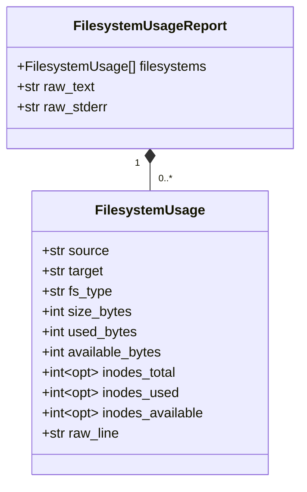
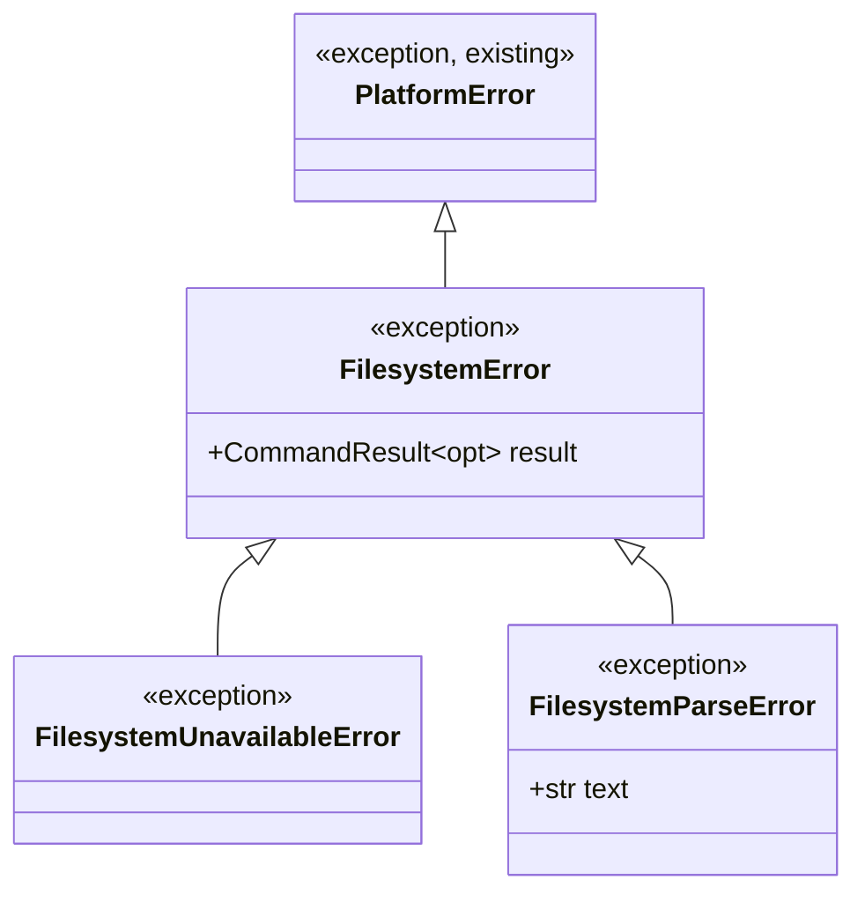
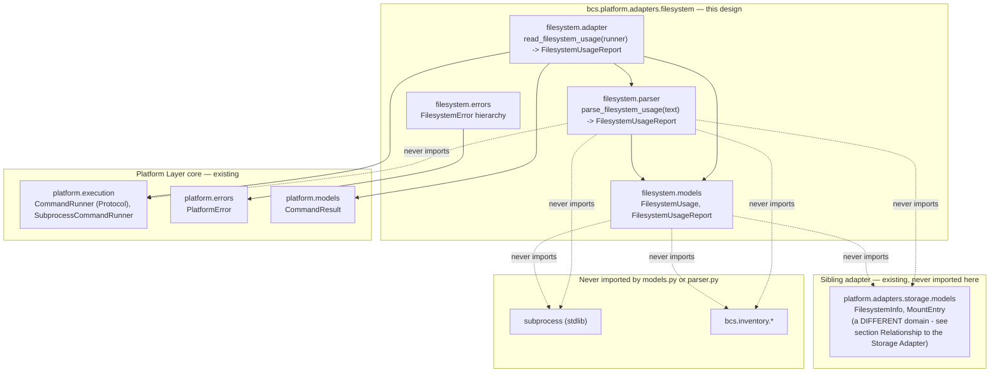
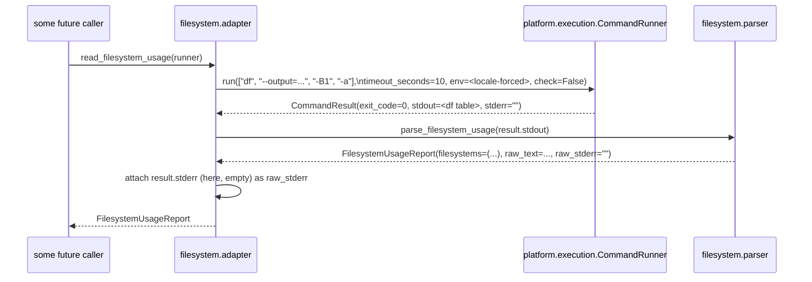
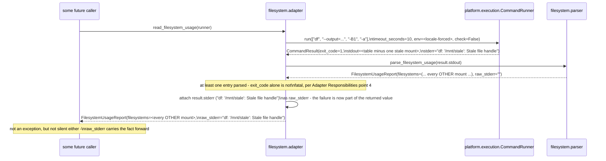

# Filesystem Adapter — Design Proposal (Filesystem Usage and Capacity, Host Discovery)

> **Status: Proposed, pending approval.** This document is the authoritative design for the Filesystem Adapter, the fourth Host Discovery adapter in BCS's Platform Layer, following the same ports-and-adapters architecture as the [EFI Adapter](EFI_ADAPTER.md) (`Accepted`, implemented), the [Storage Adapter](STORAGE_ADAPTER.md) (`Accepted`, implemented), and the [Secure Boot Adapter](SECURE_BOOT_ADAPTER.md) (`Accepted`, domain models/parser/error hierarchy implemented, adapter execution layer not yet). Nothing described here is implemented. See [§ ADR Recommendation](#adr-recommendation) for why this document concludes no new ADR is required.

## Purpose

This is the fourth of BCS's **Host Discovery** adapters — read-only Platform Layer adapters that turn Linux system-inspection tool output into typed, immutable BCS models, per [docs/PLATFORM_LAYER.md § How Future Adapters Use It](PLATFORM_LAYER.md#how-future-adapters-use-it). This one wraps `df`, the standard Linux tool for reporting filesystem space and inode usage, to close a gap the [Storage Adapter](STORAGE_ADAPTER.md) itself deferred and a gap `bcs.inventory.collectors` currently papers over with a single-purpose workaround.

Two needs motivate it:

1. **The Storage Adapter's own deferred Open Question.** [docs/STORAGE_ADAPTER.md § Open Questions, item 1](STORAGE_ADAPTER.md#open-questions) asked: *"Should the adapter also call `df -B1 --output=...` for usage statistics? ... Recommendation: Defer; usage data can be queried live when needed."* [docs/HOST_DISCOVERY_ORCHESTRATOR.md § Future Extensibility](HOST_DISCOVERY_ORCHESTRATOR.md#future-extensibility) later restated this as an explicitly unresolved boundary question: *"The `filesystem` domain's boundary against the Storage Adapter's already-designed `FilesystemInfo`/`MountEntry` is explicitly not resolved by this document — a future Filesystem adapter's own design must clarify whether it is a distinct domain or an enrichment of Storage's existing filesystem facts before its slot is filled in here."* This document is that future design, and [§ Relationship to the Storage Adapter](#relationship-to-the-storage-adapter) is where it settles the question.
2. **Host Inventory's existing usage computation is real, but narrow.** `bcs.inventory.collectors._partition_usage()` (`cli/src/bcs/inventory/collectors.py`) already calls `os.statvfs()` to compute `(total_bytes, free_bytes)` — but only for the one hardcoded `_ESP_MOUNT_POINT` (`/boot/efi`), used only by `collect_efi_system_partition()` to populate `EfiSystemPartition.size_bytes`/`free_bytes` (`CLI-016`). There is no general mechanism today for asking "how much space is free on *any* mounted filesystem" — a question Builder (writing a golden image) and Deploy (restoring one, `DEP-003`) both need answered before a space-sensitive operation begins, not just for the ESP. This adapter generalizes the *exact same underlying need* `_partition_usage()` already proves BCS has, the same way the [Storage Adapter](STORAGE_ADAPTER.md) generalized `collect_storage()`'s own narrow `sysfs` enumeration into a full, tool-based topology view.

No `SPECIFICATION.md` requirement mandates this adapter today — unlike `PLAT-004` motivating the [Secure Boot Adapter](SECURE_BOOT_ADAPTER.md#purpose), there is no `FS-`-prefixed requirement to cite. This document is deliberately transparent about that: it is grounded in the two concrete precedents above, not in a numbered requirement, and [§ ADR Recommendation](#adr-recommendation) and [§ Open Questions](#open-questions) both return to whether that is a sufficient basis to build this now, per [REVIEW.md §7](../REVIEW.md#7-a-meta-concern-proportionality)'s proportionality concern.

## Scope Guarantee

Mirroring [docs/EFI_ADAPTER.md § Read-Only Guarantee](EFI_ADAPTER.md#read-only-guarantee) and [docs/SECURE_BOOT_ADAPTER.md § Scope Guarantee](SECURE_BOOT_ADAPTER.md#scope-guarantee), this is a hard, non-negotiable constraint on this adapter's scope, not a style preference — though its shape is different from those two adapters', because `df` itself has no write-capable mode at all (unlike `efibootmgr` or `mokutil`, there is no dangerous flag to lock out):

- **This adapter discovers filesystem usage facts only.** It reports total/used/available space and inode counts for currently mounted filesystems — nothing else.
- **This adapter never formats, resizes, trims, or unmounts a filesystem, and never writes a file to create space.** No code path in this design invokes anything but `df`; no other tool is ever composed in.
- **This adapter never decides whether a filesystem has "enough" free space for anything.** It does not compute a percentage-used field, does not flag a filesystem as "full," "low," "critical," or "sufficient for image X," and does not compare its observations against any threshold, requirement, or `spec.*` field. A consumer wanting "does this target have enough room for a 12 GiB image" computes that itself from `FilesystemUsage.available_bytes` — this adapter supplies the raw fact, never the verdict. See [§ Domain Models](#domain-models) for why no percentage field exists at all, by design, not by oversight.
- **This adapter never decides which filesystem is "the" deployment target, build staging area, or anything else "primary."** Mirroring [docs/STORAGE_ADAPTER.md § Purpose](STORAGE_ADAPTER.md#purpose)'s identical stance for block devices, that selection is a decision made by domain services that consume this adapter's output — never by the adapter itself.
- If filesystem *management* (resizing, trimming, cleanup, quota enforcement) is ever pursued, it is a **separate adapter, a separate design document, and a separate ADR** — never a silent extension of this one.

## Relationship to the Storage Adapter

This section exists specifically to resolve [docs/HOST_DISCOVERY_ORCHESTRATOR.md](HOST_DISCOVERY_ORCHESTRATOR.md#future-extensibility)'s deferred boundary question, the same way [docs/SECURE_BOOT_ADAPTER.md § Naming Rationale](SECURE_BOOT_ADAPTER.md#naming-rationale) resolved its own naming-collision question before any other section could be written meaningfully.

**The boundary is: topology vs. usage, not "which tool wraps which fact."**

- The [Storage Adapter](STORAGE_ADAPTER.md)'s `FilesystemInfo` (nested inside `Partition`) and `MountEntry` answer *"what filesystem is on this partition, and where is it mounted?"* — `fs_type`, `uuid`, `label`, `mount_options`, `mount_point`/`source`/`target`. These are facts that only change when something is repartitioned, reformatted, or (re)mounted — infrequent, structural events. `lsblk`/`blkid`/`findmnt` (the tools `StorageConfiguration` composes) do not report space usage at all; `blkid` in particular reports filesystem *identity*, never *occupancy*.
- This adapter's `FilesystemUsage` answers a categorically different question — *"how full is this filesystem right now?"* — `size_bytes`, `used_bytes`, `available_bytes`, and inode counts. These are facts that change continuously, on every file written or deleted, and are meaningful at a specific moment in time rather than as a structural description.

This is a **distinct domain, not an enrichment of `FilesystemInfo`**, for a concrete, non-speculative reason: `FilesystemInfo` has no field this adapter's data could "enrich" — there is no `used_bytes` on it to extend, and adding one would require `StorageConfiguration`'s own parser (`lsblk`/`blkid`/`findmnt`, none of which report usage) to grow a fourth, unrelated tool dependency, which [docs/STORAGE_ADAPTER.md § Design Decision: Three-Tool Composition](STORAGE_ADAPTER.md#design-decision-three-tool-composition) already reasoned against doing for tools with distinct output semantics. Keeping usage in its own adapter, with its own model, keeps `StorageConfiguration` a point-in-time topology snapshot and `FilesystemUsageReport` a point-in-time occupancy snapshot — two facts a consumer can request independently, at whatever frequency each actually needs (topology once per Host Discovery sweep; usage possibly re-queried immediately before a space-sensitive operation, since it is the more volatile of the two).

**What this adapter deliberately does not do:** cross-reference its own output against `StorageConfiguration` to annotate "this filesystem lives on `/dev/nvme0n1p2`, which is part of block device `/dev/nvme0n1`." `df`'s own `source` field already reports the underlying device path (or `tmpfs`/`overlay`/a network source) as plain text — a consumer wanting the fuller block-device picture cross-references `FilesystemUsage.source` against `StorageConfiguration`'s own device/partition paths itself, exactly the same "the adapter doesn't duplicate a lookup a consumer can already do" restraint [docs/EFI_ADAPTER.md § Pydantic Models](EFI_ADAPTER.md#pydantic-models) already established for `entries`/`boot_order`.

## Package Structure

```
cli/src/bcs/platform/adapters/
└── filesystem/                    # the filesystem-usage domain - see naming note below.
    │                              # NOT named "df": the package survives a future
    │                              # backend swap (statvfs-per-mount, a different tool, ...)
    ├── __init__.py                  # re-exports FilesystemUsage, FilesystemUsageReport,
    │                              # parse_filesystem_usage, read_filesystem_usage,
    │                              # FilesystemError, FilesystemUnavailableError,
    │                              # FilesystemParseError
    ├── models.py                    # FilesystemUsage, FilesystemUsageReport
    │                              # (frozen, JSON-serializable) - see § Domain Models
    ├── parser.py                    # parse_filesystem_usage(text: str) ->
    │                              # FilesystemUsageReport - a pure function; see
    │                              # § Parser Architecture for its independence guarantees
    ├── adapter.py                   # read_filesystem_usage(runner: CommandRunner) ->
    │                              # FilesystemUsageReport - the only place this package
    │                              # calls CommandRunner.run(), and the only place
    │                              # that knows the current backend is df
    └── errors.py                    # FilesystemError(PlatformError) and its two subclasses
```

Directory named `filesystem` (one word) to match the domain category already reserved for it in the fixture corpus (`cli/tests/fixtures/filesystem/`, scaffolded during the Host Discovery fixtures-infrastructure work — see [§ Fixtures Strategy](#fixtures-strategy)), the `HostDiscoveryAdapters`/`HostDiscoverySnapshot` slot name already reserved in `bcs.inventory.discovery.models` (see [docs/HOST_DISCOVERY_ORCHESTRATOR.md § Public API](HOST_DISCOVERY_ORCHESTRATOR.md#public-api)), and the sibling category names `firmware`/`storage`/`secureboot`. Organized as a small subpackage, not a flat file, for the identical reason [ADR-0010](decisions/0010-efi-adapter-read-only-scope.md) point 7 organized `efi` that way, and every sibling adapter since has followed: a schema, a pure parser, an I/O-performing adapter function, and adapter-specific exceptions are four distinct concerns even for a domain this small. The public import surface (`from bcs.platform.adapters.filesystem import read_filesystem_usage, FilesystemUsageReport`) is unaffected either way.

**Correcting a stale placeholder note:** `cli/tests/fixtures/filesystem/README.md` currently speculates this domain would be "`mount`/`blkid`-backed." That guess predates this design and is superseded here — the actual backend is `df`, for the reasons in [§ Adapter Responsibilities](#adapter-responsibilities). This document does not itself edit that README (see [§ Fixtures Strategy](#fixtures-strategy) for why that stays a follow-up), but flags the correction here so it isn't mistaken for a live design decision.

## Domain Models

Both live in `models.py`. Like the [Secure Boot Adapter](SECURE_BOOT_ADAPTER.md#domain-models), this domain has a natural sub-entity (one record per mounted filesystem) but no deeper hierarchy — unlike the Storage Adapter's four-level device/partition/filesystem/mount structure, there is exactly **one** collection type here, not a nested tree, because `df` itself reports a flat list with no parent/child relationship between entries.



| Model | Field | JSON alias | Type | Notes |
|---|---|---|---|---|
| `FilesystemUsage` | `source` | `source` | `str` | The mount source as `df` reports it — a device path (`/dev/nvme0n1p2`), a pseudo-source (`tmpfs`), or a network source. Kept opaque and verbatim, exactly like `MountEntry.source`; this model does not resolve it to a `StorageConfiguration` device — see [§ Relationship to the Storage Adapter](#relationship-to-the-storage-adapter). |
| | `target` | `target` | `str` | The mount point, e.g. `/`, `/boot/efi`, `/home`. May legitimately contain internal whitespace (e.g. a USB drive auto-mounted under a label with a space) — see [§ Parser Architecture](#parser-architecture) for how the parser keeps this safe to extract. |
| | `fs_type` | `fsType` | `str` | The filesystem type as reported, e.g. `ext4`, `vfat`, `tmpfs`, `overlay`. Kept as `df`'s own open-ended string, mirroring `BlockDevice.device_type`'s identical "tool's own string, not a closed enum" reasoning — new filesystem types are a fact of the running kernel, not something this model predicts. |
| | `size_bytes` | `sizeBytes` | `int` | Total filesystem size, in bytes (`ge=0`). |
| | `used_bytes` | `usedBytes` | `int` | Used space, in bytes (`ge=0`). |
| | `available_bytes` | `availableBytes` | `int` | Space available to an unprivileged writer, in bytes (`ge=0`) — `df`'s own `avail` figure, which already accounts for any filesystem-reserved blocks (e.g. ext4's default 5% root reservation). **Deliberately not required to satisfy `used_bytes + available_bytes == size_bytes`** — reserved blocks routinely make that arithmetic not hold, and validating it would reject perfectly healthy, real filesystems; see [§ Parser Architecture](#parser-architecture). |
| | `inodes_total` / `inodes_used` / `inodes_available` | `inodesTotal` / `inodesUsed` / `inodesAvailable` | `int \| None` | Inode counts (`ge=0` when present). `None` if `df -i`-equivalent reporting is not meaningful for this filesystem type (`df` itself reports `-` for these on filesystems with no fixed inode allocation, e.g. many `vfat`/network filesystems) — a normal, expected condition, never an error. See [§ Parser Architecture](#parser-architecture). |
| | `raw_line` | `rawLine` | `str` | This entry's complete original `df` output line, verbatim — the per-entry equivalent of `FilesystemUsageReport.raw_text`, so nothing the parser's column-splitting logic might get subtly wrong is ever silently unrecoverable. |
| `FilesystemUsageReport` | `filesystems` | `filesystems` | `tuple[FilesystemUsage, ...]` | Every filesystem `df` reported, in the order `df` presented them. Empty tuple if `df` reported none (see [§ Error Mapping](#error-mapping) for when that is instead treated as a parse failure). May legitimately contain more than one entry for the same `target` — see [§ Validation Performed](#domain-models) below; this model never deduplicates or rejects what `df` actually reported. |
| | `raw_text` | `rawText` | `str` | The complete, unparsed `stdout` text, verbatim — the same audit/debugging rationale `FirmwareBootConfiguration.raw_text`/`SecureBootStatus.raw_text` already established. |
| | `raw_stderr` | `rawStderr` | `str` | The complete, unparsed `stderr` text, verbatim — empty string if `df` wrote nothing to `stderr`. **This is the mechanism that keeps a partial `df` failure observable rather than silently discarded** — see [§ Adapter Responsibilities](#adapter-responsibilities) and [§ Relationship to the Host Discovery Orchestrator's Caveats Model](#relationship-to-the-host-discovery-orchestrators-caveats-model). `parse_filesystem_usage` itself always leaves this `""` (the parser only ever sees `stdout` — see [§ Parser Architecture](#parser-architecture)); it is `adapter.py`'s job to attach the real value before returning. |

**No percentage-used, "is this low on space," or "is this filesystem healthy" field exists anywhere on either model, by design** — see [§ Scope Guarantee](#scope-guarantee). A consumer computing `used_bytes / size_bytes` itself is one division, not a lookup worth duplicating onto the model; encoding it here would blur "raw fact" into "pre-formatted for display," a step this design deliberately declines to take on this adapter's behalf. `raw_stderr` does not change this: it is `df`'s own unmodified diagnostic text, not a summary, a flag, or a severity judgment this adapter computed.

**Validation performed:** `size_bytes`/`used_bytes`/`available_bytes`/`inodes_total`/`inodes_used`/`inodes_available` (when present) are all `ge=0` — the only validation either model performs. `FilesystemUsageReport` does **not** reject duplicate `target` values, a deliberate change from this document's earlier draft: `/proc/mounts`-style mount tables can legitimately list the same path more than once under mount stacking (overmounting), and rejecting that with a `ValidationError` would discard an entire, otherwise-valid `df` observation over a condition that is a real, if unusual, machine state — not a data error. Silently deduplicating instead (keeping only one of the two) would be no better: it would discard a fact `df` actually reported without telling anyone. Neither is acceptable under this adapter's "expose facts, never hide them" mandate, so entries are preserved exactly as `df` presented them, duplicates included. No other cross-field validation exists: this model does not check `used_bytes <= size_bytes` (a filesystem in the middle of a write, or one using overlay/reflink accounting, can transiently report figures that don't obey that inequality cleanly — rejecting them would be inferring a data error where none exists) and does not check `used_bytes + available_bytes == size_bytes` (see the `available_bytes` field note above). The `ge=0` bounds are the one narrow, direct implementation of internal data-type consistency this design keeps — the same category `docs/STORAGE_ADAPTER.md § Pydantic Models`'s own validation established — never inference about what the numbers *mean*, and never a rejection of a legitimately observed, if unusual, fact.

Both models are **frozen** (`frozen=True, extra="forbid"`), matching every other model in `bcs.platform`. Neither carries its own `schemaVersion`, for the same reason none of the sibling adapters' top-level models do: neither is ever a `bcs` command's own top-level payload.

## Parser Architecture

`parser.parse_filesystem_usage(text: str) -> FilesystemUsageReport` is a **pure function**, with the same independence guarantees already established for every sibling adapter's parser:

- Accepts **only `text: str`** — never `stdout`, for the same provenance-independence reason.
- Produces only immutable Pydantic models.
- Never imports `CommandRunner`, `bcs.platform.execution`, or `subprocess`.
- Never knows where the text came from.
- A single text input, not three — like the EFI and Secure Boot adapters, unlike the Storage Adapter's `lsblk`/`blkid`/`findmnt` composition, because filesystem usage comes from exactly one tool invocation.

**Why a line-based parser, not a JSON one, unlike the Storage Adapter:** `df` has no structured (JSON) output mode — the Storage Adapter could lean on `lsblk -J`/`blkid -p -o json`/`findmnt -J`'s own JSON to sidestep column-parsing entirely, but no equivalent exists here. This parser is therefore architecturally closer to the EFI and Secure Boot adapters' line-based text parsing than to the Storage Adapter's JSON parsing, and inherits their permissive philosophy.

**Exact invocation this parser's contract is built around** (today's backend, not the parser's own contract — see [§ Adapter Responsibilities](#adapter-responsibilities)):

```
df --output=source,fstype,itotal,iused,iavail,size,used,avail,target -B1 -a
```

Column order is a deliberate parsing choice, not `df`'s default: `target` is placed **last** because it is the one field that may legitimately contain internal whitespace (a mount point under a label with a space in it), and `source` is placed **first** because Linux device paths, `tmpfs`, and comparable pseudo-sources are never whitespace-containing in practice. Every field between them (`fs_type` and six numeric fields) is guaranteed whitespace-free by construction — filesystem type identifiers are short bare words, and none of the byte/inode counts (or `df`'s own `-` placeholder for an unsupported inode count) can contain a space.

**Per-line splitting strategy**, addressing the whitespace-in-`target` problem directly (the same category of problem the EFI parser solves by splitting a `BootEntry` line on its *first* tab, per [docs/EFI_ADAPTER.md § Parser Architecture](EFI_ADAPTER.md#parser-architecture)):

1. Split the line on whitespace with `maxsplit=7`, yielding exactly 8 pieces: the first 7 are `source`, `fs_type`, `itotal`, `iused`, `iavail`, `size`, `used`, each guaranteed to be exactly one token; the 8th is `"avail target"`, still joined, with `target`'s own internal whitespace (if any) fully preserved.
2. Split that remainder once more, with `maxsplit=1`, into `avail` and `target` — `avail` is the first token (never contains whitespace), and `target` is everything after it, verbatim.

This never mis-splits a whitespace-containing `target`, at the cost of being unable to handle a hypothetical whitespace-containing `source` — accepted deliberately, since `source` is a value the kernel/mount table itself constructs (a device node path or a fixed pseudo-name), never user-chosen text, unlike a mount point's final path component.

**Blank lines** are stripped and skipped unconditionally, the same as every sibling parser — they carry no information to lose.

**Row classification — a fully specified, three-way rule** (this document's earlier draft left two related edge cases — a line with fewer than 9 fields, and an inode field that is neither `-` nor a number — unspecified; both are closed here). For every non-blank line:

1. **Attempt the split described above.** If the line does not contain enough whitespace-separated tokens to produce all 9 positions (`source`, `fs_type`, `itotal`, `iused`, `iavail`, `size`, `used`, `avail`, `target`), it cannot be a data row at all — but unlike an all-non-numeric line (case 2 below), a short line is **not** silently skipped: it is rejected as a malformed row, `ValueError` naming the line number and the offending text verbatim (`"malformed row (line N): <text>"`, mirroring `_raise_malformed`'s shape). This is deliberately stricter than the EFI/Secure Boot parsers' "silently skip anything unrecognized" default: a *short* line here is the parser's one signal that `df`'s output may have been truncated or corrupted mid-stream, which is a data-loss risk this design does not pass over quietly, per this adapter's "never silently discard information" mandate.
2. **If all 9 positions are present, attempt to parse each of the six numeric-position fields** (`itotal`/`iused`/`iavail` as either the literal token `-` — meaning "not supported for this filesystem type," GNU `df`'s own convention, and parsed as `None` — or a non-negative integer; `size`/`used`/`avail` as a non-negative integer, no `-` case). **If none of the six parse successfully**, the line does not resemble a data row at all — this is the header row (whatever its exact column-label text; note the `maxsplit`-based split in [§ Per-line splitting strategy](#parser-architecture) already absorbs a multi-word label like GNU `df`'s own `"Mounted on"` into the `target` position without breaking this count, so no header text needs to be hard-coded or anticipated) or a future banner/warning line — silently skipped, the same "unrecognized line, ignored" permissiveness the EFI and Secure Boot parsers establish.
3. **If *all six* numeric-position fields parse successfully**, the line is a valid data row — a `FilesystemUsage` is built from it.
4. **If *some but not all six* parse successfully** (the row has the right shape but a value that is neither a valid number nor, for the three inode fields, `-`), this is a malformed mandatory field — rejected with `ValueError` naming the specific field, the 1-based line number, and the offending line verbatim, exactly matching `_raise_malformed`'s existing shape in `bcs.platform.adapters.efi.parser`.

Text where every line falls into case 2 (or is blank) — no data row anywhere — still returns a `FilesystemUsageReport` (`filesystems=()`) from this function — a legitimate parser-level result, not a parser-level failure. Whether that combination is *also* an adapter-level "this doesn't look like `df` output at all" condition is a separate, adapter-level judgment — see [§ Error Mapping](#error-mapping).

**No cross-field validation exists in the parser itself.** `FilesystemUsageReport` performs no duplicate-`target` check — see [§ Domain Models § Validation Performed](#domain-models) for why that check was removed rather than kept as a model-level `pydantic.ValidationError`. The parser assembles exactly what it read, in the order it read it; it never deduplicates, reorders, or drops an entry for any reason other than the row-classification rule above.

**Parsing guarantees, stated exhaustively** (closing every ambiguity the earlier draft left open):

- Never raises for: a blank line; a line that parses as `None` inode fields (a `-` token); a line that doesn't resemble data at all (the header, a banner); a data line whose `target` contains internal whitespace.
- Always raises `ValueError` for: a non-blank line with fewer than 9 fields; a non-blank, 9-field line where some but not all six numeric-position fields parse.
- Never raises for a duplicate `target` across two valid data rows — both are kept.
- Never inspects `stderr` — it has no access to it; see [§ Domain Models](#domain-models)'s `raw_stderr` field note.

## Adapter Responsibilities

`adapter.read_filesystem_usage(runner: CommandRunner) -> FilesystemUsageReport` is the only place this package calls `CommandRunner.run()`, and the only place that knows the current backend is `df`:

1. Build the command: **always exactly `["df", "--output=source,fstype,itotal,iused,iavail,size,used,avail,target", "-B1", "-a"]`** — no *exclusionary* filtering flag (`-t`/`-x`) is ever added. `-B1` forces byte-precision block sizes so `size`/`used`/`avail` never need client-side unit scaling; `--output=` fixes an explicit column list and order (never relying on `df`'s own default column set, which varies by `df` version and terminal width detection) — see [§ Parser Architecture](#parser-architecture) for why this exact order was chosen. **`-a` is passed deliberately, correcting this document's earlier draft**, which omitted it and relied on `df`'s own default exclusion of zero-block pseudo-filesystems (`proc`, `sysfs`, most `cgroup` mounts) — that default is itself a filtering policy, just one `df` applies instead of this adapter, and is no more this adapter's business to lean on than one it would write itself. `-a` makes this adapter report every currently mounted filesystem `df` can see, with no exclusion of any kind, matching [docs/STORAGE_ADAPTER.md § Parser Architecture](STORAGE_ADAPTER.md#parser-steps)'s own "report what the tool reports, unfiltered" stance for `findmnt`'s mount list exactly, rather than approximately.
2. Build the locale-forced environment required by every Platform Layer adapter — see [docs/PLATFORM_LAYER.md § Locale Policy](PLATFORM_LAYER.md#locale-policy); this adapter does not restate the mechanism.
3. Call `runner.run([...], timeout_seconds=<a default>, env=<locale-forced env>, check=False)`. `check` is deliberately **false**, matching every sibling adapter's rationale: the adapter inspects `result.exit_code`/`result.stdout`/`result.stderr` itself to select the right typed exception (or, uniquely to this adapter, to decide a non-zero exit isn't fatal on its own — see below) rather than accepting whatever generic `CommandExecutionError` `check=True` would produce.
4. **The one adapter-level judgment call unique to this adapter, revised to keep every observed fact visible:** on exit code 0 **or** non-zero, pass `result.stdout` to `parser.parse_filesystem_usage`. If it returns at least one `FilesystemUsage`, take that `FilesystemUsageReport` and return a copy of it with `raw_stderr` set to `result.stderr` (verbatim, even when empty) — **regardless of exit code**. This is a deliberate divergence from the EFI/Storage/Secure Boot adapters' "any non-zero exit is always a hard failure" stance, motivated by a real, well-documented `df` behavior: `df` continues printing every filesystem it *can* successfully query even when one specific mount (a stale NFS handle, a device removed mid-call) causes it to exit non-zero at the end. Discarding all of that because one mount failed would lose real, correctly-observed facts about every *other* filesystem on the machine — but *silently* keeping the good data while dropping the failure signal would just move the same information-loss problem to `stderr` instead. Attaching `raw_stderr` to the returned value keeps both: the data that could be observed, and the raw evidence that something else could not be, together, in the one object a caller receives. Nothing is inferred from `stderr`'s presence (no "was this partial" boolean, no severity judgment) — the adapter forms no opinion about what a non-empty `raw_stderr` means; it only guarantees the text is never thrown away. See [§ Relationship to the Host Discovery Orchestrator's Caveats Model](#relationship-to-the-host-discovery-orchestrators-caveats-model) for how this interacts with the orchestration layer above this adapter.
5. If the parser raised `ValueError` (a malformed row, per [§ Parser Architecture § Row classification](#parser-architecture)), raise `FilesystemParseError`, chained (`raise ... from exc`). The `text` it carries is `result.stdout`; `FilesystemParseError` does not separately carry `stderr` — a `ValueError` here means the data itself was unparseable, a different failure mode from "some filesystems were unreadable," and is treated as a hard failure exactly like every sibling adapter's own malformed-data case.
6. If the parser returned an empty report (zero data rows, whether because `df` reported nothing or because every line was header/banner-shaped), select an exception per [§ Error Mapping](#error-mapping) based on `exit_code`/`stderr`. There is no partial data to preserve in this case, so falling back to a typed exception here loses nothing a returned value could have carried.

`timeout_seconds` defaults to **10 seconds**, matching the Storage Adapter's budget rather than the EFI/Secure Boot adapters' 5 — `df` enumerating every mounted filesystem is a slightly heavier sweep than reading one NVRAM/EFI variable, and, more importantly, `df` is the one adapter in this family with a well-known real-world hang scenario (a stuck network/stale-handle mount) the timeout exists specifically to bound. It is never omitted.

## Interaction with `CommandRunner`

Identical shape to every sibling adapter's own:

- Received via dependency injection — never constructed inline, never a module-level default.
- Exactly **one** `CommandRunner.run()` call per `read_filesystem_usage()` invocation. No retries, and no per-filesystem re-invocation — `df` itself enumerates every mount in one call.
- `check=False` always; `timeout_seconds` always explicit; `env` always explicit (locale-forced).
- `cwd` and `input_text` are never passed.
- This is the **only** module in this adapter that imports anything from `bcs.platform.execution` — `models.py` and `parser.py` do not.

## Error Hierarchy



`FilesystemError` extends `bcs.platform.errors.PlatformError` directly, following the identical pattern every sibling adapter already established — a caller can `except PlatformError` once and catch every Platform Layer failure uniformly.

### Error Mapping

| Condition | Exception raised | Notes |
|---|---|---|
| `df` not on `PATH` | `bcs.platform.errors.CommandNotFoundError` | Raised automatically by `CommandRunner`; the adapter does no translation. |
| `runner.run()` exceeds its timeout | `bcs.platform.errors.CommandTimeoutError` | Raised automatically by `CommandRunner`, propagated unchanged. |
| Any exit code, `stdout` parses into **at least one** `FilesystemUsage` | *(not an error)* | Returns the parsed `FilesystemUsageReport`, with `raw_stderr` attached, regardless of exit code — see [§ Adapter Responsibilities](#adapter-responsibilities), point 4, and [§ Relationship to the Host Discovery Orchestrator's Caveats Model](#relationship-to-the-host-discovery-orchestrators-caveats-model) for why a partial `df` failure is not treated as this adapter's failure, and how the failure signal still reaches a caller. |
| Non-zero exit, `stdout` parses into **zero** entries, `stderr` recognizably indicates the environment cannot provide filesystem data (permission denied, no filesystems mounted in a restricted namespace, etc.) | `errors.FilesystemUnavailableError` | The *semantic* failure — "this environment cannot answer this question" — kept distinct from "the tool itself is broken," mirroring `StorageUnavailableError`/`FirmwareBootUnavailableError`'s own role exactly. Carries `result` (the full `CommandResult`, including `stderr`) — nothing is lost even on this path. |
| Non-zero exit, `stdout` parses into zero entries, not recognizable as the above | `errors.FilesystemError` (the base class itself) | Carries the full `CommandResult` for diagnosis; an unanticipated failure mode, not yet given its own subclass. |
| Zero exit, but `stdout` parses into zero entries | `errors.FilesystemParseError` | Distinguishes "a real, if very unusual, empty machine state" — with `-a` now always passed (see [§ Adapter Responsibilities](#adapter-responsibilities), point 1), a genuinely empty result is rarer than it was under the earlier, unfiltered-by-default draft, but a minimal container/namespace with no mounts at all could still legitimately produce one — from "this isn't `df`-shaped output at all," mirroring `FirmwareBootParseError`'s role. This is a real, narrow ambiguity this design accepts rather than resolves further; see [§ Open Questions](#open-questions). |
| `parser.parse_filesystem_usage` raises `ValueError` on a malformed row (see [§ Parser Architecture § Row classification](#parser-architecture)) | `errors.FilesystemParseError`, chained (`raise ... from exc`) | |

## Relationship to the Host Discovery Orchestrator's Caveats Model

`docs/HOST_DISCOVERY_ORCHESTRATOR.md § Error Propagation` and [ADR-0011](decisions/0011-host-discovery-orchestrator.md) establish the **only** mechanism by which `HostDiscoverySnapshot` records "this domain had a problem but we kept going": `HostDiscoveryOrchestrator._call_adapter` catches `PlatformError`, leaves that domain's field absent, and appends one `caveats` entry — triggered exclusively by the wired adapter callable *raising*. An adapter callable that returns a value, no matter what that value contains, is indistinguishable from a fully successful call at the orchestrator level; nothing about `HostDiscoverySnapshot.caveats` can inspect the *contents* of a returned model.

This document's earlier draft treated a partial `df` failure by returning a normal `FilesystemUsageReport` and stopping there — which is exactly the shape that becomes invisible to `caveats` were this adapter ever wired into `HostDiscoveryAdapters.filesystem` (see [§ Future Extensibility](#future-extensibility)): the orchestrator would see a clean, uncaveated success, even though a mount was silently dropped. `raw_stderr` ([§ Domain Models](#domain-models)) exists specifically to close that gap **without** requiring a change to the orchestrator (out of scope for an adapter design document, and not proposed here): the fact that something was unreadable survives on the returned object itself, one layer below where `caveats` operates, rather than vanishing before it ever reaches even that boundary.

**This is not the same guarantee `caveats` provides, and this document does not claim it is.** `caveats` is visible at the `HostDiscoverySnapshot` level without a consumer needing to know anything about the `filesystem` domain's internal model shape; `raw_stderr` is visible only to a consumer that already holds a `FilesystemUsageReport` and knows to check it. Whether the orchestrator should ever be taught to promote a wired adapter's own "soft" signals (this field, or an equivalent on a future adapter) into its own `caveats` tuple is a genuine open question this document surfaces but does not resolve — see [§ Open Questions](#open-questions); doing so would be a change to `HostDiscoveryOrchestrator` itself, not to this adapter, and is out of scope here.

## Locale Policy

This adapter follows the Platform Layer's locale policy in full — see [docs/PLATFORM_LAYER.md § Locale Policy](PLATFORM_LAYER.md#locale-policy). `df`'s `--output=` column headers and any diagnostic `stderr` text are locale-sensitive in principle (GNU coreutils tools generally are), and forcing `LANG=C`/`LC_ALL=C` removes that class of failure the same way it does for every sibling adapter — this section exists only to confirm this adapter is a conforming example of that rule, not to restate it.

## Command Metadata

Command metadata (which tool was called, exit code, duration) does **not** belong on `FilesystemUsageReport`, for the identical reasoning [docs/EFI_ADAPTER.md § Command Metadata](EFI_ADAPTER.md#command-metadata) already worked through in full and [docs/STORAGE_ADAPTER.md § Command Metadata](STORAGE_ADAPTER.md#command-metadata) reused without re-litigating: the model represents domain facts (filesystem occupancy), not execution provenance. If execution provenance is needed for debugging, it is available from the `CommandResult` `CommandRunner.run()` already returns.

## Testing Strategy

| Layer | What it verifies | How |
|---|---|---|
| `models.FilesystemUsage`/`FilesystemUsageReport` | Construction, defaults, both alias spellings (`populate_by_name`), the `ge=0` bound validators, immutability, equality, hashability, JSON round-tripping (including nested models, `None` inode fields, and a non-empty `raw_stderr`), and — explicitly, since this document's earlier draft got it wrong — that constructing a `FilesystemUsageReport` with two `FilesystemUsage` entries sharing the same `target` succeeds rather than raising. | Direct unit tests, no fixtures or mocking needed — mirroring `test_platform_adapters_secureboot_models.py`. |
| `parser.parse_filesystem_usage` | Every case in [§ Parser Architecture § Row classification](#parser-architecture): a blank line; the header line (using GNU `df`'s real multi-word `"Mounted on"` label, to prove the split strategy doesn't need it hard-coded); a `target` containing internal whitespace; `-` inode fields parsing as `None`, individually and all three at once; a non-blank line with fewer than 9 fields raising `ValueError`; a 9-field line with some-but-not-all numeric fields parsing raising `ValueError`; two valid rows sharing the same `target` both surviving into the result; text with zero data lines returning an empty (not erroring) report; that `raw_stderr` is always `""` on every value this function returns; and — via AST inspection, not a substring search — that the module imports nothing beyond stdlib text handling and its own models. | Direct unit tests, using fixtures loaded via `fixture_utils.py`. Given the real corpus is capture-only and starts empty (see [§ Fixtures Strategy](#fixtures-strategy)), tests build a `tmp_path`-rooted synthetic corpus mirroring the real one's layout, exactly as every sibling parser's own test module did before real captures existed. |
| `adapter.read_filesystem_usage` | Correct command (including `-a`) and argument order, correct locale-forced `env`, correct explicit `timeout_seconds`, `check=False`, correct hand-off to the parser, that a non-zero exit with at least one successfully-parsed entry is returned as a normal result carrying the real `stderr` in `raw_stderr` (not raised as an error, and not silently dropping `stderr`), that a *zero*-exit, fully-clean result carries `raw_stderr=""`, and that a non-zero exit with zero parsed entries *is* mapped to an error per [§ Error Mapping](#error-mapping). | `FakeCommandRunner` programmed to return a `CommandResult` wrapping fixture text as `stdout`, including cases with a non-zero `exit_code` alongside non-empty `stdout` and non-empty `stderr`. |
| Error mapping | Each condition in [§ Error Mapping](#error-mapping) maps to the right exception. | `FakeCommandRunner` programmed to return/raise the corresponding failure shape. |
| Real end-to-end (optional, environment-gated) | That the whole chain works against a real `df` binary. | Skipped unless `df` is on `PATH` and the platform is Linux — mirroring every sibling adapter's real-host test philosophy; expected to skip in CI. |

## Fixtures Strategy

The domain category `cli/tests/fixtures/filesystem/` already exists, reserved during the Host Discovery fixtures-infrastructure work, currently holding only a placeholder README that speculatively (and, per this design, incorrectly) guesses a `mount`/`blkid`-backed adapter. This design closes that placeholder:

- **Exact capture command:** `LC_ALL=C LANG=C df --output=source,fstype,itotal,iused,iavail,size,used,avail,target -B1 -a`, per [`cli/tests/fixtures/README.md § How Fixtures Are Collected`](../cli/tests/fixtures/README.md) — no other flag, no post-processing, stdout redirected verbatim. `-a`'s inclusion means a real capture will contain `proc`/`sysfs`/`cgroup`-style entries; these are captured as-is, not trimmed out before saving — the fixture must reflect exactly what `df` produced, per [§ Adapter Responsibilities](#adapter-responsibilities), point 1.
- **No vendor subdirectories.** Like `secureboot/`, unlike `firmware/`: `df`'s output has no firmware-vendor-specific variability — a flat `filesystem/*.txt` layout is proposed, mirroring `secureboot/`'s own precedent and rationale exactly.
- **Naming**, per the corpus's existing convention (`<tool>_<tool-version>_<platform>_<scenario>.txt`): `df_<version>_ubuntu-24.04_<scenario>.txt`, with `<version>` taken from `df --version`'s first line. Placeholder (zero-byte) files use `unknown` for `<version>` until a real capture exists.
- **Required scenarios** (as zero-byte placeholders until real capture), each chosen to exercise one of this design's own distinctive decisions: `typical-nvme-laptop` (root `ext4` + `/boot/efi` `vfat` + the usual `-a`-visible pseudo-filesystems, moderate usage — the baseline case), `vfat-reports-no-inodes` (an entry with `-` for `itotal`/`iused`/`iavail`, exercising the `None`-inode parsing rule — realistic, since the ESP itself is `vfat`), `mount-point-with-space` (a `target` containing an embedded space, exercising the `maxsplit`-based column-splitting strategy), `duplicate-target` (two lines reporting the same `target`, exercising the deliberate non-rejection of duplicates — see [§ Domain Models](#domain-models)), and an `-stderr` pair for the partial/unavailable case (`stdout` containing every filesystem `df` could still read *and* a non-empty `stderr`, per the corpus's stderr-suffix convention), with its exit code recorded in the category README's inventory table.
- This document proposes the above; it does not itself edit `cli/tests/fixtures/filesystem/README.md` or add the scenario files — that update is a natural, small follow-up once this design is accepted, mirroring how the EFI and Secure Boot adapters' own fixtures categories were populated only after their design documents were accepted.

## Dependency Diagram



## Sequence Diagram

### `adapter.read_filesystem_usage(runner)` — the normal case



### `adapter.read_filesystem_usage(runner)` — one filesystem unavailable, the rest still reported, the failure still visible



## Future Extensibility

- **A different backend** (per-mount `os.statvfs()` calls driven by the Storage Adapter's own mount list, avoiding a `df` dependency entirely) — the entire reason for the domain-named package boundary: only `adapter.py` would need to change; `models.py`, `parser.py`'s public contract, and every consumer's import path would not. `bcs.inventory.collectors._partition_usage()` already proves this alternative works technically; this document chose the tool-wrapping route for consistency with the sibling adapters' shape and because `df` gives inode data `statvfs()` also exposes but which a hand-rolled per-mount loop would need to re-derive one syscall at a time anyway.
- **Closing `EfiSystemPartition.size_bytes`/`free_bytes`'s narrow, ESP-only implementation** — `collect_efi_system_partition()` could be migrated to source these two fields from this adapter's `FilesystemUsage` for `target == "/boot/efi"` instead of its own private `_partition_usage()`/`os.statvfs()` call, the same category of migration [docs/STORAGE_ADAPTER.md § Relationship to Existing Inventory Collectors](STORAGE_ADAPTER.md#relationship-to-existing-inventory-collectors) already proposes for `collect_storage()`. Not designed here — a follow-up, not a consequence of accepting this document.
- **Closing the `HostDiscoveryOrchestrator`'s `filesystem` slot** — via `HostDiscoveryAdapters.filesystem` becoming concretely `Callable[[], FilesystemUsageReport] | None` once this design is accepted, the identical treatment [docs/SECURE_BOOT_ADAPTER.md § Future Extensibility](SECURE_BOOT_ADAPTER.md#future-extensibility) already describes for its own `secure_boot` slot.
- **Pre-flight space checks for Builder/Deploy** — a future `bcs doctor` check, or a Builder/Deploy-internal pre-flight step, comparing an observed `FilesystemUsage.available_bytes` against an image's known size before starting a space-sensitive operation is the natural consumer this adapter is built for — see [§ Purpose](#purpose). Not designed here; deciding "enough" is explicitly not this adapter's job, per [§ Scope Guarantee](#scope-guarantee).
- **Filesystem health/integrity checks** (`fsck -N` dry-run status, SMART-adjacent wear indicators) are explicitly **not** modeled here — a `fsck` invocation is materially more invasive/slow than a `df` read even in "check only" mode, and no `SPECIFICATION.md` requirement motivates it today. A separate adapter, if ever pursued.
- **Quota reporting** (`repquota`/per-user limits) is out of scope — BCS's classroom machines are not documented as running per-user disk quotas anywhere in `SPECIFICATION.md`/`ARCHITECTURE.md`, and adding it without a concrete need would be exactly the kind of speculative flexibility [REVIEW.md §7](../REVIEW.md#7-a-meta-concern-proportionality) argues against.

## Backward Compatibility

Additive only, following the identical checklist every sibling adapter's own design already used:

| Already-implemented/designed public name | Affected by this document? |
|---|---|
| `bcs.platform.models.CommandResult`, `bcs.platform.errors.PlatformError` hierarchy, `bcs.platform.execution.CommandRunner`/`SubprocessCommandRunner` | No. |
| `bcs.platform.adapters.efi.*`, `bcs.platform.adapters.storage.*`, `bcs.platform.adapters.secureboot.*` (all implemented/designed names) | No. |
| `bcs.inventory.collectors._partition_usage()`/`collect_efi_system_partition()` | No — a future migration onto this adapter is proposed in [§ Future Extensibility](#future-extensibility) but not designed or performed here. |
| `docs/HOST_DISCOVERY_ORCHESTRATOR.md`'s `HostDiscoveryAdapters`/`HostDiscoverySnapshot` | No structural change — only narrows the already-reserved `filesystem` slot's type from a placeholder to a concrete one, exactly as that document anticipated. |
| `HostDiscoveryOrchestrator._call_adapter`/`HostDiscoverySnapshot.caveats` (ADR-0011) | No change proposed or required. This document's [§ Relationship to the Host Discovery Orchestrator's Caveats Model](#relationship-to-the-host-discovery-orchestrators-caveats-model) documents a boundary of that existing mechanism; it does not ask for the mechanism itself to be extended. |

## Open Questions

Trimmed against this revision: the previous partial-`df`-failure design choice and the inode-fields question are both resolved by [§ Adapter Responsibilities](#adapter-responsibilities)/[§ Domain Models](#domain-models) above and removed from this list; the `collect_efi_system_partition()` migration note is covered once, in [§ Future Extensibility](#future-extensibility), and not repeated here as a question. Two genuine questions this revision itself raises are added.

- **Whether the orchestrator should ever be taught to promote an adapter's own model-level "soft" signal (this adapter's `raw_stderr`, or an equivalent on a future adapter) into `HostDiscoverySnapshot.caveats`.** [§ Relationship to the Host Discovery Orchestrator's Caveats Model](#relationship-to-the-host-discovery-orchestrators-caveats-model) deliberately does not resolve this — it is a change to `HostDiscoveryOrchestrator`/`HostDiscoverySnapshot` itself (out of scope for an adapter design document), not to this adapter, and would need its own design/decision once (if) a second adapter hits the same "partial success, worth surfacing" shape independently.
- **Whether a genuinely empty, zero-exit `df` result (zero data rows) should be distinguishable from unparseable output at all**, given `-a` is now always passed (see [§ Adapter Responsibilities](#adapter-responsibilities), point 1) — a truly mount-less namespace is narrower territory than it was under the earlier, `-a`-omitting draft, but `errors.FilesystemParseError` still covers both "genuinely nothing to report" and "this isn't `df`-shaped output" identically (see [§ Error Mapping](#error-mapping)). Not resolved further here; a future, more specific signal (a dedicated exception, or a sentinel value) is not designed.
- **Whether this adapter is sufficiently motivated to build now at all**, given no `SPECIFICATION.md` requirement names it — see [§ Purpose](#purpose) and [§ ADR Recommendation](#adr-recommendation). This document's position is that the existing `_partition_usage()`/`os.statvfs()` code and the Storage Adapter's own explicitly deferred Open Question are concrete enough precedent, per [REVIEW.md §7](../REVIEW.md#7-a-meta-concern-proportionality)'s own standard ("no concrete second contributor/need") — but a reviewer weighing proportionality differently could reasonably conclude this should stay deferred further, exactly as `STORAGE_ADAPTER.md`'s own Open Question 1 originally did.
- **Exact reference `df` version, column-name stability, and `-a`'s exact exclusion set** — `--output=` column names (`itotal`, `iavail`, etc.) are a GNU coreutils feature, and precisely which filesystems `-a` surfaces versus `df`'s bare default is version-dependent; behavior should be confirmed empirically against a real Ubuntu 24.04 LTS system before implementation, mirroring every sibling adapter's own unresolved "exact tool version" question.
- **Real fixture capture** — the corpus category exists; no real output has been captured yet, per [§ Fixtures Strategy](#fixtures-strategy).
- **Whether/how this adapter is wired into `bcs doctor` or the Host Discovery Orchestrator** — not decided here, mirroring how every sibling adapter's design left its own CLI/`HostInventory` wiring as an open question.

## ADR Recommendation

This design does **not** require a new ADR. Every architectural mechanism it uses was already decided by an existing, accepted ADR, and none of them are extended or reinterpreted here:

- **ADR-0008** (Host Inventory ports-and-adapters): this adapter's core (`models.py`, `parser.py`) contains no printing, no framework imports, and degrades gracefully — the same discipline, applied a layer down, that ADR-0008 already established.
- **ADR-0009** (Platform Layer / `CommandRunner`): this adapter uses `CommandRunner` exactly as designed, with no new execution pattern.
- **ADR-0010** (EFI Adapter — read-only, domain-named): this design follows the identical shape — a scope guarantee, domain-driven package/model naming, pure-parser/thin-adapter split, `PlatformError`-rooted exception hierarchy, Platform Layer locale policy.
- **ADR-0011** (Host Discovery Orchestrator): this adapter's callable shape (`Callable[[], FilesystemUsageReport]`) and its `PlatformError`-only error-isolation contract with `HostDiscoveryOrchestrator` are exactly what ADR-0011 already specifies for any wired adapter — see [§ Relationship to the Host Discovery Orchestrator's Caveats Model](#relationship-to-the-host-discovery-orchestrators-caveats-model). This design does not ask the orchestrator to do anything new; it only documents, honestly, the boundary of what the orchestrator's existing `caveats` mechanism can and cannot see about this specific adapter's own return value.

Two judgment calls in this document are genuinely new applications of existing rules, not new rules themselves — the same category AGENTS.md's own ADR guidance explicitly excludes from requiring a fresh ADR (see, e.g., the Storage Adapter's and Secure Boot Adapter's own "ADR Recommendation" sections for the worked precedent):

1. **The topology-vs-usage boundary against the Storage Adapter** ([§ Relationship to the Storage Adapter](#relationship-to-the-storage-adapter)) is a domain-scoping decision of the same *category* [docs/SECURE_BOOT_ADAPTER.md § Naming Rationale](SECURE_BOOT_ADAPTER.md#naming-rationale) already made (and recorded, without its own ADR) when it separated `SecureBootStatus` from `spec.security.secureBoot`'s policy concept.
2. **Attaching `raw_stderr` to a still-returned value on partial `df` failure, rather than raising** ([§ Adapter Responsibilities](#adapter-responsibilities), point 4; [§ Relationship to the Host Discovery Orchestrator's Caveats Model](#relationship-to-the-host-discovery-orchestrators-caveats-model)) is an adapter-level implementation judgment about one tool's specific failure semantics — the same category of decision `docs/STORAGE_ADAPTER.md § Error Handling in Parser`'s own "amended during implementation" notes already recorded for the Storage Adapter without a fresh ADR. Unlike this document's earlier draft (which discarded the failure signal entirely, in real tension with `PLATFORM_LAYER.md § Design Principles` item 3's "never silently downgrade a real failure"), this revision no longer discards anything — it changes *where* the fact is observable (on the returned model, not via a raised exception), not *whether* it remains observable. This is a smaller, better-justified divergence than the one this section previously described, not a new one; it still does not touch any component boundary, interface, or platform scope ADR-0008/0009/0010/0011 already settled.

This adapter is the natural continuation of the architecture already accepted in ADR-0008, ADR-0009, ADR-0010, and (for its relationship to the orchestrator) ADR-0011 — the fourth adapter following a pattern, not a new pattern. If a reviewer disagrees — most plausibly because of the [§ Open Questions](#open-questions) item about whether `HostDiscoveryOrchestrator` should itself be taught to promote an adapter's own soft signals into `caveats`, which *would* be a change to a shared component's interface, per [docs/decisions/README.md § When to Write an ADR](decisions/README.md#when-to-write-an-adr) — the recommendation would be **ADR-0012**, scoped to *that* orchestrator-level change specifically, not to this adapter's own design. This document's own conclusion is that no ADR is required for the Filesystem Adapter as designed here.

## Related Documents

- [docs/EFI_ADAPTER.md](EFI_ADAPTER.md), [docs/STORAGE_ADAPTER.md](STORAGE_ADAPTER.md), and [docs/SECURE_BOOT_ADAPTER.md](SECURE_BOOT_ADAPTER.md), plus [ADR-0010](decisions/0010-efi-adapter-read-only-scope.md) — the sibling adapters this design mirrors in shape, and the specific precedents (tab-splitting, `-`-means-absent, read-only-by-construction-vs-by-convention) it reuses or explicitly diverges from.
- [docs/PLATFORM_LAYER.md](PLATFORM_LAYER.md) and [ADR-0009](decisions/0009-platform-layer-command-runner.md) — the `CommandRunner`/`CommandResult`/`PlatformError` foundation and Locale Policy this adapter is built on.
- [docs/HOST_DISCOVERY_ORCHESTRATOR.md § Future Extensibility](HOST_DISCOVERY_ORCHESTRATOR.md#future-extensibility) — the deferred `filesystem`-vs-`storage` boundary question this document exists to resolve, and the `filesystem` slot this design gives a concrete type to.
- [ADR-0011](decisions/0011-host-discovery-orchestrator.md) and [docs/HOST_DISCOVERY_ORCHESTRATOR.md § Error Propagation](HOST_DISCOVERY_ORCHESTRATOR.md#error-propagation) — the `caveats` isolation model this document checks its own partial-failure design against, in [§ Relationship to the Host Discovery Orchestrator's Caveats Model](#relationship-to-the-host-discovery-orchestrators-caveats-model).
- [docs/STORAGE_ADAPTER.md § Open Questions](STORAGE_ADAPTER.md#open-questions) — the deferred "should the adapter also call `df`" question this document is the direct answer to.
- `cli/src/bcs/inventory/collectors.py`'s `_partition_usage()`/`collect_efi_system_partition()` — the existing, narrow, `statvfs()`-based precedent this adapter generalizes.
- [SPECIFICATION.md](../SPECIFICATION.md) `BLD-004`/`DEP-003`/`CLI-016` — the disk-layout and ESP-reporting requirements this adapter's data is relevant to without being required by any of them directly; see [§ Purpose](#purpose)'s explicit note that no requirement mandates this adapter today.
- [docs/standards/naming-conventions.md § Domain-Driven Naming](standards/naming-conventions.md#domain-driven-naming) — the project-wide rule this document's naming choices apply, for the fourth time.
- [REVIEW.md §7](../REVIEW.md#7-a-meta-concern-proportionality) — the proportionality concern this document defers to repeatedly: when declining to model quotas or `fsck`, and when weighing in [§ Open Questions](#open-questions) whether this adapter is motivated enough to build at all.
