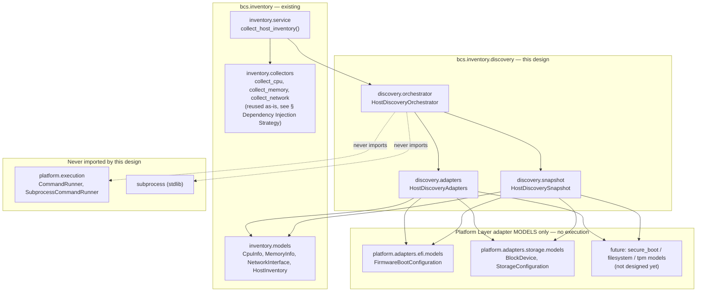
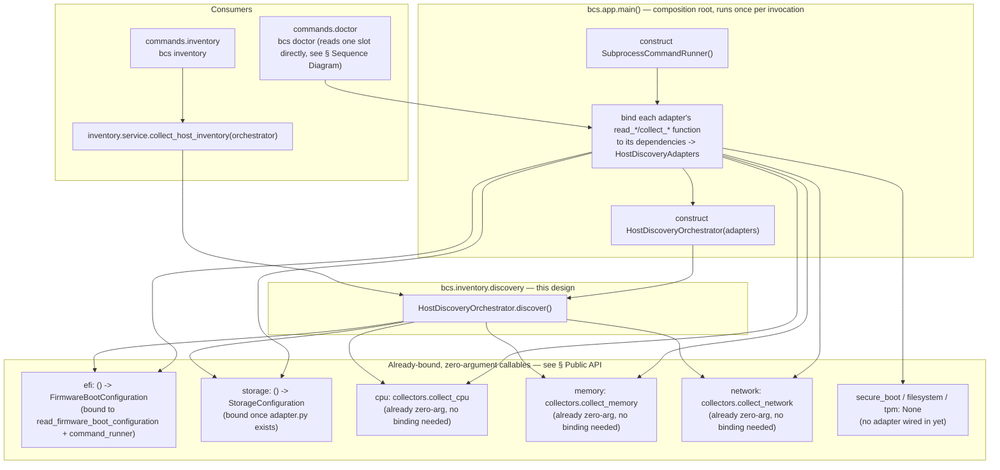
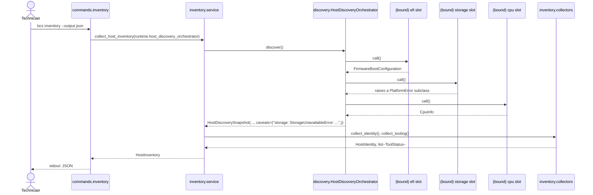
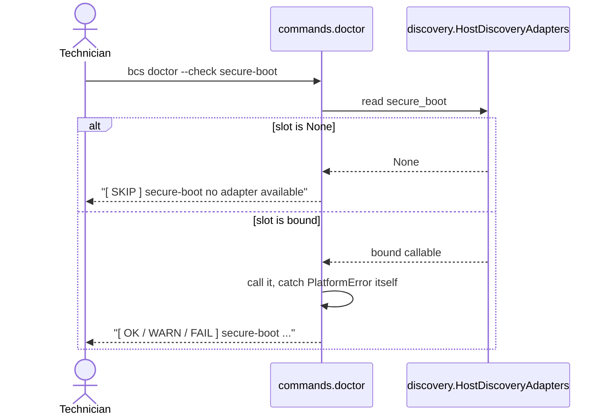

# Host Discovery Orchestrator — Design Proposal (Coordinating Discovery Adapters into Host Inventory)

> **Status: Proposed, pending approval.** This document designs the Host Discovery Orchestrator: the component that coordinates every Host Discovery adapter (Platform Layer adapters and legacy `sysfs`-based collectors alike) and aggregates their output into a form consumable by [Host Inventory](HOST_INVENTORY.md). Nothing described here is implemented. See [ADR-0011](decisions/0011-host-discovery-orchestrator.md) (status: `Proposed`) for the architectural decision this document expands.

## Purpose

Two already-documented, previously-deferred questions motivate this component:

1. [docs/PLATFORM_LAYER.md § Open Questions](PLATFORM_LAYER.md#open-questions--explicitly-deferred) explicitly defers "migrating `bcs.inventory.collectors` to accept an injected `CommandRunner`" as "its own follow-on design/approval step once a first real adapter... is actually being built." Two adapters (EFI, Storage) now exist or are designed; this document is that follow-on step.
2. [docs/EFI_ADAPTER.md § Open Questions](EFI_ADAPTER.md#open-questions) and [docs/STORAGE_ADAPTER.md § Relationship to Existing Inventory Collectors](STORAGE_ADAPTER.md#relationship-to-existing-inventory-collectors) each independently ask the same unanswered question — "what exposes this adapter's output to a `bcs` command / `HostInventory`?" — without referencing each other. This document answers it once, for every current and future Discovery adapter, rather than leaving each adapter to keep re-asking it.

The Host Discovery Orchestrator is the single place that knows *which* Discovery adapters exist for a given `bcs` build and calls each of them. Nothing above it (`bcs.inventory.service`, `bcs.commands.inventory`, `bcs.commands.doctor`) needs to enumerate adapters itself, and nothing below it (an individual adapter) needs to know it is one of several being coordinated.

## Aggregation-Only Guarantee

Mirroring [docs/EFI_ADAPTER.md § Read-Only Guarantee](EFI_ADAPTER.md#read-only-guarantee), this is a hard, non-negotiable constraint on this component's scope, not a style preference:

- **This component never executes a Linux command.** It imports no adapter's `adapter.py` (the module that calls `CommandRunner.run()`); it only ever receives already-bound, zero-argument callables (see [§ Public API](#public-api)) that some other, upstream code has already connected to a `CommandRunner`.
- **This component never imports `subprocess`.**
- **This component never imports `bcs.platform.execution.CommandRunner`.** Its only structural dependency on the Platform Layer is on adapters' *model* modules (`bcs.platform.adapters.efi.models`, `bcs.platform.adapters.storage.models`, ...) for type annotations — data shapes, not execution.
- **This component never decides an installation target, a preferred disk, a preferred ESP, a boot order, or an operating system.** It has no concept of "preferred" or "selected" anything. Every field it produces is either exactly what an adapter returned, or absent (`None`) — it never filters, ranks, merges, or interprets adapter output. Contrast [docs/STORAGE_ADAPTER.md § Purpose](STORAGE_ADAPTER.md#purpose): "Which device is 'primary'... is a decision made by domain services that consume this adapter's output" — this component is not that domain service, and never becomes one.
- If a future need for such a decision arises (e.g. "which partition is the ESP for this deployment"), it is a **separate component, with its own separate design document**, consuming this orchestrator's output — never a silent extension of it.

## Package Structure

```
cli/src/bcs/inventory/
├── __init__.py
├── models.py                   # HostInventory (existing) - unaffected by this design
├── collectors.py                # existing sysfs-based collect_* functions - unaffected;
│                                # several (collect_cpu, collect_memory, collect_network) are
│                                # reused as-is, see § Dependency Injection Strategy
├── service.py                    # existing collect_host_inventory() - gains a dependency on
│                                # the orchestrator; see § Relationship to Host Inventory
└── discovery/                    # NEW - this design
    ├── __init__.py                 # re-exports HostDiscoveryOrchestrator, HostDiscoveryAdapters,
    │                              # HostDiscoverySnapshot
    ├── adapters.py                  # HostDiscoveryAdapters - the frozen DI bundle of
    │                              # already-bound, zero-argument adapter callables
    ├── snapshot.py                   # HostDiscoverySnapshot (frozen, JSON-serializable) -
    │                              # this component's only output type
    └── orchestrator.py               # HostDiscoveryOrchestrator - the coordination logic
```

Organized as a small subpackage rather than a flat module for the same reason `bcs.platform.adapters.efi` was (see [ADR-0010](decisions/0010-efi-adapter-read-only-scope.md), point 7): three distinct concerns (a DI bundle, an output model, coordination logic) benefit from separation, and the public import surface (`from bcs.inventory.discovery import HostDiscoveryOrchestrator, ...`) is unaffected either way.

**Why `bcs.inventory.discovery`, not `bcs.platform.discovery`:** the Platform Layer is explicitly designed to depend on nothing above it ([docs/PLATFORM_LAYER.md § Purpose](PLATFORM_LAYER.md#purpose): "`CommandRunner` depends on nothing above it"). This component depends on `HostInventory`-adjacent concepts — it exists to feed Host Inventory, and it directly reuses `bcs.inventory.collectors`' existing CPU/Memory/Network functions (see below) — so putting it under `bcs.platform` would invert that dependency direction. Putting it under `bcs.inventory` instead matches a direction [docs/PLATFORM_LAYER.md § Dependency Injection](PLATFORM_LAYER.md#dependency-injection)'s own diagram already anticipated (`Inventory -.optional future dependency.-> Lsblk`, `-.optional future dependency.-> Blkid`) — Host Inventory depending on Platform Layer adapters, never the reverse.

## Dependency Diagram



## Component Diagram



## Public API

### `HostDiscoveryAdapters` (`discovery/adapters.py`)

A frozen `dataclass` (not a Pydantic model — it holds callables, not serializable data). Mirrors [`RuntimeContext`](../cli/src/bcs/context.py)'s own precedent exactly: a frozen bundle of collaborators, built once at the composition root. Every field is **optional** and defaults to `None`, meaning "no adapter wired in for this domain in this build" — never an error by itself; see [§ Error Propagation](#error-propagation).

| Field | Type | Bound to (illustrative) | Status |
|---|---|---|---|
| `efi` | `Callable[[], FirmwareBootConfiguration] \| None` | `functools.partial(read_firmware_boot_configuration, runner=command_runner)` | Adapter implemented ([EFI_ADAPTER.md](EFI_ADAPTER.md)) |
| `storage` | `Callable[[], StorageConfiguration] \| None` | `functools.partial(read_storage_topology, runner=command_runner)` | Adapter designed, models implemented, `adapter.py` not yet implemented ([STORAGE_ADAPTER.md](STORAGE_ADAPTER.md)) |
| `secure_boot` | `Callable[[], object] \| None` *(type TBD)* | — | Not designed yet — see [§ Future Extensibility](#future-extensibility) |
| `filesystem` | `Callable[[], object] \| None` *(type TBD)* | — | Not designed yet — see [§ Future Extensibility](#future-extensibility) for its boundary against `storage` |
| `network` | `Callable[[], tuple[NetworkInterface, ...]] \| None` | `collectors.collect_network` (already zero-argument, no binding needed) | Existing `sysfs`-based collector, reused as-is |
| `cpu` | `Callable[[], CpuInfo] \| None` | `collectors.collect_cpu` (already zero-argument, no binding needed) | Existing `sysfs`-based collector, reused as-is |
| `memory` | `Callable[[], MemoryInfo] \| None` | `collectors.collect_memory` (already zero-argument, no binding needed) | Existing `sysfs`-based collector, reused as-is |
| `tpm` | `Callable[[], object] \| None` *(type TBD)* | — | Not designed yet, and not currently motivated by any `SPECIFICATION.md` requirement — included because it was named as a target domain, not as a recommendation to build it next; see [§ Future Extensibility](#future-extensibility) |

Explicit, named, optional slots — not a dynamic registry keyed by string, and not a `Collector`-style protocol third parties register against. [docs/HOST_INVENTORY.md § Proposed Changes, item 4](HOST_INVENTORY.md#proposed-changes-requiring-approval) already considered and declined a dynamic collector registry, "since there is no concrete second contributor yet... exactly the kind of speculative flexibility [REVIEW.md §7] already argues against." The same reasoning applies here: all eight domains this orchestrator coordinates are already known and named (by this very design brief); a ninth arriving later is a small, reviewed, one-field addition to two data structures, not a runtime extension point.

### `HostDiscoverySnapshot` (`discovery/snapshot.py`)

A frozen, JSON-serializable Pydantic model — this component's **only** output type. Field-for-field, every payload field mirrors a `HostDiscoveryAdapters` slot exactly: whatever the bound callable returned, unmodified, or absent if that slot was unset or its call failed (see [§ Error Propagation](#error-propagation)). Like `CommandResult`, `FirmwareBootConfiguration`, and `StorageConfiguration`, it deliberately does **not** carry its own `schemaVersion` — it is never a `bcs` command's own top-level payload; it is always consumed by `bcs.inventory.service.collect_host_inventory()` on its way into `HostInventory` (see [§ Relationship to Host Inventory](#relationship-to-host-inventory)).

| Field | JSON alias | Type | Notes |
|---|---|---|---|
| `firmware_boot_configuration` | `firmwareBootConfiguration` | `FirmwareBootConfiguration \| None` | From the `efi` adapter slot. |
| `storage_topology` | `storageTopology` | `StorageConfiguration \| None` | From the `storage` adapter slot. |
| `secure_boot` | `secureBoot` | *(type TBD)* `\| None` | From the `secure_boot` slot; always `None` until that adapter exists. |
| `filesystem` | `filesystem` | *(type TBD)* `\| None` | From the `filesystem` slot; always `None` until that adapter exists. |
| `network` | `network` | `tuple[NetworkInterface, ...]` | From the `network` slot; empty tuple if unset. |
| `cpu` | `cpu` | `CpuInfo \| None` | From the `cpu` slot. |
| `memory` | `memory` | `MemoryInfo \| None` | From the `memory` slot. |
| `tpm` | `tpm` | *(type TBD)* `\| None` | From the `tpm` slot; always `None` until that adapter exists. |
| `caveats` | `caveats` | `tuple[str, ...]` | One entry per domain whose adapter was wired in but raised a `PlatformError` when called — see [§ Error Propagation](#error-propagation). Empty tuple if every wired adapter succeeded (or none were wired at all). |

### `HostDiscoveryOrchestrator` (`discovery/orchestrator.py`)

```
class HostDiscoveryOrchestrator:
    def __init__(self, adapters: HostDiscoveryAdapters) -> None: ...
    def discover(self) -> HostDiscoverySnapshot: ...
```

*(Illustrative signature — not implemented.)*

- A single public method, `discover()`, taking no arguments (everything it needs was already injected via the constructor) and returning a fully-populated `HostDiscoverySnapshot`.
- Not a `Protocol` with multiple implementations, unlike `CommandRunner`: there is exactly one coordination strategy (call every wired slot, isolate failures, aggregate), and the test seam is the *adapters bundle* it is constructed with, not the orchestrator class itself — see [§ Testing Strategy](#testing-strategy).
- `discover()` is expected to be called at most once per `bcs` invocation, mirroring `collect_host_inventory()`'s own current usage; nothing prevents calling it more than once (each call re-invokes every wired adapter and produces a fresh, independent snapshot, matching Host Inventory's own "immutable snapshot, re-collected whenever fresh data is needed" principle), but no current consumer needs to.

## Dependency Injection Strategy

Follows the same seam every other Platform Layer/Host Inventory collaborator already uses ([docs/PLATFORM_LAYER.md § Dependency Injection](PLATFORM_LAYER.md#dependency-injection)):

1. **`bcs.app.main()`, the composition root, and nowhere else, constructs `HostDiscoveryAdapters`.** It is the one place that knows how to bind each adapter's real function to its dependencies — `functools.partial(read_firmware_boot_configuration, runner=command_runner)` for `efi`, a direct reference (`collectors.collect_cpu`) for slots that are already zero-argument, `None` for any domain with no adapter yet.
2. **`HostDiscoveryOrchestrator` receives `HostDiscoveryAdapters` as a constructor argument** — never constructs one itself, never imports an adapter module directly, and never reaches for a module-level default.
3. **`HostDiscoveryOrchestrator` never sees a `CommandRunner`.** By the time it receives `HostDiscoveryAdapters`, every slot that needed one has already been bound to it upstream. This is what makes "depend only on adapter interfaces" a literal, checkable property rather than just an intent: `discovery/orchestrator.py` and `discovery/adapters.py` have no import of `bcs.platform.execution` or `subprocess` to check for — the same mechanical guarantee [docs/PLATFORM_LAYER.md § Enforcement](PLATFORM_LAYER.md#enforcement) already established for `bcs.platform.execution` itself, extended here by omission rather than by an explicit Ruff scoping rule (there is no legitimate reason this package would ever import `subprocess`, so there is nothing to scope an ignore for).
4. **Testing substitutes a `HostDiscoveryAdapters` built from stub callables** (plain lambdas or functions returning a canned model or raising a canned `PlatformError` subclass) — no `FakeCommandRunner`, no mocking of any adapter's internals, no monkeypatching. See [§ Testing Strategy](#testing-strategy).

This mirrors, one layer up, [docs/PLATFORM_LAYER.md § Design Principles](PLATFORM_LAYER.md#design-principles) item 5's own statement for `CommandRunner`: "consumed via dependency injection... so tests substitute a fake without patching module state."

## Lifecycle

- **Who constructs `HostDiscoveryAdapters` and `HostDiscoveryOrchestrator`:** `bcs.app.main()`, at the same point in startup `SubprocessCommandRunner` is already built (per [docs/PLATFORM_LAYER.md § Ownership and Lifecycle](PLATFORM_LAYER.md#ownership-and-lifecycle)) — no other module instantiates either.
- **When:** once per `bcs` process invocation, after `command_runner` is available (several `HostDiscoveryAdapters` slots depend on it) and before any subcommand runs.
- **Who owns it:** proposed as a new field on `RuntimeContext` (`host_discovery_orchestrator: HostDiscoveryOrchestrator`), exactly the treatment already given to `command_runner` — a real, visible, additive change to `RuntimeContext`'s frozen dataclass, flagged here rather than silently implied; see [§ Relationship to Host Inventory](#relationship-to-host-inventory) for why this is a necessary, not optional, consequence of this design. Because `RuntimeContext` is frozen, this reference is fixed for the lifetime of the invocation, matching every other collaborator on it.
- **How consumers obtain it:** as an explicit constructor/function parameter, threaded down from `RuntimeContext` — never a module-level global, never a service locator. `bcs.commands.inventory.run_inventory(runtime)` already receives `RuntimeContext`; it would pass `runtime.host_discovery_orchestrator` to `collect_host_inventory()`.
- **Does it hold state across calls?** No. `HostDiscoveryOrchestrator` itself is stateless beyond the `HostDiscoveryAdapters` it was constructed with; each `discover()` call is an independent, fresh sweep — there is no cache, no "last known snapshot," matching [docs/HOST_INVENTORY.md § Design Principles](HOST_INVENTORY.md#design-principles) item 2: "a change in the machine's state produces a *new* snapshot, not an update to an old one."

## Relationship to Host Inventory

`bcs.inventory.service.collect_host_inventory()` is, today, the one function that constructs `HostInventory` by calling nine collectors directly ([`service.py`](../cli/src/bcs/inventory/service.py)). This design proposes it gain an `orchestrator: HostDiscoveryOrchestrator` parameter and internally:

1. Call `orchestrator.discover()` once, to get a `HostDiscoverySnapshot`.
2. Continue to call `collectors.collect_identity()` and `collectors.collect_tooling()` directly — these two fact areas have no Discovery adapter equivalent named in this design's scope (identity and tooling presence are not among the eight orchestrated domains) and are left exactly as they are today.
3. Assemble `HostInventory` from both: `collected_at`, `identity`, `firmware`, `operating_system`, `efi_system_partition`, `storage`/`usb_storage`, and `tooling` continue to come from the *existing* collectors exactly as today; `cpu`/`memory`/`network` are now satisfied from the snapshot instead of a direct collector call — behaviorally identical today, since the bound callables *are* those same collectors (see [§ Public API](#public-api)).
4. **This design does not, by itself, add `firmwareBootConfiguration`/`storageTopology`/etc. as new `HostInventory` fields.** Doing so is an additive `HostInventory` schema change — the same category of change [ADR-0008](decisions/0008-host-inventory-ports-and-adapters.md)'s own EFI System Partition/USB Storage amendment already made once — and is deliberately left as a **separate, explicitly flagged follow-up**, not decided silently here: this document's job is the orchestrator, not a second rewrite of `docs/HOST_INVENTORY.md`'s schema. Until that follow-up is proposed and accepted, `HostDiscoverySnapshot.firmware_boot_configuration`/`storage_topology`/etc. are available to any caller of `orchestrator.discover()` directly, but do not yet appear in `bcs inventory`'s own JSON output.

This sequencing deliberately mirrors how `RuntimeContext.command_runner` shipped (Platform-001 Part 4) before any collector was migrated to use it: dependency injection wiring first, consumer migration as an explicit, separate, later step.

## Sequence Diagram

### `bcs inventory --output json`, once this design and its `HostInventory` follow-up both land (illustrative)



### `bcs doctor --check secure-boot` (selective path, illustrative — mirrors the existing `doctor` asymmetry)



This preserves [docs/HOST_INVENTORY.md § Dependency Graph](HOST_INVENTORY.md#dependency-graph)'s existing, deliberate asymmetry — `doctor` evaluates one fact at a time and must not pay for, or be blocked by, an unrelated check — by having `doctor` read one named slot off `HostDiscoveryAdapters` directly, rather than calling `HostDiscoveryOrchestrator.discover()`'s full sweep for a single check.

## Error Propagation

For each non-`None` slot in `HostDiscoveryAdapters`, `discover()`:

1. **Calls it.**
2. **On success,** stores the returned model directly on the matching `HostDiscoverySnapshot` field, unmodified.
3. **On a raised `bcs.platform.errors.PlatformError`** (or any subclass — `FirmwareBootError`, a future `StorageError`, a future `SecureBootError`, etc.), leaves that field `None` and appends one entry to `caveats` (e.g. `"efi: FirmwareBootUnavailableError: ..."`) — logged at `WARNING`, matching [docs/PLATFORM_LAYER.md § Logging Strategy](PLATFORM_LAYER.md#logging-strategy)'s existing "logged in addition to, not instead of, raising" convention, adapted here to "logged in addition to, not instead of, isolating." **One domain's failure never prevents the other seven from being collected** — the same per-unit failure isolation [`NFR-001`](../SPECIFICATION.md#3-non-functional-requirements) already requires of Deploy's per-machine handling and `bcs doctor`'s own per-check independence, applied one layer down to per-*domain* discovery.
4. **On any other exception** (not a `PlatformError` — e.g. a `TypeError` from a miswired callable), the exception **propagates unmodified out of `discover()`**. This is a genuine bug, not a "this environment doesn't have Secure Boot" fact, and per [docs/standards/coding-standards.md § Error Handling](standards/coding-standards.md#error-handling), "don't swallow errors to make output quieter" — the orchestrator is disciplined about *which* failures are expected (typed, adapter-declared `PlatformError`s) and refuses to guess about the rest.
5. **For a `None` slot** (no adapter wired for that domain), the matching field is simply `None`/empty with **no `caveats` entry** — this is a configuration fact ("this build of `bcs` doesn't have a Secure Boot adapter yet"), not a runtime failure, and conflating the two would make `caveats` noisy on every single invocation for domains that are permanently unwired today (`secure_boot`, `filesystem`, `tpm`).

**`caveats` is a direct, narrower realization of [docs/HOST_INVENTORY.md § Proposed Changes, item 1](HOST_INVENTORY.md#proposed-changes-requiring-approval)** ("a `None`/empty value from a collector is ambiguous... add a `caveats: list[str]` field"), scoped to this orchestrator's own output rather than to `HostInventory` directly. Approving `HostDiscoverySnapshot.caveats` here does not, by itself, approve adding an equivalent field to `HostInventory` itself or to any already-accepted section of it — that remains its own, separately approvable follow-up, per this project's usual granular-approval convention (see, e.g., how accepting [ADR-0008](decisions/0008-host-inventory-ports-and-adapters.md) did not itself approve every item in [docs/HOST_INVENTORY.md § Proposed Changes Requiring Approval](HOST_INVENTORY.md#proposed-changes-requiring-approval)).

## Testing Strategy

| Layer | What it verifies | How |
|---|---|---|
| `HostDiscoveryAdapters` | Construction, defaults (every slot `None`) — a plain dataclass, little to test beyond that it holds what it's given. | Direct unit tests, no fixtures. |
| `HostDiscoverySnapshot` | Construction, defaults, frozen/extra-forbid, equality, hashability (every field is either a frozen model, `None`, or a tuple of hashable items — `caveats` being a tuple of strings does not break hashability), JSON round-tripping (including nested adapter models). | Direct unit tests, mirroring `test_platform_adapters_efi_models.py`/`test_platform_adapters_storage_models.py`'s own style exactly — no fixtures, no mocking. |
| `HostDiscoveryOrchestrator.discover()` | Every slot populated → every `HostDiscoverySnapshot` field populated; every slot `None` → every field absent/empty and `caveats` empty; a slot's callable raising a `PlatformError` subclass → that field `None`, one matching `caveats` entry, *and* every other slot still populated (the isolation property, [§ Error Propagation](#error-propagation) point 3); a slot's callable raising a non-`PlatformError` → propagates out of `discover()` uncaught. | `HostDiscoveryAdapters` built entirely from stub `lambda`s/plain functions — no `FakeCommandRunner`, no real adapter, no mocking of anything. This is the main coverage burden for this component, and it needs none of the machinery any individual adapter's own tests need. |
| Integration with real adapter signatures | That `functools.partial(read_firmware_boot_configuration, runner=...)`-style binding actually produces a callable matching `HostDiscoveryAdapters.efi`'s declared type, end to end. | A handful of cases, each using `FakeCommandRunner` (already established for adapter-level tests) bound the same way the composition root is expected to bind it — confirms the *seam*, not the adapter's own parsing/execution logic, which remains each adapter's own test suite's responsibility and must not be duplicated here. |
| `bcs.inventory.service.collect_host_inventory(orchestrator)` | Correctly combines `orchestrator.discover()`'s result with `collect_identity()`/`collect_tooling()` into one `HostInventory`. | Existing test style (mocked collectors, per [docs/HOST_INVENTORY.md § Testing Strategy](HOST_INVENTORY.md#testing-strategy)), extended with a stub/fake orchestrator the same way `command_runner` is already substitutable via `conftest.py`'s `make_runtime_context` fixture. |

## Future Extensibility

- **Adding Secure Boot, Filesystem, or TPM once each has its own accepted adapter design:** add one new field to `HostDiscoveryAdapters` and one to `HostDiscoverySnapshot`, bind it at the composition root, done — `HostDiscoveryOrchestrator`'s own coordination logic needs no change (it already iterates its full, fixed field set). This is the concrete payoff of the explicit-slots design over a dynamic registry: each addition is a small, reviewable diff against two data structures, not a runtime extension mechanism to design and secure.
- **Replacing the `network`/`cpu`/`memory` slots' current `sysfs`-based bindings with future tool-based adapters** (e.g. an `ip`-based Network adapter closing [docs/HOST_INVENTORY.md](HOST_INVENTORY.md#open-questions--explicitly-deferred)'s own documented `ip_addresses` gap) — only the composition root's binding changes; a slot's declared type may need to widen (e.g. `network`'s type becoming a new, richer model rather than `tuple[NetworkInterface, ...]`), a normal, expected, one-field consequence of that adapter's own future design, not a redesign of this orchestrator.
- **The `filesystem` domain's boundary against the Storage Adapter's already-designed `FilesystemInfo`/`MountEntry`** is explicitly *not* resolved by this document — a future Filesystem adapter's own design must clarify whether it is a distinct domain or an enrichment of Storage's existing filesystem facts before its slot is filled in here, matching this project's own [REVIEW.md §7](../REVIEW.md#7-a-meta-concern-proportionality) proportionality concern. The `filesystem` slot exists in this design only as a reserved name, not as an endorsement that a separate Filesystem adapter should be built.
- **A future `HostInventory` schema amendment** (see [§ Relationship to Host Inventory](#relationship-to-host-inventory), point 4) is the natural next step once this design is accepted, but is out of scope here by design.
- **A future REST API or Web UI** (per [docs/HOST_INVENTORY.md § Interaction with a Future REST API](HOST_INVENTORY.md#interaction-with-a-future-rest-api)) is unaffected: it would still call `collect_host_inventory(orchestrator)` (or, eventually, receive `orchestrator` via its own DI container) exactly as `bcs inventory` does — nothing about this design is CLI-specific.
- **Parallelizing the up-to-eight adapter calls** within `discover()` (they are independent of each other) is a plausible future performance optimization, not designed or recommended here — today's two implemented/designed adapters make this premature; see [§ Open Questions](#open-questions).

## Open Questions

- **Exact `HostInventory` schema amendment** (new field names; whether `EfiSystemPartition`/`StorageDevice`/`FirmwareInfo` are ever reconciled with `StorageConfiguration`/`FirmwareBootConfiguration`) — deliberately deferred; see [§ Relationship to Host Inventory](#relationship-to-host-inventory), point 4.
- **Whether `RuntimeContext` gains `host_discovery_orchestrator` directly, or whether `bcs.inventory.service` builds one internally from `runtime.command_runner`** — this document proposes the former (matching `command_runner`'s own precedent), but does not consider the question closed.
- **Retry/timeout composition across multiple adapter calls within one `discover()` sweep** — each adapter already enforces its own `timeout_seconds` (per [docs/PLATFORM_LAYER.md § Timeout Handling](PLATFORM_LAYER.md#timeout-handling)); whether `discover()` itself needs an aggregate budget (relevant once several tool-based adapters are wired at once) is not designed here.
- **Parallelizing the up-to-eight adapter calls** within `discover()` — see [§ Future Extensibility](#future-extensibility); not designed or recommended now.

## Related Documents

- [docs/decisions/0011-host-discovery-orchestrator.md](decisions/0011-host-discovery-orchestrator.md) — the architectural decision this design proposal builds on (status: `Proposed`).
- [docs/PLATFORM_LAYER.md § Open Questions](PLATFORM_LAYER.md#open-questions--explicitly-deferred) — the deferred `CommandRunner` migration question this document resolves.
- [docs/EFI_ADAPTER.md § Open Questions](EFI_ADAPTER.md#open-questions) and [docs/STORAGE_ADAPTER.md § Relationship to Existing Inventory Collectors](STORAGE_ADAPTER.md#relationship-to-existing-inventory-collectors) — the two independently-asked "what exposes this to `HostInventory`" questions this document answers once.
- [docs/HOST_INVENTORY.md](HOST_INVENTORY.md) and [ADR-0008](decisions/0008-host-inventory-ports-and-adapters.md) — the aggregate root and ports-and-adapters discipline this design extends, and the source of the `caveats` idea this design gives a first, narrower home to.
- [docs/standards/naming-conventions.md § Domain-Driven Naming](standards/naming-conventions.md#domain-driven-naming) — `HostDiscoveryOrchestrator`/`HostDiscoveryAdapters`/`HostDiscoverySnapshot` name the coordination concern itself, not any tool or adapter behind it.
- [REVIEW.md §7](../REVIEW.md#7-a-meta-concern-proportionality) — the proportionality concern this document defers to when declining to design a dynamic adapter registry, parallel adapter execution, or the `HostInventory` schema amendment now.
