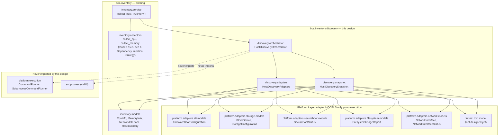
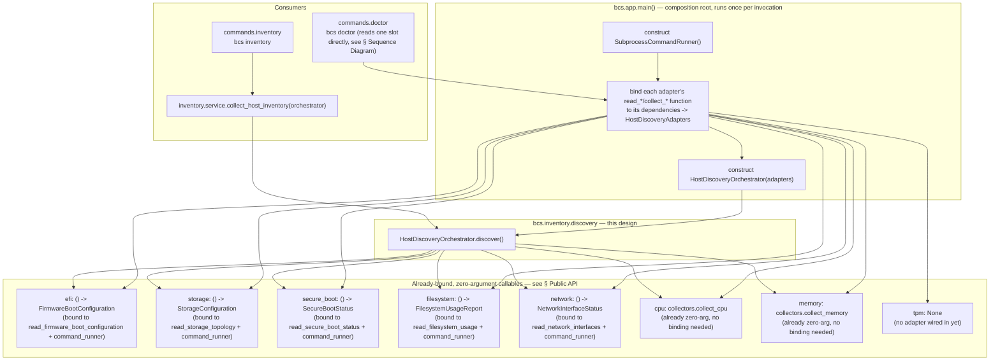
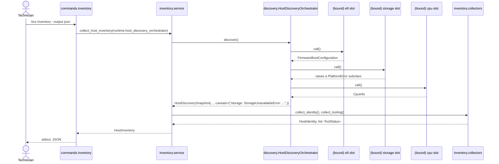
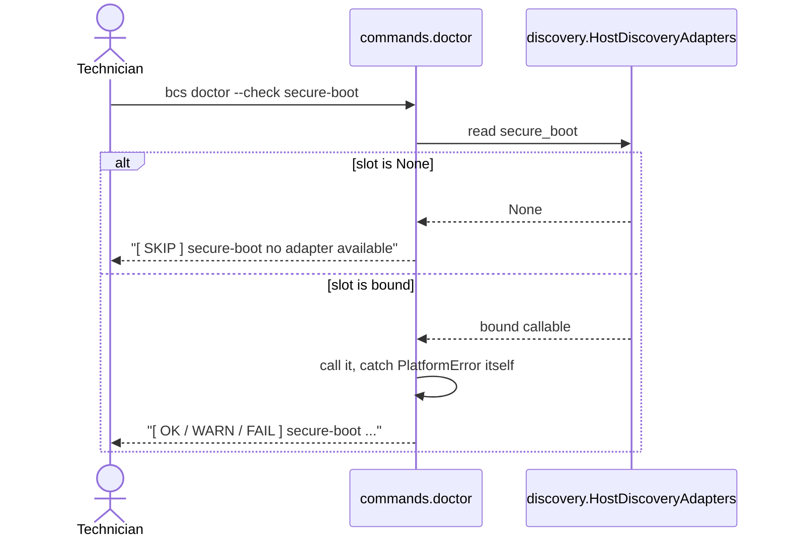

# Host Discovery Orchestrator — Design Proposal (Coordinating Discovery Adapters into Host Inventory)

> **Status: Accepted; data-holding types, coordination logic, Host Inventory integration, composition-root/`RuntimeContext` wiring, and `bcs inventory`/`bcs doctor` command wiring implemented (Parts 1–5), including the Network Adapter's own composition-root wiring (Beta M3) and the Secure Boot integration (Beta M4).** This document designs the Host Discovery Orchestrator: the component that coordinates every Host Discovery adapter (Platform Layer adapters and the two remaining legacy `sysfs`-based collectors, `cpu`/`memory`) and aggregates their output into a form consumable by [Host Inventory](HOST_INVENTORY.md). See [ADR-0011](decisions/0011-host-discovery-orchestrator.md) (status: `Accepted`) for the architectural decision this document expands. **Implemented:** `HostDiscoveryAdapters`/`HostDiscoverySnapshot` (`cli/src/bcs/inventory/discovery/models.py`), `HostDiscoveryOrchestrator` (`cli/src/bcs/inventory/discovery/orchestrator.py`, per [§ Public API](#public-api) and [§ Error Propagation](#error-propagation)), `bcs.inventory.service.collect_host_inventory()`'s optional `orchestrator` parameter, driving `storage`, `network`, and `firmware.secure_boot` via translation layers (`cli/src/bcs/inventory/service.py`, per [§ Relationship to Host Inventory](#relationship-to-host-inventory---implemented)), `bcs.app.main()`'s composition-root wiring plus `RuntimeContext.host_discovery_orchestrator` (`cli/src/bcs/app.py`, `cli/src/bcs/context.py`, per [§ Dependency Injection Strategy](#dependency-injection-strategy---implemented) and [§ Lifecycle](#lifecycle---implemented)), `bcs.commands.inventory.run_inventory()` passing `runtime.host_discovery_orchestrator` into `collect_host_inventory()` (`cli/src/bcs/commands/inventory.py`), and `bcs.commands.doctor._check_secure_boot()`/`_check_storage()`/`_check_network()` each calling their own Platform Adapter directly via `runtime.command_runner` (`cli/src/bcs/commands/doctor.py`) — closing the gaps tracked as issue [#70](https://github.com/nino79/batoi-classroom-suite/issues/70) (storage, `bcs inventory`), Beta Milestone M3 (network, `bcs inventory`), Beta Milestone M4 (Secure Boot, both commands), and the Host Discovery Orchestrator completion pass (storage/network for `bcs doctor`). **None of `bcs doctor`'s Secure Boot/Storage/Network checks go through this orchestrator** — see [§ Relationship to Host Inventory](#relationship-to-host-inventory---implemented) point 5c and [§ Alternatives Considered](decisions/0011-host-discovery-orchestrator.md#alternatives-considered) for why. `bcs doctor`'s remaining checks (`esp`, `usb-storage`, `identity`'s equivalent facts, `operating_system`) have no clean adapter equivalent without new interpretive business logic or a new orchestrator slot, and remain collector-only. This resolves the confirmed real-world symptom recorded in [docs/REAL_WORLD_VALIDATION.md](REAL_WORLD_VALIDATION.md) (`bcs inventory` previously reported an empty `storage` array on a machine `lsblk` correctly enumerated), closes `NetworkInterface.ip_addresses`'s previous permanent-placeholder gap, and closes `FirmwareInfo.secure_boot`'s previous always-`unknown` placeholder gap; see `docs/ISSUE_70_IMPLEMENTATION_CHECKLIST.md` for the storage implementation record and `docs/SECURE_BOOT_IMPLEMENTATION_PLAN.md` for the Secure Boot one.

## Purpose

Two already-documented, previously-deferred questions motivate this component:

1. [docs/PLATFORM_LAYER.md § Open Questions](PLATFORM_LAYER.md#open-questions--explicitly-deferred) explicitly defers "migrating `bcs.inventory.collectors` to accept an injected `CommandRunner`" as "its own follow-on design/approval step once a first real adapter... is actually being built." Two adapters (EFI, Storage) now exist or are designed; this document is that follow-on step.
2. [docs/EFI_ADAPTER.md § Open Questions](EFI_ADAPTER.md#open-questions) and [docs/STORAGE_ADAPTER.md § Relationship to Existing Inventory Collectors](STORAGE_ADAPTER.md#relationship-to-existing-inventory-collectors) each independently ask the same unanswered question — "what exposes this adapter's output to a `bcs` command / `HostInventory`?" — without referencing each other. This document answers it once, for every current and future Discovery adapter, rather than leaving each adapter to keep re-asking it.

The Host Discovery Orchestrator is the single place that knows *which* Discovery adapters exist for a given `bcs` build and calls each of them. Nothing above it (`bcs.inventory.service`, `bcs.commands.inventory`, `bcs.commands.doctor`) needs to enumerate adapters itself, and nothing below it (an individual adapter) needs to know it is one of several being coordinated.

## Aggregation-Only Guarantee

Mirroring [docs/EFI_ADAPTER.md § Read-Only Guarantee](EFI_ADAPTER.md#read-only-guarantee), this is a hard, non-negotiable constraint on this component's scope, not a style preference:

- **This component never executes a Linux command.** It imports no adapter's `adapter.py` (the module that calls `CommandRunner.run()`); it only ever receives already-bound, zero-argument callables (see [§ Public API](#public-api)) that some other, upstream code has already connected to a `CommandRunner`.
- **This component never imports `subprocess`.**
- **This component never imports `bcs.platform.execution.CommandRunner`.** Its only structural dependency on the Platform Layer is on adapters' *model* modules (`bcs.platform.adapters.efi.models`, `bcs.platform.adapters.storage.models`, ...) for type annotations — data shapes, not execution.
- **This component never decides an installation target, a preferred disk, a preferred ESP, a boot order, or an operating system.** It has no concept of "preferred" or "selected" anything. Every field it produces is either exactly what an adapter returned, or absent (`None`) — it never filters, ranks, merges, or interprets adapter output. Contrast [docs/STORAGE_ADAPTER.md § Purpose](STORAGE_ADAPTER.md#purpose): "Which device is 'primary'... is a decision made by domain services that consume this adapter's output" — this component is not that domain service, and never becomes one.
- If a future need for such a decision arises (e.g. "which partition is the ESP for this deployment"), it is a **separate component, with its own separate design document**, consuming this orchestrator's output — never a silent extension of it.

## Package Structure

```
cli/src/bcs/inventory/
├── __init__.py
├── models.py                   # HostInventory (existing) - unaffected by this design
├── collectors.py                # existing sysfs-based collect_* functions - unaffected;
│                                # two (collect_cpu, collect_memory) are reused as-is,
│                                # collect_network is a fallback only, see § Dependency
│                                # Injection Strategy / § Relationship to Host Inventory
├── service.py                    # [implemented] existing collect_host_inventory() - gains an
│                                # optional orchestrator dependency; see § Relationship to Host
│                                # Inventory
└── discovery/                    # NEW - this design
    ├── __init__.py                 # [implemented] re-exports HostDiscoveryAdapters,
    │                              # HostDiscoverySnapshot, HostDiscoveryOrchestrator
    ├── models.py                    # [implemented] HostDiscoveryAdapters (the frozen DI bundle
    │                              # of already-bound, zero-argument adapter callables) and
    │                              # HostDiscoverySnapshot (frozen, JSON-serializable, this
    │                              # component's only output type) - both data-holding types,
    │                              # consolidated into one module since neither has execution
    │                              # or coordination logic of its own
    └── orchestrator.py               # [implemented] HostDiscoveryOrchestrator -
                                     # the coordination logic
```

**A structural refinement from this document's original sketch, flagged rather than silently done:** the Public API section below originally proposed `adapters.py`/`snapshot.py` as two separate modules. The actual implementation consolidates both into a single `models.py` — the same "one module per distinct concern" reasoning that split `bcs.platform.adapters.efi` into four files doesn't apply as strongly here, since neither `HostDiscoveryAdapters` nor `HostDiscoverySnapshot` contains any logic (execution, coordination, or otherwise) to keep separate from the other; they are both plain data-holding types. The public import surface (`from bcs.inventory.discovery import HostDiscoveryAdapters, HostDiscoverySnapshot`) is unaffected either way.

Organized as a small subpackage rather than a flat module for the same reason `bcs.platform.adapters.efi` was (see [ADR-0010](decisions/0010-efi-adapter-read-only-scope.md), point 7): three distinct concerns (a DI bundle, an output model, coordination logic) benefit from separation, and the public import surface (`from bcs.inventory.discovery import HostDiscoveryOrchestrator, ...`) is unaffected either way.

**Why `bcs.inventory.discovery`, not `bcs.platform.discovery`:** the Platform Layer is explicitly designed to depend on nothing above it ([docs/PLATFORM_LAYER.md § Purpose](PLATFORM_LAYER.md#purpose): "`CommandRunner` depends on nothing above it"). This component depends on `HostInventory`-adjacent concepts — it exists to feed Host Inventory, and it directly reuses `bcs.inventory.collectors`' existing CPU/Memory/Network functions (see below) — so putting it under `bcs.platform` would invert that dependency direction. Putting it under `bcs.inventory` instead matches a direction [docs/PLATFORM_LAYER.md § Dependency Injection](PLATFORM_LAYER.md#dependency-injection)'s own diagram already anticipated (`Inventory -.optional future dependency.-> Lsblk`, `-.optional future dependency.-> Blkid`) — Host Inventory depending on Platform Layer adapters, never the reverse.

## Dependency Diagram



## Component Diagram



## Public API

### `HostDiscoveryAdapters` (`discovery/models.py`) — implemented

A frozen `dataclass` (not a Pydantic model — it holds callables, not serializable data). Mirrors [`RuntimeContext`](../cli/src/bcs/context.py)'s own precedent exactly: a frozen bundle of collaborators, built once at the composition root. Every field is **optional** and defaults to `None`, meaning "no adapter wired in for this domain in this build" — never an error by itself; see [§ Error Propagation](#error-propagation).

| Field | Type | Bound to (illustrative) | Status |
|---|---|---|---|
| `efi` | `Callable[[], FirmwareBootConfiguration] \| None` | `functools.partial(read_firmware_boot_configuration, runner=command_runner)` | Adapter implemented ([EFI_ADAPTER.md](EFI_ADAPTER.md)) |
| `storage` | `Callable[[], StorageConfiguration] \| None` | `functools.partial(read_storage_topology, runner=command_runner)` | Adapter fully implemented ([STORAGE_ADAPTER.md](STORAGE_ADAPTER.md)) |
| `secure_boot` | `Callable[[], SecureBootStatus] \| None` | `functools.partial(read_secure_boot_status, runner=command_runner)` | Adapter fully implemented ([SECURE_BOOT_ADAPTER.md](SECURE_BOOT_ADAPTER.md)) and wired at the composition root |
| `filesystem` | `Callable[[], FilesystemUsageReport] \| None` | `functools.partial(read_filesystem_usage, runner=command_runner)` | Adapter fully implemented ([FILESYSTEM_ADAPTER.md](FILESYSTEM_ADAPTER.md)) and wired at the composition root |
| `network` | `Callable[[], NetworkInterfaceStatus] \| None` | `functools.partial(read_network_interfaces, runner=command_runner)` | Adapter fully implemented ([NETWORK_ADAPTER.md](NETWORK_ADAPTER.md)) and wired at the composition root (Beta M3) |
| `cpu` | `Callable[[], CpuInfo] \| None` | `collectors.collect_cpu` (already zero-argument, no binding needed) | Existing `sysfs`-based collector, reused as-is |
| `memory` | `Callable[[], MemoryInfo] \| None` | `collectors.collect_memory` (already zero-argument, no binding needed) | Existing `sysfs`-based collector, reused as-is |
| `tpm` | `Callable[[], object] \| None` *(type TBD)* | — | Not designed yet, and not currently motivated by any `SPECIFICATION.md` requirement — included because it was named as a target domain, not as a recommendation to build it next; see [§ Future Extensibility](#future-extensibility) |

**Historical note:** before the Network Adapter was accepted and wired in, `network` was typed `Callable[[], list[NetworkInterface]]` (`bcs.inventory.models.NetworkInterface`), bound directly to `collectors.collect_network` (already zero-argument, no binding needed) - the same treatment `cpu`/`memory` still have. It now follows the identical `functools.partial`-bound shape `efi`/`storage`/`secure_boot`/`filesystem` already had once their own adapters reached acceptance.

Explicit, named, optional slots — not a dynamic registry keyed by string, and not a `Collector`-style protocol third parties register against. [docs/HOST_INVENTORY.md § Proposed Changes, item 4](HOST_INVENTORY.md#proposed-changes-requiring-approval) already considered and declined a dynamic collector registry, "since there is no concrete second contributor yet... exactly the kind of speculative flexibility [REVIEW.md §7] already argues against." The same reasoning applies here: all eight domains this orchestrator coordinates are already known and named (by this very design brief); a ninth arriving later is a small, reviewed, one-field addition to two data structures, not a runtime extension point.

### `HostDiscoverySnapshot` (`discovery/models.py`) — implemented

A frozen, JSON-serializable Pydantic model — this component's **only** output type. Field-for-field, every payload field mirrors a `HostDiscoveryAdapters` slot exactly: whatever the bound callable returned, unmodified, or absent if that slot was unset or its call failed (see [§ Error Propagation](#error-propagation)). Like `CommandResult`, `FirmwareBootConfiguration`, and `StorageConfiguration`, it deliberately does **not** carry its own `schemaVersion` — it is never a `bcs` command's own top-level payload; it is always consumed by `bcs.inventory.service.collect_host_inventory()` on its way into `HostInventory` (see [§ Relationship to Host Inventory](#relationship-to-host-inventory)).

| Field | JSON alias | Type | Notes |
|---|---|---|---|
| `firmware_boot_configuration` | `firmwareBootConfiguration` | `FirmwareBootConfiguration \| None` | From the `efi` adapter slot. |
| `storage_topology` | `storageTopology` | `StorageConfiguration \| None` | From the `storage` adapter slot. |
| `secure_boot` | `secureBoot` | `SecureBootStatus \| None` | From the `secure_boot` slot; `None` if unset or its call failed. Wired at the composition root. |
| `filesystem` | `filesystem` | `FilesystemUsageReport \| None` | From the `filesystem` slot; `None` if unset or its call failed. Wired at the composition root. |
| `network` | `network` | `NetworkInterfaceStatus \| None` | From the `network` slot; `None` if unset or its call failed. Wired at the composition root (Beta M3). |
| `cpu` | `cpu` | `CpuInfo \| None` | From the `cpu` slot. |
| `memory` | `memory` | `MemoryInfo \| None` | From the `memory` slot. |
| `tpm` | `tpm` | *(type TBD)* `\| None` | From the `tpm` slot; always `None` until that adapter exists. |
| `caveats` | `caveats` | `tuple[str, ...]` | One entry per domain whose adapter was wired in but raised a `PlatformError` when called — see [§ Error Propagation](#error-propagation). Empty tuple if every wired adapter succeeded (or none were wired at all). |

**Unconditionally hashable.** Every field here is either a frozen model built entirely from tuples (including `network`'s `NetworkInterfaceStatus`, whose own `NetworkInterface.ip_addresses` is a `tuple[str, ...]`), `None`, or an `object`-typed opaque value. **Historical note:** before `network` was typed to `NetworkInterfaceStatus`, it held `tuple[bcs.inventory.models.NetworkInterface, ...]` instead, and `bcs.inventory.models.NetworkInterface`'s own `list`-typed `ip_addresses` field made any snapshot with at least one network interface unhashable, matching `HostInventory`'s own same limitation. That caveat no longer applies to this model.

### `HostDiscoveryOrchestrator` (`discovery/orchestrator.py`) — implemented

```
class HostDiscoveryOrchestrator:
    def __init__(self, adapters: HostDiscoveryAdapters) -> None: ...
    def discover(self) -> HostDiscoverySnapshot: ...
```

- A single public method, `discover()`, taking no arguments (everything it needs was already injected via the constructor) and returning a fully-populated `HostDiscoverySnapshot`.
- Not a `Protocol` with multiple implementations, unlike `CommandRunner`: there is exactly one coordination strategy (call every wired slot, isolate failures, aggregate), and the test seam is the *adapters bundle* it is constructed with, not the orchestrator class itself — see [§ Testing Strategy](#testing-strategy).
- `discover()` is expected to be called at most once per `bcs` invocation, mirroring `collect_host_inventory()`'s own current usage; nothing prevents calling it more than once (each call re-invokes every wired adapter and produces a fresh, independent snapshot, matching Host Inventory's own "immutable snapshot, re-collected whenever fresh data is needed" principle), but no current consumer needs to.
- Internally, each domain is called through a small private helper (`_call_adapter`, a `[T]`-generic function, not a loop over a dict of field names) that returns `None` for an unset slot, isolates a `PlatformError` into one `caveats` entry, and lets any other exception propagate — implementing exactly the contract in [§ Error Propagation](#error-propagation). Domains are visited in the fixed order `efi`, `storage`, `secure_boot`, `filesystem`, `network`, `cpu`, `memory`, `tpm`, matching `HostDiscoveryAdapters`' own field order; an unexpected exception halts that order immediately, so domains after the failing one are never called for that `discover()` invocation.

## Dependency Injection Strategy — implemented

Follows the same seam every other Platform Layer/Host Inventory collaborator already uses ([docs/PLATFORM_LAYER.md § Dependency Injection](PLATFORM_LAYER.md#dependency-injection)):

1. **`bcs.app.main()`, the composition root, and nowhere else, constructs `HostDiscoveryAdapters`.** It is the one place that knows how to bind each adapter's real function to its dependencies — `functools.partial(read_firmware_boot_configuration, runner=command_runner)` for `efi`, `functools.partial(read_storage_topology, runner=command_runner)` for `storage`, `functools.partial(read_secure_boot_status, runner=command_runner)` for `secure_boot`, `functools.partial(read_filesystem_usage, runner=command_runner)` for `filesystem`, `functools.partial(read_network_interfaces, runner=command_runner)` for `network`, a direct reference (`collectors.collect_cpu`/`collect_memory`) for the two slots that are already zero-argument, and `None` for the one domain with no `adapter.py` at all (`tpm`, not designed yet). Built exactly once per invocation, at the same point `SubprocessCommandRunner` itself is built, and reused for the rest of that invocation - never constructed lazily per adapter slot.
2. **`HostDiscoveryOrchestrator` receives `HostDiscoveryAdapters` as a constructor argument** — never constructs one itself, never imports an adapter module directly, and never reaches for a module-level default.
3. **`HostDiscoveryOrchestrator` never sees a `CommandRunner`.** By the time it receives `HostDiscoveryAdapters`, every slot that needed one has already been bound to it upstream. This is what makes "depend only on adapter interfaces" a literal, checkable property rather than just an intent: `discovery/orchestrator.py` and `discovery/models.py` have no import of `bcs.platform.execution` or `subprocess` to check for — verified mechanically, not just by convention, via an AST-based purity test in each module's own test file (mirroring the same technique already established for the EFI/Storage parsers) — the same mechanical guarantee [docs/PLATFORM_LAYER.md § Enforcement](PLATFORM_LAYER.md#enforcement) already established for `bcs.platform.execution` itself, extended here by omission rather than by an explicit Ruff scoping rule (there is no legitimate reason this package would ever import `subprocess`, so there is nothing to scope an ignore for).
4. **Testing substitutes a `HostDiscoveryAdapters` built from stub callables** (plain lambdas or functions returning a canned model or raising a canned `PlatformError` subclass) — no `FakeCommandRunner`, no mocking of any adapter's internals, no monkeypatching. See [§ Testing Strategy](#testing-strategy).

This mirrors, one layer up, [docs/PLATFORM_LAYER.md § Design Principles](PLATFORM_LAYER.md#design-principles) item 5's own statement for `CommandRunner`: "consumed via dependency injection... so tests substitute a fake without patching module state."

## Lifecycle — implemented

- **Who constructs `HostDiscoveryAdapters` and `HostDiscoveryOrchestrator`:** `bcs.app.main()`, at the same point in startup `SubprocessCommandRunner` is already built (per [docs/PLATFORM_LAYER.md § Ownership and Lifecycle](PLATFORM_LAYER.md#ownership-and-lifecycle)) — no other module instantiates either.
- **When:** once per `bcs` process invocation, after `command_runner` is available (several `HostDiscoveryAdapters` slots depend on it) and before any subcommand runs.
- **Who owns it:** `RuntimeContext.host_discovery_orchestrator: HostDiscoveryOrchestrator`, exactly the treatment already given to `command_runner` — a real, additive field on `RuntimeContext`'s frozen dataclass; see [§ Relationship to Host Inventory](#relationship-to-host-inventory---implemented) for why this is a necessary, not optional, consequence of this design. Because `RuntimeContext` is frozen, this reference is fixed for the lifetime of the invocation, matching every other collaborator on it.
- **How consumers obtain it:** as an explicit constructor/function parameter, threaded down from `RuntimeContext` — never a module-level global, never a service locator. `bcs.commands.inventory.run_inventory(runtime)` receives `RuntimeContext` and passes `runtime.host_discovery_orchestrator` to `collect_host_inventory()` (issue [#70](https://github.com/nino79/batoi-classroom-suite/issues/70)); `bcs.commands.doctor` does not, and is out of scope for that issue (see `docs/ISSUE_70_IMPLEMENTATION_CHECKLIST.md` § 7).
- **Does it hold state across calls?** No. `HostDiscoveryOrchestrator` itself is stateless beyond the `HostDiscoveryAdapters` it was constructed with; each `discover()` call is an independent, fresh sweep — there is no cache, no "last known snapshot," matching [docs/HOST_INVENTORY.md § Design Principles](HOST_INVENTORY.md#design-principles) item 2: "a change in the machine's state produces a *new* snapshot, not an update to an old one."

## Relationship to Host Inventory — implemented

`bcs.inventory.service.collect_host_inventory()` ([`service.py`](../cli/src/bcs/inventory/service.py)) gained an `orchestrator: HostDiscoveryOrchestrator | None = None` parameter, defaulting to `None`:

1. **`orchestrator=None` (the default):** behaviour is byte-for-byte identical to before this parameter existed — `cpu`, `memory`, `network`, and `storage` all come from `collectors.collect_cpu()`/`collect_memory()`/`collect_network()`/`collect_storage()` exactly as before.
2. **`orchestrator` given:** `orchestrator.discover()` is called exactly once, to get a `HostDiscoverySnapshot`.
3. Continues to call `collectors.collect_identity()` and `collectors.collect_tooling()` directly regardless — these two fact areas have no Discovery adapter equivalent named in this design's scope (identity and tooling presence are not among the eight orchestrated domains) and are unaffected either way.
4. Assembles `HostInventory` from both: `collected_at`, `identity`, `operating_system`, `efi_system_partition`, `usb_storage`, and `tooling` continue to come from the *existing* collectors unconditionally; `storage` and `network` are each satisfied from the snapshot's `storage_topology`/`network` when present, translated into `HostInventory`'s existing shape (see points 5a/5b below); `firmware` is always collector-sourced for `uefi`/`vendor`/`version`, with its `secure_boot` sub-field conditionally overridden from the snapshot (see point 5c below).
5. **Refinement beyond this section's original wording, flagged rather than silently done:** `cpu`/`memory` are **not** taken from the snapshot unconditionally. `HostDiscoverySnapshot.cpu`/`memory` are `Optional` (`None` when that slot is unset, or when its adapter raised a `PlatformError` — see [§ Error Propagation](#error-propagation)), but `HostInventory.cpu`/`memory` are *required* fields with no `None` variant; passing a `None` snapshot value straight through would raise a Pydantic `ValidationError`, which is not "preserve all existing inventory behaviour." `collect_host_inventory()` instead falls back to the same `collectors.collect_cpu()`/`collect_memory()` call it would have made without an orchestrator at all, whenever the snapshot's value is `None`:
   ```python
   cpu = snapshot.cpu if snapshot.cpu is not None else collectors.collect_cpu()
   memory = snapshot.memory if snapshot.memory is not None else collectors.collect_memory()
   ```

   5a. **`storage` — implemented, issue #70.** `HostDiscoverySnapshot.storage_topology` is `Optional[StorageConfiguration]` (`None` when that slot is unset or its adapter raised a `PlatformError`), the same shape as `cpu`/`memory`, so it follows the identical fallback pattern: `collect_host_inventory()` calls a private `_translate_storage_devices()` helper to narrow the Storage Adapter's richer `StorageConfiguration`/`BlockDevice` (partitions, mounts, device type, removability, vendor, serial) down to the same `list[StorageDevice]` shape `HostInventory.storage` has always had, filtering to `device_type == "disk"` only — matching the legacy `collect_storage()` collector's own implicit scope, so this does not silently widen what `bcs inventory` reports beyond what it always has:
   ```python
   storage = (
       _translate_storage_devices(snapshot.storage_topology)
       if snapshot.storage_topology is not None
       else collectors.collect_storage()
   )
   ```
   This is a narrowing translation, not a `HostInventory`/`StorageDevice` schema change — no new field, no new model.

   5b. **`network` — implemented, Beta M3.** `HostDiscoverySnapshot.network` is `Optional[NetworkInterfaceStatus]` (`None` when that slot is unset or its adapter raised a `PlatformError`), the same shape as `cpu`/`memory`/`storage_topology` - a change from this section's earlier wording, which described `network` as needing no fallback because an empty list was already valid; that was only true while the slot was bound to the legacy collector directly (see the historical note in [§ Public API](#public-api)). Now that `network` is bound to the Network Adapter, an unset/failed slot must fall back exactly like `storage`, via a private `_translate_network_interfaces()` helper narrowing the Network Adapter's richer `NetworkInterfaceStatus`/`NetworkInterface` (IP addresses as a tuple, raw text) down to the same `list[NetworkInterface]` shape `HostInventory.network` has always had - a 1:1 field mapping, no filtering:
   ```python
   network = (
       _translate_network_interfaces(snapshot.network)
       if snapshot.network is not None
       else collectors.collect_network()
   )
   ```
   This closes `HostInventory.NetworkInterface.ip_addresses`'s previous permanent-placeholder gap (`collect_network()` never populated it; `ip -json addr show` does) without a schema change - no new field, no new model.

   5c. **`firmware.secure_boot` — implemented, Beta M4.** `HostDiscoverySnapshot.secure_boot` is `Optional[SecureBootStatus]` (`None` when that slot is unset or its adapter raised a `PlatformError`), the same shape as `cpu`/`memory`/`storage_topology`/`network`. Unlike those four, `secure_boot` is not itself a top-level `HostInventory` field - it overrides one sub-field (`secure_boot`) of `FirmwareInfo`, an already-required field that also carries `uefi`/`vendor`/`version`, none of which the Secure Boot Adapter has an opinion on. `collect_host_inventory()` always calls `collectors.collect_firmware()` first (unconditionally, exactly as before this integration), then - only when an orchestrator was given and `snapshot.secure_boot is not None` - overrides just the translated `secure_boot` value via `FirmwareInfo.model_copy(update=...)`:
   ```python
   firmware = collectors.collect_firmware()
   ...
   if snapshot.secure_boot is not None:
       firmware = firmware.model_copy(
           update={"secure_boot": _translate_secure_boot_state(snapshot.secure_boot)}
       )
   ```
   `_translate_secure_boot_state()` is a value-preserving conversion between the Secure Boot Adapter's `SecureBootState` and `bcs.inventory.models.SecureBootState` - both four-value `StrEnum`s sharing identical string values by deliberate design (see [docs/SECURE_BOOT_ADAPTER.md § Naming Rationale](SECURE_BOOT_ADAPTER.md#naming-rationale)). This closes `FirmwareInfo.secure_boot`'s previous always-`unknown`-under-UEFI placeholder gap without a schema change - no new field, no new model. **`bcs doctor`'s Secure Boot check is not part of this integration** - see the paragraph below point 7.
6. **This integration does not add `firmwareBootConfiguration`/`storageTopology`/`secureBoot`/etc. as new, additional `HostInventory` fields** (i.e. the *raw*, richer snapshot shape - `storage`/`network`/`firmware.secure_boot` are populated from translated data, per points 5a/5b/5c, not by exposing `storageTopology`/`network`/`secureBoot`'s own richer field names or shapes directly). Doing so is an additive `HostInventory` schema change — the same category of change [ADR-0008](decisions/0008-host-inventory-ports-and-adapters.md)'s own EFI System Partition/USB Storage amendment already made once — and remains a **separate, explicitly flagged follow-up**, per [ADR-0011](decisions/0011-host-discovery-orchestrator.md) Decision point 6 and Consequences: this integration's job was wiring the orchestrator into `collect_host_inventory()`, not a rewrite of `docs/HOST_INVENTORY.md`'s schema. `HostDiscoverySnapshot.firmware_boot_configuration`/`filesystem`/`tpm`/`caveats` remain available to any caller of `orchestrator.discover()` directly, but do not appear in `bcs inventory`'s own JSON output.
7. **No duplicated error handling.** No `try`/`except` wraps `orchestrator.discover()` — any exception it raises (which, by [§ Error Propagation](#error-propagation)'s own contract, can only be a non-`PlatformError`, since `PlatformError` is already isolated inside `discover()` into `caveats`) propagates out of `collect_host_inventory()` completely unmodified, exactly as none of the existing collector calls are wrapped either.

**`bcs doctor`'s Secure Boot, Storage, and Network checks deliberately do not go through this orchestrator at all.** `bcs.commands.doctor._check_secure_boot(runtime)` (Beta M4), `_check_storage(runtime)`, and `_check_network(runtime)` (both completing the Host Discovery Orchestrator integration) each call their own Platform Adapter directly - `read_secure_boot_status()`, `read_storage_topology()`, `read_network_interfaces()` - via `runtime.command_runner`, never `runtime.host_discovery_orchestrator.discover()`. This is not an oversight or a simplification left for later: [ADR-0011 § Alternatives Considered](decisions/0011-host-discovery-orchestrator.md#alternatives-considered) explicitly rejected letting `bcs doctor` depend on the full orchestrator sweep, precisely to preserve each check's independence - one check must never pay for, or be blocked by, an unrelated domain's adapter call. `bcs doctor`'s remaining checks (`esp`, `usb-storage`, `tooling`) still read one legacy collector directly each - reaching for their own adapter equivalent would require new interpretive business logic (e.g. deciding which GPT partition-type GUID means "ESP"), not a translation, and remains out of scope; `_check_storage()`/`_check_network()` fall back to their own legacy collector's full result on any `PlatformError`, since that collector already produces real, useful data (unlike Secure Boot's permanent placeholder), so this check's pre-existing behaviour is preserved exactly when the adapter is unavailable.

This sequencing deliberately mirrored how `RuntimeContext.command_runner` shipped (Platform-001 Part 4) before any collector was migrated to use it: dependency injection wiring first, `RuntimeContext`/CLI-command migration as an explicit, separate, later step. That later step is now also done: `bcs.commands.inventory.run_inventory()` passes `runtime.host_discovery_orchestrator` into `collect_host_inventory()`, closing issue [#70](https://github.com/nino79/batoi-classroom-suite/issues/70); `bcs.commands.doctor`'s `_check_secure_boot()`/`_check_storage()`/`_check_network()` close the remaining `bcs doctor` gaps via direct adapter calls instead.

## Sequence Diagram

### `bcs inventory --output json`, once this design and its `HostInventory` follow-up both land (illustrative)



### `bcs doctor --check secure-boot` (selective path, illustrative — mirrors the existing `doctor` asymmetry)



This preserves [docs/HOST_INVENTORY.md § Dependency Graph](HOST_INVENTORY.md#dependency-graph)'s existing, deliberate asymmetry — `doctor` evaluates one fact at a time and must not pay for, or be blocked by, an unrelated check — by having `doctor` read one named slot off `HostDiscoveryAdapters` directly, rather than calling `HostDiscoveryOrchestrator.discover()`'s full sweep for a single check.

## Error Propagation

**Implemented exactly as designed.** For each non-`None` slot in `HostDiscoveryAdapters`, `discover()`:

1. **Calls it.**
2. **On success,** stores the returned model directly on the matching `HostDiscoverySnapshot` field, unmodified.
3. **On a raised `bcs.platform.errors.PlatformError`** (or any subclass — `FirmwareBootError`, a future `StorageError`, a future `SecureBootError`, etc.), leaves that field `None` and appends one entry to `caveats` (e.g. `"efi: FirmwareBootUnavailableError: ..."`) — logged at `WARNING`, matching [docs/PLATFORM_LAYER.md § Logging Strategy](PLATFORM_LAYER.md#logging-strategy)'s existing "logged in addition to, not instead of, raising" convention, adapted here to "logged in addition to, not instead of, isolating." **One domain's failure never prevents the other seven from being collected** — the same per-unit failure isolation [`NFR-001`](../SPECIFICATION.md#3-non-functional-requirements) already requires of Deploy's per-machine handling and `bcs doctor`'s own per-check independence, applied one layer down to per-*domain* discovery.
4. **On any other exception** (not a `PlatformError` — e.g. a `TypeError` from a miswired callable), the exception **propagates unmodified out of `discover()`**. This is a genuine bug, not a "this environment doesn't have Secure Boot" fact, and per [docs/standards/coding-standards.md § Error Handling](standards/coding-standards.md#error-handling), "don't swallow errors to make output quieter" — the orchestrator is disciplined about *which* failures are expected (typed, adapter-declared `PlatformError`s) and refuses to guess about the rest.
5. **For a `None` slot** (no adapter wired for that domain), the matching field is simply `None`/empty with **no `caveats` entry** — this is a configuration fact ("this build of `bcs` doesn't have this adapter wired in"), not a runtime failure, and conflating the two would make `caveats` noisy on every single invocation for the one domain permanently unwired today (`tpm`). A wired `secure_boot`/`filesystem` adapter raising a `PlatformError` (e.g. `mokutil`/`df` not found) *does* get a `caveats` entry, exactly like `efi`/`storage`.

**`caveats` is a direct, narrower realization of [docs/HOST_INVENTORY.md § Proposed Changes, item 1](HOST_INVENTORY.md#proposed-changes-requiring-approval)** ("a `None`/empty value from a collector is ambiguous... add a `caveats: list[str]` field"), scoped to this orchestrator's own output rather than to `HostInventory` directly. Approving `HostDiscoverySnapshot.caveats` here does not, by itself, approve adding an equivalent field to `HostInventory` itself or to any already-accepted section of it — that remains its own, separately approvable follow-up, per this project's usual granular-approval convention (see, e.g., how accepting [ADR-0008](decisions/0008-host-inventory-ports-and-adapters.md) did not itself approve every item in [docs/HOST_INVENTORY.md § Proposed Changes Requiring Approval](HOST_INVENTORY.md#proposed-changes-requiring-approval)).

## Testing Strategy

| Layer | What it verifies | How |
|---|---|---|
| `HostDiscoveryAdapters` **(implemented)** | Construction, defaults (every slot `None`), all slots bound, frozen (assignment raises), equality, hashability (a frozen dataclass of `Callable \| None` fields hashes by reference, unaffected by what a bound callable would return if called). | Direct unit tests, no fixtures — see `cli/tests/test_inventory_discovery_models.py`. |
| `HostDiscoverySnapshot` **(implemented)** | Construction, defaults, `populate_by_name` aliases, frozen/extra-forbid, concrete `SecureBootStatus`-typed `secure_boot`, `FilesystemUsageReport`-typed `filesystem`, and `NetworkInterfaceStatus`-typed `network` values, an opaque `object`-typed `tpm` value, equality, JSON round-tripping (including nested models), and hashability - unconditional now that every field is a frozen, tuple-built model, `None`, or an opaque `object` value (`network`'s prior `list`-typed-field unhashability caveat no longer applies, now that it holds `NetworkInterfaceStatus` rather than `tuple[bcs.inventory.models.NetworkInterface, ...]`). | Direct unit tests, mirroring `test_platform_adapters_efi_models.py`/`test_platform_adapters_storage_models.py`'s own style exactly — no fixtures, no mocking. `discovery/models.py` is at 100% statement and branch coverage. |
| `HostDiscoveryOrchestrator.discover()` **(implemented)** | No adapters configured; one/several/all configured; every slot populated → every `HostDiscoverySnapshot` field populated in the declared order; every slot `None` → every field absent/empty and `caveats` empty (no caveat for an unset slot); a slot's callable raising `PlatformError` (base class and a subclass both) → that field `None`, one matching `caveats` entry, *and* every other slot still populated (the isolation property, [§ Error Propagation](#error-propagation) point 3); multiple failing slots → one caveat each, in order; a slot's callable raising a non-`PlatformError` → propagates out of `discover()` uncaught, unwrapped (same exception instance), and halts before any later slot is called; every configured adapter called exactly once per `discover()` call; calling `discover()` twice re-invokes every wired adapter a second time; every domain, including `network`, is passed straight through by `_call_adapter` uniformly - the `list`-to-`tuple` conversion `network` once needed (back when its adapter callable returned a plain `list`) was removed once its slot was typed to `NetworkInterfaceStatus`. | `HostDiscoveryAdapters` built entirely from lightweight fake callables (a small generic `_CountingAdapter[T]` recording call counts, plus plain functions for the execution-order test) — no `FakeCommandRunner`, no real adapter, no mocking of anything. See `cli/tests/test_inventory_discovery_orchestrator.py`; `discovery/orchestrator.py` is at 100% statement and branch coverage. This is the main coverage burden for this component, and it needs none of the machinery any individual adapter's own tests need. |
| Composition-root wiring (`bcs.app.main()` → `RuntimeContext.host_discovery_orchestrator`) **(implemented)** | `HostDiscoveryOrchestrator` and `HostDiscoveryAdapters` are each constructed exactly once per invocation (never lazily, never re-built per adapter slot access); two separate invocations get two distinct instances (no module-level singleton/service locator); the `efi`/`storage`/`secure_boot`/`filesystem`/`network` slots' `functools.partial` bindings share the exact same `CommandRunner` instance `RuntimeContext.command_runner` carries; `cpu`/`memory` are bound directly to `bcs.inventory.collectors`' own functions, with no `functools.partial` needed; `tpm` stays unset (no `adapter.py` exists for it yet); `RuntimeContext` exposes the exact same orchestrator instance `bcs.app.main()` built - not a copy, not a re-wrapped equivalent; observable CLI command behaviour is unchanged. | CliRunner-level integration tests mirroring `tests/test_command_runner_wiring.py`'s own approach exactly (`monkeypatch` capturing/counting wrappers around `HostDiscoveryAdapters`/`HostDiscoveryOrchestrator`/`RuntimeContext` at the `bcs.app` module level, never mocking an adapter's internals) plus a small `RuntimeContext`-level identity/exposure section mirroring the existing `command_runner` tests. See `cli/tests/test_host_discovery_wiring.py` and the "Host Discovery Orchestrator Part 4" section of `cli/tests/test_context.py`. |
| `bcs.inventory.service.collect_host_inventory(orchestrator)` **(implemented)** | `orchestrator=None`/omitted behaves identically to before the parameter existed; a given orchestrator supplies `cpu`/`memory`/`storage`/`network` instead of the direct collector calls; every other section unaffected; the orchestrator is called exactly once; a snapshot's `None` `cpu`/`memory`/`storage_topology`/`network` (unset slot, or an isolated `PlatformError`) falls back to the matching collector, `storage`/`network` via their own translation helpers; an unexpected exception from `orchestrator.discover()` propagates out unmodified. | `monkeypatch`-based fakes for the non-discovery collectors (matching the existing test style, per [docs/HOST_INVENTORY.md § Testing Strategy](HOST_INVENTORY.md#testing-strategy)), plus real `HostDiscoveryOrchestrator`/`HostDiscoveryAdapters` instances built from stub callables (including a `_CountingAdapter[T]`, mirroring the orchestrator's own test fixture) — no `FakeCommandRunner`, no mocking. See `cli/tests/test_inventory_service.py`; the new logic is at 100% statement and branch coverage. |
| Full pipeline, end to end **(implemented)** | The complete path — `bcs.app.main()`'s composition root, `RuntimeContext.host_discovery_orchestrator`, `HostDiscoveryAdapters` binding the *real, currently-implemented* `efi`/`storage`/`secure_boot`/`filesystem`/`network` adapters (not lightweight fakes) to one shared `CommandRunner`, `HostDiscoveryOrchestrator.discover()`, and the resulting `HostDiscoverySnapshot` — works together correctly: every tool-based adapter invoked exactly once per `discover()` call; the locale-forced environment reaches every adapter; a `PlatformError` from one real adapter (a missing executable, or a recognizable "environment cannot provide this data" `stderr`) isolates into exactly one `caveats` entry in the exact `"{domain}: {ExceptionType}: {message}"` format, naming that adapter's own actual exception subclass, while every other domain still succeeds; multiple independent failures each get their own caveat, in field order. | A single, shared, multi-tool `FakeCommandRunner` (keyed by `command[0]`, mirroring `test_platform_adapters_storage_adapter.py`'s own fake) binds all five real adapter functions via the exact same `functools.partial` shape `bcs.app.main()` uses; one test builds the orchestrator directly, another patches only `SubprocessCommandRunner` and drives it through a real CLI invocation via `CliRunner`/`bcs.app.main()`, capturing the exact `HostDiscoveryOrchestrator` instance the composition root built. `cpu`/`memory` use the real, unfaked `bcs.inventory.collectors` functions throughout, exactly as production does. See `cli/tests/test_host_discovery_pipeline.py`; the complete `bcs.platform.adapters.network` package reaches 100% statement and branch coverage through this integration path. |

## Future Extensibility

- **Adding TPM once it has its own accepted adapter design** (Secure Boot and Filesystem already went through this exact process — see [docs/SECURE_BOOT_ADAPTER.md](SECURE_BOOT_ADAPTER.md)/[docs/FILESYSTEM_ADAPTER.md](FILESYSTEM_ADAPTER.md) and the `secure_boot`/`filesystem` rows throughout this document): add one new field to `HostDiscoveryAdapters` and one to `HostDiscoverySnapshot`, bind it at the composition root, done — `HostDiscoveryOrchestrator`'s own coordination logic needs no change (it already iterates its full, fixed field set). This is the concrete payoff of the explicit-slots design over a dynamic registry: each addition is a small, reviewable diff against two data structures, not a runtime extension mechanism to design and secure.
- **Replacing the `cpu`/`memory` slots' current `sysfs`-based bindings with future tool-based adapters** — only the composition root's binding changes; a slot's declared type may need to widen, a normal, expected, one-field consequence of that adapter's own future design, not a redesign of this orchestrator. `network` already went through exactly this transition (Beta M3): its `sysfs`-based `collect_network` binding was replaced with the `ip`-based Network Adapter's `read_network_interfaces`, closing [docs/HOST_INVENTORY.md](HOST_INVENTORY.md#open-questions--explicitly-deferred)'s own documented `ip_addresses` gap, and its slot type widened from `list[bcs.inventory.models.NetworkInterface]` to `NetworkInterfaceStatus` — the concrete precedent for `cpu`/`memory` following the same path later.
- **The `filesystem` domain's boundary against the Storage Adapter's already-designed `FilesystemInfo`/`MountEntry`** was resolved by [docs/FILESYSTEM_ADAPTER.md § Relationship to the Storage Adapter](FILESYSTEM_ADAPTER.md#relationship-to-the-storage-adapter): a distinct domain (topology vs. usage), not an enrichment of `FilesystemInfo`. The Filesystem Adapter is now accepted, fully implemented, and wired into the `filesystem` slot at the composition root.
- **A future `HostInventory` schema amendment** (see [§ Relationship to Host Inventory](#relationship-to-host-inventory---implemented), point 6) is the natural next step once this design is accepted, but is out of scope here by design.
- **A future REST API or Web UI** (per [docs/HOST_INVENTORY.md § Interaction with a Future REST API](HOST_INVENTORY.md#interaction-with-a-future-rest-api)) is unaffected: it would still call `collect_host_inventory(orchestrator)` (or, eventually, receive `orchestrator` via its own DI container) exactly as `bcs inventory` does — nothing about this design is CLI-specific.
- **Parallelizing the up-to-eight adapter calls** within `discover()` (they are independent of each other) is a plausible future performance optimization, not designed or recommended here — today's two implemented/designed adapters make this premature; see [§ Open Questions](#open-questions).

## Open Questions

- **Exact `HostInventory` schema amendment** (new field names; whether `EfiSystemPartition`/`StorageDevice`/`FirmwareInfo` are ever reconciled with `StorageConfiguration`/`FirmwareBootConfiguration`) — deliberately deferred; see [§ Relationship to Host Inventory](#relationship-to-host-inventory---implemented), point 6.
- **Retry/timeout composition across multiple adapter calls within one `discover()` sweep** — each adapter already enforces its own `timeout_seconds` (per [docs/PLATFORM_LAYER.md § Timeout Handling](PLATFORM_LAYER.md#timeout-handling)); whether `discover()` itself needs an aggregate budget (relevant once several tool-based adapters are wired at once) is not designed here.
- **Parallelizing the up-to-eight adapter calls** within `discover()` — see [§ Future Extensibility](#future-extensibility); not designed or recommended now.

## Related Documents

- [docs/decisions/0011-host-discovery-orchestrator.md](decisions/0011-host-discovery-orchestrator.md) — the architectural decision this design proposal builds on (status: `Accepted`).
- [docs/PLATFORM_LAYER.md § Open Questions](PLATFORM_LAYER.md#open-questions--explicitly-deferred) — the deferred `CommandRunner` migration question this document resolves.
- [docs/EFI_ADAPTER.md § Open Questions](EFI_ADAPTER.md#open-questions) and [docs/STORAGE_ADAPTER.md § Relationship to Existing Inventory Collectors](STORAGE_ADAPTER.md#relationship-to-existing-inventory-collectors) — the two independently-asked "what exposes this to `HostInventory`" questions this document answers once.
- [docs/HOST_INVENTORY.md](HOST_INVENTORY.md) and [ADR-0008](decisions/0008-host-inventory-ports-and-adapters.md) — the aggregate root and ports-and-adapters discipline this design extends, and the source of the `caveats` idea this design gives a first, narrower home to.
- [docs/standards/naming-conventions.md § Domain-Driven Naming](standards/naming-conventions.md#domain-driven-naming) — `HostDiscoveryOrchestrator`/`HostDiscoveryAdapters`/`HostDiscoverySnapshot` name the coordination concern itself, not any tool or adapter behind it.
- [REVIEW.md §7](../REVIEW.md#7-a-meta-concern-proportionality) — the proportionality concern this document defers to when declining to design a dynamic adapter registry, parallel adapter execution, or the `HostInventory` schema amendment now.
