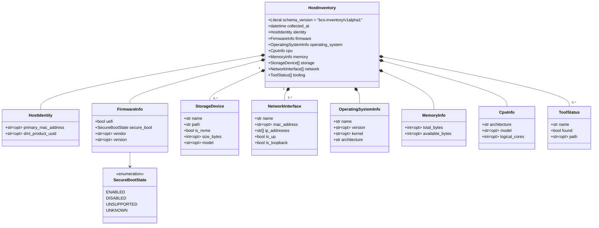
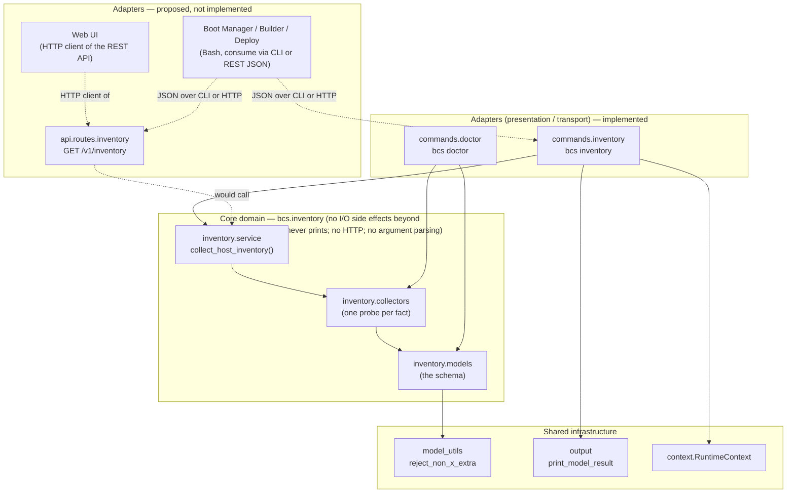
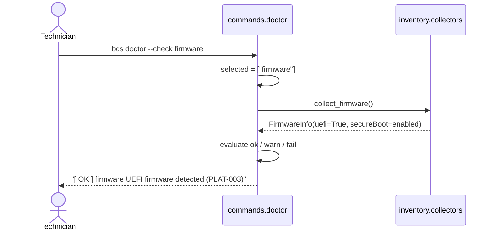
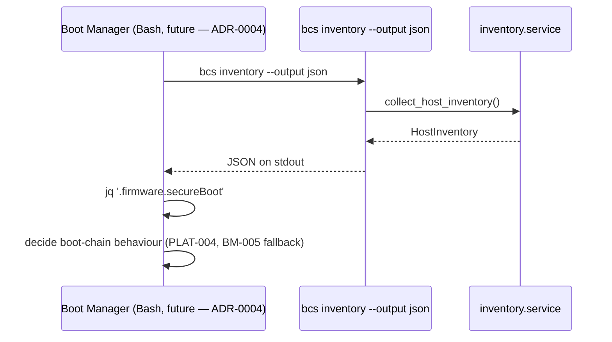

# Host Inventory Subsystem — Design Proposal

> **Status: Design accepted ([ADR-0008](decisions/0008-host-inventory-ports-and-adapters.md), Accepted).** The ports-and-adapters split, immutability, and JSON-as-canonical-format decisions in this document are approved. Parts of this subsystem are already implemented (see [§ Current Implementation Status](#current-implementation-status-vs-this-proposal)) because the CLI framework work that produced them predates this document; the rest is not yet implemented. **No code changes accompany this document or ADR-0008's acceptance.** Accepting the architecture does not, by itself, approve each item in [§ Proposed Changes Requiring Approval](#proposed-changes-requiring-approval) — those remain individually open and still need their own sign-off before implementation.

## Purpose

The Host Inventory subsystem is BCS's single source of truth describing the current machine: firmware, storage, network, identity, operating system, CPU, memory, and tooling facts. It exists so that **hardware detection happens in exactly one place**. Every other part of BCS — `bcs doctor`, and eventually Boot Manager, Builder, and Deploy — consumes this subsystem's output instead of independently re-probing the same facts, which is precisely the kind of duplicated-concept risk this project's own [REVIEW.md](../REVIEW.md) exists to catch.

This is a cross-cutting subsystem, not a fourth BCS component (it does not appear in [ARCHITECTURE.md §3](../ARCHITECTURE.md#3-components)), in the same sense that [ClassroomConfig](CONFIGURATION.md) and the `bcs` CLI itself ([ARCHITECTURE.md §8](../ARCHITECTURE.md#8-operator-interface)) are not components: it is shared infrastructure that Boot Manager, Builder, and Deploy are each expected to depend on.

## Design Principles

1. **One probe per fact, exactly once.** Every hardware/software fact is gathered by exactly one function. Nothing downstream (`bcs doctor`, a future REST endpoint, a future Web UI) re-implements detection — they consume already-collected data or call the same collector.
2. **Immutable snapshots.** A `HostInventory` instance is a point-in-time observation. It is never mutated after construction; a change in the machine's state produces a *new* snapshot, not an update to an old one. This makes a snapshot safe to cache, compare, log, or hand to another thread/process without defensive copying.
3. **The core never prints, never knows about transport.** `bcs.inventory.models`, `bcs.inventory.collectors`, and `bcs.inventory.service` contain no `print()`, no Rich/Typer imports, no HTTP, no argument parsing. Presentation and transport are adapters layered on top — see [§ Package Structure](#package-structure) and [ADR-0008](decisions/0008-host-inventory-ports-and-adapters.md).
4. **Degrade gracefully, never crash, never fabricate.** A collector that cannot determine a fact returns `None`/an empty collection/an explicit "unknown" enum value. It never raises for an ordinary "this isn't Linux" or "this file doesn't exist" condition, and it never guesses a plausible-looking value.
5. **Own schema, own version.** `HostInventory` carries `schemaVersion: "bcs-inventory/v1alpha1"`, an axis independent of `bcs-cli/v1alpha1` (the CLI's own output shape, see [docs/CLI.md](CLI.md#extensibility--versioning)) and `bcs/v1alpha1` (ClassroomConfig, see [ADR-0005](decisions/0005-yaml-as-unified-configuration-format.md)). A consumer reading inventory JSON should never need to know or care what CLI version produced it.

## Package Structure

```
cli/src/bcs/
├── model_utils.py            # shared "x- extra keys only" validator (also used by config.models)
├── inventory/                 # the subsystem's core domain - no I/O side effects beyond
│   │                          # reading host facts, no printing, no HTTP
│   ├── __init__.py             # re-exports HostInventory, collect_host_inventory
│   ├── models.py               # the schema: HostInventory and its sections (Pydantic, frozen)
│   ├── collectors.py           # one function per fact area, each returns one model
│   └── service.py               # collect_host_inventory() - the single orchestration entry point
└── commands/
    ├── inventory.py            # the CLI adapter: `bcs inventory` - the only place output is printed
    └── doctor.py                # a second adapter: `bcs doctor` evaluates pass/fail against the
                                  # same collectors, without going through service.py's full snapshot
```

Nothing above `inventory/` may import from it in the reverse direction, and nothing inside `inventory/` may import Typer, Rich, or any presentation concern - this is the enforceable half of the "core never prints" principle, and is exactly what makes the [future REST API](#interaction-with-a-future-rest-api) and [future Web UI](#interaction-with-a-future-web-ui) sections below free additions rather than redesigns.

## Pydantic Models

All models below live in `bcs.inventory.models`. Two base classes establish the subsystem's two structural guarantees:

| Base class | `model_config` | Used by |
|---|---|---|
| `FrozenModel` | `frozen=True, extra="forbid"` | Every leaf/value model: no mutation, no undocumented fields. |
| `FrozenExtensibleModel` | `frozen=True, extra="allow"` + a validator rejecting any extra key not prefixed `x-` | `HostInventory` itself - the one place forward-compatible, not-yet-formalized fields are allowed, mirroring [ClassroomConfig's `x-` convention](CONFIGURATION.md#extensibility-model). |



Field-level detail (types shown are the Python/Pydantic types; JSON keys are the `camelCase` aliases in parentheses):

| Model | Fields |
|---|---|
| `HostInventory` | `schema_version` (`schemaVersion`, fixed literal) · `collected_at` (`collectedAt`, `datetime`) · `identity` · `firmware` · `operating_system` (`operatingSystem`) · `cpu` · `memory` · `storage: list[StorageDevice]` · `network: list[NetworkInterface]` · `tooling: list[ToolStatus]` |
| `HostIdentity` | `primary_mac_address` (`primaryMacAddress`, optional) · `dmi_product_uuid` (`dmiProductUuid`, optional) |
| `FirmwareInfo` | `uefi: bool` · `secure_boot` (`secureBoot`, `SecureBootState`) · `vendor: str \| None` · `version: str \| None` |
| `SecureBootState` (`StrEnum`) | `enabled` · `disabled` · `unsupported` (not UEFI, or firmware has no Secure Boot at all) · `unknown` (UEFI, but state undetermined) |
| `StorageDevice` | `name: str` · `path: str` · `is_nvme` (`isNvme`, `bool`) · `size_bytes` (`sizeBytes`, optional) · `model: str \| None` |
| `NetworkInterface` | `name: str` · `mac_address` (`macAddress`, optional) · `ip_addresses` (`ipAddresses`, `list[str]`, currently always empty - see [§ Open Questions](#open-questions--explicitly-deferred)) · `is_up` (`isUp`, `bool`) · `is_loopback` (`isLoopback`, `bool`) |
| `OperatingSystemInfo` | `name: str` · `version: str \| None` · `kernel: str \| None` · `architecture: str` |
| `MemoryInfo` | `total_bytes` (`totalBytes`, optional) · `available_bytes` (`availableBytes`, optional) |
| `CpuInfo` | `architecture: str` · `model: str \| None` · `logical_cores` (`logicalCores`, optional) |
| `ToolStatus` | `name: str` · `found: bool` · `path: str \| None` |

## Responsibilities of Each Class / Module

| Unit | Responsibility |
|---|---|
| `FrozenModel` / `FrozenExtensibleModel` | Enforce the subsystem's two structural guarantees (immutability; extra-field policy) in one place, so no individual model has to restate `model_config`. |
| `HostInventory` | The aggregate root. Owns the top-level identity of a snapshot (`schema_version`, `collected_at`) and composes every section. The *only* model any adapter constructs directly. |
| `HostIdentity`, `FirmwareInfo`, `OperatingSystemInfo`, `CpuInfo`, `MemoryInfo` | Value objects: each describes one bounded, single-valued fact area. No behavior beyond validation. |
| `StorageDevice`, `NetworkInterface`, `ToolStatus` | Value objects describing one member of a *collection* of facts (zero or more devices/interfaces/tools). |
| `SecureBootState` | Enumerates the only valid answers to "what is this firmware's Secure Boot state," including the two "I don't know" cases (`unsupported` vs. `unknown`) as first-class values rather than `None` - see the type's own docstring for why the distinction matters. |
| `bcs.inventory.collectors.collect_*` (functions, not classes) | Each is a **pure-enough** (reads real files, does no writes, has no side effects a caller needs to know about), independently callable, independently testable probe for exactly one fact area. Deliberately plain functions, not a class hierarchy - see the note in [§ Proposed Changes](#proposed-changes-requiring-approval) on why a `Collector` protocol was considered and *not* recommended yet. |
| `bcs.inventory.service.collect_host_inventory` | The one orchestration function. Owns the `collected_at` timestamp (so every section of one snapshot shares one collection instant) and is the only code that composes all collectors into a `HostInventory`. |
| `bcs.commands.inventory.run_inventory` | The CLI adapter. Owns *all* formatting/printing for `bcs inventory`; contains no fact-collection logic itself. |
| `bcs.commands.doctor` (`_check_firmware` etc.) | A second adapter, of a different shape: it calls individual collectors directly (bypassing `collect_host_inventory()`) so that `bcs doctor --check firmware` can collect and evaluate exactly one fact instead of the whole snapshot - see [§ Dependency Graph](#dependency-graph) for why this is a deliberate asymmetry, not an oversight. |
| `bcs.output.print_model_result` | Generic "print a self-describing Pydantic model" helper, not inventory-specific, but currently used only by `bcs inventory` - the seam that keeps `HostInventory`'s own `schemaVersion` from being shadowed by the CLI's (`bcs-cli/v1alpha1`). |
| `bcs.model_utils.reject_non_x_extra` | Shared `x-`-prefix validation, used by both `bcs.inventory.models` and `bcs.config.models` so the two domains can't independently drift on what counts as a valid extension key. |

## Dependency Graph



**Why `commands.doctor` depends on `inventory.collectors` directly, not `inventory.service`:** `bcs doctor --check firmware` should collect *only* firmware facts, not the entire machine's inventory, so it can stay fast and so a failing/slow collector for an unrelated fact (say, a hung tooling probe) can never block an unrelated check. `collect_host_inventory()` always gathers everything; it is the right dependency for `bcs inventory` (which always wants the full snapshot) and the wrong one for `bcs doctor`'s selective checks. This is documented here because it is easy to "fix" by mistake into a single dependency path that would remove `doctor`'s selectivity.

## Sequence Diagrams

### 1. `bcs inventory --output json` (implemented)

```mermaid
sequenceDiagram
    actor Tech as Technician
    participant Main as bcs.__main__
    participant App as bcs.app (Typer)
    participant Cmd as commands.inventory
    participant Svc as inventory.service
    participant Col as inventory.collectors
    participant Out as output.print_model_result

    Tech->>Main: bcs inventory --output json
    Main->>App: normalize_argv(argv); dispatch
    App->>Cmd: run_inventory(runtime)
    Cmd->>Svc: collect_host_inventory()
    Svc->>Col: collect_firmware(), collect_storage(),\ncollect_network(), collect_identity(),\ncollect_operating_system(), collect_cpu(),\ncollect_memory(), collect_tooling()
    Col-->>Svc: immutable value objects
    Svc-->>Cmd: HostInventory (frozen)
    Cmd->>Out: print_model_result(console, JSON, inventory)
    Out-->>Tech: stdout: {"schemaVersion": "bcs-inventory/v1alpha1", ...}
```

### 2. `bcs doctor --check firmware` (implemented, selective path)



### 3. Boot Manager consuming inventory at boot/maintenance time (proposed — Boot Manager does not exist yet)



### 4. Deploy querying fleet-wide inventory via a future REST adapter (proposed)

```mermaid
sequenceDiagram
    participant Deploy as Deploy (central, future — ADR-0004)
    participant Agent as bcs REST adapter (proposed, per classroom PC)
    participant Svc as inventory.service

    Deploy->>Agent: GET /v1/inventory  (over the classroom LAN)
    Agent->>Svc: collect_host_inventory()
    Svc-->>Agent: HostInventory
    Agent-->>Deploy: 200 OK, application/json
    Deploy->>Deploy: aggregate across the classroom;\ndecide multicast session eligibility (NFR-002)
```

## Interaction with the CLI

Already fully specified in [docs/CLI.md § `bcs inventory`](CLI.md#bcs-inventory) and [§ `bcs doctor`](CLI.md#bcs-doctor); this document doesn't restate that reference material. Two consumption modes matter for this design specifically:

- **Human use** (`bcs inventory`, no `--output`): the Rich-formatted text view in `commands.inventory._print_text`.
- **Machine use** (`bcs inventory --output json`, piped to `jq`/a script, or read from a file): the canonical, versioned JSON shape - see [§ Serialization Strategy](#serialization-strategy). This is the mode every non-human consumer (Boot Manager, a future REST API caller inspecting a local snapshot, a test harness) is expected to use.

## Interaction with a Future REST API

This is the concrete payoff of the [ports-and-adapters split](decisions/0008-host-inventory-ports-and-adapters.md): because `inventory.service.collect_host_inventory()` returns a plain, already-validated Pydantic model with no dependency on Typer/Rich/`sys.argv`, a REST endpoint built with a Pydantic-native framework (FastAPI is the natural choice, though this design doesn't require it) needs almost no new code:

```python
# Illustrative only - not implemented, and not part of this proposal's approval ask.
@app.get("/v1/inventory", response_model=HostInventory, response_model_by_alias=True)
def get_inventory() -> HostInventory:
    return collect_host_inventory()
```

`HostInventory` becomes the response model directly; FastAPI (or an equivalent framework) generates its OpenAPI schema from the same Pydantic model that already documents the CLI's JSON output, so the two can never drift.

**One open architectural fork this document deliberately does not resolve:** does the REST API run as a *local agent* on each classroom PC (answering `GET /v1/inventory` for that machine only), or as a *central aggregator* that a Deploy-like consumer queries per machine? The sequence diagram above assumes a local agent, one per classroom PC, because:

- It requires no new cross-machine trust/auth design beyond what Deploy's own network already needs (see [SECURITY.md § network trust](../SECURITY.md#security-relevant-design-areas)).
- It reuses the existing `bcs-<name>` [plugin convention](CLI.md#plugin-system) or a possible future built-in `bcs serve` command - either way, no new extensibility mechanism is required; see [ADR-0006](decisions/0006-bcs-unified-cli-architecture.md).

A central aggregator (one service, many machines reporting in) is also credible, but introduces its own questions (push vs. pull, authentication, a data store) that are exactly the kind of premature design [REVIEW.md §7](../REVIEW.md#7-a-meta-concern-proportionality) warns against doing before there is a real Deploy implementation to drive the requirements. **This fork is recorded as an explicitly open question** ([§ Open Questions](#open-questions--explicitly-deferred)), not decided here.

**Why this matters concretely for Deploy:** Deploy (per [DEP-001](../SPECIFICATION.md#23-deploy)) orchestrates a whole classroom from what is likely a machine other than the ones being imaged. It cannot simply shell out to a local `bcs inventory` the way Boot Manager can (Boot Manager runs *on* the machine it's asking about) - it needs some network-reachable way to ask "what does machine X currently look like" before, e.g., deciding whether X is eligible for a multicast session (`NFR-002`'s reference classroom size assumes machines are actually there and imageable). A REST adapter over this exact `HostInventory` shape is the natural way to satisfy that need without Deploy reimplementing any detection logic itself.

## Interaction with a Future Web UI

The Web UI is a browser-side **client of the REST API**, not a third direct adapter over the core domain - it never imports `bcs.inventory` itself (unless a future maintainer chooses a server-rendered Python web framework, in which case it *could*, using the same import path `commands.inventory` already uses). Either way, no redesign of `bcs.inventory.models` is implied: the JSON shape is already stable, versioned, and `camelCase`-keyed exactly as a typical frontend expects, per [§ Serialization Strategy](#serialization-strategy). This is deliberately the shortest section in this document - there is nothing here to design yet that isn't already covered by the REST API section above, and inventing frontend-specific detail this far ahead of any REST API existing would be the same premature-ceremony mistake flagged in [REVIEW.md §7](../REVIEW.md#7-a-meta-concern-proportionality).

## Serialization Strategy

| Form | Status | Role |
|---|---|---|
| In-memory Pydantic instance | Canonical | What every adapter actually holds and passes around; immutable. |
| JSON (`model_dump(mode="json", by_alias=True)`) | **Canonical wire format** | What every non-Python consumer reads: `bcs inventory --output json`, a future REST response body, a future Boot Manager/Builder/Deploy Bash script via `jq`. `camelCase` keys, ISO-8601 UTC timestamps, enum values as their string (e.g. `"enabled"`), matching the conventions already established for ClassroomConfig and `bcs`'s own CLI JSON output. |
| YAML (`yaml.safe_dump` of the same JSON-mode dict) | CLI convenience only | `bcs inventory --output yaml` exists for a human who prefers YAML to read; **no consumer should ever be built to expect YAML** - it is a rendering of the same data, not a second format with its own guarantees. |
| Text (Rich tables/panels) | CLI convenience only | For a technician reading the terminal directly; carries no machine-readable guarantees at all. |

**Versioning.** `schemaVersion` follows the same policy already established for `bcs-cli/v1alpha1` and `bcs/v1alpha1` ([docs/CLI.md § Extensibility & Versioning](CLI.md#extensibility--versioning)): additive fields (a new optional section, a new optional field on an existing section) do not require a version bump; removing or renaming a field, or changing a field's meaning, does.

**Proposed (not yet done): a checked-in JSON Schema artifact.** `HostInventory.model_json_schema()` can generate a complete JSON Schema for this shape at any time. Publishing that output as a versioned file (e.g. `docs/schemas/host-inventory.schema.json`), mirroring [`config/schema.yaml`](../config/schema.yaml)'s role for ClassroomConfig, would give:

- A validation target for a future Bash-side consumer that wants to check `bcs inventory --output json`'s shape without needing Python/Pydantic (e.g. via `ajv` or a hand-rolled `jq`-based check).
- A concrete artifact a future REST API's OpenAPI documentation can reference or regenerate against.
- A regression target for the golden-file test proposed in [§ Testing Strategy](#testing-strategy).

This is listed under [§ Proposed Changes](#proposed-changes-requiring-approval) rather than done already, since it's a new artifact with its own maintenance cost (it must be regenerated whenever the models change) that deserves an explicit yes/no rather than being added silently.

## Testing Strategy

### What Exists Today

| Test file | What it verifies |
|---|---|
| `tests/test_inventory_models.py` | Immutability (root and nested), the `x-` extension rule, JSON round-tripping through aliases, hashability of scalar-only sections, rejection of unknown non-`x-` fields. |
| `tests/test_inventory_collectors.py` | Each collector's behavior against a *faked* filesystem (module-level `Path` constants monkeypatched to `tmp_path` fixtures) - both the "fact present" and "fact absent/unsupported" branches for every collector. |
| `tests/test_inventory_service.py` | `collect_host_inventory()` correctly assembles all eight collector outputs into one snapshot (via mocked collectors), plus one test that runs the *real* collectors end to end to confirm they don't crash on whatever platform CI happens to run on. |
| `tests/test_commands_inventory.py` | The CLI adapter's text/JSON/YAML rendering, using a fixed, hand-built `HostInventory` (not a real host) - and specifically that the JSON output's `schemaVersion` is `bcs-inventory/v1alpha1`, never shadowed by the CLI's own. |
| `tests/test_commands_doctor.py` (relevant subset) | Each `_check_*` evaluation function's ok/warn/fail/skip mapping, against a monkeypatched collector - these are the tests that close the gap that existed before `doctor` was refactored onto `bcs.inventory` (previously, the equivalent logic was never exercised directly, only through registry-level mocking). |
| `tests/test_model_utils.py` | The shared `x-`-prefix rule in isolation, independent of which domain (config or inventory) uses it. |

This is deliberately layered the same way the code is: model tests never touch collectors; collector tests never touch the CLI; CLI tests never touch the real filesystem. Each layer is tested against the layer directly below it, mocked.

### Proposed Additions (Not Yet Implemented)

1. **A golden-file JSON Schema regression test.** Generate `HostInventory.model_json_schema()` in a test, compare it against a checked-in snapshot, and fail loudly (with a clear message pointing at `schemaVersion` policy) if they differ without a matching version bump. This is the automated guardrail for the "own schema, own version" design principle - today, nothing stops an accidental breaking change from silently landing.
2. **A cross-language contract test, once a Bash consumer exists.** Once Boot Manager, Builder, or Deploy has real Bash code that parses `bcs inventory --output json`, a `bats` test invoking the real `bcs inventory --output json` and asserting on specific `jq` queries would catch drift between the Python producer and the Bash consumer's assumptions. Not proposed for implementation now - there is no Bash consumer yet to write this test against, and writing it speculatively would be the exact premature-ceremony problem [REVIEW.md §7](../REVIEW.md#7-a-meta-concern-proportionality) warns about.

## Current Implementation Status vs. This Proposal

| Aspect | Status | Notes |
|---|---|---|
| Package structure | ✅ Implemented | Matches [§ Package Structure](#package-structure) exactly. |
| Pydantic models | ✅ Implemented | Matches [§ Pydantic Models](#pydantic-models) exactly. |
| Collectors | ✅ Implemented | Linux-oriented placeholders; degrade gracefully on other platforms (verified on Windows during development). |
| Service orchestration | ✅ Implemented | |
| CLI adapter (`bcs inventory`) | ✅ Implemented | |
| `bcs doctor` integration | ✅ Implemented | Refactored onto `inventory.collectors` in the same change that introduced this subsystem. |
| Unit tests | ✅ Implemented | See [§ Testing Strategy](#testing-strategy); 209 tests pass across the whole `cli/` package as of this writing. |
| Collection-caveat reporting (e.g. distinguishing "no NVMe present" from "storage detection unsupported here") | 💡 Proposed | Not implemented - see [§ Proposed Changes](#proposed-changes-requiring-approval) item 1. |
| Checked-in JSON Schema artifact | 💡 Proposed | Not implemented - item 2. |
| Golden-file schema regression test | 💡 Proposed | Not implemented - item 3. |
| `Collector` protocol / dynamic collector registry | 💡 Considered, not recommended | See item 4 - explicitly *not* proposed for implementation now. |
| REST API adapter | 💤 Not started | Design only, this document. No framework choice made. |
| Web UI | 💤 Not started | Design only, further out; see [§ Interaction with a Future Web UI](#interaction-with-a-future-web-ui). |
| Boot Manager / Builder / Deploy consumption | 💤 Not started | Those components remain documentation-only (see [ROADMAP.md](../ROADMAP.md)). |

## Proposed Changes Requiring Approval

None of the following have been implemented. Each is independently approvable/rejectable - approving this document, and [ADR-0008](decisions/0008-host-inventory-ports-and-adapters.md)'s acceptance, does not imply approving all of them.

1. **Add collection-caveat reporting.** Today, a `None`/empty value from a collector is ambiguous: it could mean "this machine genuinely has no NVMe storage" or "the collector couldn't determine that here" (wrong platform, missing permission, etc.). Proposal: add a `caveats: list[str]` field to `HostInventory` (populated by collectors returning a sentinel alongside their value, or by the service layer inspecting *how* a collector degraded) so a consumer - especially a future REST caller with no access to `bcs`'s own log output - can tell the two cases apart. Needs a concrete sub-design (where exactly caveats are attached: per-section vs. one flat list) before implementation.
2. **Publish a checked-in JSON Schema artifact** (e.g. `docs/schemas/host-inventory.schema.json`), generated from `HostInventory.model_json_schema()`, mirroring `config/schema.yaml`'s role. See [§ Serialization Strategy](#serialization-strategy).
3. **Add the golden-file schema regression test** described in [§ Testing Strategy](#testing-strategy), gated on item 2 existing.
4. **Considered, not recommended: a `Collector` protocol + dynamic registry**, so third parties could contribute new collectors without editing `bcs.inventory.collectors` directly (relevant if, e.g., Boot Manager ever wanted to contribute boot-specific facts to a shared inventory rather than only reading it). Not recommended *now*: there is no concrete second contributor yet, `doctor.py`'s existing dict-of-callables pattern already gives ordinary extensibility for BCS's own collectors, and a dynamic registry is exactly the kind of speculative flexibility [REVIEW.md §7](../REVIEW.md#7-a-meta-concern-proportionality) argues against building ahead of a real need. Recorded here so it isn't silently forgotten if that need does arrive.

## Open Questions / Explicitly Deferred

- **REST API topology**: local per-machine agent vs. central aggregator - see [§ Interaction with a Future REST API](#interaction-with-a-future-rest-api). Deliberately unresolved pending a real Deploy implementation to drive the requirement.
- **IP address enumeration**: `NetworkInterface.ip_addresses` is currently always `[]` - pure-stdlib per-interface IP discovery isn't portable without a new dependency or shelling out to `ip`/`ifconfig`, neither in scope for the current implementation pass.
- **Secure Boot byte-value parsing**: `FirmwareInfo.secure_boot` currently returns `unknown` for any UEFI system with `efivars` present, rather than actually reading the `SecureBoot-<GUID>` variable's value. Recorded as a placeholder in the collector's own docstring.
- **Web UI framework/design**: entirely deferred - see [§ Interaction with a Future Web UI](#interaction-with-a-future-web-ui).

## Related Documents

- [docs/CLI.md § The Host Inventory Subsystem](CLI.md#the-host-inventory-subsystem) and [§ `bcs inventory`](CLI.md#bcs-inventory) — the CLI-facing reference this document doesn't duplicate.
- [docs/decisions/0008-host-inventory-ports-and-adapters.md](decisions/0008-host-inventory-ports-and-adapters.md) — the architectural decision this design proposal builds on (status: `Accepted`).
- [docs/CONFIGURATION.md](CONFIGURATION.md) — the sibling subsystem (ClassroomConfig) this design deliberately mirrors in style (immutable-ish models, `x-` extensibility, own schema version).
- [ADR-0004](decisions/0004-bash-as-primary-implementation-language.md) — why Boot Manager, Builder, and Deploy are expected to consume this subsystem as JSON rather than as a Python import.
- [ADR-0007](decisions/0007-python-for-the-bcs-cli.md) — why this subsystem is implemented in Python at all.
- [docs/architecture/boot-manager.md](architecture/boot-manager.md), [builder.md](architecture/builder.md), [deploy.md](architecture/deploy.md) — each component's own note on how it is expected to consume this subsystem.
- [cli/README.md](../cli/README.md) — where this subsystem's code and tests actually live.
- [REVIEW.md](../REVIEW.md) — the proportionality concern this document repeatedly defers to when declining to over-design the future REST API/Web UI/registry work.
