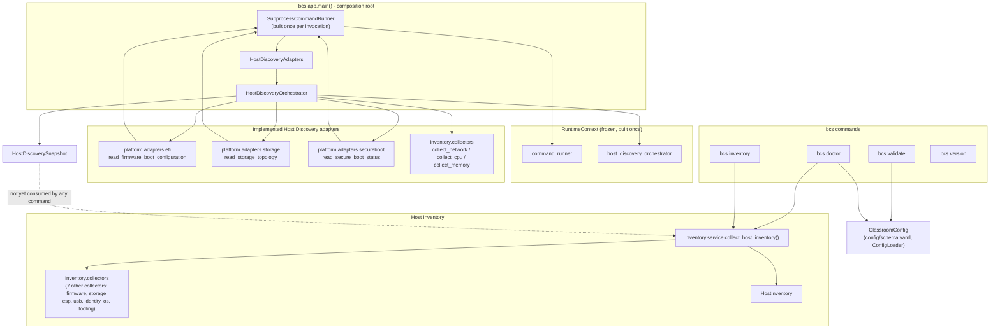

# Implementation Status

This is the single authoritative dashboard for **what is implemented today** in Batoi Classroom Suite (BCS), generated from the current state of this repository. It answers one question — "what exists right now?" — without requiring a reader to cross-reference [ROADMAP.md](../ROADMAP.md), [CHANGELOG.md](../CHANGELOG.md), the [ADRs](decisions/), or every individual design document.

This document does not replace any of those — see [§ 10. Reading Guide](#10-reading-guide). It links to them rather than duplicating their content, and it is not itself normative: it describes state, it does not decide architecture (that's [ARCHITECTURE.md](../ARCHITECTURE.md) and the [ADRs](decisions/)) or record future plans (that's [ROADMAP.md](../ROADMAP.md)).

## 1. Overall Project Status

- **Current development phase:** [Phase 0 — Foundation](../ROADMAP.md#phase-0--foundation-architecture--governance) (architecture, specification, and core infrastructure). Phases 1–5 and v1.0 GA are all still `⏳ Planned`/`💤 Not started` — see [§ 6. Phase Progress](#6-phase-progress).
- **Implemented subsystems:** the `bcs` CLI framework (`version`/`doctor`/`validate`/`inventory` commands), the unified `ClassroomConfig` loader/validator, the Host Inventory subsystem, the Platform Layer core (`CommandRunner`/`CommandResult`/`PlatformError`), and three Host Discovery adapters (EFI, Storage, Secure Boot) fully wired into the Host Discovery Orchestrator's composition root.
- **Partially implemented subsystems:** the `bcs` CLI command tree (`build`/`install`/`deploy`/`backup`/`restore`/`update`/`config` are registered stubs, per [`cli/src/bcs/commands/stubs.py`](../cli/src/bcs/commands/stubs.py)); the Host Discovery Orchestrator (implemented end to end as a component, but only 3 of its 8 named domain slots have a bound adapter, and no CLI command consumes it yet — see [§ 5. Host Discovery Status](#5-host-discovery-status)); the Filesystem Adapter (`docs/FILESYSTEM_ADAPTER.md`, `Accepted`; domain models implemented — Part 1 — per [PATTERNS.md](PATTERNS.md); parser, errors, adapter, and Host Discovery wiring not yet implemented).
- **Documentation-only components:** Boot Manager, Builder, and Deploy (Phases 1–3 — each directory contains only a placeholder `README.md`, no code).
- **Current test count:** 819 passing tests in `cli/` (`pytest`, zero failures).
- **Quality gates status:** `mypy` (strict, canonical `mypy` command) — clean, 54 source files. `pytest` — 819 passed. `ruff check`/`ruff format --check` — clean across `cli/src/` and all but one test file; see [§ 7. Test Status](#7-test-status) for the one known exception.
- **Overall implementation progress:** Phase 0's documentation set is substantially in place; within it, the `cli/` framework and its Platform Layer/Host Discovery subsystem are the only components with real, tested code. Boot Manager, Builder, and Deploy (Phases 1–3) have not started.

## 2. Architecture Components

| Component | Purpose | Status | Design | Implementation | Tests | Notes |
|---|---|---|---|---|---|---|
| Configuration | Unified `ClassroomConfig` YAML format driving all three components | ✅ Implemented | [docs/CONFIGURATION.md](CONFIGURATION.md) ([ADR-0005](decisions/0005-yaml-as-unified-configuration-format.md), Accepted) | `cli/src/bcs/config/` — loader, models, overrides, and `bcs validate` (`config/validator.py`) | `cli/tests/test_config_*.py` | Builder/Deploy ingestion of this format is not implemented (those components don't exist yet). |
| CLI | Single entry point (`bcs`) into all three components | 🚧 Partially implemented | [docs/CLI.md](CLI.md) ([ADR-0006](decisions/0006-bcs-unified-cli-architecture.md)/[ADR-0007](decisions/0007-python-for-the-bcs-cli.md), Accepted) | `cli/src/bcs/` — `version`/`doctor`/`validate`/`inventory` implemented; `build`/`install`/`deploy`/`backup`/`restore`/`update`/`config` are stubs | `cli/tests/test_app_cli.py`, `test_commands_*.py` | Stub commands report "not implemented in this phase" and exit non-zero by design. |
| Host Inventory | Single source of truth describing the current machine | ✅ Implemented | [docs/HOST_INVENTORY.md](HOST_INVENTORY.md) ([ADR-0008](decisions/0008-host-inventory-ports-and-adapters.md), Accepted) | `cli/src/bcs/inventory/` — 10 collector functions, `HostInventory` models, `collect_host_inventory()` | `cli/tests/test_inventory_*.py` | Consumed by `bcs doctor`/`bcs inventory`. Does not yet consume the Host Discovery Orchestrator's output (see [§ 5](#5-host-discovery-status)). |
| Platform Layer | Sole path to OS process execution for `cli/` | ✅ Core implemented | [docs/PLATFORM_LAYER.md](PLATFORM_LAYER.md) ([ADR-0009](decisions/0009-platform-layer-command-runner.md), Accepted) | `cli/src/bcs/platform/` — `CommandResult`, `PlatformError` hierarchy, `CommandRunner`/`SubprocessCommandRunner`, `RuntimeContext.command_runner` DI | `cli/tests/test_platform_*.py` | 3 of 5 [Approved Design Decisions](PLATFORM_LAYER.md#approved-design-decisions) items remain outstanding — see [§ 8](#8-outstanding-work). |
| EFI Adapter | Read-only UEFI firmware boot configuration wrapper | ✅ Fully implemented | [docs/EFI_ADAPTER.md](EFI_ADAPTER.md) ([ADR-0010](decisions/0010-efi-adapter-read-only-scope.md), Accepted) | `cli/src/bcs/platform/adapters/efi/` — `models.py`/`parser.py`/`adapter.py`/`errors.py` | `cli/tests/test_platform_adapters_efi_*.py` | Wired into the Host Discovery composition root (`efi` slot). |
| Storage Adapter | Read-only block/partition/filesystem topology wrapper | ✅ Fully implemented | [docs/STORAGE_ADAPTER.md](STORAGE_ADAPTER.md) (Accepted) | `cli/src/bcs/platform/adapters/storage/` — same four-file shape | `cli/tests/test_platform_adapters_storage_*.py` | Wired into the Host Discovery composition root (`storage` slot). |
| Secure Boot Adapter | Read-only firmware Secure Boot state wrapper | ✅ Fully implemented | [docs/SECURE_BOOT_ADAPTER.md](SECURE_BOOT_ADAPTER.md) (Accepted) | `cli/src/bcs/platform/adapters/secureboot/` — same four-file shape | `cli/tests/test_platform_adapters_secureboot_*.py` | Wired into the Host Discovery composition root (`secure_boot` slot). Not yet folded into `HostInventory`'s own schema. |
| Host Discovery Orchestrator | Coordinates every Host Discovery adapter into one snapshot | ✅ Implemented end to end | [docs/HOST_DISCOVERY_ORCHESTRATOR.md](HOST_DISCOVERY_ORCHESTRATOR.md) ([ADR-0011](decisions/0011-host-discovery-orchestrator.md), Accepted) | `cli/src/bcs/inventory/discovery/` — data models, coordination logic, `RuntimeContext.host_discovery_orchestrator` composition-root wiring | `cli/tests/test_inventory_discovery_*.py`, `test_host_discovery_*.py` | No `bcs` command passes `runtime.host_discovery_orchestrator` into `collect_host_inventory()` yet. |
| Filesystem Adapter | Read-only filesystem usage/capacity wrapper | 🚧 Partially implemented | [docs/FILESYSTEM_ADAPTER.md](FILESYSTEM_ADAPTER.md) (`Accepted`) | `cli/src/bcs/platform/adapters/filesystem/` — `models.py` implemented (Part 1); `parser.py`/`errors.py`/`adapter.py` not yet | `cli/tests/test_platform_adapters_filesystem_models.py` | Fourth Host Discovery adapter; the `filesystem` slot in `HostDiscoveryAdapters` remains a reserved, generically-typed (`object`) placeholder until `adapter.py` exists. |
| Network Adapter | Network interface enumeration | 💤 No dedicated adapter | — | `bcs.inventory.collectors.collect_network()` (existing `sysfs`-based collector), reused directly as the `network` Host Discovery slot | `cli/tests/test_inventory_collectors.py` | No tool-based Platform Layer adapter has been designed for this domain; `NetworkInterface.ip_addresses` is a documented, permanent placeholder gap in the current collector. |
| CPU Adapter | CPU facts | 💤 No dedicated adapter | — | `bcs.inventory.collectors.collect_cpu()`, reused directly as the `cpu` Host Discovery slot | `cli/tests/test_inventory_collectors.py` | Same pattern as Network — no dedicated tool-based adapter designed. |
| Memory Adapter | Memory facts | 💤 No dedicated adapter | — | `bcs.inventory.collectors.collect_memory()`, reused directly as the `memory` Host Discovery slot | `cli/tests/test_inventory_collectors.py` | Same pattern as Network — no dedicated tool-based adapter designed. |
| TPM Adapter | TPM facts | 💤 Not designed | — | None | None | A reserved slot name (`tpm`) in [`HostDiscoveryAdapters`/`HostDiscoverySnapshot`](HOST_DISCOVERY_ORCHESTRATOR.md#public-api) only; no design document exists, and no `SPECIFICATION.md` requirement currently motivates one. |
| Boot Manager | Owns the boot-time experience on each classroom PC | 💤 Documentation only | [docs/architecture/boot-manager.md](architecture/boot-manager.md), [docs/specifications/boot-manager.md](specifications/boot-manager.md) | None (`boot-manager/` contains only a placeholder `README.md`) | None | Phase 1 — Planned. |
| Builder | Produces the versioned golden image | 💤 Documentation only | [docs/architecture/builder.md](architecture/builder.md), [docs/specifications/builder.md](specifications/builder.md) | None (`builder/` contains only a placeholder `README.md`) | None | Phase 2 — Planned. Its configuration format (Configuration, above) is implemented; ingestion is not. |
| Deploy | Distributes golden images to classroom fleets | 💤 Documentation only | [docs/architecture/deploy.md](architecture/deploy.md), [docs/specifications/deploy.md](specifications/deploy.md) | None (`deploy/` contains only a placeholder `README.md`) | None | Phase 3 — Planned. |

Legend: ✅ Implemented · 🚧 Partially implemented · 💤 Not implemented / documentation only.

## 3. ADR Status

| ADR | Title | Status | Implemented? | Notes |
|---|---|---|---|---|
| [0001](decisions/0001-record-architecture-decisions.md) | Record architecture decisions | Accepted | N/A — process decision | In effect: this is the process that produced ADRs 0002–0011. |
| [0002](decisions/0002-three-component-separation.md) | Three-component separation | Accepted | Structurally, yes | Reflected in the `boot-manager/`/`builder/`/`deploy/`/`cli/` top-level split; none of the three components has implementation code yet. |
| [0003](decisions/0003-clonezilla-as-deployment-engine.md) | Clonezilla as the deployment engine | Accepted | Not yet | Decision recorded; Deploy (Phase 3) has not started. |
| [0004](decisions/0004-bash-as-primary-implementation-language.md) | Bash as the primary implementation language | Accepted | Not yet | Applies to Boot Manager/Builder/Deploy, none of which has started; `cli/` is the documented exception (Python, [ADR-0007](decisions/0007-python-for-the-bcs-cli.md)). |
| [0005](decisions/0005-yaml-as-unified-configuration-format.md) | YAML as the unified configuration format | Accepted | Yes | `config/schema.yaml`, `cli/src/bcs/config/`. |
| [0006](decisions/0006-bcs-unified-cli-architecture.md) | `bcs` as a unified CLI, not three component CLIs | Accepted | Yes | `cli/src/bcs/app.py` and the command tree. |
| [0007](decisions/0007-python-for-the-bcs-cli.md) | Python (Typer/Rich/Pydantic/PyYAML) for the `bcs` CLI | Accepted | Yes | The entire `cli/` package. |
| [0008](decisions/0008-host-inventory-ports-and-adapters.md) | Host Inventory as an immutable, ports-and-adapters core domain | Accepted | Yes | `cli/src/bcs/inventory/`, including its EFI System Partition/USB Storage amendment. |
| [0009](decisions/0009-platform-layer-command-runner.md) | Platform Layer as the sole path to process execution | Accepted | Yes (core) | `cli/src/bcs/platform/`; see [§ 8](#8-outstanding-work) for the small remaining items. |
| [0010](decisions/0010-efi-adapter-read-only-scope.md) | EFI adapter — read-only, domain-named firmware boot configuration integration | Accepted | Yes | `cli/src/bcs/platform/adapters/efi/`, fully implemented. |
| [0011](decisions/0011-host-discovery-orchestrator.md) | Host Discovery Orchestrator — coordinating discovery adapters into Host Inventory | Accepted | Yes | `cli/src/bcs/inventory/discovery/`, implemented end to end including composition-root wiring; see [§ 5](#5-host-discovery-status) for its current scope. |

This table mirrors the authoritative index at [docs/decisions/README.md § Index](decisions/README.md#index); that file is the source of truth if the two ever disagree.

## 4. Platform Adapter Matrix

| Domain | Models | Parser | Errors | Adapter | Composition Root | Host Discovery | Tests | Documentation |
|---|---|---|---|---|---|---|---|---|
| EFI | ✅ | ✅ | ✅ | ✅ | ✅ (`efi` slot) | ✅ Wired | ✅ | [EFI_ADAPTER.md](EFI_ADAPTER.md) — Accepted |
| Storage | ✅ | ✅ | ✅ | ✅ | ✅ (`storage` slot) | ✅ Wired | ✅ | [STORAGE_ADAPTER.md](STORAGE_ADAPTER.md) — Accepted |
| Secure Boot | ✅ | ✅ | ✅ | ✅ | ✅ (`secure_boot` slot) | ✅ Wired | ✅ | [SECURE_BOOT_ADAPTER.md](SECURE_BOOT_ADAPTER.md) — Accepted |
| Filesystem | ✅ | ❌ | ❌ | ❌ | ❌ | ❌ (`filesystem` slot reserved, generic `object`-typed) | ✅ (models only) | [FILESYSTEM_ADAPTER.md](FILESYSTEM_ADAPTER.md) — `Accepted`; Part 1 (models) implemented |

"Composition Root" means bound in `bcs.app.main()`'s `HostDiscoveryAdapters` construction (`cli/src/bcs/app.py`), sharing the single `SubprocessCommandRunner` instance. "Host Discovery" means `HostDiscoveryOrchestrator.discover()` actually invokes that slot when called. Neither implies the result reaches `HostInventory`'s own schema or any `bcs` command's output — see [§ 5](#5-host-discovery-status).

## 5. Host Discovery Status

**Implemented adapters** (wired at the composition root, invoked by `HostDiscoveryOrchestrator.discover()`): `efi`, `storage`, `secure_boot` — see [§ 4](#4-platform-adapter-matrix). `network`, `cpu`, `memory` are also wired, but to the pre-existing `sysfs`-based `bcs.inventory.collectors` functions directly, not to a tool-based Platform Layer adapter.

**Pending adapters:** `filesystem` (design `Accepted` — [docs/FILESYSTEM_ADAPTER.md](FILESYSTEM_ADAPTER.md); domain models implemented, `parser.py`/`errors.py`/`adapter.py` not yet, so nothing to wire in) and `tpm` (not designed at all, no motivating requirement).

**Current pipeline:** `bcs.app.main()` (the composition root) constructs one `SubprocessCommandRunner`, binds it into `HostDiscoveryAdapters` (`efi`/`storage`/`secure_boot` via `functools.partial`; `network`/`cpu`/`memory` directly), constructs one `HostDiscoveryOrchestrator` from that bundle, and stores it on `RuntimeContext.host_discovery_orchestrator` — built exactly once per `bcs` invocation. Calling `.discover()` on it invokes every wired slot in the fixed order `efi`, `storage`, `secure_boot`, `filesystem`, `network`, `cpu`, `memory`, `tpm`, isolates any `PlatformError` into a `caveats` entry (`"{domain}: {ExceptionType}: {message}"`, per [ADR-0011 § Error Propagation](HOST_DISCOVERY_ORCHESTRATOR.md#error-propagation)) without stopping the remaining slots, and returns one immutable `HostDiscoverySnapshot`. This whole path is exercised end to end by `cli/tests/test_host_discovery_pipeline.py`.

**Current limitations:**

- No `bcs` command passes `runtime.host_discovery_orchestrator` into `collect_host_inventory()` yet — `bcs inventory`/`bcs doctor` still source every fact from the original ten collectors directly, unaffected by any Discovery adapter's presence.
- `HostDiscoverySnapshot`'s tool-adapter-sourced fields (`firmwareBootConfiguration`, `storageTopology`, `secureBoot`) are never folded into `HostInventory`'s own schema — per [ADR-0011 Decision point 6](decisions/0011-host-discovery-orchestrator.md), that requires a separate, not-yet-proposed [ADR-0008](decisions/0008-host-inventory-ports-and-adapters.md) amendment.
- `filesystem`/`tpm` slots are always `None` — no adapter exists for either.
- Every fixture in `cli/tests/fixtures/{firmware,storage,secureboot}/` is still a zero-byte placeholder; no real hardware/VM output has been captured yet, so parser/adapter tests use synthetic or inline text instead.

## 6. Phase Progress

Full detail lives in [ROADMAP.md](../ROADMAP.md); this is a status count only, not a replacement.

| Phase | Items | Done | In progress | Planned / not started |
|---|---|---|---|---|
| [Phase 0 — Foundation](../ROADMAP.md#phase-0--foundation-architecture--governance) | 15 | 9 | 6 | 0 |
| Phase 1 — Boot Manager | 5 | 0 | 0 | 5 |
| Phase 2 — Builder | 4 | 1 | 0 | 3 |
| Phase 3 — Deploy | 5 | 0 | 0 | 5 |
| Phase 4 — Integration | 3 | 0 | 0 | 3 |
| Phase 5 — Hardening & Scale | 4 | 0 | 0 | 4 (not started) |
| v1.0 — General Availability | 3 | 0 | 0 | 3 (not started) |

**Completed:** the `bcs` CLI framework, the unified configuration format, Host Inventory, the Platform Layer core, and all three implemented Host Discovery adapters (EFI/Storage/Secure Boot) plus the Host Discovery Orchestrator — all within Phase 0.

**In progress:** the remaining Phase 0 foundational documents (project mission/README, `ARCHITECTURE.md`, `SPECIFICATION.md`, contribution workflow, initial ADRs, issue/PR templates) are marked `🚧` in ROADMAP.md — they exist but are treated as living documents, continuously refined rather than finished once.

**Planned:** Phases 1 through 4 in full, and the two Phase 5/v1.0 item groups not started at all. See [ROADMAP.md](../ROADMAP.md) for the itemized list of what each phase actually requires.

## 7. Test Status

- **pytest:** 819 passed, 0 failed (`cli/`, run via the project's own `pytest` configuration in `cli/pyproject.toml`).
- **Coverage:** 96% statement coverage overall (2,143 statements, 67 missed; 410 branches, 36 partial), measured by the same `pytest --cov` configuration CI uses. Every module under `bcs.platform` and `bcs.inventory.discovery` (the Platform Layer core, all three fully-implemented adapters, the Filesystem Adapter's own `models.py`, and the Host Discovery Orchestrator) is at 100% statement and branch coverage.
- **Ruff:** `ruff check .`/`ruff format --check .` are clean across `cli/src/` and all test files except one: `cli/tests/test_platform_adapters_efi_adapter.py` has 4 pre-existing findings (an unsorted import block, one `PLR0913`, one `UP017`, one missing trailing newline) that predate the work reflected in this document and have not been fixed, since they are unrelated to any task that touched this repository so far.
- **mypy:** the canonical `mypy` command (strict mode, `packages = ["bcs"]` per `cli/pyproject.toml`) passes cleanly across all 54 source files under `cli/src/bcs/`. Test files are covered by a relaxed `disallow_untyped_defs = false` override and are not part of the strict gate — matching `.github/workflows/ci.yml`'s own `mypy` job exactly.
- **CI:** [`.github/workflows/ci.yml`](../.github/workflows/ci.yml) — four jobs (`lint`, `typecheck`, `test` on a Python 3.12/3.13 matrix, `cli-smoke-test`), gated behind an `all-green` job. Scoped via path filters to `cli/**`, `config/**`, and the workflow file itself — it does not run on documentation-only changes elsewhere in the repository, including this one.

## 8. Outstanding Work

Each item links to the design document or ADR that already records it in full — this list does not restate requirements.

**High**

- No `bcs` command consumes the Host Discovery Orchestrator yet — see [docs/HOST_DISCOVERY_ORCHESTRATOR.md](HOST_DISCOVERY_ORCHESTRATOR.md)'s own status banner.
- Boot Manager, Builder, and Deploy (Phases 1–3) have not started — see [ROADMAP.md](../ROADMAP.md).

**Medium**

- Filesystem Adapter ([docs/FILESYSTEM_ADAPTER.md](FILESYSTEM_ADAPTER.md), `Accepted`) has only its domain models implemented (Part 1); `parser.py`, `errors.py`, `adapter.py`, composition-root wiring, and Host Discovery integration remain — see [docs/PATTERNS.md](PATTERNS.md) for the process.
- Folding Discovery-domain facts into `HostInventory`'s own schema is a separate, not-yet-proposed ADR-0008 amendment — see [ADR-0011 Decision point 6](decisions/0011-host-discovery-orchestrator.md) and [docs/HOST_DISCOVERY_ORCHESTRATOR.md § Relationship to Host Inventory](HOST_DISCOVERY_ORCHESTRATOR.md#relationship-to-host-inventory---implemented).
- `cli/pyproject.toml`'s Bandit `S603`/`S607` scoping is not yet narrowed from repository-wide to `bcs.plugins`/`bcs.platform.execution` — see [docs/PLATFORM_LAYER.md § Approved Design Decisions](PLATFORM_LAYER.md#approved-design-decisions), item 3.
- A shared `FakeCommandRunner` test double under `cli/tests/` has not been added — see [docs/PLATFORM_LAYER.md § Approved Design Decisions](PLATFORM_LAYER.md#approved-design-decisions), item 4.
- Real fixture captures for the EFI/Storage/Secure Boot corpora — every fixture under `cli/tests/fixtures/` remains a zero-byte placeholder; see each adapter document's own Fixtures Strategy section.

**Low**

- `FrozenModel`/`FrozenExtensibleModel` relocation to `bcs.model_utils` — see [docs/PLATFORM_LAYER.md § Approved Design Decisions](PLATFORM_LAYER.md#approved-design-decisions), item 5.
- Network/CPU/Memory/TPM tool-based adapters are not designed and not currently motivated by any `SPECIFICATION.md` requirement — see [docs/HOST_DISCOVERY_ORCHESTRATOR.md § Future Extensibility](HOST_DISCOVERY_ORCHESTRATOR.md#future-extensibility). If one is ever proposed, it should follow the process in [PATTERNS.md](PATTERNS.md), the methodology extracted from the EFI/Storage/Secure Boot adapters.

## 9. Current Architecture Snapshot

Implemented components only — no future adapters, no Boot Manager/Builder/Deploy.

## 10. Reading Guide

- **If you want architecture** → [ARCHITECTURE.md](../ARCHITECTURE.md)
- **If you want implementation status** → this document, `docs/IMPLEMENTATION_STATUS.md`
- **If you want future work** → [ROADMAP.md](../ROADMAP.md)
- **If you want historical changes** → [CHANGELOG.md](../CHANGELOG.md)
- **If you want design details** → the individual design documents ([HOST_INVENTORY.md](HOST_INVENTORY.md), [PLATFORM_LAYER.md](PLATFORM_LAYER.md), [EFI_ADAPTER.md](EFI_ADAPTER.md), [STORAGE_ADAPTER.md](STORAGE_ADAPTER.md), [SECURE_BOOT_ADAPTER.md](SECURE_BOOT_ADAPTER.md), [FILESYSTEM_ADAPTER.md](FILESYSTEM_ADAPTER.md), [HOST_DISCOVERY_ORCHESTRATOR.md](HOST_DISCOVERY_ORCHESTRATOR.md), [CLI.md](CLI.md), [CONFIGURATION.md](CONFIGURATION.md))
- **If you want architectural decisions** → [docs/decisions/](decisions/) (the ADRs)
- **If you want to build the next Platform Layer adapter** → [PATTERNS.md](PATTERNS.md) — the repeatable lifecycle, Definition of Done, testing strategy, and checklist every adapter in [§ 4. Platform Adapter Matrix](#4-platform-adapter-matrix) already followed
