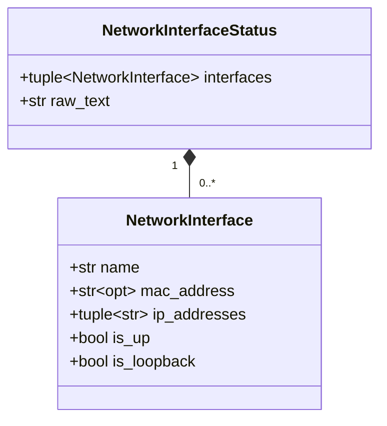
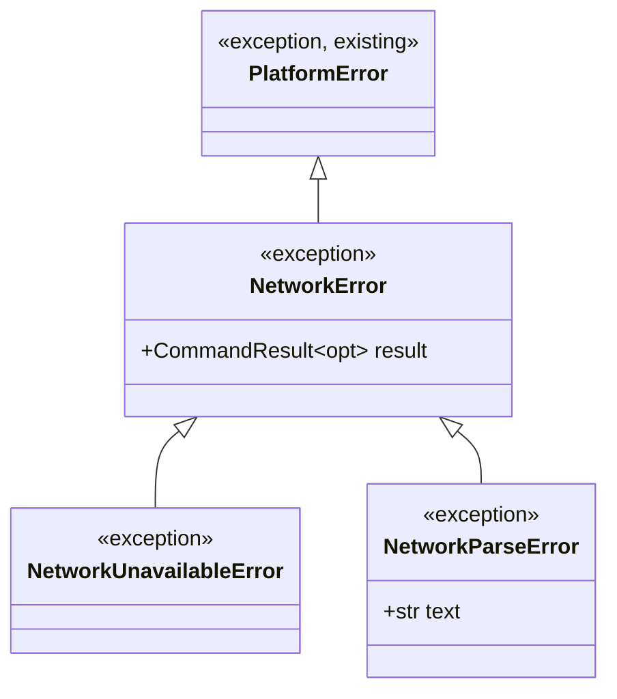
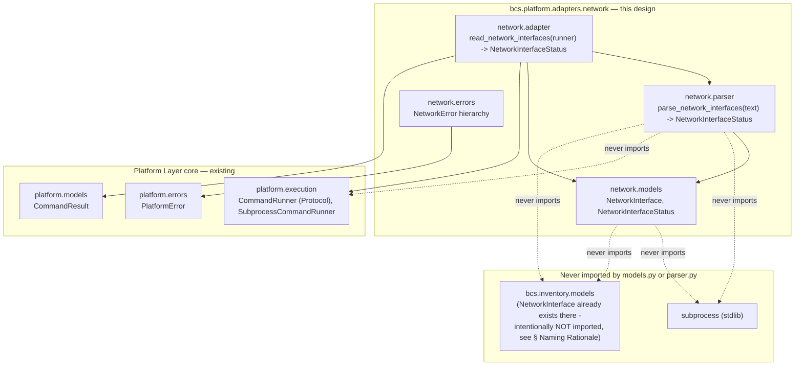
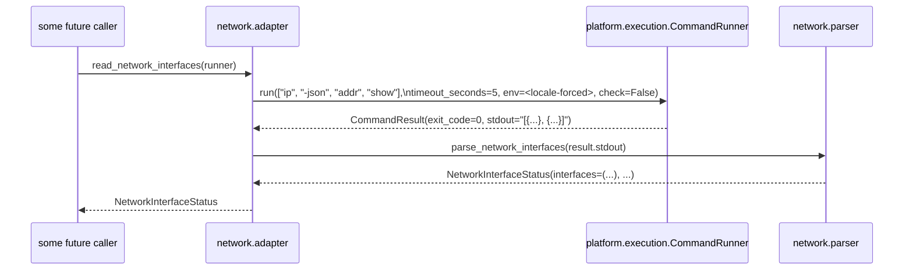
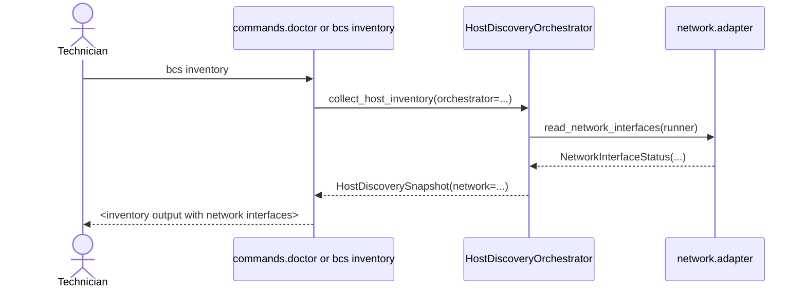

# Network Adapter — Design Proposal (Network Interface Status, Host Discovery)

> **Status: Accepted; domain models, error hierarchy, pure parser, adapter, and fixture corpus scaffold implemented (Parts 1–5).** This document is the design for the Network Adapter, the fifth Host Discovery adapter in BCS's Platform Layer, following the same ports-and-adapters architecture as the [EFI Adapter](EFI_ADAPTER.md) (`Accepted`, implemented), the [Storage Adapter](STORAGE_ADAPTER.md) (`Accepted`, implemented), the [Secure Boot Adapter](SECURE_BOOT_ADAPTER.md) (`Accepted`, fully implemented), and the [Filesystem Adapter](FILESYSTEM_ADAPTER.md) (`Accepted`, fully implemented). This document describes the adapter's complete design — domain models, pure parser, error hierarchy, adapter orchestration, fixture strategy, and composition-root wiring — following the established pattern, and concludes that no new ADR is required (see [§ ADR Recommendation](#adr-recommendation)). **Implemented:** `NetworkInterface`/`NetworkInterfaceStatus` (`cli/src/bcs/platform/adapters/network/models.py`), per [§ Domain Models](#domain-models); `NetworkError`/`NetworkUnavailableError`/`NetworkParseError` (`cli/src/bcs/platform/adapters/network/errors.py`), per [§ Error Hierarchy](#error-hierarchy); `parse_network_interfaces` (`cli/src/bcs/platform/adapters/network/parser.py`), per [§ Parser Strategy](#parser-strategy); `read_network_interfaces` (`cli/src/bcs/platform/adapters/network/adapter.py`), per [§ Adapter Responsibilities](#adapter-responsibilities); and `cli/tests/fixtures/network/` with six zero-byte placeholder files and README, per [§ Fixtures Strategy](#fixtures-strategy) — the complete adapter as designed in this document. **Not yet implemented:** dedicated `errors.py`/`parser.py`/`adapter.py` unit test modules (see [§ Testing Strategy](#testing-strategy)) and composition-root/Host Discovery wiring — tracked as GitHub issue #73.

## Purpose

This is the fifth of BCS's **Host Discovery** adapters — read-only Platform Layer adapters that turn Linux system-inspection tool output into typed, immutable BCS models, per [docs/PLATFORM_LAYER.md § How Future Adapters Use It](PLATFORM_LAYER.md#how-future-adapters-use-it). This one wraps `ip -json addr show`, the standard Linux tool for enumerating network interfaces with their MAC addresses, IP addresses, and operational state, to replace the current `sysfs`-based network collection with a robust, tool-based approach.

Two needs motivate it:

1. **Host Inventory's network collection is a `sysfs`-only placeholder.** The existing `collect_network()` in `bcs.inventory.collectors` (`cli/src/bcs/inventory/collectors.py:249`) reads `/sys/class/net/` directly — it can report interface name, MAC address, and operstate, but its `ip_addresses` field is explicitly documented as *"a known placeholder gap (empty ipAddresses): pure-stdlib, per-interface IP discovery isn't portable without either a new dependency or shelling out to ip/ifconfig"*. This adapter closes that gap: `ip -json addr show` reports IP addresses natively, with no new dependency.
2. **The Platform Layer's adapter pattern is the established mechanism for closing such gaps.** The same progression — `sysfs`-based collector to Platform Layer adapter — already occurred for storage (`collect_storage()` → Storage Adapter) and firmware EFI facts. This adapter continues that pattern for networking, consistent with [docs/HOST_DISCOVERY_ORCHESTRATOR.md](HOST_DISCOVERY_ORCHESTRATOR.md)'s architecture of typed, tool-backed slots.

## Scope Guarantee

Mirroring [docs/EFI_ADAPTER.md § Read-Only Guarantee](EFI_ADAPTER.md#read-only-guarantee) and [docs/SECURE_BOOT_ADAPTER.md § Scope Guarantee](SECURE_BOOT_ADAPTER.md#scope-guarantee):

- **This adapter discovers network interface facts only.** It reports interface name, link address (MAC), IP addresses, operational state, and loopback classification — nothing else.
- **This adapter never enables, disables, or reconfigures a network interface.** No code path in this design invokes any `ip` flag that mutates link state (`link set up`/`down`), addresses (`addr add`/`del`), routes, or any other write-capable `ip` subcommand. The only flag this adapter ever passes is `-json addr show`.
- **This adapter never decides which interface is "primary," "management," "deployment," or anything else.** Those are domain-service decisions, mirroring the identical stance in [docs/STORAGE_ADAPTER.md § Purpose](STORAGE_ADAPTER.md#purpose) and [docs/FILESYSTEM_ADAPTER.md § Scope Guarantee](FILESYSTEM_ADAPTER.md#scope-guarantee).
- If network *management* (configuring addresses, routes, DNS, link aggregation, or any write operation) is ever pursued, it is a **separate adapter, a separate design document, and a separate ADR** — never a silent extension of this one.

## Domain Boundary

**In scope** — facts the current `collect_network()` already attempts to collect, plus the IP-address data it currently cannot:

- Interface name (e.g. `eth0`, `wlp2s0`)
- MAC/link-layer address
- All assigned IP addresses (IPv4 and IPv6), including link-local
- Operational state (UP or DOWN, derived from the `flags` kernel attribute)
- Loopback vs. non-loopback classification

**Out of scope and explicitly not modelled:**

- **Link speed, duplex, or driver info** — available via `ethtool` but not needed by any current requirement; a future adapter or enrichment can add it.
- **Wireless SSID, signal strength, or PHY info** — not a deployment concern for BCS's wired-Ethernet-focused deployment scenarios.
- **Routing table or ARP/NDP cache** — separate tools (`ip route show`, `ip neigh show`) with separate output shapes; no current requirement demands them.
- **DNS configuration** — already out of scope of the current `collect_network()` and not needed by any SPECIFICATION.md requirement.
- **Interface statistics** (RX/TX bytes, packets, drops, errors) — available but not needed; not modelled.
- **DHCP lease state** — not observable via `ip` without a separate tool; no requirement demands it.

## Package Structure

```
cli/src/bcs/platform/adapters/
└── network/                       # the network interface domain.
    │                              # NOT named "iproute2" or "ip": the package survives
    │                              # a future backend swap (netlink direct, sysfs
    │                              # complement, rtnetlink socket, ...)
    ├── __init__.py                # [implemented] re-exports NetworkInterface,
    │                              # NetworkInterfaceStatus, parse_network_interfaces,
    │                              # read_network_interfaces, NetworkError,
    │                              # NetworkUnavailableError, NetworkParseError
    ├── models.py                  # [implemented] NetworkInterface, NetworkInterfaceStatus
    │                              # (frozen, JSON-serializable) — see § Domain Models
    ├── parser.py                  # [implemented] parse_network_interfaces(text: str) ->
    │                              # NetworkInterfaceStatus — a pure function;
    │                              # see § Parser Strategy
    ├── adapter.py                 # [implemented] read_network_interfaces(runner: CommandRunner) ->
    │                              # NetworkInterfaceStatus — the only place this
    │                              # package calls CommandRunner.run(), and the only
    │                              # place that knows the current backend is ip
    └── errors.py                  # [implemented] NetworkError(PlatformError) and its
                                 # two subclasses
```

Directory named `network` (the domain name, not the tool name), matching the pattern established by `efi/`, `storage/`, `secureboot/`, and `filesystem/`. Organized as a small subpackage — a schema, a pure parser, an I/O-performing adapter function, and adapter-specific exceptions — for the same reason [ADR-0010](decisions/0010-efi-adapter-read-only-scope.md) point 7 organized `efi/` that way.

## Domain Models

**Implemented** (`cli/src/bcs/platform/adapters/network/models.py`; see `cli/tests/test_platform_adapters_network_models.py` for the corresponding test coverage).

The Network Adapter has two domain models: `NetworkInterface` (one observed interface) and `NetworkInterfaceStatus` (the complete set of observed interfaces on the system).



| Model | Field | JSON alias | Type | Notes |
|---|---|---|---|---|
| `NetworkInterfaceStatus` | `interfaces` | `interfaces` | `tuple[NetworkInterface, ...]` | Every network interface found, in the order the kernel reported them. Empty tuple if no non-virtual interfaces exist (defensive; not expected on a deployed system). |
| | `raw_text` | `rawText` | `str` | The complete, unparsed source text, verbatim. Kept for audit/debugging, mirroring `FirmwareBootConfiguration.raw_text` and `SecureBootStatus.raw_text`. |
| `NetworkInterface` | `name` | `name` | `str` | The interface name as reported (e.g. `"eth0"`, `"lo"`, `"wlp2s0"`). |
| | `mac_address` | `macAddress` | `str \| None` | The link-layer address as reported (e.g. `"52:54:00:12:34:56"`). `None` for interfaces that have no MAC address in their `ip -json` output (loopback, `tun`/`tap`), and also normalised to `None` for the null MAC (`00:00:00:00:00:00`). See [§ Open Questions](#open-questions). |
| | `ip_addresses` | `ipAddresses` | `tuple[str, ...]` | All IP addresses currently assigned to this interface (IPv4 and IPv6, including link-local), in the order reported. Empty tuple if no address is assigned. |
| | `is_up` | `isUp` | `bool` | Whether the interface is administratively UP **and** has carrier (`LOWER_UP` flag present in the `flags` array). |
| | `is_loopback` | `isLoopback` | `bool` | Whether the interface has the `LOOPBACK` flag set in its `flags` array. |

**Naming rationale:** `NetworkInterface` is used rather than `Interface` (too generic — would be ambiguous between network, disk controller, BIOS, and every other kind of interface in a system), `NetInterface` (unnecessarily abbreviated), or `NetworkAdapter` (collides with the architectural term for this Host Discovery adapter kind). The existing `bcs.inventory.models.NetworkInterface` is already the canonical name for this concept at the inventory layer, and defining an independently-named Platform Layer version would create an unnecessary translation step — see [§ Naming Rationale](#naming-rationale).

`NetworkInterfaceStatus` follows the `<Domain>Status` pattern `SecureBootStatus` already established ([docs/SECURE_BOOT_ADAPTER.md § Domain Models](SECURE_BOOT_ADAPTER.md#domain-models)): "observed condition, not a configurable state." `NetworkConfiguration` was considered and rejected for the same reason `SecureBootConfiguration` was: it implies a writable/settable policy, which this adapter explicitly does not provide.

### Naming Rationale

**Why `NetworkInterface` in `bcs.platform.adapters.network.models` is independently defined, not imported from `bcs.inventory.models`:** reusing `bcs.inventory.models.NetworkInterface` would create a dependency from `bcs.platform` (a lower layer) up into `bcs.inventory` (a higher layer) — the same architectural inversion [docs/SECURE_BOOT_ADAPTER.md § Naming Rationale](SECURE_BOOT_ADAPTER.md#naming-rationale) already ruled out for `SecureBootState`. This adapter's `NetworkInterface` is therefore an **independently defined** model with the same name and compatible fields, deliberately — a future translation between the two (whether as a Host Inventory schema amendment, an adapter enrichment, or any other mechanism) is a trivial one-to-one mapping.

Both models are **frozen** (`frozen=True, extra="forbid"`), matching every other model in `bcs.platform`. `NetworkInterfaceStatus` carries no `schemaVersion` of its own, for the same reason `FirmwareBootConfiguration`/`StorageConfiguration`/`SecureBootStatus` don't.

## Parser Strategy

**Implemented** (`cli/src/bcs/platform/adapters/network/parser.py`) — see [§ Testing Strategy](#testing-strategy) for its current coverage/testing status.

`parser.parse_network_interfaces(text: str) -> NetworkInterfaceStatus` is a **pure function**, with the same independence guarantees already established for every existing Platform Layer parser:

- Accepts **only `text: str`** — never `stdout`, for the same provenance-independence reason.
- Produces only immutable Pydantic models.
- Never imports `CommandRunner`, `bcs.platform.execution`, or `subprocess`.
- Never knows where the text came from.
- A single text input, not multiple — network interface status comes from exactly one tool invocation (`ip -json addr show`).

**Parsing approach:** JSON-based (`json.loads`), mirroring the Storage Adapter's parser ([docs/STORAGE_ADAPTER.md § Parser Architecture](STORAGE_ADAPTER.md#parser-architecture)) rather than the line-by-line regex approach of the EFI and Secure Boot parsers, because `ip -json` produces structured JSON output by design.

The expected JSON structure (of what `ip -json addr show` currently produces — a fact about today's backend, not the parser's contract):

```
[
  {
    "ifname": "lo",
    "flags": ["LOOPBACK", "UP", "LOWER_UP"],
    "address": "00:00:00:00:00:00",
    "addr_info": [
      {"family": "inet", "local": "127.0.0.1", "prefixlen": 8}
    ]
  },
  {
    "ifname": "eth0",
    "flags": ["BROADCAST", "MULTICAST", "UP", "LOWER_UP"],
    "operstate": "UP",
    "link_type": "ether",
    "address": "52:54:00:12:34:56",
    "addr_info": [
      {"family": "inet", "local": "10.0.2.15", "prefixlen": 24}
    ]
  }
]
```

| JSON field | Extracted into | Notes |
|---|---|---|
| `ifname` | `NetworkInterface.name` | Required — missing or empty raises `ValueError`. |
| `address` | `NetworkInterface.mac_address` | Optional — `None` if absent or if the value is `"00:00:00:00:00:00"` (the null MAC, which is not a real address). |
| `addr_info[*].local` (for each entry where `family` is `"inet"` or `"inet6"`) | `NetworkInterface.ip_addresses` | All addresses collected into a flat tuple in iteration order. Empty tuple if no `addr_info` entries. |
| `flags` array contains `"UP"` and `"LOWER_UP"` | `NetworkInterface.is_up` | `True` when both flags are present; `False` otherwise. |
| `flags` array contains `"LOOPBACK"` | `NetworkInterface.is_loopback` | `True` when the flag is present; `False` otherwise. |
| anything else | ignored, not an error | |

**Permissiveness rules**, matching the settled project convention established by the EFI adapter and applied by every adapter since:

1. **An unrecognized JSON field at the interface-entry level** is silently ignored — a future `ip` version adding a new field does not break parsing.
2. **A missing `address` field, or a null-MAC address (`"00:00:00:00:00:00"`),** sets `mac_address` to `None` (defensive; not an error).
3. **A missing or empty `ifname`** is a malformed entry — rejected with a `ValueError` quoting the 1-based entry index, mirroring `_raise_malformed`'s existing shape.
4. **A non-array `addr_info`** (defensive; not expected from real `ip`) is treated as absent — `ip_addresses` is set to empty.

`is_up` is derived from the `flags` array rather than the `operstate` field that `ip -json` also provides, because the flags (`UP` + `LOWER_UP`) are the kernel's most fundamental representation of administrative state and link state — the same two facts the existing `sysfs`-based collector reads separately. For BCS's wired-Ethernet target platform, the two sources do not meaningfully diverge.

## Adapter Responsibilities

**Implemented** (`cli/src/bcs/platform/adapters/network/adapter.py`; see `cli/tests/test_platform_adapters_network_adapter.py` for the corresponding test coverage).

`adapter.read_network_interfaces(runner: CommandRunner) -> NetworkInterfaceStatus` is the only place this package calls `CommandRunner.run()`, and the **only** place that knows the current backend is `ip`:

1. Build the command: **always exactly `["ip", "-json", "addr", "show"]`** — no other flag or subcommand is ever passed, per [§ Scope Guarantee](#scope-guarantee).
2. Build the locale-forced environment required by every Platform Layer adapter — see [docs/PLATFORM_LAYER.md § Locale Policy](PLATFORM_LAYER.md#locale-policy). While `ip -json` output is numerical/structured and not subject to locale variation, the policy is forced uniformly regardless.
3. Call `runner.run(["ip", "-json", "addr", "show"], timeout_seconds=5.0, env=<locale-forced env>, check=False)`. `check` is deliberately **false** — the adapter inspects `result.exit_code`/`result.stdout`/`result.stderr` itself, exactly mirroring every existing adapter.
4. On a zero exit, pass `result.stdout` to `parser.parse_network_interfaces`. On parser failure (a `ValueError` from bad JSON, a missing top-level array, or a malformed entry), wrap it in `NetworkParseError`.
5. On a non-zero exit, select an exception per [§ Error Mapping](#error-mapping).
6. Return the parsed `NetworkInterfaceStatus`.

`timeout_seconds` defaults to **5.0 seconds**, matching the Secure Boot adapter's own default — reading interface state via netlink is normally near-instant.

## Interaction with `CommandRunner`

Identical shape to every existing adapter:

- Received via dependency injection — never constructed inline, never a module-level default.
- Exactly **one** `CommandRunner.run()` call per `read_network_interfaces()` invocation. No retries.
- `check=False` always; `timeout_seconds` always explicit; `env` always explicit (locale-forced).
- `cwd` and `input_text` are never passed.
- This is the **only** module in this adapter that imports anything from `bcs.platform.execution` — `models.py` and `parser.py` do not.

## Error Hierarchy

**Implemented** (`cli/src/bcs/platform/adapters/network/errors.py`) — see [§ Testing Strategy](#testing-strategy) for its current coverage/testing status.



`NetworkError` extends `bcs.platform.errors.PlatformError` directly, following the identical pattern `FirmwareBootError`, `StorageError`, `SecureBootError`, and `FilesystemError` already established — a caller can `except PlatformError` once and catch every Platform Layer failure uniformly.

### Error Mapping

| Condition | Exception raised | Notes |
|---|---|---|
| `ip` not on `PATH` | `bcs.platform.errors.CommandNotFoundError` | Raised automatically by `CommandRunner`; the adapter does no translation. |
| `runner.run()` exceeds its timeout | `bcs.platform.errors.CommandTimeoutError` | Raised automatically by `CommandRunner`, propagated unchanged. |
| Non-zero exit, `stderr` recognizably indicates network data is unavailable (e.g. network namespace not accessible, permission denied for netlink socket) | `errors.NetworkUnavailableError` | The *semantic* failure — "this environment cannot answer this question," kept distinct from "the tool itself is broken." |
| Non-zero exit, not recognizable as the above | `errors.NetworkError` (the base class itself) | Carries the full `CommandResult` for diagnosis; an unanticipated failure mode. |
| Zero exit, but the output is not valid JSON, is missing the expected top-level array, or contains a malformed entry (e.g. missing `ifname`) | `errors.NetworkParseError` | Wraps the underlying `ValueError`; carries `text` for diagnosis, mirroring `FirmwareBootParseError`/`StorageParseError`. |

## Locale Policy

This adapter follows the Platform Layer's locale policy in full — see [docs/PLATFORM_LAYER.md § Locale Policy](PLATFORM_LAYER.md#locale-policy). While `ip -json` output is inherently locale-independent (field names, addresses, and flags are all kernel-level identifiers, not localised text), the mechanism is forced uniformly across every adapter per the platform-wide rule, and this section confirms this adapter is a conforming instance.

## Testing Strategy

**Models, errors, parser, and adapter are all implemented (Parts 1–4). `models.py` and `adapter.py` each have a dedicated test module at 100% statement and branch coverage; `errors.py`/`parser.py` do not yet have their own dedicated test modules — both are currently exercised only transitively, through `adapter.py`'s own tests (`network/errors.py` reaches 100% coverage this way; `network/parser.py` reaches ~86%, since `adapter.py`'s tests do not exercise every parser branch — e.g. a non-string `flags` entry, or an `addr_info` entry with an unrecognized `family`). Closing this gap with dedicated `test_platform_adapters_network_errors.py`/`test_platform_adapters_network_parser.py` modules remains outstanding, per this adapter's own [Implementation Plan § Part 2](NETWORK_ADAPTER_IMPLEMENTATION_PLAN.md)/[§ Part 3](NETWORK_ADAPTER_IMPLEMENTATION_PLAN.md).**

| Layer | What it verifies | How |
|---|---|---|
| `models.NetworkInterface`/`models.NetworkInterfaceStatus` **(implemented)** | Construction, defaults, both alias spellings (`populate_by_name`), immutability, equality, hashability, JSON serialization/deserialization round-tripping (including alias names), and independence from `bcs.inventory.models.NetworkInterface` (compatible fields, distinct type). | Direct unit tests, no fixtures or mocking needed — mirroring `test_platform_adapters_efi_models.py`. See `cli/tests/test_platform_adapters_network_models.py`; `network/models.py` is at 100% statement and branch coverage. |
| `parser.parse_network_interfaces` **(implemented; no dedicated test module yet)** | Every JSON field shape individually and combined; permissive handling of unrecognized fields; absent `address`; null MAC (`00:00:00:00:00:00`); empty `addr_info`; absent `addr_info`; empty input (empty JSON array); multiple interfaces; IPv4 and IPv6 mixed; a malformed entry (missing `ifname`) with its index-in-array error message; and (via AST inspection, not a substring search) the import-purity check already established for every existing parser's test module. | Planned: direct unit tests, using fixtures loaded via `fixture_utils.py`. Given the corpus starts empty (see [§ Fixtures Strategy](#fixtures-strategy)), tests would build a `tmp_path`-rooted synthetic corpus mirroring the real one's layout, exactly as the EFI parser tests did before real `efibootmgr` captures existed. Not yet implemented — see this section's own note above. |
| `adapter.read_network_interfaces` **(implemented)** | Correct command (`["ip", "-json", "addr", "show"]`), correct locale-forced `env` (with `PATH` preserved), correct explicit `timeout_seconds` (including the 5.0-second default and `None`), `check=False`, correct hand-off to the parser, the adapter-level `NetworkParseError` wrapping with `__cause__` preserved, and the empty-JSON-array-is-not-an-error case. | `FakeCommandRunner` programmed to return a `CommandResult` wrapping inline JSON text as `stdout`, mirroring `test_platform_adapters_secureboot_adapter.py`. See `cli/tests/test_platform_adapters_network_adapter.py`; `network/adapter.py` is at 100% statement and branch coverage. |
| Error mapping **(implemented, via `adapter.read_network_interfaces`'s own test module)** | Each condition in [§ Error Mapping](#error-mapping) maps to the right exception. | `FakeCommandRunner` programmed to return/raise each failure shape — a non-zero `CommandResult` with each recognizable "unavailable" `stderr` pattern; a non-zero `CommandResult` with unrecognized `stderr`; a zero-exit `CommandResult` with invalid JSON, a non-array top level, or a malformed entry; `CommandNotFoundError`/`CommandTimeoutError` passed through unchanged. |
| Real end-to-end (optional, environment-gated) | That the whole chain works against a real `ip` binary on the target platform. | Skipped unless on Linux with `ip` on `PATH`; expected to skip in CI (non-Linux runners). Not yet implemented, mirroring every sibling adapter's own "planned, not built" status for this row. |

## Fixtures Strategy

**Designed here; not yet implemented.**

`cli/tests/fixtures/network/` — a new fixture category, following the established pattern:

- **Exact capture command:** `LC_ALL=C LANG=C ip -json addr show`, per [`cli/tests/fixtures/README.md § How Fixtures Are Collected`](../cli/tests/fixtures/README.md) — no other flag, no post-processing, stdout redirected verbatim.
- **No vendor subdirectories.** Unlike `firmware/` (`generic/`, `dell/`, `hp/`, `lenovo/`), `network/`'s fixtures need no per-OEM partitioning: `ip`'s JSON output is generated by the kernel's netlink interface, which is not vendor-specific. A flat `network/*.txt` layout is used — the same deliberate flatness as `secureboot/`.
- **Naming**, per the corpus's existing convention (`<tool>_<tool-version>_<platform>_<scenario>.txt`): `ip_<version>_ubuntu-24.04_<scenario>.txt`, with `<version>` taken from `ip --version`. Placeholder (zero-byte) files use `unknown` for `<version>` until a real capture exists, per the corpus's own placeholder rule.
- **Required scenarios** (zero-byte placeholders until real capture): `ethernet-up` (one Ethernet interface UP with an IPv4 address), `ethernet-down` (interface present but administratively DOWN), `multi-interface` (Ethernet + loopback + WiFi, the common real-machine case), `ipv6-only` (only IPv6 link-local addresses, no IPv4), `no-address` (interface present but no assigned addresses), and `empty` (empty JSON array `[]` — not expected on a real machine but a valid parser input the adapter should handle gracefully).

## Dependency Diagram



## Sequence Diagram

### `adapter.read_network_interfaces(runner)` — the adapter's own call chain



### Future integration with the Host Discovery Orchestrator (illustrative — not decided by this document)



## Relationship to Host Discovery Orchestrator

This adapter is designed to fill the `network` slot of `HostDiscoveryAdapters`/`HostDiscoverySnapshot` (defined in [docs/HOST_DISCOVERY_ORCHESTRATOR.md](HOST_DISCOVERY_ORCHESTRATOR.md)), which is currently served by the inlined `collect_network()` from `bcs.inventory.collectors` wired directly as a `Callable` — not following the adapter pattern. Once this adapter is implemented:

- `HostDiscoveryAdapters.network` changes from `Callable[[], list[NetworkInterface]] | None` (the current `collect_network` shape, domain-model-importing from `bcs.inventory`) to `Callable[[], NetworkInterfaceStatus] | None` (adapter-shaped, domain-model-importing from `bcs.platform.adapters.network`).
- `HostDiscoverySnapshot.network` narrows from `tuple[NetworkInterface, ...]` to `NetworkInterfaceStatus | None`.
- The composition root (`bcs.app.main()`) binds `read_network_interfaces` into the slot, sharing the same `CommandRunner` instance as the other adapters — exactly as [docs/HOST_DISCOVERY_ORCHESTRATOR.md § Dependency Injection Strategy](HOST_DISCOVERY_ORCHESTRATOR.md#dependency-injection-strategy) already does for `efi`, `storage`, `secure_boot`, and `filesystem`.

This wiring is the same step [ADR-0011](decisions/0011-host-discovery-orchestrator.md) already specifies for any adapter reaching implementation.

## ADR Recommendation

This design does **not** require a new ADR. Every architectural mechanism it uses was already decided by an existing, accepted ADR, and none of them are extended or reinterpreted here:

- **ADR-0008** (Host Inventory ports-and-adapters): this adapter's core (`models.py`, `parser.py`) contains no printing, no framework imports, and degrades gracefully — the same discipline, applied a layer down, that ADR-0008 already established.
- **ADR-0009** (Platform Layer / `CommandRunner`): this adapter uses `CommandRunner` exactly as designed, with no new execution pattern.
- **ADR-0010** (EFI Adapter — read-only, domain-named): this design follows the identical shape — read-only guarantee, domain-driven package/model naming, pure-parser/thin-adapter split, `PlatformError`-rooted exception hierarchy, Platform Layer locale policy.
- **ADR-0011** (Host Discovery Orchestrator): wiring this adapter's `read_network_interfaces` into `HostDiscoveryAdapters.network` at the composition root is exactly the mechanism ADR-0011 already specifies for any adapter reaching implementation — the same treatment `efi`, `storage`, `secure_boot`, and `filesystem` already received.
- The naming-collision question (`NetworkInterface` in `bcs.platform.adapters.network.models` vs. `bcs.inventory.models.NetworkInterface`) follows the same precedent `SecureBootState` already established in [docs/SECURE_BOOT_ADAPTER.md § Naming Rationale](SECURE_BOOT_ADAPTER.md#naming-rationale) for independently defining a same-named model at the Platform Layer rather than importing from `bcs.inventory` — no new naming rule, only a new application of an existing one, recorded in this document's own [§ Naming Rationale](#naming-rationale).

This adapter is the natural continuation of the architecture already accepted in ADR-0008, ADR-0009, ADR-0010, and ADR-0011 — the fifth adapter following a pattern, not a new pattern.

## Future Extensibility

- **A different backend** (netlink syscall directly via `ctypes`/`cffi`, or reading `/proc/net/dev` as a fallback) — the entire reason for the domain-named package boundary: only `adapter.py` would need to change; `models.py`, `parser.py`'s public contract, and every consumer's import path would not.
- **Wireless-specific facts** (SSID, signal strength, PHY mode) — a separate adapter, domain-named `wireless` or similar, wrapping `iw dev <ifname> link` or similar, if and when a requirement motivates it.
- **Interface statistics** (RX/TX bytes, packets, drops, errors — from `ip -s -json link`) — an optional enrichment of `NetworkInterface` with additional fields; not modelled now because no current requirement demands them.
- **Closing `HostInventory`'s network collection gap** — the Host Discovery Orchestrator's `network` slot, once typed to `NetworkInterfaceStatus`, becomes the tool-backed replacement for `collect_network()`. Translating `NetworkInterface` (Platform Layer) to `bcs.inventory.models.NetworkInterface` (or replacing the latter's collection mechanism entirely) remains part of the still-open Host Inventory schema amendment [ADR-0011](decisions/0011-host-discovery-orchestrator.md) Decision point 6 already deferred — not decided here, and not part of this adapter's own implementation.

## Open Questions

- **Null MAC for loopback:** The current `collect_network()` reads `/sys/class/net/lo/address` and stores the result verbatim (which on Linux returns `"00:00:00:00:00:00"`). The proposed parser encounters the same value from `ip -json` and normalises it to `None` — a deliberate semantic improvement (loopback has no real MAC), but a behavioral difference from the existing collector. Documented in [§ Parser Strategy](#parser-strategy).
- **Real fixture capture** — the category `cli/tests/fixtures/network/` does not yet exist; no real `ip` output has been captured. The six required scenarios are defined in [§ Fixtures Strategy](#fixtures-strategy); someone with access to a deployed LliureX machine on Ubuntu 24.04 LTS will need to capture them.
- **Whether/how this adapter is wired into `bcs inventory`/`bcs doctor`** — not decided here. The Host Discovery Orchestrator wiring is an architectural given (the `network` slot exists and this adapter fills it); the CLI command that actually invokes the orchestrator and displays its output is a separate concern, not yet implemented by any command (none currently passes `runtime.host_discovery_orchestrator` through).
- **Interface classification** — no model field flags an interface as "management," "deployment-target," "primary," or anything beyond `is_loopback`. That classification, if ever needed, belongs to a domain service consuming this adapter's output, not to this adapter itself.

## Related Documents

- [docs/EFI_ADAPTER.md](EFI_ADAPTER.md) and [ADR-0010](decisions/0010-efi-adapter-read-only-scope.md) — the sibling adapter whose package structure, parser philosophy, error hierarchy, and read-only discipline this design mirrors.
- [docs/STORAGE_ADAPTER.md](STORAGE_ADAPTER.md) — the second Host Discovery adapter; this design inherits its JSON-parsing approach from the Storage Adapter's established pattern.
- [docs/SECURE_BOOT_ADAPTER.md](SECURE_BOOT_ADAPTER.md) — the third Host Discovery adapter; this design inherits its `<Domain>Status` naming pattern and independently-defined-model rationale for Platform Layer models.
- [docs/FILESYSTEM_ADAPTER.md](FILESYSTEM_ADAPTER.md) — the fourth Host Discovery adapter; this design inherits its scope-guarantee prose and full composition-root wiring precedent.
- [docs/PLATFORM_LAYER.md](PLATFORM_LAYER.md) and [ADR-0009](decisions/0009-platform-layer-command-runner.md) — the `CommandRunner`/`CommandResult`/`PlatformError` foundation and Locale Policy this adapter is built on.
- [docs/HOST_INVENTORY.md](HOST_INVENTORY.md) — the existing `collect_network()` `sysfs`-based collector this adapter is designed to replace.
- [docs/HOST_DISCOVERY_ORCHESTRATOR.md](HOST_DISCOVERY_ORCHESTRATOR.md) and [ADR-0011](decisions/0011-host-discovery-orchestrator.md) — the `network` slot this design gives a concrete type to, and the composition-root wiring pattern this adapter will use.
- [docs/standards/naming-conventions.md](standards/naming-conventions.md#domain-driven-naming) — the project-wide domain-driven naming rule this document applies for the fifth time.
