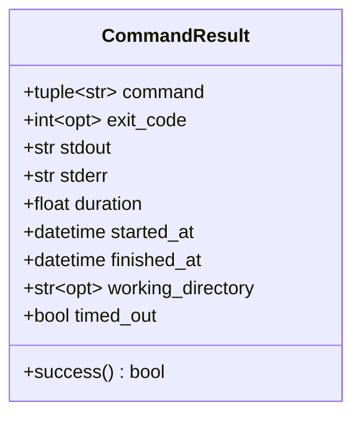
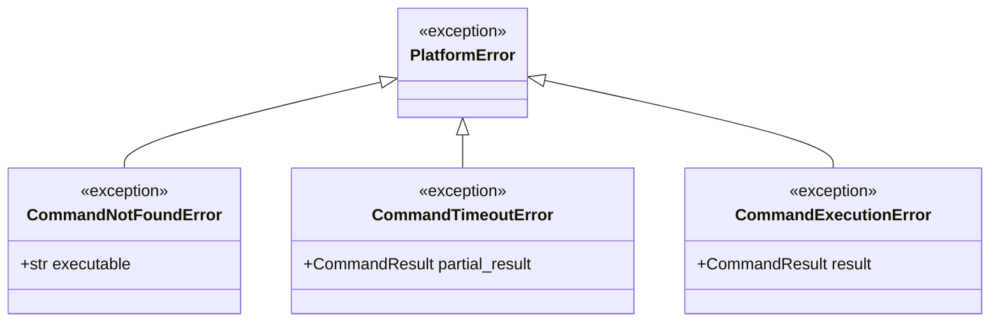
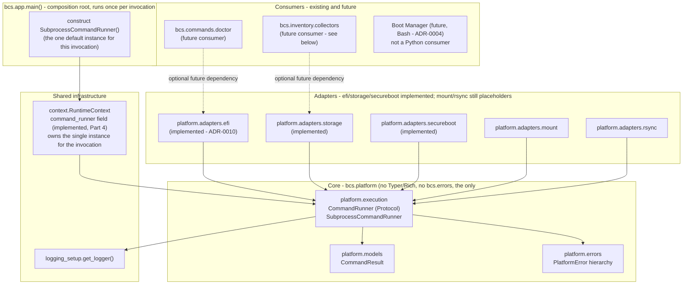
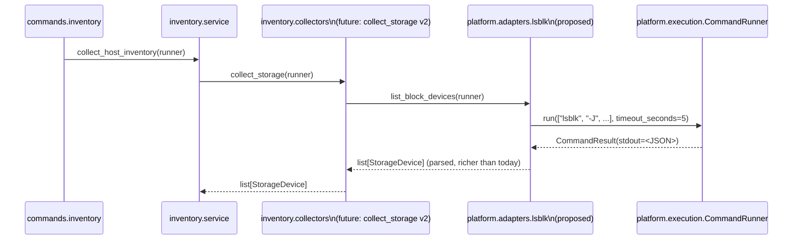

# Platform Layer — Design Proposal (Command Runner)

> **Status: Accepted; core implemented, three Host Discovery adapters built on top of it.** The architecture below (as amended during review — see [§ Amendments Incorporated](#amendments-incorporated-during-review)) is approved. Implemented: `CommandResult` (Platform-001 Part 1), the `PlatformError` exception hierarchy (Part 2), `CommandRunner`/`SubprocessCommandRunner` (Part 3), and `RuntimeContext` dependency injection (Part 4 — see [§ Dependency Injection](#dependency-injection)). Not yet implemented: the Ruff enforcement scoping (item 3 below), `FakeCommandRunner`, and the `FrozenModel` relocation. Of the adapters built on this core: the EFI Adapter (`models.py`/`parser.py`/`adapter.py`/`errors.py`, see [docs/EFI_ADAPTER.md](EFI_ADAPTER.md) and [ADR-0010](decisions/0010-efi-adapter-read-only-scope.md)), the Storage Adapter (same four files, see [docs/STORAGE_ADAPTER.md](STORAGE_ADAPTER.md)), and the Secure Boot Adapter (same four files, see [docs/SECURE_BOOT_ADAPTER.md](SECURE_BOOT_ADAPTER.md)) are all fully implemented; `mount`/`rsync` remain undesigned placeholders. `bcs.inventory.service.collect_host_inventory()` does call into the Platform Layer today, through the EFI/Storage/Secure Boot adapters wired into a `HostDiscoveryOrchestrator` at `bcs.app.main()`'s composition root (see [docs/HOST_DISCOVERY_ORCHESTRATOR.md](HOST_DISCOVERY_ORCHESTRATOR.md)) — no CLI command has been migrated to pass the orchestrator through yet, and `secure_boot` is not folded into `HostInventory`'s own schema, but the wiring is no longer merely potential.

## Amendments Incorporated During Review

The design below already reflects these; listed here for traceability against the original proposal:

1. **Module renamed:** `bcs.platform.runner` → `bcs.platform.execution`. `CommandRunner` (the interface) and `SubprocessCommandRunner`/`FakeCommandRunner` (its implementations) keep their names — only the file they live in is renamed.
2. **`CommandResult` extended** with `command`, `exitCode`, `duration`, `startedAt`, `finishedAt`, `workingDirectory`, and a computed `success` property, replacing the earlier `argv`/`returncode`/`durationSeconds`/`ok` naming — see [§ Models](#models).
3. **"Argument lists only, never `shell=True`" promoted to its own named architectural rule** — see [§ Architectural Rule: Argument Lists Only](#architectural-rule-argument-lists-only-never-shelltrue) — rather than living only inside a design principle's parenthetical.
4. **`docs/standards/coding-standards.md` updated** with an explicit, tool-named prohibition (`subprocess.run()`, `subprocess.Popen()`, "or equivalent") — see that document directly; no longer just a cross-reference to this one.
5. **Ruff enforcement confirmed as part of the approved design** (not merely a proposed follow-up): `S603`/`S607` narrow to `bcs.plugins` and `bcs.platform.execution` only — see [§ Enforcement](#enforcement).

## Purpose

Every interaction BCS's Python code (`cli/`) has with the operating system — running an external program, inspecting its output, reacting to its exit code, killing it if it hangs — is scattered today: `bcs.plugins.run_plugin` calls `subprocess.run` directly, `bcs.inventory.collectors` avoids external tools entirely for exactly this reason (reading `/proc`/`/sys` files instead, with documented placeholder gaps where a real tool would do better — see [docs/HOST_INVENTORY.md § Open Questions](HOST_INVENTORY.md#open-questions--explicitly-deferred)). Every future adapter that needs `efibootmgr`, `lsblk`, `blkid`, `mount`, or `rsync` would otherwise reinvent this same handling independently: command construction, timeout enforcement, output capture, error translation, logging.

The Platform Layer exists so that happens in **exactly one place**. Concretely:

- **Business code MUST NEVER call `subprocess` directly.** Every process BCS's Python code spawns is spawned through the Platform Layer's `CommandRunner`. This is the hard constraint this whole design exists to satisfy (`NFR-008`).
- Everything above it — collectors, commands, future adapters — depends on `CommandRunner`; `CommandRunner` depends on nothing above it. This is the same ports-and-adapters discipline [ADR-0008](decisions/0008-host-inventory-ports-and-adapters.md) already established for the Host Inventory subsystem, applied one layer lower: where Host Inventory centralizes *reading facts about the machine*, the Platform Layer centralizes *running programs on it*.
- It is Linux-oriented (like `bcs.inventory.collectors`) but not Linux-*only* in its own implementation: `CommandRunner`'s contract (run a command, capture output, enforce a timeout, translate failures) has nothing OS-specific about it. What *is* Linux-only is the tools future adapters wrap (`efibootmgr`, `lsblk`, ...) — the Platform Layer itself is portable; its consumers mostly won't be, and aren't expected to be, per [SPECIFICATION.md §4](../SPECIFICATION.md#4-explicit-non-goals)'s fixed target platform.

## Design Principles

1. **One execution seam.** `subprocess` (or `os.system`, `os.popen`, `os.exec*`) is imported in exactly one module: `bcs.platform.execution`. Nowhere else in `cli/src/bcs/` imports it — see [§ Enforcement](#enforcement) for how this is checked mechanically, not just by convention.
2. **Structured in, structured out.** Callers pass a command as an argument list (never a shell string), and get back an immutable, typed result or a typed exception — see [§ Architectural Rule: Argument Lists Only](#architectural-rule-argument-lists-only-never-shelltrue). No caller ever touches a raw `subprocess.CompletedProcess`, `subprocess.TimeoutExpired`, or `OSError`.
3. **Fail loud, fail typed.** Per [docs/standards/coding-standards.md § Error Handling](standards/coding-standards.md#error-handling) ("don't swallow errors to make output quieter"), the Platform Layer never silently downgrades a real failure into an empty/default value the way `bcs.inventory.collectors` does for *absent facts*. Running a command is an action with a real failure mode, not a probe of a possibly-absent file — callers decide how to handle failure, but they always get a typed exception to decide with, never a bare `OSError` or a swallowed exception.
4. **Independent of the CLI's own error/exit-code scheme.** `bcs.errors.BcsError`/`bcs.exit_codes.ExitCode` are a CLI-adapter-level concept (`bcs.__main__.main` translates them to a process exit code). The Platform Layer defines its **own** exception hierarchy and does not import `bcs.errors` — exactly the same independence [ADR-0008](decisions/0008-host-inventory-ports-and-adapters.md) already established for `bcs.inventory`'s core from CLI concerns. A command that calls into the Platform Layer is responsible for translating a Platform Layer exception into a `BcsError` if it wants a specific exit code (see [§ Exception Hierarchy](#exception-hierarchy)).
5. **Swappable by construction, not by monkeypatching.** `CommandRunner` is consumed via dependency injection (a parameter, not a module-level singleton), so tests substitute a fake without patching module state — the same principle [`bcs.context.RuntimeContext`](../cli/src/bcs/context.py) already states for itself ("the context is the single seam through which every collaborator is injected, so commands stay unit testable without patching module state"). This is a deliberate strengthening over `bcs.inventory.collectors`' own test style (which monkeypatches module-level `Path` constants) — justified here because running a process is a genuinely different, heavier-weight, more failure-prone side effect than reading a file, and because — unlike the Collector-Protocol option [HOST_INVENTORY.md explicitly declined to build](HOST_INVENTORY.md#proposed-changes-requiring-approval) for want of a second implementation — `CommandRunner` has a concrete second implementation from day one: a real one and a fake one for tests (see [§ Testing Strategy](#testing-strategy)).

## Architectural Rule: Argument Lists Only, Never `shell=True`

This is a hard, non-negotiable rule of the Platform Layer's design, not a style preference:

- **Every command is represented as a list of arguments** (`["efibootmgr", "-v"]`, never `"efibootmgr -v"`). `CommandRunner.run()` has no code path that accepts a single interpolated shell string.
- **`shell=True` is never passed to `subprocess`, anywhere, under any circumstance.** This eliminates an entire class of shell-injection risk (Bandit `S602`) by construction — there is no string-interpolation-into-a-shell code path to review for correctness in the first place, because it does not exist.
- This rule applies to `bcs.platform.execution` itself and to every current and future adapter built on it (`efibootmgr`, `lsblk`, `blkid`, `mount`, `rsync`, and anything added later). An adapter that finds itself wanting to build a shell string (e.g., for a pipeline) must instead express that as multiple `CommandRunner.run()` calls with data passed between them in Python, or as a single command's argument list — never by handing a string to a shell.
- Enforced mechanically alongside the "only one module imports `subprocess`" rule — see [§ Enforcement](#enforcement).

## Package Structure

```
cli/src/bcs/
└── platform/                  # the Platform Layer - no business logic, no Typer/Rich,
    │                          # the only place subprocess is imported
    ├── __init__.py             # re-exports CommandRunner, CommandResult, SubprocessCommandRunner,
    │                          # and the exception hierarchy
    ├── execution.py            # CommandRunner (a structural Protocol) + SubprocessCommandRunner
    │                          # (the one production implementation) - renamed from "runner.py"
    │                          # during review, see § Amendments Incorporated During Review
    ├── models.py               # CommandResult (frozen, JSON-serializable)
    ├── errors.py               # PlatformError and its subclasses
    └── adapters/                # one module (or subpackage) per domain - see
        ├── efi/                   # § How Future Adapters Use It - implemented
        ├── storage/                # implemented (subsumes the lsblk/blkid tool-name
        │                          # placeholders originally sketched here - see
        │                          # docs/STORAGE_ADAPTER.md)
        ├── secureboot/             # implemented - see docs/SECURE_BOOT_ADAPTER.md
        ├── filesystem/             # implemented - see docs/FILESYSTEM_ADAPTER.md
        ├── mount.py               # still an undesigned tool-name placeholder
        └── rsync.py               # still an undesigned tool-name placeholder
```

Per [docs/standards/naming-conventions.md § Domain-Driven Naming](standards/naming-conventions.md#domain-driven-naming) (first applied in [ADR-0010](decisions/0010-efi-adapter-read-only-scope.md)), adapters are named after the domain they represent, not the tool they currently wrap — `efi/`, not `efibootmgr.py`. `mount.py`/`rsync.py` above are still tool-name **placeholders**, listed only to show where those adapters will eventually live; each is expected to be reviewed for a more domain-appropriate name (e.g., something storage/filesystem-oriented rather than tool-oriented) when it is actually designed, the same way `efibootmgr.py` became `efi/` and the originally-sketched `lsblk.py`/`blkid.py` placeholders became the single domain-named `storage/` subpackage. This is not decided for either remaining placeholder yet.

A **naming note, flagged rather than decided silently**: naming this package `bcs.platform` sits alongside the stdlib `platform` module already imported (unqualified, `import platform`) in `bcs.inventory.collectors` for `platform.machine()`/`platform.system()`. The two names don't actually collide — `bcs.platform` and `platform` are distinct fully-qualified module paths, and Python resolves `from bcs.platform import CommandRunner` unambiguously — but a file that did `from bcs import platform` (unqualified) alongside a bare `import platform` would shadow one with the other. The mitigation is a one-line import-style rule (always `from bcs.platform import ...` or `import bcs.platform as ...`, never `from bcs import platform`), not a rename — the name `bcs.platform` is worth keeping because it matches this issue's own terminology ("the Platform Layer") and reads clearly next to `bcs.inventory`, `bcs.config`, `bcs.commands`. Flagged here so it isn't rediscovered as a surprise later; alternatives (`bcs.osal`, `bcs.system`, `bcs.exec`) are available if the collision risk is judged worse than the naming-consistency benefit.

### Enforcement

"Business code MUST NEVER call `subprocess` directly" is documented today only as a docstring convention for `bcs.plugins` (see its own `# noqa` comments in `cli/pyproject.toml`: `S603`/`S607` are currently ignored *repository-wide*). Now that this architecture is approved, that blanket ignore is confirmed to narrow to apply **only** to `bcs.plugins` (the reviewed passthrough-I/O exception — see [§ Relationship to Existing Code](#relationship-to-existing-code)) and `cli/src/bcs/platform/execution.py` (via Ruff's `[tool.ruff.lint.per-file-ignores]`, the same mechanism already used to scope `T20` — "no leftover `print()`" — to `src/bcs/commands/*`). Every other module regains Bandit's `S603`/`S607` subprocess-call warnings at full strength, so an accidental `import subprocess` anywhere else in `cli/src/bcs/` fails CI lint the moment it's written — a mechanical guardrail, not just a reviewed convention. This is listed under [§ Approved Design Decisions](#approved-design-decisions) — the decision itself is settled; the `pyproject.toml` edit is still pending implementation, per this document's status banner.

## CommandRunner API

`CommandRunner` is a structural interface (a `Protocol`, per [§ Design Principles](#design-principles) item 5) with exactly one method:

| Signature element | Type | Meaning |
|---|---|---|
| `command` (positional) | a sequence of strings | The command and its arguments, exactly as `subprocess` itself expects — see [§ Architectural Rule: Argument Lists Only](#architectural-rule-argument-lists-only-never-shelltrue). `command[0]` is resolved via `PATH` the same way `subprocess.run` already resolves it. Renamed from `argv` during review, to read consistently with `CommandResult.command` (see [§ Models](#models)). |
| `timeout_seconds` (keyword, optional) | a number of seconds, or absent for "no timeout" | Enforced by the runner itself (see [§ Timeout Handling](#timeout-handling)). Adapters are expected to always pass an explicit value; "no timeout" is legal but discouraged — see [§ Open Questions](#open-questions--explicitly-deferred). |
| `check` (keyword, default false) | boolean | If true, a non-zero exit raises `CommandExecutionError`. If false (the default), the caller inspects the returned `CommandResult` itself — mirrors `subprocess.run`'s own `check` parameter exactly, so nothing new to learn for a reader already familiar with `subprocess`. |
| `cwd` (keyword, optional) | a path | Working directory for the child process. Kept as `cwd` (not renamed to match `CommandResult.working_directory`) deliberately: the *input* parameter mirrors `subprocess`'s own kwarg name for a Python caller's ergonomics, while the *output* field uses a more self-documenting name for anyone reading raw JSON (a session report, a log line) without Python context. A small, intentional asymmetry, noted here rather than left as a silent inconsistency. |
| `env` (keyword, optional) | a string-to-string mapping | Matches `subprocess.Popen`'s own `env` semantics **exactly**: absent means the child inherits the current process's environment; a provided mapping **replaces** it entirely (it is not merged/overlaid) — a caller wanting to add one variable on top of the inherited environment copies `os.environ` itself first. This is a deliberate "no surprises, matches the stdlib you already know" choice over inventing a merge convention. |
| `input_text` (keyword, optional) | a string | Text piped to the child's stdin, if any — mirrors `subprocess.run(..., input=...)`. |
| **Returns** | `CommandResult` | On success, or on a non-zero exit when `check` is false. |
| **Raises** | see [§ Exception Hierarchy](#exception-hierarchy) | `CommandNotFoundError`, `CommandTimeoutError`, or (only when `check` is true and the exit is non-zero) `CommandExecutionError`. |

Two implementations exist in this design:

- **`SubprocessCommandRunner`** — the one production implementation, wrapping the standard library's `subprocess.run` with output captured (never inherited/passthrough — see [§ Relationship to Existing Code](#relationship-to-existing-code) for why plugin dispatch, which *does* want passthrough I/O, is a deliberately separate case).
- **`FakeCommandRunner`** — a test double (not shipped in the installed package; lives under `cli/tests/`) that returns pre-programmed `CommandResult`s for a given command (or command pattern) and records every call made against it, so adapter tests can assert both "the right command was built" and "the parsed output matches the canned response" without touching a real OS or tool. See [§ Testing Strategy](#testing-strategy).

## Models



| Field | JSON alias | Type | Notes |
|---|---|---|---|
| `command` | `command` | `tuple[str, ...]` | The exact command executed, immutable (a tuple, not a list) so `CommandResult` itself can be frozen without a mutable-field hazard. Renamed from `argv` during review. |
| `exit_code` | `exitCode` | `int \| None` | The process's real exit code. Renamed from `returncode` during review. `None` only ever appears on the `partial_result` carried inside a `CommandTimeoutError` — a killed process has no real exit code to report. |
| `stdout` / `stderr` | `stdout` / `stderr` | `str` | Captured and decoded as UTF-8 with `errors="replace"` (never raises on undecodable bytes; a tool that emits binary garbage on stdout is a real, if rare, possibility this must not crash on). |
| `duration` | `duration` | `float` (seconds) | Wall-clock time from `started_at` to `finished_at`. Renamed from `duration_seconds` during review. Kept as its own field, even though it is arithmetically derivable from the two timestamps below, so a consumer doesn't have to compute it — the three values are always expected to agree. |
| `started_at` | `startedAt` | `datetime` (UTC, timezone-aware) | Added during review. When the child process was spawned — matches the timestamp convention already established by `HostInventory.collected_at`. |
| `finished_at` | `finishedAt` | `datetime` (UTC, timezone-aware) | Added during review. When the child process exited, or was killed on timeout. |
| `working_directory` | `workingDirectory` | `str \| None` | Added during review. The effective working directory used for this invocation; `None` means the runner's own process working directory was inherited (the `cwd` parameter was not given). |
| `timed_out` | `timedOut` | `bool` | Whether this result represents a killed-on-timeout process. Always `False` on a normally-returned `CommandResult` — see [§ Timeout Handling](#timeout-handling) for why a *raised* `CommandTimeoutError` is the normal path, and this field's `True` case is only ever observed via that exception's `partial_result`. |
| `success` | — (computed, not a field) | property → `bool` | `exit_code == 0 and not timed_out`. Renamed from `ok` during review. |

Following the same convention as `bcs.inventory.models` and `bcs.config.models`, `CommandResult` is a **frozen**, JSON-serializable model — useful for logging and for a future Deploy session report ([`DEP-005`](../SPECIFICATION.md#23-deploy)) that wants to record exactly what commands ran and what they returned, per [`NFR-004`](../SPECIFICATION.md#3-non-functional-requirements) auditability. It deliberately does **not** carry its own `schemaVersion` — unlike `HostInventory`, a `CommandResult` is never the top-level payload of a `bcs` command's output; it is always embedded inside something else's result (a future adapter's parsed model, a session report), so versioning is that container's responsibility, not this model's own.

## Exception Hierarchy



| Exception | Raised when | Carries | Deliberately does *not* inherit from |
|---|---|---|---|
| `PlatformError` | Base class; never raised directly. | — | `bcs.errors.BcsError` — see [§ Design Principles](#design-principles) item 4. |
| `CommandNotFoundError` | The executable can't be located or executed at all — translates the underlying `FileNotFoundError`/`PermissionError` `subprocess` itself would raise. | `executable: str` (the `command[0]` that failed to resolve/execute). | — |
| `CommandTimeoutError` | `timeout_seconds` elapsed before the process finished. | `partial_result: CommandResult` (`timed_out=True`, `exit_code=None`, whatever `stdout`/`stderr` was captured before the kill, `finished_at` set to the kill time). | — |
| `CommandExecutionError` | `check=True` was given and the process exited non-zero. | `result: CommandResult` (the full result, so the caller/logger can inspect `stderr` for diagnosis). | — |

A calling command (a CLI adapter, not the Platform Layer itself) is free to catch any of these and re-raise as a `bcs.errors.BcsError` subclass if it wants a specific process exit code — e.g., a future `bcs doctor` check might catch `CommandNotFoundError` for a missing tool and report it as a `warn`/`fail` `CheckResult` exactly the way today's `_check_tooling` already reports a missing `clonezilla`/`partclone`, without ever needing to know the Platform Layer's exceptions exist at the `bcs.__main__` level.

## Timeout Handling

Two distinct timeout concepts exist in `bcs`, and this design deliberately keeps them separate:

1. **The CLI's own `--timeout`** ([docs/CLI.md § Global Options](CLI.md#global-options), already implemented as `RuntimeContext.timeout`) is a **whole-invocation** wall-clock budget (e.g., `bcs deploy --timeout 45m`), mapped to `ExitCode.TIMEOUT` (`7`) and `bcs.errors.BcsTimeoutError` at the CLI level.
2. **`CommandRunner`'s own `timeout_seconds`** is a **per-call** budget for one external process.

`CommandRunner` has no knowledge of the whole-invocation budget — that composition is the calling **command's** responsibility (e.g., a future `deploy` command tracking elapsed time and passing `min(remaining_budget, adapter_default_timeout)` into each `CommandRunner.run()` call it makes). This keeps the Platform Layer decoupled from `RuntimeContext`/CLI concerns, consistent with [§ Design Principles](#design-principles) item 4.

**Mechanism:** `SubprocessCommandRunner` passes `timeout_seconds` straight through to `subprocess.run`'s own `timeout` parameter, which raises `subprocess.TimeoutExpired` (carrying whatever partial `stdout`/`stderr` was captured before the kill, when using captured output) after sending the child a kill signal. `SubprocessCommandRunner` catches exactly this one exception type, builds the `partial_result` `CommandResult` (`timed_out=True`, `exit_code=None`, `finished_at` set to the kill time), and raises `CommandTimeoutError(partial_result=...)`. Timeout is **always** an exception, never a silently-returned `CommandResult` with `timed_out=True` set — matching [§ Design Principles](#design-principles) item 3 ("fail loud"): a caller that doesn't explicitly want to handle a timeout doesn't need an `if result.timed_out` check on every single call site; it can let the exception propagate and be handled (or not) like any other failure.

## Locale Policy

**Every Platform Layer adapter that executes a Linux command via `CommandRunner` MUST force `LANG=C` and `LC_ALL=C`.** This is a platform-wide rule, not an adapter-specific implementation detail — first identified while designing the EFI adapter ([ADR-0010](decisions/0010-efi-adapter-read-only-scope.md)), and promoted here so every future adapter (`lsblk`, `blkid`, `mount`, `rsync`, and anything added later) follows it uniformly rather than each rediscovering the same need independently.

**Rationale:** many Linux command-line tools localize their output (translated strings, locale-specific number/date formatting) when the invoking user's environment requests it. An adapter's parser (see, e.g., [docs/EFI_ADAPTER.md § Parser Architecture](EFI_ADAPTER.md#parser-architecture)) depends on a *stable, predictable* text format to parse reliably; a tool emitting Catalan or Spanish strings because a technician's shell has `LANG=ca_ES.UTF-8` set would silently break parsing in a way that has nothing to do with the tool's actual behavior. Forcing the `C` locale removes this entire class of failure.

**Mechanism:** because `CommandRunner`'s `env` parameter *replaces* the child's environment entirely rather than merging into it (see [§ CommandRunner API](#commandrunner-api)), an adapter cannot pass `{"LANG": "C", "LC_ALL": "C"}` alone — that would drop `PATH` and everything else the child process needs. Every adapter is responsible for building its own environment as **a full copy of `os.environ`, with `LANG` and `LC_ALL` overridden to `"C"`**, and passing that complete mapping as `env`. This is a few lines of adapter-side code, not a `CommandRunner` feature — `CommandRunner` itself remains a general-purpose execution seam with no opinion on locale; the policy lives in the adapters that choose to invoke locale-sensitive tools.

This policy applies to adapters parsing structured text output. It does not apply to `bcs.plugins.run_plugin` (the reviewed passthrough-I/O exception — see [§ Relationship to Existing Code](#relationship-to-existing-code)), which inherits the invoking user's full environment deliberately, including locale, since a plugin is meant to behave like any other program the technician runs interactively.

## Logging Strategy

The Platform Layer logs through the **same shared logger** every other `bcs` module already uses (`bcs.logging_setup.get_logger()`) — no separate logger namespace, so the existing text/JSON formatting and secrets-redaction (`_redact()`, already applied to every log message regardless of source — see [`logging_setup.py`](../cli/src/bcs/logging_setup.py)) apply to Platform Layer log lines automatically, for free.

| Level | What's logged |
|---|---|
| `INFO` | One line at invocation start (`running: <command[0]> ...`, args elided/truncated) and one at completion (`completed: <command[0]> exit=<code> duration=<seconds>s`) — enough for a technician to see what happened without `--verbose`, matching [docs/standards/coding-standards.md § Logging and Observability](standards/coding-standards.md#logging-and-observability)'s "write for [the single technician], not a log-aggregation pipeline." |
| `DEBUG` | The full `command` and `cwd`. |
| `TRACE` | Full `stdout`/`stderr` content (still redacted — a tool's captured output could itself echo back a secret it was given). |
| `WARNING` | Logged (in addition to, not instead of, raising) whenever `CommandTimeoutError` or `CommandExecutionError` occurs — observational only; logging is never a substitute for the exception itself reaching the caller, per the "don't swallow errors" rule. |

## Dependency Injection

**Implemented (Platform-001 Part 4).** `RuntimeContext` (the CLI's existing dependency-injection container — see [`context.py`](../cli/src/bcs/context.py)) carries a `command_runner: CommandRunner` field, built once in `bcs.app`'s root Typer callback as a `SubprocessCommandRunner()` instance and passed into `RuntimeContext(...)` as a constructor argument — exactly the same treatment already given to `console`, `config_loader`, and `preferences`.

### Ownership and Lifecycle

- **Who constructs it:** `bcs.app.main()` — the composition root — and nowhere else. No other module imports or instantiates `SubprocessCommandRunner`.
- **When:** once per `bcs` process invocation, during application startup, before any subcommand runs — the same point `console`, `config_loader`, and `preferences` are already built.
- **Who owns it:** `RuntimeContext` holds the single reference for the lifetime of the invocation. Because `RuntimeContext` is a frozen `dataclass`, nothing downstream can reassign `command_runner` to a different object once constructed — the reference `RuntimeContext` carries *is* the one every consumer for the rest of that invocation sees, by Python's own object-reference semantics, not by any extra bookkeeping.
- **How consumers obtain it:** as an explicit constructor/function parameter, passed down from `RuntimeContext` — never via a module-level global, a lazily-created default, or a lookup-by-name/type ("service locator"). There is exactly one instance per invocation; nothing creates a second one, and nothing needs to, since `RuntimeContext` itself is only ever built once and its `ctx.obj` reference is what every command function already receives (see `bcs.app`'s existing dispatch, unchanged by this integration).
- **Testing:** `cli/tests/conftest.py`'s `make_runtime_context` fixture accepts an optional `command_runner` override, defaulting to a real `SubprocessCommandRunner()` when omitted — so tests can inject a custom double (a hand-written fake, or a future shared `FakeCommandRunner`) without monkeypatching module state, the same DI-based testing philosophy `RuntimeContext` already documents for its other collaborators.
- **What this integration deliberately does not do:** no existing command was changed to actually *call* `command_runner.run(...)` — `bcs doctor`, `bcs inventory`, and every other command behave exactly as before. This is dependency injection only; wiring a business service (a collector, a doctor check) to actually use the injected runner is separate, future work.

Any command or future adapter that needs to run an external tool receives the runner as an explicit parameter — never by importing a module-level default, never by constructing its own `SubprocessCommandRunner()` inline. This is what makes [§ Testing Strategy](#testing-strategy)'s `FakeCommandRunner` substitution possible without monkeypatching module state, matching `RuntimeContext`'s own stated design goal.



## Testing Strategy

Three layers, mirroring the test-layering discipline already established for Host Inventory ([docs/HOST_INVENTORY.md § Testing Strategy](HOST_INVENTORY.md#testing-strategy)):

| Layer | What it verifies | How |
|---|---|---|
| `SubprocessCommandRunner` | Real process execution: success + stdout capture, non-zero exit with `check=False` (returns a result), non-zero exit with `check=True` (raises `CommandExecutionError`), timeout (raises `CommandTimeoutError`), a missing executable (raises `CommandNotFoundError`), `env` replacement semantics, stdin piping via `input_text`, and that `duration`/`started_at`/`finished_at`/`working_directory` are populated correctly. | Runs the **real** interpreter running the test suite (`[sys.executable, "-c", "<inline script>"]`) as the "external command," not a Linux-only tool — this keeps these tests fully cross-platform (they must pass in this repository's own Windows development environment as well as Linux CI) without weakening what's actually exercised: it is still a real subprocess, a real timeout, a real missing-executable path. |
| `FakeCommandRunner` | Returns the programmed `CommandResult` for a given command/matcher; records every call made against it. | A handful of direct unit tests — the double itself is simple enough not to need more. |
| Future adapters (the EFI adapter, `lsblk`, ...) | Each adapter's own command construction and output-parsing logic. | Exercised **only** against `FakeCommandRunner` loaded with realistic canned tool output (real, captured tool output — never fabricated) — never against a real OS/device, exactly mirroring how `bcs.inventory.collectors` tests fake the filesystem (`tmp_path`-backed `Path` constants) instead of touching real `/sys`/`/proc`. The captured-output corpus infrastructure exists at `cli/tests/fixtures/` (domain-organized: `firmware/`, `storage/`, `secureboot/`, `filesystem/`), with collection/locale/anonymization/naming rules in its README and shared loading helpers in `cli/tests/fixture_utils.py`; no real output has been captured yet (placeholders only). Each adapter's own design (and therefore its own test plan in detail) is out of scope for *this* document — see [§ How Future Adapters Use It](#how-future-adapters-use-it). |

`SubprocessCommandRunner` tests are the one place the Platform Layer is tested against a *real* process — deliberately kept small in number and free of any Linux-only dependency, so they don't inherit the "must degrade gracefully off-Linux" caveat that `bcs.inventory.collectors`' equivalent real-host test carries.

## How Future Adapters Use It

This section originally sketched the *shape* future adapters would take — one module per external tool under `bcs.platform.adapters`, each a thin translation layer between raw tool output and a typed, immutable BCS model, exactly analogous to how `bcs.inventory.collectors` translates `/proc`/`/sys` file contents into typed models today. Of the four originally sketched below, **`efi` is now fully implemented**, and **`lsblk`/`blkid` were superseded** by a single, accepted, fully-implemented `storage` adapter (see [docs/STORAGE_ADAPTER.md](STORAGE_ADAPTER.md)) rather than built as two separate flat modules as originally sketched here; `mount`/`rsync` remain undesigned. The table below is kept for historical/illustrative reference to the original shape — see each adapter's own design document for its actual, current contract. **The EFI adapter was the first exception to "not designed yet"** — it now has its own complete, accepted, and implemented design as `bcs.platform.adapters.efi` (domain-named, not `.efibootmgr` — see [docs/standards/naming-conventions.md § Domain-Driven Naming](standards/naming-conventions.md#domain-driven-naming)); see [docs/EFI_ADAPTER.md](EFI_ADAPTER.md) and [ADR-0010](decisions/0010-efi-adapter-read-only-scope.md) (status: `Accepted`, implemented).

| Adapter (proposed) | Wraps | Would produce | Motivating consumer |
|---|---|---|---|
| `efi` (currently backed by `efibootmgr -v`) — **implemented** | `efibootmgr -v` | `FirmwareBootConfiguration`/`BootEntry` — see [docs/EFI_ADAPTER.md](EFI_ADAPTER.md) | Boot Manager's UEFI NVRAM boot-entry management (`BM-003`), once Boot Manager's own phase begins; also closes a concrete gap for `bcs doctor`/`bcs inventory`, which today can only report *whether* UEFI is present (`FirmwareInfo.uefi`), not what boot entries exist. |
| `lsblk` — **superseded by `storage`, implemented** | `lsblk -J -o NAME,SIZE,TYPE,MOUNTPOINT,FSTYPE` | Richer per-partition storage detail | Directly closed the placeholder gap this row originally documented in [`bcs.inventory.collectors.collect_storage`](../cli/src/bcs/inventory/collectors.py)/`collect_usb_storage` — see [docs/STORAGE_ADAPTER.md](STORAGE_ADAPTER.md) for the adapter that actually shipped. |
| `blkid` — **superseded by `storage`, implemented** | `blkid <device>` | Filesystem UUID/type for one partition | This row's original candidate simplification (replacing `collect_efi_system_partition`'s heuristic) was not what shipped; `blkid` is instead one of the three tools the `storage` adapter composes — see [docs/STORAGE_ADAPTER.md](STORAGE_ADAPTER.md). |
| `mount` | `mount` / `umount` | `CommandResult` (or a parsed mount-table model later) | Deploy's disk-layout restoration (`DEP-003`), Boot Manager's maintenance path. |
| `rsync` | `rsync -a ...` | `CommandResult` (a parsed transfer-summary model is a future, separate design question) | Builder/Deploy artifact staging — not yet specified in any detail; explicitly out of scope here. |

### Sequence: a future `lsblk`-based collector (illustrative, not implemented)



This sequence is illustrative of the *shape* of the integration only. It implies `collect_host_inventory` and the collectors it calls would need a `runner: CommandRunner` parameter threaded through them — a real, visible signature change to existing, already-implemented, already-tested code. That migration is **not** part of this proposal; it is listed as a follow-on design question in [§ Open Questions](#open-questions--explicitly-deferred).

## Relationship to Existing Code

- **`bcs.plugins.run_plugin`** already calls `subprocess.run` directly, and is a **deliberate, reviewed exception**, not an oversight to fix by routing it through `CommandRunner`. Plugin dispatch wants full **passthrough** I/O — the child inherits the parent's real stdin/stdout/stderr, so an interactive plugin (one that itself prompts the user) works correctly. `CommandRunner` is built around **captured** output for structured parsing (the adapter use case), a genuinely different contract. Forcing plugin dispatch through `CommandRunner` would mean either weakening `CommandRunner`'s captured-output guarantee or bolting on a passthrough mode it doesn't otherwise need. This document confirms `bcs.plugins` stays as it is, with its existing `S603`/`S607` review comment narrowed (see [§ Enforcement](#enforcement)) to remain valid for this one file specifically, rather than repository-wide.
- **`bcs.inventory.collectors`** was the nearest and most natural future consumer for two gaps it used to document itself: IP address enumeration (previously always empty) and Secure Boot byte-value parsing (previously always `unknown`). Both are now resolved — not by teaching the legacy collectors themselves to shell out, but by routing `bcs inventory`/`bcs doctor` through the already-implemented Network/Secure Boot Platform Layer adapters via the Host Discovery Orchestrator (Beta M3/M4; see [docs/HOST_DISCOVERY_ORCHESTRATOR.md](HOST_DISCOVERY_ORCHESTRATOR.md)). The legacy collectors themselves are unchanged, and remain the fallback when an orchestrator/adapter is unavailable.

## Approved Design Decisions

The architecture is approved. Status per item, updated as implementation proceeds (Platform-001 Parts 1–4):

1. ✅ **Implemented.** `cli/src/bcs/platform/` per [§ Package Structure](#package-structure): `models.py` (`CommandResult`, Part 1), `errors.py` (the exception hierarchy, Part 2), `execution.py` (`CommandRunner` Protocol + `SubprocessCommandRunner`, Part 3).
2. ✅ **Implemented (Part 4).** `command_runner: CommandRunner` added to `RuntimeContext`, constructed once in `bcs.app`'s root callback as a `SubprocessCommandRunner()` — see [§ Dependency Injection](#dependency-injection) for ownership/lifecycle detail. No existing command's behavior changed.
3. 💤 **Not yet implemented.** Narrow `cli/pyproject.toml`'s `S603`/`S607` Ruff ignores from repository-wide to `src/bcs/plugins.py` and `src/bcs/platform/execution.py` only (mirroring the existing `T20` per-file scoping), so any future accidental `import subprocess` outside those two files fails lint.
4. 💤 **Not yet implemented.** Add a `FakeCommandRunner` test double under `cli/tests/` for future adapter tests to share.
5. 💤 **Not yet implemented.** Relocate `FrozenModel`/`FrozenExtensibleModel` (currently defined only in `bcs.inventory.models`) to `bcs.model_utils`, so `bcs.platform.models.CommandResult` can reuse them instead of duplicating an identical base class. (`CommandResult` currently defines its own equivalent `model_config` directly, per the Part 1 implementation.)

## Open Questions / Explicitly Deferred

- **Migrating `bcs.inventory.collectors` to accept an injected `CommandRunner`** — resolved, not by migrating any existing collector's signature, but by the Host Discovery Orchestrator (`docs/HOST_DISCOVERY_ORCHESTRATOR.md`, `Accepted`, implemented): `collect_host_inventory()` gained a separate, optional `orchestrator` parameter instead, so `collect_storage()` and friends were never changed. See [docs/HOST_DISCOVERY_ORCHESTRATOR.md § Related Documents](HOST_DISCOVERY_ORCHESTRATOR.md#related-documents).
- **Each individual adapter's command contract and output model** (`mount`, `rsync`) remains not designed by this document. `lsblk`/`blkid` were superseded by the fully-implemented `storage` adapter, and `efi`/`secureboot`/`filesystem` are also now designed and fully implemented separately — see [docs/EFI_ADAPTER.md](EFI_ADAPTER.md), [docs/STORAGE_ADAPTER.md](STORAGE_ADAPTER.md), [docs/SECURE_BOOT_ADAPTER.md](SECURE_BOOT_ADAPTER.md), and [docs/FILESYSTEM_ADAPTER.md](FILESYSTEM_ADAPTER.md).
- **A "passthrough" mode for `CommandRunner`** (inherited stdio, for a hypothetical future interactive use case closer to plugin dispatch) is noted as conceivable in [§ Relationship to Existing Code](#relationship-to-existing-code) but not designed — no concrete consumer needs it today.
- **Whether `CommandRunner.run()` should warn (lint-time or run-time) when called without a `timeout_seconds`** is noted in [§ CommandRunner API](#commandrunner-api) as desirable but not designed in enforcement detail here.

## Related Documents

- [docs/decisions/0009-platform-layer-command-runner.md](decisions/0009-platform-layer-command-runner.md) — the architectural decision this design proposal builds on (status: `Accepted`).
- [docs/HOST_INVENTORY.md](HOST_INVENTORY.md) and [ADR-0008](decisions/0008-host-inventory-ports-and-adapters.md) — the sibling subsystem this design deliberately mirrors in style and in ports-and-adapters discipline, and the nearest future consumer of `CommandRunner`.
- [docs/CLI.md § Global Options](CLI.md#global-options) / [§ Exit Codes](CLI.md#exit-codes) — the CLI-level `--timeout`/exit-code scheme this design deliberately stays decoupled from at the core, per [§ Timeout Handling](#timeout-handling).
- [docs/standards/coding-standards.md](standards/coding-standards.md) — the cross-language error-handling/logging principles this design applies to Python specifically, and the explicit `subprocess` prohibition for business code.
- [SPECIFICATION.md §3](../SPECIFICATION.md#3-non-functional-requirements) — home of `NFR-008` (see the ADR).
- [REVIEW.md §7](../REVIEW.md#7-a-meta-concern-proportionality) — the proportionality concern this document defers to when declining to design a `Collector`-Protocol-style dynamic adapter registry, and when scoping `CommandResult` to not carry its own `schemaVersion`.
