# RC Legacy Collector Exit Plan — `bcs.inventory.collectors`

**Date:** 2026-07-09
**Scope:** Post-issue-#70/M3/M4 review of every legacy `collect_*` function in `cli/src/bcs/inventory/collectors.py` — which are fully obsolete, still required, temporarily required, or blocked (by an ADR, a schema change, or `bcs doctor`'s own migration status) — with a dependency graph, safe removal order, LOC estimate, test impact, and risk assessment.
**Built on:** `docs/COLLECTOR_USAGE_CENSUS.md` and `docs/COLLECTOR_CALL_GRAPH.md` (same-day prior analysis), re-verified against current source. See `docs/RC_TECHNICAL_DEBT_REPORT.md` for two corrections to that prior analysis that also apply here.
**No code was removed to produce this plan.**

---

## Status Classification

| Collector | Status | Blocked by |
|---|---|---|
| `collect_firmware()` (the `uefi`/`vendor`/`version` fields) | **Still required** | Nothing — no adapter equivalent exists or is planned for these three fields; EFI Adapter output (`FirmwareBootConfiguration`) isn't the same fact area. |
| `collect_firmware()` → `_read_secure_boot_state()` (the `secure_boot` field's fallback) | **Temporarily required** | Doctor/no-orchestrator fallback — see [Removal Order](#safe-removal-order), step 5. |
| `collect_storage()` | **Temporarily required** | `bcs doctor`'s own migration (still calls it as a fallback) **and** `collect_host_inventory()`'s no-orchestrator path (`orchestrator=None`). |
| `collect_network()` | **Temporarily required** | Same two blockers as `collect_storage()`. |
| `collect_efi_system_partition()` | **Temporarily required**, no removal path designed yet | Needs a new interpretive business-logic service built on `StorageAdapter.BlockDevice.partitions` (GPT PARTTYPE filtering) — not an ADR/schema blocker (the `HostInventory.efiSystemPartition` field already exists, from the ADR-0008 amendment), just an unbuilt replacement. |
| `collect_usb_storage()` | **Temporarily required**, no removal path designed yet | Same shape as above, built on `BlockDevice.is_removable` instead. |
| `collect_identity()` | **Still required** | No adapter is even planned (speculative-only in the census); not blocked, just permanent until someone proposes one. |
| `collect_operating_system()` | **Permanent** | Pure `platform`/`/etc/os-release` reads — never had a Platform Layer justification (no external tool involved). |
| `collect_cpu()` | **Permanent** | Pure `/proc/cpuinfo`/`platform` reads, reused directly as the HDO `cpu` slot (no separate adapter needed unless a future richer source, e.g. `dmidecode`, is proposed). |
| `collect_memory()` | **Permanent** | Same shape as `collect_cpu()`, `/proc/meminfo`. |
| `collect_tooling()` | **Permanent** | Pure `shutil.which`, no subprocess, no Platform Layer justification. |

**Nothing is fully obsolete today.** Every collector either has no replacement designed, or is still reachable as a real fallback path (not just a legacy stub nobody calls) — confirmed by direct verification, not just carried over from the prior census (see `docs/RC_TECHNICAL_DEBT_REPORT.md`'s correction to `COLLECTOR_CALL_GRAPH.md`'s "unreachable on healthy systems" claim for `storage`/`network`).

---

## Dependency Graph

```mermaid
graph TD
    subgraph Composition Root
        APP[bcs.app: main] -->|binds| ADAPTERS[HostDiscoveryAdapters]
        APP -->|binds cpu, memory directly| ADAPTERS
    end

    subgraph Host Discovery
        ADAPTERS --> HDO[HostDiscoveryOrchestrator.discover]
        HDO --> SNAP[HostDiscoverySnapshot]
    end

    subgraph Inventory Service
        SNAP -->|storage_topology| SVC[collect_host_inventory]
        SNAP -->|network| SVC
        SNAP -->|secure_boot| SVC
        SNAP -->|cpu, memory| SVC
        SVC -->|fallback: snapshot field is None| LEGACY_S[collect_storage]
        SVC -->|fallback| LEGACY_N[collect_network]
        SVC -->|fallback, unreachable today - see RC_TECHNICAL_DEBT_REPORT #2| LEGACY_C[collect_cpu]
        SVC -->|fallback, unreachable today| LEGACY_M[collect_memory]
        SVC -->|always, no adapter path exists| LEGACY_FW[collect_firmware]
        SVC -->|always, no adapter path exists| LEGACY_ESP[collect_efi_system_partition]
        SVC -->|always, no adapter path exists| LEGACY_USB[collect_usb_storage]
        SVC -->|always, no adapter path exists| LEGACY_ID[collect_identity]
        SVC -->|always, permanent| LEGACY_OS[collect_operating_system]
        SVC -->|always, permanent| LEGACY_TOOL[collect_tooling]
    end

    subgraph bcs doctor
        DOC_SB[_check_secure_boot] -->|primary| ADAPT_SB[read_secure_boot_status]
        DOC_SB -.->|UEFI gate only| LEGACY_FW
        DOC_ST[_check_storage] -->|primary| ADAPT_ST[read_storage_topology]
        DOC_ST -->|fallback on PlatformError| LEGACY_S
        DOC_NW[_check_network] -->|primary| ADAPT_NW[read_network_interfaces]
        DOC_NW -->|fallback on PlatformError| LEGACY_N
        DOC_ESP[_check_esp] --> LEGACY_ESP
        DOC_USB[_check_usb_storage] --> LEGACY_USB
        DOC_TOOL[_check_tooling] --> LEGACY_TOOL
        DOC_FW[_check_firmware] --> LEGACY_FW
    end

    LEGACY_S -.->|removal requires| BLOCK1[doctor fallback removed AND no-orchestrator path removed]
    LEGACY_N -.->|removal requires| BLOCK1
    LEGACY_ESP -.->|removal requires| BLOCK2[new BlockDevice-derived business-logic service]
    LEGACY_USB -.->|removal requires| BLOCK2
    LEGACY_FW -.->|secure_boot fallback removal requires| BLOCK3[orchestrator made mandatory, a breaking API change]
```

---

## Safe Removal Order

Ordered so each step's prerequisite is satisfied by the step(s) before it. None of these steps is proposed for execution now — this is a sequencing plan for post-Beta work, per this pass's "no new features, document don't implement" scope.

1. **Design and accept the ESP/USB-storage business-logic service.** Not an ADR amendment by itself (the `HostInventory` fields already exist) — a new internal service (e.g. `bcs.inventory.derive_esp`/`derive_usb_storage`, or similar) that filters `StorageConfiguration.devices[].partitions`/`.is_removable` the way `collect_efi_system_partition()`/`collect_usb_storage()` filter `/proc/mounts`/`/sys/block` today. Until this exists, `collect_efi_system_partition()`/`collect_usb_storage()` cannot be touched.
2. **Wire the new service into `bcs doctor`'s `esp`/`usb-storage` checks and `collect_host_inventory()`, following the exact translate-or-fallback pattern already used for storage/network/secure-boot.** At this point `collect_efi_system_partition()`/`collect_usb_storage()` become fallback-only, the same status `collect_storage()`/`collect_network()` have today — not yet removable, but no longer primary.
3. **Complete M5 (physical hardware validation).** Confirms the Storage/Network/Secure Boot Adapters are reliable across every `docs/HARDWARE_VALIDATION_MATRIX.md` environment. This is the evidence needed before any fallback-only collector can be trusted to not be silently relied upon.
4. **Decide whether `bcs doctor`'s adapter-first-collector-fallback pattern stays permanently, or whether a failed adapter should just report `FAIL`/`WARN` with no collector fallback.** This is a product decision, not a technical one — graceful degradation (today's behavior) has real value on an unsupported/partial environment, but it's also the reason `collect_storage()`/`collect_network()`/(after step 2) `collect_efi_system_partition()`/`collect_usb_storage()` can never fully retire while it stands. If the decision is "keep graceful degradation," these four collectors become **permanent**, not temporary — that's a legitimate outcome, not a failure to reach RC.
5. **Only if step 4 decides to drop collector fallback:** remove `collect_storage()`, `collect_network()`, `collect_efi_system_partition()`, `collect_usb_storage()` from `bcs doctor` and from `collect_host_inventory()`'s orchestrator-path fallback. The no-orchestrator path (`collect_host_inventory(orchestrator=None)`) is a separate, harder removal — it's part of the function's public default-parameter contract (`bcs.inventory.service.collect_host_inventory`), and removing it is a breaking API change requiring its own ADR, not a cleanup.
6. **`_read_secure_boot_state()` can only be deleted once `collect_firmware()`'s `secure_boot` field either gets a non-collector fallback or the no-orchestrator path is removed (step 5's harder half).** It is the last-resort value in a three-tier fallback (adapter → this function → the field simply can't be `UNKNOWN`-free), so it is the very last thing in this chain to go.
7. **`cpu`/`memory` fallback branches in `service.py`** (`docs/RC_TECHNICAL_DEBT_REPORT.md` finding #2) are independent of the above chain — they can be removed at any time *if* a maintainer explicitly decides no future tool-based CPU/Memory adapter is planned, closing off that possibility. Otherwise keep indefinitely as defensive code with negligible cost.

**Nothing above is scheduled.** Steps 1-2 are the only ones with a concrete existing tracking issue (#74 ESP, #75 USB storage, per `docs/COLLECTOR_USAGE_CENSUS.md`); steps 3-7 depend on decisions this pass is explicitly not authorized to make (Hard Constraint: "Do not implement new features," and Phase 3's "document drift, don't resolve it" instruction extends naturally to "don't make removal decisions either").

---

## Estimated LOC Removed (if the full chain above is ever completed)

| Item | Approx. LOC (function + private helpers) |
|---|---|
| `collect_storage()` | 17 |
| `collect_network()` | 32 |
| `collect_efi_system_partition()` + `_read_esp_mount`/`_parent_disk`/`_partition_uuid`/`_partition_usage` | ~82 |
| `collect_usb_storage()` + `_is_usb_removable`/`_read_usb_storage_device`/`_find_mounted_partition` | ~58 |
| `_read_secure_boot_state()` | 7 |
| `service.py` fallback branches (storage/network/cpu/memory, orchestrator path) | ~12 |
| **Total, if every step above is eventually completed** | **~208 of `collectors.py`'s 398 lines (~52%) + ~12 lines of `service.py`** |

This is an upper bound assuming step 4 resolves toward "drop collector fallback entirely." If it resolves the other way (keep graceful degradation permanently — a fully legitimate outcome), the realistic removable total shrinks to just `_read_secure_boot_state()` (7 lines) and the `cpu`/`memory` fallback branches (step 7, ~6 lines) — **~13 lines, not ~220.** The technical debt here is real but mostly *contingent on a product decision that hasn't been made*, not a backlog of confirmed-safe deletions.

---

## Expected Test Impact

Counts from `docs/COLLECTOR_USAGE_CENSUS.md`, re-verified against the census table:

| Collector | Direct unit tests (`test_inventory_collectors.py`) | Service-level tests (`test_inventory_service.py`, patched) |
|---|---|---|
| `collect_storage()` | 2 | 2 patched + 1 fallback-path test |
| `collect_network()` | 2 | 3 patched |
| `collect_efi_system_partition()` | 4 | 1 patched |
| `collect_usb_storage()` | 4 | — |
| `collect_firmware()` (incl. `_read_secure_boot_state`) | 3 | 2 patched |
| `collect_cpu()` | 2 | 5 patched |
| `collect_memory()` | 2 | 5 patched |

If the full removal chain in [Safe Removal Order](#safe-removal-order) is ever completed, roughly **19 direct unit tests** and **18 patched service-level tests** (37 total) would need deletion or rewrite — a meaningful fraction of `test_inventory_collectors.py`'s and `test_inventory_service.py`'s current suites. This should be planned as its own dedicated pass with its own coverage-impact check, not bundled into an unrelated change, exactly as this repository's own Definition of Done already requires ("maintain or improve coverage").

---

## Risk Assessment

| Risk | Likelihood | Impact | Mitigation |
|---|---|---|---|
| Removing a "temporarily required" collector before its blocking condition is actually resolved | Low, if this plan's ordering is followed | High — reintroduces the exact class of bug this session's earlier tasks (Beta M3/M4, issue #70) closed (empty `storage`/`network` output, `secure_boot` stuck at `UNKNOWN`) | Follow the removal order strictly; each step has an explicit, checkable prerequisite, not a time-based one. |
| Deciding to drop `bcs doctor`'s graceful-degradation fallback (step 4) without physical hardware evidence that adapters are reliable enough | Medium — this decision will look tempting purely for code-simplification reasons | High — a classroom technician running `bcs doctor` on a machine with a transiently-missing tool (`lsblk` not on `PATH` in a minimal image, e.g.) would get a hard failure instead of degraded-but-useful output | Do not decide step 4 before M5 (physical hardware validation) is complete and logged in `VM_TEST_LOG.md`. |
| `_read_secure_boot_state()` deletion attempted before the no-orchestrator path is resolved | Low — it's the last item in the chain, unlikely to be reached first | Medium — `collect_host_inventory(orchestrator=None)` would have no value to put in `FirmwareInfo.secure_boot` at all, a genuine crash, not a degraded value | Keep as the literal last step; don't parallelize with earlier steps. |
| `cpu`/`memory` fallback removal (step 7) foreclosing a future tool-based adapter | Low probability, but the cost of being wrong is a silent regression (crash instead of graceful degradation) the day that adapter ships | Low-Medium | Get an explicit maintainer decision ("no CPU/Memory tool-based adapter is planned, ever, for this platform") before removing, not just an absence of a current plan. |
