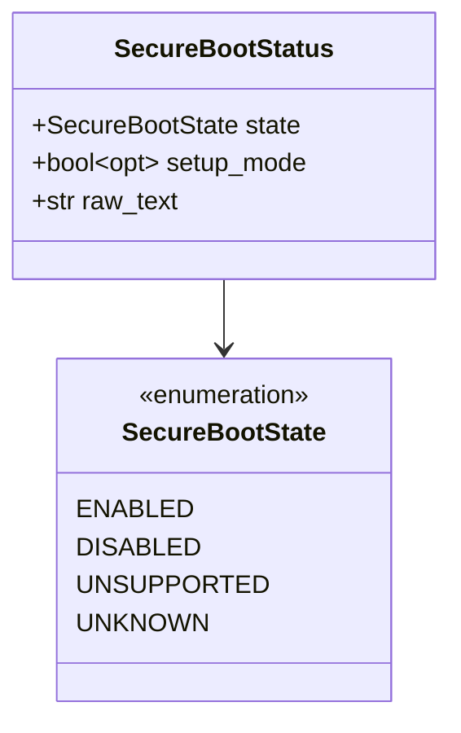
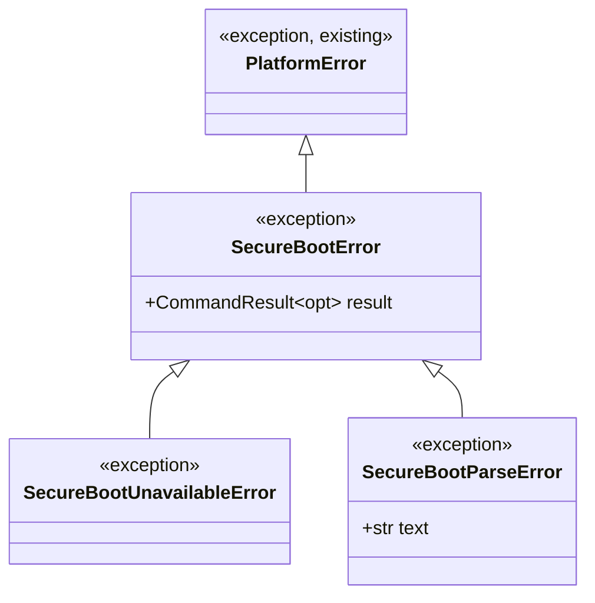
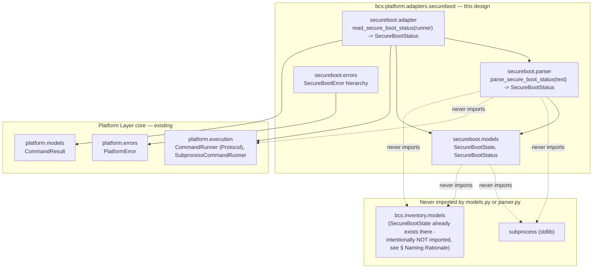
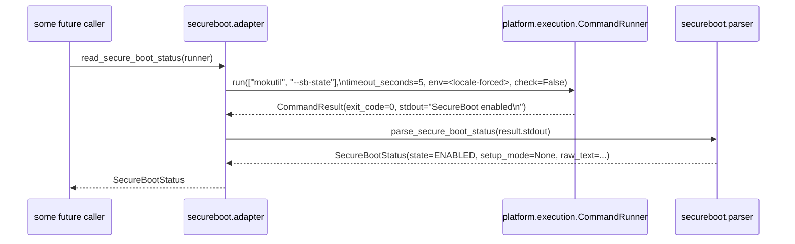
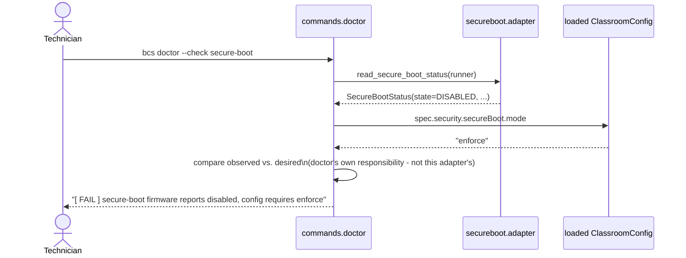

# Secure Boot Adapter — Design Proposal (Firmware Secure Boot State, Host Discovery)

> **Status: Accepted; fully implemented, and consumed by both `bcs inventory` and `bcs doctor` (Beta M4).** This document is the authoritative design for the Secure Boot Adapter, the third Host Discovery adapter in BCS's Platform Layer, following the same ports-and-adapters architecture as the [EFI Adapter](EFI_ADAPTER.md) (`Accepted`, implemented) and the [Storage Adapter](STORAGE_ADAPTER.md) (`Accepted`, implemented). **Implemented:** `SecureBootState`/`SecureBootStatus` (`cli/src/bcs/platform/adapters/secureboot/models.py`), per [§ Domain Models](#domain-models); the pure parser, `parse_secure_boot_status` (`cli/src/bcs/platform/adapters/secureboot/parser.py`), per [§ Parser Strategy](#parser-strategy); the error hierarchy (`cli/src/bcs/platform/adapters/secureboot/errors.py`), per [§ Error Hierarchy](#error-hierarchy); and the orchestration adapter, `read_secure_boot_status` (`cli/src/bcs/platform/adapters/secureboot/adapter.py`), per [§ Adapter Responsibilities](#adapter-responsibilities) — the complete adapter as designed in this document, with no changes to its public API. **Also implemented:** the `secure_boot` slot is wired into `HostDiscoveryAdapters` at `bcs.app.main()`'s composition root, sharing the same `CommandRunner` instance as `efi`/`storage`, and `HostDiscoveryOrchestrator`/`HostDiscoverySnapshot` are narrowed from `Callable[[], object] | None`/`object | None` to `Callable[[], SecureBootStatus] | None`/`SecureBootStatus | None` — see [docs/HOST_DISCOVERY_ORCHESTRATOR.md](HOST_DISCOVERY_ORCHESTRATOR.md). **Also implemented (Beta M4):** `bcs.inventory.service.collect_host_inventory()` translates `snapshot.secure_boot.state` into the *existing* `FirmwareInfo.secure_boot` field (no new `HostInventory` field - see [docs/HOST_DISCOVERY_ORCHESTRATOR.md § Relationship to Host Inventory](HOST_DISCOVERY_ORCHESTRATOR.md#relationship-to-host-inventory---implemented) point 5c), and `bcs.commands.doctor._check_secure_boot()` calls `read_secure_boot_status()` **directly** via `runtime.command_runner` - deliberately not through `HostDiscoveryOrchestrator.discover()`, per [ADR-0011 § Alternatives Considered](decisions/0011-host-discovery-orchestrator.md#alternatives-considered)'s rejection of a full-sweep orchestrator for `bcs doctor`. **Still not done:** folding `secure_boot`'s own richer shape (`setup_mode`, `raw_text`) into `HostInventory`'s own schema as a new field remains a separate ADR-0008 amendment, per [ADR-0011](decisions/0011-host-discovery-orchestrator.md) Decision point 6 - unaffected by Beta M4's translation of `state` alone. See [§ ADR Recommendation](#adr-recommendation) for why this document concludes no new ADR is required, and `docs/SECURE_BOOT_IMPLEMENTATION_PLAN.md` for the Beta M4 implementation record.

## Purpose

This is the third of BCS's **Host Discovery** adapters — read-only Platform Layer adapters that turn Linux system-inspection tool output into typed, immutable BCS models, per [docs/PLATFORM_LAYER.md § How Future Adapters Use It](PLATFORM_LAYER.md#how-future-adapters-use-it). This one wraps `mokutil --sb-state`, the standard Linux tool for reading UEFI Secure Boot state, to close a gap `docs/HOST_INVENTORY.md` has documented since its own acceptance.

Two needs motivate it:

1. **Host Inventory's own documented gap — resolved, Beta M4.** [docs/HOST_INVENTORY.md § Open Questions](HOST_INVENTORY.md#open-questions--explicitly-deferred) used to state: *"`FirmwareInfo.secure_boot` currently returns `unknown` for any UEFI system with `efivars` present, rather than actually reading the `SecureBoot-<GUID>` variable's value. Recorded as a placeholder in the collector's own docstring."* This adapter is the mechanism that closed that gap — not by teaching the existing `sysfs`-reading collector to parse raw EFI variable bytes itself, but by giving `bcs.inventory.service.collect_host_inventory()` a real, tool-based source of truth to call instead, via the Host Discovery Orchestrator (see [docs/HOST_DISCOVERY_ORCHESTRATOR.md § Relationship to Host Inventory](HOST_DISCOVERY_ORCHESTRATOR.md#relationship-to-host-inventory---implemented) point 5c).
2. **`PLAT-004`'s own requirement now has an observation mechanism.** [SPECIFICATION.md](../SPECIFICATION.md#1-target-platform-matrix): *"UEFI Secure Boot must be either supported or safely, explicitly disabled as part of deployment — silent incompatibility is not acceptable."* `bcs doctor`'s `secure-boot` check ([docs/CLI.md § `bcs doctor`](CLI.md#bcs-doctor)) evaluates "state vs. `spec.security.secureBoot.mode`" — the *state* half of that comparison used to be the `unknown`-always placeholder above; `_check_secure_boot()` now calls this adapter directly (Beta M4) and has something real to compare against.

## Scope Guarantee

Mirroring [docs/EFI_ADAPTER.md § Read-Only Guarantee](EFI_ADAPTER.md#read-only-guarantee), this is a hard, non-negotiable constraint on this adapter's scope, not a style preference — and, for `mokutil` specifically, a more consequential one than for `efibootmgr`: `mokutil` can enroll, delete, or revoke Machine Owner Keys and toggle signature-validation enforcement, operations that alter what code the firmware will trust to execute.

- **This adapter discovers Secure Boot facts only.** It reports what the firmware currently says about Secure Boot state and UEFI Setup Mode — nothing else.
- **This adapter never enables or disables Secure Boot.**
- **This adapter never modifies firmware variables** — not `SecureBoot`, not `SetupMode`, not the platform key (PK), key exchange key (KEK), signature database (`db`), or forbidden-signature database (`dbx`).
- **This adapter never enrolls, deletes, revokes, or imports a Machine Owner Key**, and never toggles MOK signature-validation enforcement. No code path in this design invokes `--import`, `--delete`, `--revoke-import`, `--enable-validation`, `--disable-validation`, `--reset`, `--generate-hash`, `--sign`, `--set-verbosity`, `--pk`, `--kek`, or any other write-capable `mokutil` flag. **The only flag this adapter ever passes is `--sb-state`** — see [§ Adapter Responsibilities](#adapter-responsibilities).
- **This adapter never makes a decision.** It does not decide whether Secure Boot *should* be enabled, does not compare its observation against `spec.security.secureBoot.mode`, and does not decide whether a machine is "compliant." Comparing an observed fact against a desired policy (`PLAT-004`, `spec.security.secureBoot.mode`) is `bcs doctor`'s job today and would remain a *consumer's* job for any future replacement — never this adapter's.
- If Secure Boot or MOK *management* (enrolling keys, toggling enforcement, provisioning `db`/`dbx`) is ever pursued, it is a **separate adapter, a separate design document, and a separate ADR** — never a silent extension of this one. This document does not design that capability, does not name it, and takes no position on whether it should ever exist.

## Package Structure

```
cli/src/bcs/platform/adapters/
└── secureboot/                    # the Secure Boot domain - see naming note below.
    │                              # NOT named "mokutil": the package survives a
    │                              # future backend swap (direct efivarfs reads,
    │                              # libefivar, ...)
    ├── __init__.py                  # [implemented] re-exports SecureBootState, SecureBootStatus,
    │                              # SecureBootError, SecureBootUnavailableError,
    │                              # SecureBootParseError, parse_secure_boot_status, and
    │                              # read_secure_boot_status
    ├── models.py                    # [implemented] SecureBootState (enum), SecureBootStatus
    │                              # (frozen, JSON-serializable) - see § Domain Models
    ├── parser.py                    # [implemented] parse_secure_boot_status(text: str) ->
    │                              # SecureBootStatus - a pure function; see
    │                              # § Parser Strategy for its independence guarantees
    ├── adapter.py                   # [implemented] read_secure_boot_status(runner: CommandRunner) ->
    │                              # SecureBootStatus - the only place this package
    │                              # calls CommandRunner.run(), and the only place
    │                              # that knows the current backend is mokutil
    └── errors.py                    # [implemented] SecureBootError(PlatformError) and its two subclasses
```

Directory named `secureboot` (one word, no separator) to match the domain category already reserved for it in the fixture corpus (`cli/tests/fixtures/secureboot/`, scaffolded during the Host Discovery fixtures-infrastructure work — see [§ Fixtures Strategy](#fixtures-strategy)) and the sibling category names `firmware`/`storage`/`filesystem`. Organized as a small subpackage, not a flat file, for the same reason [ADR-0010](decisions/0010-efi-adapter-read-only-scope.md) point 7 organized `efi` that way: a schema, a pure parser, an I/O-performing adapter function, and adapter-specific exceptions are four distinct concerns even for a domain this small. The public import surface (`from bcs.platform.adapters.secureboot import read_secure_boot_status, SecureBootStatus`) is unaffected either way.

## Domain Models

**Implemented** (`cli/src/bcs/platform/adapters/secureboot/models.py`; see `cli/tests/test_platform_adapters_secureboot_models.py` for the corresponding test coverage). Both live in `models.py`. Unlike the EFI Adapter (one collection type, `BootEntry`) and the Storage Adapter (a four-level device/partition/filesystem/mount hierarchy), Secure Boot state has **no natural sub-entity** — it is a single, flat fact area. This adapter therefore has exactly **one** domain model plus one small enum, not a family of them; adding a second model here without a concrete field driving it would be exactly the kind of unjustified structure [REVIEW.md §7](../REVIEW.md#7-a-meta-concern-proportionality) argues against.



| Model | Field | JSON alias | Type | Notes |
|---|---|---|---|---|
| `SecureBootStatus` | `state` | `state` | `SecureBootState` | The firmware's currently reported Secure Boot state, as observed. `UNKNOWN` if `mokutil` succeeded but reported neither `enabled` nor `disabled` in a recognizable form (see [§ Parser Strategy](#parser-strategy)) — never guessed. |
| | `setup_mode` | `setupMode` | `bool \| None` | Whether the platform is currently in UEFI **Setup Mode** (the platform key is not enrolled, and firmware-level signature enforcement is bypassed) — a directly related, separately observable UEFI fact. `None` if `mokutil`'s output didn't report it (see [§ Parser Strategy](#parser-strategy) — this is expected to happen on some `mokutil` versions, not an error). |
| | `raw_text` | `rawText` | `str` | The complete, unparsed source text, verbatim. Kept for the same reason `FirmwareBootConfiguration.raw_text` is: audit/debugging, and so nothing the permissive parser chose not to interpret is ever actually lost. This closes an asymmetry the Storage Adapter's design left open — `StorageConfiguration` has no verbatim-source field; this adapter's own text volume is small enough that there is no cost-based reason to omit one here. |
| `SecureBootState` (enum) | — | — | `ENABLED` \| `DISABLED` \| `UNSUPPORTED` \| `UNKNOWN` | Deliberately the same four values, in the same order, as `bcs.inventory.models.SecureBootState` — see [§ Naming Rationale](#naming-rationale) for why this is a *second, independently defined* enum with the same name and value set, not a shared import. |

### Naming Rationale

**Why `SecureBootStatus`, not `SecureBootConfiguration`:** the "`<Domain>Configuration`" pattern `FirmwareBootConfiguration` and `StorageConfiguration` established was checked against `ClassroomConfig` before reuse here, per the recommendation from this project's own architecture review (2026-07) that flagged exactly this collision risk for the next adapter. `spec.security.secureBoot.mode` ([docs/CONFIGURATION.md § `spec.security`](CONFIGURATION.md#specsecurity)) already exists, is `PLAT-004`'s canonical field for **desired** Secure Boot posture, and that document's own [§ Duplication Avoided: `secureBoot`](CONFIGURATION.md#duplication-avoided-secureboot) section states plainly: *"Secure Boot posture is a security decision that Boot Manager must **honor**, not a Boot Manager setting in its own right."* Naming this adapter's top-level model `SecureBootConfiguration` would collide with that established, **policy**-flavored term in exactly the way `EFI_ADAPTER.md` already worked to avoid for bare `BootConfiguration`. `SecureBootStatus` instead mirrors `bcs.inventory.models.ToolStatus`'s existing naming pattern (`<Thing> + Status` = the **observed** condition of a thing, e.g. `found`/`path` for a tool) — a pattern already established elsewhere in this codebase for exactly this "observed, not desired" distinction, and unambiguous against `spec.security.secureBoot`.

**Why `SecureBootState` is redefined here rather than imported from `bcs.inventory.models`:** reusing `bcs.inventory.models.SecureBootState` directly would create a dependency from `bcs.platform` (a lower layer) up into `bcs.inventory` (a higher layer) — the inverse of the direction every Platform Layer document has stated repeatedly (`bcs.platform`'s core "depends on nothing above it"; `bcs.inventory` is the documented *future* consumer of Platform Layer adapters, per [docs/PLATFORM_LAYER.md § Dependency Injection](PLATFORM_LAYER.md#dependency-injection)'s own diagram, never the reverse). This adapter's `SecureBootState` is therefore an **independently defined** enum with the same name and the same four values as the existing Host Inventory one, deliberately — not an accidental collision, but a conscious choice: the two represent the same real-world concept at two different layers, and sharing a name (with no import relationship) makes a future translation between them (part of the still-undecided `HostInventory` schema amendment, see [docs/HOST_DISCOVERY_ORCHESTRATOR.md § Relationship to Host Inventory](HOST_DISCOVERY_ORCHESTRATOR.md#relationship-to-host-inventory---implemented)) a trivial, obviously-correct one-to-one mapping rather than a values-don't-quite-line-up translation exercise.

Both models are **frozen** (`frozen=True, extra="forbid"`), matching every other model in `bcs.platform`. `SecureBootStatus` carries no `schemaVersion` of its own, for the same reason `FirmwareBootConfiguration`/`StorageConfiguration` don't: it is never a `bcs` command's own top-level payload.

## Parser Strategy

**Implemented** (`cli/src/bcs/platform/adapters/secureboot/parser.py`; see `cli/tests/test_platform_adapters_secureboot_parser.py` for the corresponding test coverage, including an AST-based import-purity check mirroring the EFI/Storage parsers' own).

`parser.parse_secure_boot_status(text: str) -> SecureBootStatus` is a **pure function**, with the same independence guarantees already established for the EFI Adapter's parser ([docs/EFI_ADAPTER.md § Parser Architecture](EFI_ADAPTER.md#parser-architecture)):

- Accepts **only `text: str`** — never `stdout`, for the same provenance-independence reason.
- Produces only immutable Pydantic models.
- Never imports `CommandRunner`, `bcs.platform.execution`, or `subprocess`.
- Never knows where the text came from.
- A single text input, not three (unlike the Storage Adapter's `lsblk`/`blkid`/`findmnt` composition) — Secure Boot state comes from exactly one tool invocation.

**Recognized line patterns** (of the text `mokutil --sb-state` currently produces — a fact about today's backend, not the parser's contract):

| Pattern | Extracted into |
|---|---|
| `SecureBoot enabled` | `state = ENABLED` |
| `SecureBoot disabled` | `state = DISABLED` |
| `SetupMode enabled` | `setup_mode = True` |
| `SetupMode disabled` | `setup_mode = False` |
| anything else | ignored, not an error |

**Two-tier permissiveness**, identical in spirit to the EFI Adapter's own rule ([docs/EFI_ADAPTER.md § Parser Architecture](EFI_ADAPTER.md#parser-architecture)) and applied here for the third time, now a settled project convention rather than a one-off:

1. **A line matching no recognized pattern at all** is silently skipped — a future `mokutil` version adding an unrelated line, or a distribution-specific banner, does not break parsing. Text with *no* recognized lines at all still returns a `SecureBootStatus` (with `state = UNKNOWN`, `setup_mode = None`) — a legitimate parser-level result, not a parser-level failure. Whether that specific combination is *also* an adapter-level "this doesn't look like `mokutil` output at all" condition is a separate, adapter-level judgment — see [§ Error Mapping](#error-mapping).
2. **A line starting with the literal prefix `SecureBoot ` or `SetupMode `, whose value is neither `enabled` nor `disabled`**, is a malformed mandatory field — rejected with a `ValueError` naming the field, the 1-based line number, and the offending line verbatim, exactly matching `_raise_malformed`'s existing shape in `bcs.platform.adapters.efi.parser`.

No cross-field validation exists in this model (unlike `FirmwareBootConfiguration`'s duplicate-`boot_number` check) — `SecureBootStatus` has no collection field for a uniqueness constraint to apply to.

## Adapter Responsibilities

**Implemented** (`cli/src/bcs/platform/adapters/secureboot/adapter.py`; see `cli/tests/test_platform_adapters_secureboot_adapter.py` for the corresponding test coverage). `adapter.read_secure_boot_status(runner: CommandRunner) -> SecureBootStatus` is the only place this package calls `CommandRunner.run()`, and the only place that knows the current backend is `mokutil`:

1. Build the command: **always exactly `["mokutil", "--sb-state"]`** — no other flag is ever passed, per [§ Scope Guarantee](#scope-guarantee).
2. Build the locale-forced environment required by every Platform Layer adapter — see [docs/PLATFORM_LAYER.md § Locale Policy](PLATFORM_LAYER.md#locale-policy); this adapter does not restate the mechanism.
3. Call `runner.run(["mokutil", "--sb-state"], timeout_seconds=5.0, env=<locale-forced env>, check=False)`. `check` is deliberately **false**, matching the EFI Adapter's own rationale: the adapter inspects `result.exit_code`/`result.stdout`/`result.stderr` itself to select the right typed exception rather than accepting whatever generic `CommandExecutionError` `check=True` would produce.
4. On a zero exit, pass `result.stdout` to `parser.parse_secure_boot_status`. If the parsed result has `state == UNKNOWN` **and** `setup_mode is None` — precisely the condition meaning the source text contained no recognized line at all — raise `SecureBootParseError`. This is the adapter-level judgment [§ Parser Strategy](#parser-strategy) deferred: a genuinely unparseable, non-`mokutil`-shaped output is a version-incompatibility signal worth surfacing distinctly, exactly mirroring `FirmwareBootParseError`'s own role. A text with only a recognized `SetupMode` line and no `SecureBoot` line still returns normally (`state=UNKNOWN`, `setup_mode` set) — at least one line was recognized, so this is not treated as unparseable.
5. Otherwise, return the parsed `SecureBootStatus`.
6. On a non-zero exit, select an exception per [§ Error Mapping](#error-mapping).

`timeout_seconds` defaults to **5.0 seconds**, matching the EFI Adapter's own default — reading a single EFI variable is normally near-instant — and is never omitted.

## Interaction with `CommandRunner`

Identical shape to the EFI Adapter's own ([docs/EFI_ADAPTER.md § Interaction with `CommandRunner`](EFI_ADAPTER.md#interaction-with-commandrunner)):

- Received via dependency injection — never constructed inline, never a module-level default.
- Exactly **one** `CommandRunner.run()` call per `read_secure_boot_status()` invocation. No retries.
- `check=False` always; `timeout_seconds` always explicit; `env` always explicit (locale-forced).
- `cwd` and `input_text` are never passed.
- This is the **only** module in this adapter that imports anything from `bcs.platform.execution` — `models.py` and `parser.py` do not.

## Error Hierarchy



`SecureBootError` extends `bcs.platform.errors.PlatformError` directly, following the identical pattern `FirmwareBootError` and (in design) `StorageError` already established — a caller can `except PlatformError` once and catch every Platform Layer failure uniformly.

### Error Mapping

| Condition | Exception raised | Notes |
|---|---|---|
| `mokutil` not on `PATH` | `bcs.platform.errors.CommandNotFoundError` | Raised automatically by `CommandRunner`; the adapter does no translation. |
| `runner.run()` exceeds its timeout | `bcs.platform.errors.CommandTimeoutError` | Raised automatically by `CommandRunner`, propagated unchanged. |
| Non-zero exit, `stderr` recognizably indicates EFI variables are unavailable (not a UEFI system, `efivarfs` not mounted, insufficient permission) | `errors.SecureBootUnavailableError` | The *semantic* failure — "this environment cannot answer this question" — kept distinct from "the tool itself is broken," mirroring `FirmwareBootUnavailableError`'s own role exactly. |
| Non-zero exit, not recognizable as the above | `errors.SecureBootError` (the base class itself) | Carries the full `CommandResult` for diagnosis; an unanticipated failure mode, not yet given its own subclass. |
| Zero exit, but the text contains no recognized line at all | `errors.SecureBootParseError` | Distinguishes "an unusual but tolerated output" from "this isn't `mokutil`-shaped output at all." |

## Locale Policy

This adapter follows the Platform Layer's locale policy in full — see [docs/PLATFORM_LAYER.md § Locale Policy](PLATFORM_LAYER.md#locale-policy). `mokutil` is not known to localize its `enabled`/`disabled` output the way some tools localize free-text messages, but the policy is forced uniformly across every adapter regardless of a given tool's known behavior, precisely so no adapter has to individually verify (and no future `mokutil` release has to be trusted not to start) localizing its output.

## Testing Strategy

| Layer | What it verifies | How |
|---|---|---|
| `models.SecureBootStatus`/`SecureBootState` **(implemented)** | Construction, defaults, immutability, equality, hashability, JSON serialization/deserialization round-tripping (including alias names), and independence from `bcs.inventory.models.SecureBootState` (same values, distinct type). | Direct unit tests, no fixtures or mocking needed — mirroring `test_platform_adapters_efi_models.py`. See `cli/tests/test_platform_adapters_secureboot_models.py`; `secureboot/models.py` is at 100% statement and branch coverage. |
| `parser.parse_secure_boot_status` **(implemented)** | Every line pattern individually and combined; permissive handling of unrecognized lines, blank lines, internal whitespace, and CRLF line endings; absent `SetupMode` line; empty input; a later duplicate line overwriting an earlier one; each malformed-mandatory-field rejection (`SecureBoot`, `SetupMode`) with its line-number-and-line-text message; that no input ever produces `state=UNSUPPORTED` (reserved for the future adapter layer, never this parser); the AST-based import-purity check already established for the EFI parser's own test module. | Direct unit tests, using fixtures loaded via `fixture_utils.py`. Given the corpus is real-capture-only and starts empty (see [§ Fixtures Strategy](#fixtures-strategy)), tests build a `tmp_path`-rooted synthetic corpus mirroring the real one's layout, exactly as `test_platform_adapters_efi_parser.py` did before real `efibootmgr` captures existed. See `cli/tests/test_platform_adapters_secureboot_parser.py`; `secureboot/parser.py` is at 100% statement and branch coverage. |
| `adapter.read_secure_boot_status` **(implemented)** | Correct command (`["mokutil", "--sb-state"]`), correct locale-forced `env`, correct explicit `timeout_seconds` (including the 5.0-second default), `check=False`, correct hand-off to the parser, and the adapter-level `SecureBootParseError` judgment (zero recognized lines) — including the "only `SetupMode` recognized" case that must *not* raise it. | `FakeCommandRunner` programmed to return a `CommandResult` wrapping literal text as `stdout`, mirroring `test_platform_adapters_efi_adapter.py`'s own style. See `cli/tests/test_platform_adapters_secureboot_adapter.py`; `secureboot/adapter.py` is at 100% statement and branch coverage. |
| Error mapping **(implemented)** | Each condition in [§ Error Mapping](#error-mapping) maps to the right exception. | `FakeCommandRunner` programmed to return/raise the corresponding failure shape (a non-zero `CommandResult` with recognizable "unavailable" `stderr`; a non-zero `CommandResult` with unrecognized `stderr`; a zero-exit `CommandResult` with a malformed field or no recognized line at all; `CommandNotFoundError`/`CommandTimeoutError` passed through unchanged) — see `cli/tests/test_platform_adapters_secureboot_adapter.py`. |
| Real end-to-end (optional, environment-gated) | That the whole chain works against a real `mokutil` binary. | Not yet added — a possible future addition, mirroring the EFI Adapter's own real-host test philosophy; would be skipped unless `mokutil` is on `PATH` and the platform is Linux, and expected to skip in CI. |

## Fixtures Strategy

**Implemented** (scaffolding only — no real capture yet). `cli/tests/fixtures/secureboot/README.md` documents the corpus per this section; the five required scenarios below exist as zero-byte placeholders, and the parser/adapter test suites use their own `tmp_path`-rooted synthetic corpus in the meantime, exactly as `test_platform_adapters_efi_parser.py` did before real `efibootmgr` captures existed:

- **Exact capture command:** `LC_ALL=C LANG=C mokutil --sb-state`, per [`cli/tests/fixtures/README.md § How Fixtures Are Collected`](../cli/tests/fixtures/README.md) — no other flag, no post-processing, stdout redirected verbatim.
- **No vendor subdirectories.** Unlike `firmware/` (`generic/`, `dell/`, `hp/`, `lenovo/`), `secureboot/`'s fixtures need no per-OEM partitioning: `mokutil`'s output is generated by a generic Linux userspace tool reading a standardized UEFI variable, not by firmware-vendor-specific device-path text the way `efibootmgr`'s boot entries are. A flat `secureboot/*.txt` layout is used instead — a deliberate difference from `firmware/`'s layout, not an oversight.
- **Naming**, per the corpus's existing convention (`<tool>_<tool-version>_<platform>_<scenario>.txt`): `mokutil_<version>_ubuntu-24.04_<scenario>.txt`, with `<version>` taken from `mokutil --version`. Placeholder (zero-byte) files use `unknown` for `<version>` until a real capture exists, per the corpus's own placeholder rule.
- **Required scenarios** (zero-byte placeholders until real capture — see `cli/tests/fixtures/secureboot/README.md`'s own inventory table): `enabled` (`SecureBoot enabled`, `SetupMode disabled`), `disabled` (`SecureBoot disabled`), `setup-mode` (`SecureBoot enabled`, `SetupMode enabled` — a distinct, security-relevant combination worth its own fixture), `no-setup-mode-line` (only a `SecureBoot` line, covering `mokutil` versions/builds that don't report Setup Mode at all), and `unavailable-stderr` for the non-UEFI/unavailable case (per the corpus's stderr-suffix convention), with its exit code to be recorded in the category README's inventory table once captured.

## Dependency Diagram



## Sequence Diagram

### `adapter.read_secure_boot_status(runner)` — the adapter's own call chain



### `bcs doctor --check secure-boot` — implemented, Beta M4



This diagram is no longer illustrative — it is what `bcs.commands.doctor._check_secure_boot(runtime)` actually does (Beta M4): a real `CommandRunner`-backed call (`runtime.command_runner`) where it previously had none, via `read_secure_boot_status()` directly, never through the [Host Discovery Orchestrator](HOST_DISCOVERY_ORCHESTRATOR.md)'s `.discover()` (per [ADR-0011 § Alternatives Considered](decisions/0011-host-discovery-orchestrator.md#alternatives-considered)). The comparison against `spec.security.secureBoot.mode` continues to live in `commands.doctor`, never in this adapter, exactly as this diagram always anticipated.

## Future Extensibility

- **A different backend** (direct `efivarfs` byte reads of `SecureBoot-8be4df61-93ca-11d2-aa0d-00e098032b8c`, or `libefivar` bindings) — the entire reason for the domain-named package boundary: only `adapter.py` would need to change; `models.py`, `parser.py`'s public contract, and every consumer's import path would not. This is explicitly noted as a live possibility, not a remote one — [docs/HOST_INVENTORY.md](HOST_INVENTORY.md#open-questions--explicitly-deferred)'s own placeholder gap was originally framed in terms of "actually reading the `SecureBoot-<GUID>` variable's value," and a future maintainer may reasonably prefer that direct route over shelling out to `mokutil` at all. This document chose the tool-wrapping route for consistency with the EFI and Storage adapters' own shape (real, parseable text output; a natural "parser strategy"/"adapter responsibilities" split, as this document was asked to produce) — not because the `efivarfs`-direct alternative was found lacking.
- **Closing `HostInventory`'s `FirmwareInfo.secure_boot` placeholder — done, Beta M4.** The [Host Discovery Orchestrator](HOST_DISCOVERY_ORCHESTRATOR.md)'s `secure_boot` slot is concretely typed `Callable[[], SecureBootStatus] | None` and wired at the composition root, exactly as this bullet originally anticipated. `bcs.inventory.service._translate_secure_boot_state()` now translates `SecureBootStatus.state` into `bcs.inventory.models.SecureBootState` (a value-preserving conversion between two enums sharing identical string values) and overrides the *existing* `FirmwareInfo.secure_boot` field via `model_copy()` — **this is not the still-open `HostInventory` schema amendment** [ADR-0011](decisions/0011-host-discovery-orchestrator.md) Decision point 6 refers to; that amendment is specifically about adding *new* top-level fields for the richer snapshot shapes (`firmwareBootConfiguration`, `secure_boot`'s own `setup_mode`/`raw_text`), which remains undecided and unaffected by this translation. This is the identical distinction `docs/ISSUE_70_IMPLEMENTATION_CHECKLIST.md` § 2 already established for `storage` and Beta M3 re-confirmed for `network`.
- **Setup Mode's own future relevance** — a signed-boot-chain / MOK-enrollment pipeline (`ROADMAP.md` Phase 5, `spec.security.imageSigning`, currently reserved/no-op) would plausibly want to know whether a target machine is in Setup Mode before attempting any key-enrollment step; `setup_mode` is included now precisely because it is a directly observable UEFI fact `mokutil` already reports, not because this document anticipates building that pipeline.
- **MOK enrollment/key listing** (`mokutil --list-enrolled`, `--list-new`, etc.) is explicitly **not** modeled here — no `SPECIFICATION.md` requirement motivates it today, and adding it without one would be exactly the kind of speculative flexibility [REVIEW.md §7](../REVIEW.md#7-a-meta-concern-proportionality) argues against. If a concrete future need for enrolled-key visibility arises, it is a new field (or a new adapter) with its own justification, not assumed here.

## Backward Compatibility

Additive only, following the identical checklist the EFI and Storage adapters' own designs already used:

| Already-implemented/designed public name | Affected by this document? |
|---|---|
| `bcs.platform.models.CommandResult`, `bcs.platform.errors.PlatformError` hierarchy, `bcs.platform.execution.CommandRunner`/`SubprocessCommandRunner` | No. |
| `bcs.platform.adapters.efi.*` (all implemented names) | No. |
| `bcs.platform.adapters.storage.*` (all designed/implemented names) | No. |
| `bcs.inventory.models.SecureBootState`, `FirmwareInfo` | No — this adapter's own `SecureBootState` is a separate, independently defined type; see [§ Naming Rationale](#naming-rationale). |
| `docs/HOST_DISCOVERY_ORCHESTRATOR.md`'s `HostDiscoveryAdapters`/`HostDiscoverySnapshot` | No structural change — the already-reserved `secure_boot` slot's type was narrowed from a placeholder (`object`) to a concrete one (`SecureBootStatus`) and wired at the composition root, exactly as that document anticipated; no other slot or the orchestrator's own coordination logic changed. |

## Open Questions

- **Exact reference `mokutil` version and exact Setup Mode line format** — to be confirmed empirically against a real Ubuntu 24.04 LTS system before implementation, mirroring the EFI Adapter's own unresolved "exact `efibootmgr` version" question. This document does not assert `mokutil`'s Setup Mode reporting format as a confirmed fact — see [§ Parser Strategy](#parser-strategy)'s permissive handling of its absence.
- **`efivarfs`-direct vs. `mokutil`-wrapping backend choice** — this document chose the tool-wrapping route for consistency with sibling adapters (see [§ Future Extensibility](#future-extensibility)); not considered a closed question if a future reviewer prefers the direct route instead.
- **Real fixture capture** — the corpus category exists; no real output has been captured yet, per [§ Fixtures Strategy](#fixtures-strategy).
- **Resolved — how this adapter is wired into `bcs doctor`/`bcs inventory`.** `bcs inventory` consumes it via the Host Discovery Orchestrator, translated into the existing `firmware.secure_boot` field (Beta M4). `bcs doctor` deliberately does **not** go through the orchestrator - `_check_secure_boot()` calls `read_secure_boot_status()` directly via `runtime.command_runner`, per [ADR-0011 § Alternatives Considered](decisions/0011-host-discovery-orchestrator.md#alternatives-considered)'s rejection of a full-sweep orchestrator for any single `bcs doctor` check. Folding the *richer* snapshot shape (`setup_mode`/`raw_text`) into `HostInventory`'s own schema remains the one still-undecided step (the ADR-0008 amendment, per Decision point 6).

## ADR Recommendation

This design does **not** require a new ADR. Every architectural mechanism it uses was already decided by an existing, accepted ADR, and none of them are extended or reinterpreted here:

- **ADR-0008** (Host Inventory ports-and-adapters): this adapter's core (`models.py`, `parser.py`) contains no printing, no framework imports, and degrades gracefully — the same discipline, applied a layer down, that ADR-0008 already established.
- **ADR-0009** (Platform Layer / `CommandRunner`): this adapter uses `CommandRunner` exactly as designed, with no new execution pattern.
- **ADR-0010** (EFI Adapter — read-only, domain-named): this design follows the identical shape — read-only guarantee, domain-driven package/model naming, pure-parser/thin-adapter split, `PlatformError`-rooted exception hierarchy, Platform Layer locale policy. The one genuinely new judgment call this document makes — avoiding `SecureBootConfiguration` in favor of `SecureBootStatus` to prevent a collision with `spec.security.secureBoot.mode` — is the same *category* of naming decision ADR-0010 itself already made (and recorded) for `BootConfiguration` vs. `FirmwareBootConfiguration`; it does not introduce a new naming *rule*, only a new application of the existing one, and is recorded in this document's own [§ Naming Rationale](#naming-rationale) rather than needing its own ADR.
- **ADR-0011** (Host Discovery Orchestrator): wiring this adapter's `read_secure_boot_status` into `HostDiscoveryAdapters.secure_boot` at `bcs.app.main()`'s composition root, and narrowing that slot's type from `object` to `SecureBootStatus`, is exactly the mechanism ADR-0011 already specifies for any adapter reaching acceptance — the same treatment `efi`/`storage` already received in ADR-0011's own Part 4. Nothing about `HostDiscoveryOrchestrator`'s coordination logic, `caveats` isolation, or public API changed; only a previously-reserved, generically-typed slot became concrete, per [docs/HOST_DISCOVERY_ORCHESTRATOR.md § Future Extensibility](HOST_DISCOVERY_ORCHESTRATOR.md#future-extensibility)'s own description of this exact step.

This adapter is the natural continuation of the architecture already accepted in ADR-0008, ADR-0009, ADR-0010, and (for its composition-root wiring) ADR-0011 — the third adapter following a pattern, not a new pattern. If a reviewer disagrees and believes the naming-collision precedent above is significant enough to warrant its own durable record, the recommendation would be a new ADR, numbered per [AGENTS.md § ADR Workflow](../AGENTS.md#adr-workflow) at whatever point it is actually written (not reserved here — see [docs/FILESYSTEM_ADAPTER.md § ADR Recommendation](FILESYSTEM_ADAPTER.md#adr-recommendation) for another document that independently reserves a hypothetical next number for an unrelated decision), but this document's own conclusion is that it is not required.

## Related Documents

- [docs/EFI_ADAPTER.md](EFI_ADAPTER.md) and [ADR-0010](decisions/0010-efi-adapter-read-only-scope.md) — the sibling adapter this design mirrors in shape, parser philosophy, error hierarchy, and read-only discipline.
- [docs/STORAGE_ADAPTER.md](STORAGE_ADAPTER.md) — the second Host Discovery adapter; this document closes the `raw_text` asymmetry that design left open.
- [docs/PLATFORM_LAYER.md](PLATFORM_LAYER.md) and [ADR-0009](decisions/0009-platform-layer-command-runner.md) — the `CommandRunner`/`CommandResult`/`PlatformError` foundation and Locale Policy this adapter is built on.
- [docs/HOST_INVENTORY.md § Open Questions](HOST_INVENTORY.md#open-questions--explicitly-deferred) — the documented `FirmwareInfo.secure_boot` placeholder gap this adapter is designed to eventually close.
- [docs/HOST_DISCOVERY_ORCHESTRATOR.md](HOST_DISCOVERY_ORCHESTRATOR.md) and [ADR-0011](decisions/0011-host-discovery-orchestrator.md) — the `secure_boot` slot this design gives a concrete type to, and the composition-root wiring pattern this adapter now uses.
- [docs/CONFIGURATION.md § `spec.security`](CONFIGURATION.md#specsecurity) and [§ Duplication Avoided: `secureBoot`](CONFIGURATION.md#duplication-avoided-secureboot) — the existing, policy-flavored `secureBoot` term this design's naming rationale is checked against.
- [SPECIFICATION.md § Target Platform Matrix](../SPECIFICATION.md#1-target-platform-matrix) — `PLAT-004`, the requirement this adapter gives an observation mechanism to.
- [docs/standards/naming-conventions.md § Domain-Driven Naming](standards/naming-conventions.md#domain-driven-naming) — the project-wide rule this document's naming choices apply, for the third time.
- [REVIEW.md §7](../REVIEW.md#7-a-meta-concern-proportionality) — the proportionality concern this document defers to when declining to model MOK key enrollment or a write-capable variant of this adapter.
