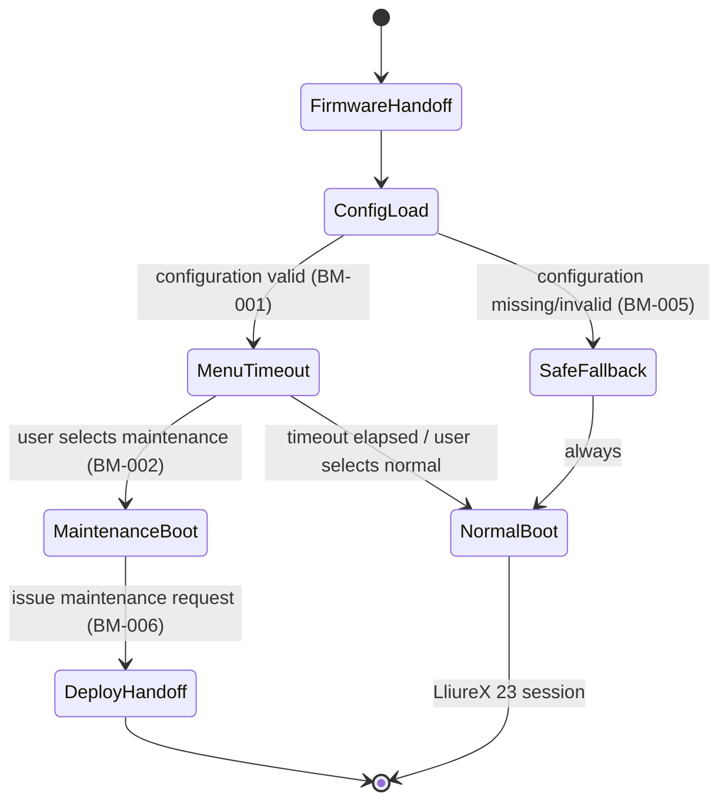

# Boot Manager — Architecture

See also: [docs/specifications/boot-manager.md](../specifications/boot-manager.md) for the normative requirements this design must satisfy, and [boot-manager/README.md](../../boot-manager/README.md) for the component's current status.

## Purpose

Boot Manager owns everything that happens on a classroom PC between power-on and either (a) a usable LliureX 23 session, or (b) a deliberate maintenance action. It is the only BCS component whose logic executes, unattended, on every single boot of every single machine — which shapes almost every design decision below.

## Responsibilities

- Present a themed boot menu within a bounded, configurable timeout (`BM-001`).
- Offer at least two paths: normal boot and maintenance boot (`BM-002`).
- Manage the UEFI NVRAM boot entries required for the menu to appear reliably (`BM-003`).
- Apply branding from [`assets/`](../../assets/) without requiring code changes (`BM-004`).
- Fall back safely to the installed OS if its own configuration is broken (`BM-005`).
- Issue maintenance/re-imaging requests to Deploy, identifying the requesting machine (`BM-006`).
- Present UI text in Valencian and Spanish (`BM-007`).

## Boot State Machine

The critical property of this state machine is that **every path not explicitly leading to `MaintenanceBoot` converges on `NormalBoot`** — including the `SafeFallback` path taken when configuration is broken (`BM-005`). There is no state from which the machine can end up neither booted nor in a deliberate maintenance session.

## Key Design Constraints

### UEFI, not BIOS

Boot Manager assumes UEFI firmware exclusively (`PLAT-003`). This removes an entire category of legacy boot-order/MBR complexity, but introduces UEFI-specific concerns: NVRAM boot entry management (which can be firmware-quirky across OEMs and models found in classroom hardware refreshes), and Secure Boot (`PLAT-004`), which constrains what can be executed in the boot chain without either a signed chain of trust or an explicit, deliberate opt-out. Boot Manager is an intended consumer of the [Host Inventory subsystem](../HOST_INVENTORY.md) (`bcs inventory`)'s `firmware` section — the single source of truth for whether a given machine is UEFI-capable and its observed Secure Boot state, rather than a second, Bash-specific probe of the same facts.

### Safety Over Availability of the Menu

Per the design principle "fail toward safety, not toward menu" (see [overview.md](overview.md)), if Boot Manager's configuration is missing or invalid, the correct behavior is to boot the installed LliureX 23 system directly (`BM-005`) — not to halt, not to loop, and not to require physical intervention. A boot menu is a convenience for maintenance; it must never become a single point of failure for getting a classroom running at the start of a lesson.

### The Maintenance Path Is an Interface, Not a Feature

The maintenance boot path (`BM-002`, `BM-006`) is the concrete implementation of the "maintenance request" interface described in [ARCHITECTURE.md §4](../../ARCHITECTURE.md#4-component-boundaries). Boot Manager does not implement re-imaging itself — it identifies the machine and hands off to Deploy. This keeps Boot Manager small, and keeps imaging logic in exactly one place (Deploy).

### Theming as Data, Not Code

Branding (logos, icons, backgrounds, fonts — see [assets/README.md](../../assets/README.md)) must be swappable per deployment without touching Boot Manager's logic (`BM-004`). This matters because different centres (not just CIPFP Batoi) are expected to reuse BCS with their own branding.

## Open Questions

These are flagged here rather than silently assumed; resolving them is expected to happen via ADRs during [Phase 1](../../ROADMAP.md#phase-1--boot-manager-design-validation):

- Exact mechanism for UEFI NVRAM boot entry management across the range of OEM firmware found in classroom hardware (`BM-003`) — reliability varies significantly by vendor. A read-only inspection step (the EFI Adapter, `bcs.platform.adapters.efi` — see [docs/EFI_ADAPTER.md](../EFI_ADAPTER.md) and [ADR-0010](../decisions/0010-efi-adapter-read-only-scope.md), design accepted, not yet implemented) is intended to precede any *write*/management capability, so real boot-entry data can be observed across real hardware first; it does not itself resolve this question.
- Precise format and transport of the maintenance request (`BM-006`) — this is a joint interface with Deploy and should be decided jointly.
- Secure Boot posture: ship a signed boot chain vs. document a supported "Secure Boot disabled" deployment mode (`PLAT-004`).
