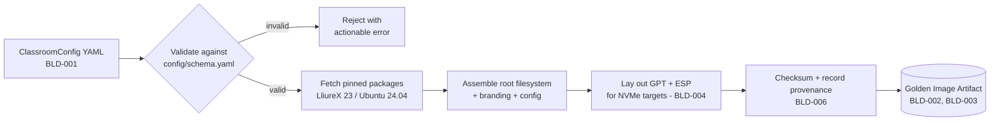

# Builder — Architecture

See also: [docs/specifications/builder.md](../specifications/builder.md) for the normative requirements this design must satisfy, and [builder/README.md](../../builder/README.md) for the component's current status. Invoked by a technician via `bcs build` — see [docs/CLI.md](../CLI.md#bcs-build). Builder is an intended consumer of the [Host Inventory subsystem](../CLI.md#the-host-inventory-subsystem) (`bcs inventory`) — e.g. to confirm a build host meets `PLAT-005`/tooling prerequisites before starting a build.

## Purpose

Builder turns a declarative description of "what a classroom PC should be" into a versioned, reproducible disk image — the golden image that Deploy later distributes to a fleet. Builder is the single point where package versions, base OS version, and classroom-specific customisation are pinned.

## Responsibilities

- Accept a declarative recipe — the `spec.builder`/`spec.packages` sections of the unified [BCS configuration](../CONFIGURATION.md) — describing package sets, configuration, and branding (`BLD-001`).
- Produce a versioned image artifact traceable to the recipe and base OS versions (`BLD-002`).
- Produce output Deploy can consume via Clonezilla — partclone-compatible partition images (`BLD-003`).
- Lay out a UEFI-compatible partition scheme (GPT + ESP) suitable for NVMe targets (`BLD-004`).
- Given the same recipe and pinned inputs, produce a reproducible image (`BLD-005`).
- Record build provenance: recipe version, base OS version, build date, artifact checksum (`BLD-006`).

## Build Pipeline

Rejection at the validation step (rather than partway through assembly) is deliberate: a bad recipe should fail fast and cheaply, not after packages have already been fetched.

## Key Design Constraints

### The Recipe Is the Source of Truth

Builder's input is a declarative recipe, not an imperative script that happens to produce an image. This is what makes `BLD-005` (reproducibility) and `BLD-006` (provenance) achievable: a recipe can be diffed, reviewed, and versioned independently of the build tooling that consumes it. The recipe format is defined in [docs/CONFIGURATION.md](../CONFIGURATION.md) and [config/schema.yaml](../../config/schema.yaml) (see [ADR-0005](../decisions/0005-yaml-as-unified-configuration-format.md)); implementing a validator against that schema remains a [Phase 2](../../ROADMAP.md#phase-2--builder-golden-image-pipeline) deliverable.

### Golden Image, Not Golden Machine

Builder's output is an artifact — a versioned, checksummed image — never a live, hand-tuned machine that "happens to be right." Any customisation that exists only on a physical machine and not in the recipe is, by definition, not reproducible and therefore not something Deploy can safely replicate across a fleet. This is the architectural reason recipes exist at all.

### Output Format Is Downstream-Constrained

Builder does not choose its output format freely: it must produce something Deploy can drive through Clonezilla (`BLD-003`), on a GPT + ESP layout that Boot Manager can then discover at boot (`BLD-004`). Builder's format choices are therefore constrained by both downstream components — this is why [ADR-0003](../decisions/0003-clonezilla-as-deployment-engine.md) (choosing Clonezilla) is a decision that affects Builder even though Builder doesn't run Clonezilla itself.

### Provenance Is Not Optional

Because a single golden image gets multiplied across an entire classroom (and potentially an entire centre) by Deploy, an unverified or ambiguous artifact is a fleet-wide risk, not a single-machine inconvenience. `BLD-006`'s provenance record (recipe version, base OS version, build date, checksum) is what Deploy verifies against (`DEP-004`) and what makes an incident traceable back to a specific recipe.

## Open Questions

To be resolved during [Phase 2](../../ROADMAP.md#phase-2--builder-golden-image-pipeline):

- Degree of reproducibility achievable in practice (`BLD-005`) given upstream Ubuntu/LliureX package churn — "bit-for-bit identical" vs. "same package set and configuration." [docs/CONFIGURATION.md](../CONFIGURATION.md) adds a `baseImage.pinnedSnapshot` field to narrow this, but the achievable degree of reproducibility in practice is still unvalidated.
- Where build provenance records are stored and how Deploy queries them at verification time (`DEP-004`) — the storage/hosting architecture for the artifact itself remains undefined (see [REVIEW.md §1.2](../../REVIEW.md#12-no-storagehosting-architecture-for-the-golden-image-artifact)).
- How `spec.packages.profiles` (named package groups) are selected per machine or classroom subset — see [docs/CONFIGURATION.md §Open Questions](../CONFIGURATION.md#open-questions).
