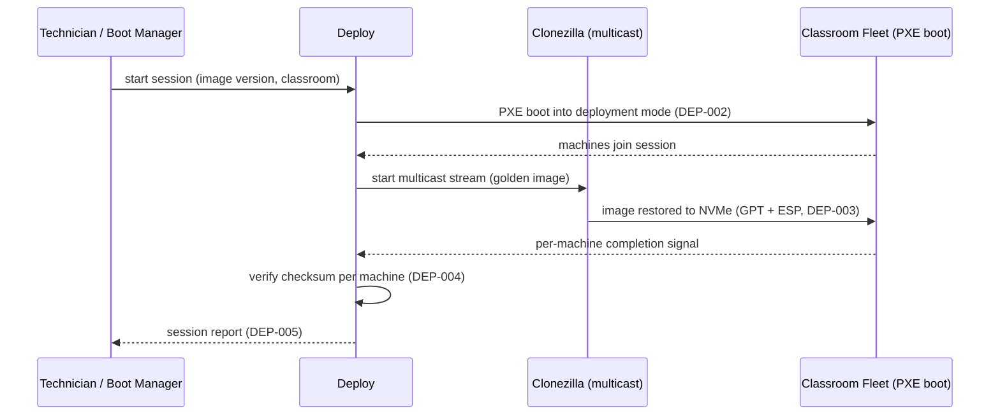

# Deploy — Architecture

See also: [docs/specifications/deploy.md](../specifications/deploy.md) for the normative requirements this design must satisfy, and [deploy/README.md](../../deploy/README.md) for the component's current status.

## Purpose

Deploy gets a Builder-produced golden image onto a fleet of physical classroom machines, and confirms it arrived intact. It orchestrates Clonezilla rather than reimplementing disk cloning, and is the counterpart Boot Manager calls into when a machine requests re-imaging.

## Responsibilities

- Image a single machine (unicast) and a full classroom (multicast) from the same artifact (`DEP-001`).
- Support PXE network boot as an entry point, requiring no local bootable media (`DEP-002`).
- Restore the disk layout Boot Manager expects — ESP plus any recovery partition — on NVMe targets (`DEP-003`).
- Verify deployed images against the artifact's checksum and report success/failure per machine (`DEP-004`).
- Produce a session report suitable for a single technician auditing a rollout (`DEP-005`).
- Accept and schedule/execute maintenance requests originating from Boot Manager (`DEP-006`).
- Complete a full-classroom multicast deployment within a single class period for the reference classroom size (`DEP-007`, `NFR-002`).

## Multicast Deployment Sequence

A single machine's failure at any step is isolated to that machine's row in the session report (`DEP-005`) — it does not abort the multicast stream for the rest of the classroom (`NFR-001`).

## Key Design Constraints

### Orchestration, Not Reimplementation

Deploy's job is to orchestrate Clonezilla sessions (unicast and multicast) and PXE boot flow — not to reimplement disk cloning. See [ADR-0003](../decisions/0003-clonezilla-as-deployment-engine.md) for why Clonezilla specifically was chosen over alternatives. This keeps Deploy's own scope bounded to scheduling, network orchestration, verification, and reporting.

### A Classroom Is the Unit of Work

`DEP-001` and `DEP-007` treat "a classroom" (20–30 machines on one switch, per `NFR-002`) as the natural unit of a deployment session, driven by multicast. Unicast exists for the single-machine case (e.g., a maintenance request from one machine via `DEP-006`), but the performance target and the operational reporting (`DEP-005`) are designed around whole-classroom sessions, because that's the actual recurring operational event (start of term, hardware refresh, golden image update).

### Resumability Is Load-Bearing

`NFR-001` (safe resumability after a network interruption or single-machine failure) is not a nice-to-have: a 30-machine multicast session where one machine's failure aborts or corrupts the session for the other 29 is operationally unacceptable for a single technician running it during a class period. Session design must isolate per-machine failure from the rest of the session.

### Verification Closes the Loop with Builder

`DEP-004`'s checksum verification is the deploy-time half of Builder's `BLD-006` provenance recording — Deploy does not just trust that imaging succeeded; it confirms the deployed bits match what Builder produced. This is also the basis for `NFR-004` (auditability): a session report can state, per machine, exactly which verified image version is now running.

### The Boot Manager Handshake

`DEP-006` is the deploy-side half of the maintenance-request interface described in [ARCHITECTURE.md §4](../../ARCHITECTURE.md#4-component-boundaries) and [boot-manager.md](boot-manager.md). Its exact transport/format is an open, jointly-owned question — see below.

## Open Questions

To be resolved during [Phase 3](../../ROADMAP.md#phase-3--deploy-single-classroom-rollout) and [Phase 4](../../ROADMAP.md#phase-4--integration-closed-loop):

- Exact PXE/multicast session scheduling model: always-on deployment server vs. on-demand session start triggered by a technician or by a Boot Manager maintenance request.
- Format and transport of the maintenance request from Boot Manager (joint decision with [boot-manager.md](boot-manager.md)).
- Where and how session reports (`DEP-005`) are persisted and surfaced to a technician managing multiple classrooms.
- Network trust model for PXE/multicast traffic on the classroom LAN (see [SECURITY.md](../../SECURITY.md#security-relevant-design-areas)).
