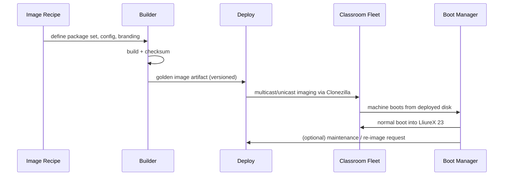

# Architecture Overview

This is the entry point into the detailed, per-component architecture documentation. For the condensed, top-level view, see [ARCHITECTURE.md](../../ARCHITECTURE.md); this page adds detail that doesn't fit there without overloading it.

## The Classroom PC Lifecycle

Every machine BCS manages moves through the same three-phase lifecycle, repeatedly, for as long as it's in service:

This diagram is the same lifecycle described narratively in [ARCHITECTURE.md §2](../../ARCHITECTURE.md#2-system-overview); it's included here because implementers of any one component need to see themselves in the sequence of *all three*, not just their own box.

## Design Principles

These principles apply across all three components and should guide any design decision not explicitly covered by a requirement in [SPECIFICATION.md](../../SPECIFICATION.md):

1. **Specific over generic.** BCS targets LliureX 23 / Ubuntu 24.04 / UEFI / NVMe / Clonezilla specifically. Resist abstracting for hypothetical other platforms — that abstraction has a cost (see [ADR-0002](../decisions/0002-three-component-separation.md)) and no current customer.
2. **Artifacts over shared state.** Components hand each other versioned, checksummed artifacts (an image, a disk layout, a maintenance request) rather than sharing databases, config files, or runtime state. This is what makes independent versioning and independent operation possible.
3. **Fail toward safety, not toward menu.** Boot Manager in particular must fail toward "boot the installed OS" rather than toward "show a broken menu" — a stalled boot menu on 30 machines during a class period is a worse outcome than silently skipping straight to the installed system.
4. **A single technician is the operator.** Every design decision should be evaluated against "can one person run this across a whole centre," not against a hypothetical dedicated ops team. This drives the emphasis on reporting (DEP-005), idempotency (NFR-007), and fallback behavior (BM-005).

## Per-Component Detail

- [boot-manager.md](boot-manager.md)
- [builder.md](builder.md)
- [deploy.md](deploy.md)

## Related

- [SPECIFICATION.md](../../SPECIFICATION.md) — normative requirements referenced throughout these documents.
- [decisions/](../decisions/) — ADRs recording why specific architectural choices were made.
