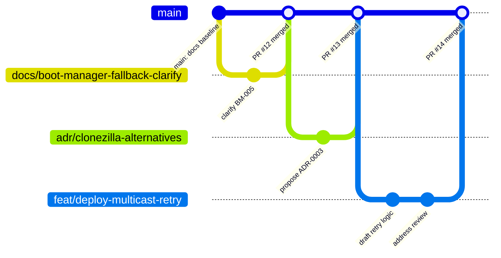
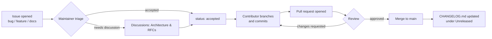

# Development Workflow

This document describes, end to end, how a change moves from idea to merged commit in BCS. `CONTRIBUTING.md` is the short version; this is the reference.

## Branching Model

BCS uses **trunk-based development**: `main` is always releasable (or, during Phase 0, always internally consistent documentation), and all work happens on short-lived branches merged back via pull request. There are no long-lived `develop` or per-component branches — component independence (see [ARCHITECTURE.md §4](../../ARCHITECTURE.md#4-component-boundaries)) is achieved through directory and interface boundaries, not through git branches.

Branch names follow `type/short-description`, per [naming-conventions.md](../standards/naming-conventions.md#git-branches).

## From Issue to Merge

1. **Triage.** Every new issue starts `status: triage` (see [.github/LABELS.md](../../.github/LABELS.md)). A maintainer applies a `component:` label and either `status: accepted` or moves the conversation to [Discussions → Architecture & RFCs](../../.github/DISCUSSIONS.md) if it needs more shape first.
2. **Branch.** Named per [naming-conventions.md](../standards/naming-conventions.md#git-branches).
3. **Commit.** [Conventional Commits](https://www.conventionalcommits.org/), per [naming-conventions.md](../standards/naming-conventions.md#commits).
4. **Pull request.** Uses [.github/PULL_REQUEST_TEMPLATE.md](../../.github/PULL_REQUEST_TEMPLATE.md); links the issue or ADR it addresses.
5. **Review.**
   - **Standard changes** (documentation clarity, bug fixes, additive detail): one maintainer approval.
   - **Changes to `ARCHITECTURE.md`, `SPECIFICATION.md`, or a documented component interface**: one maintainer approval **plus** an accompanying ADR under [docs/decisions/](../decisions/) (see [CONTRIBUTING.md](../../CONTRIBUTING.md#proposing-an-adr)).
   - **Changes to component implementation code** (once it exists): review additionally checks conformance to [docs/standards/coding-standards.md](../standards/coding-standards.md) and [bash-style-guide.md](../standards/bash-style-guide.md).
6. **Merge.** Squash merge is the default, keeping `main`'s history one logical change per commit. A merge commit is acceptable for a PR that's intentionally a sequence of independently-meaningful commits (e.g., a multi-ADR batch) — the author should say so in the PR description.
7. **Changelog.** Any user- or contributor-visible change updates [CHANGELOG.md](../../CHANGELOG.md) under `[Unreleased]` as part of the same PR, not a follow-up.

## CI Expectations

A CI pipeline exists today ([.github/workflows/ci.yml](../../.github/workflows/ci.yml)), scoped to `cli/`/`config/`: Ruff lint and format, mypy (strict), pytest (Python 3.12/3.13), and a `bcs` smoke-test job. It does not yet gate on:

- Markdown link/anchor validity (the same check described in this project's own review process — see the link-checker approach used to validate this documentation set).
- [ShellCheck](https://www.shellcheck.net/) and `shfmt` for any Bash (per [bash-style-guide.md](../standards/bash-style-guide.md#tooling)) — not yet relevant, since Boot Manager/Builder/Deploy have no Bash implementation yet.
- `bats` test suite for Bash components, once they exist.

Until these are added, these specific checks are the reviewer's responsibility, applied manually.

## Definition of Done

A change is done when:

- It's merged to `main`.
- Any normative document it affects (`SPECIFICATION.md`, `ARCHITECTURE.md`) is internally consistent with the rest of the docs set (cross-references, requirement IDs).
- `CHANGELOG.md` reflects it under `[Unreleased]`.
- Any ADR it required is `Accepted`, not left `Proposed`.
