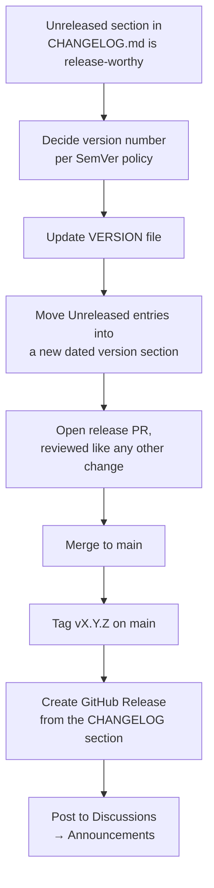

# Release Process

BCS has not yet shipped a `1.0.0` release, but the process is documented now rather than invented under pressure at the first release — a 10-year-maintained project should never be improvising its release mechanics.

## Versioning Policy

BCS follows [Semantic Versioning](https://semver.org/) (`MAJOR.MINOR.PATCH`):

- **Pre-1.0 (`0.y.z`):** anything may change between minor versions, including requirements in `SPECIFICATION.md` and interfaces in `ARCHITECTURE.md`. This covers the entire [Phase 0–5](../../ROADMAP.md) span.
- **`1.0.0`:** the first release where the interfaces between Boot Manager, Builder, and Deploy (see [ARCHITECTURE.md §4](../../ARCHITECTURE.md#4-component-boundaries)) are considered stable and CIPFP Batoi can run it in production, per the [v1.0 milestone](../../ROADMAP.md#v10--general-availability).
- **Post-1.0 `MAJOR`:** a breaking change to a documented component interface or a supported platform requirement (`PLAT-xxx`).
- **Post-1.0 `MINOR`:** backward-compatible functionality (a new capability, a new supported hardware profile) added to any component.
- **Post-1.0 `PATCH`:** backward-compatible fixes.

The current version is the single line in [VERSION](../../VERSION).

## What Triggers a Release

A release is cut when the accumulated `[Unreleased]` section in [CHANGELOG.md](../../CHANGELOG.md) represents a coherent, useful checkpoint — not on a fixed calendar cadence. During Phase 0, that means a meaningful documentation/architecture milestone (e.g., "specification stable enough to start Boot Manager implementation"); post-implementation, it means a working, tested increment of one or more components.

## Release Checklist

1. Confirm `[Unreleased]` in `CHANGELOG.md` is release-worthy (see above).
2. Decide the version number per the policy above; when in doubt about MAJOR vs. MINOR, err toward MAJOR for anything touching a component interface.
3. Update [VERSION](../../VERSION) to the new version string.
4. Rewrite `CHANGELOG.md`: rename `[Unreleased]` to `[X.Y.Z] - YYYY-MM-DD`, add a fresh empty `[Unreleased]` section above it, and update the comparison links at the bottom of the file.
5. Open this as its own pull request (release PRs are not bundled with unrelated feature/doc work) and get it reviewed like any other change, per [development-workflow.md](development-workflow.md).
6. On merge, tag the resulting commit on `main` as `vX.Y.Z`.
7. Create a GitHub Release from that tag, using the corresponding `CHANGELOG.md` section as the release body.
8. Announce it in [Discussions → Announcements](../../.github/DISCUSSIONS.md).

## Pre-1.0 Caveat

Because BCS is pre-1.0, releases during Phase 0–5 primarily mark documentation/architecture maturity, not shipped software — a release like `v0.3.0` might mean "Boot Manager's specification is implementation-ready," not "Boot Manager is installable." The release notes should say plainly which of these a given release represents, so downstream readers (including other centres evaluating BCS) don't assume more maturity than exists.

## Maintenance/Patch Releases

Pre-1.0, patch releases are rare (documentation corrections rarely need their own release rather than just landing on `main`). Post-1.0, if a patch is needed for a version other than the latest, a short-lived `release/X.Y` branch is cut from the relevant tag, the fix is cherry-picked, and a new `PATCH` tag is created from that branch — `main` continues independently. This is the only case where a longer-lived branch is expected to exist alongside trunk-based `main` development (see [development-workflow.md](development-workflow.md#branching-model)).
