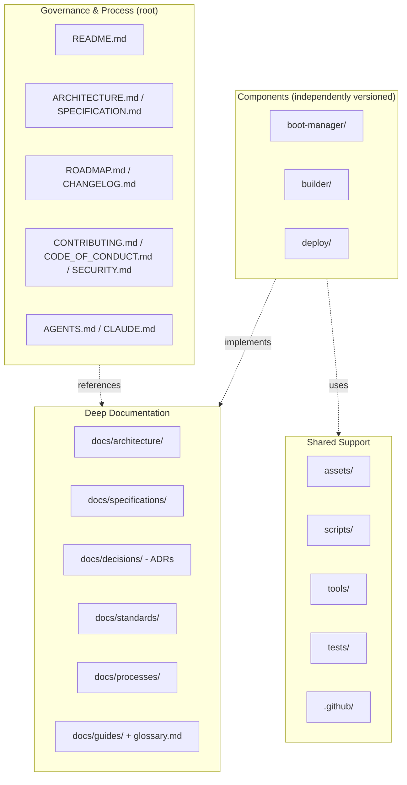

# Repository Organization

This document is the canonical reference for how the BCS repository is laid out and why. `README.md` shows a summarized tree for newcomers; this page explains the reasoning so the structure stays intentional as the project grows over its multi-year maintenance horizon.

## Grouping Model

Every top-level entry belongs to exactly one of four groups. When adding something new, decide which group it belongs to before deciding where the file goes — the group, not convenience, determines the location.



## Top-Level Layout

```
batoi-classroom-suite/
├── README.md                 # Project entry point: mission, components, status
├── ARCHITECTURE.md           # System design (normative, condensed)
├── SPECIFICATION.md          # Requirements (normative, condensed, requirement IDs)
├── ROADMAP.md                # Phased delivery plan
├── CHANGELOG.md              # Keep a Changelog, tracks the Unreleased/versioned history
├── CONTRIBUTING.md           # Contribution workflow
├── CODE_OF_CONDUCT.md        # Community standards (Contributor Covenant)
├── SECURITY.md               # Vulnerability reporting and security-sensitive design areas
├── AGENTS.md                 # Vendor-neutral working agreement for AI coding agents
├── CLAUDE.md                 # Claude Code-specific notes (imports AGENTS.md)
├── LICENSE                   # MIT
├── VERSION                   # Current version, single line, consumed by release tooling
├── .gitignore
│
├── boot-manager/             # Component: boot-time experience (see below)
├── builder/                  # Component: golden image build pipeline
├── deploy/                   # Component: fleet deployment via Clonezilla
│
├── docs/                     # Deep documentation — see docs/README.md
│   ├── architecture/         # Per-component architecture deep-dives
│   ├── specifications/       # Per-component requirements
│   ├── decisions/            # Architecture Decision Records (ADRs)
│   ├── standards/            # Coding, Bash, Markdown, naming conventions
│   ├── processes/            # Development workflow, release process
│   ├── guides/                # Contributor-facing guides (getting started, FAQ)
│   ├── glossary.md
│   └── repository-organization.md  # This file
│
├── assets/                   # Shared branding assets (logos, icons, fonts, backgrounds)
├── scripts/                  # Maintainer/CI housekeeping scripts
├── tools/                    # Developer tooling
├── tests/                    # Cross-component integration test strategy
└── .github/                  # Issue templates, PR template, labels, Discussions categories
```

## Placement Rules

Use these rules when deciding where a new file belongs, rather than re-deciding from scratch each time:

1. **Normative vs. descriptive.** `ARCHITECTURE.md` and `SPECIFICATION.md` at the root stay condensed and normative — requirement IDs and component boundaries live there. Anything that explains, justifies, or expands on a requirement belongs under `docs/`, linked back from the root document, never duplicated into it.
2. **Decisions are append-only.** A choice with real cost to reverse gets an ADR in `docs/decisions/`, numbered sequentially, never edited after acceptance (see [docs/decisions/README.md](decisions/README.md)). It does not get folded into `ARCHITECTURE.md` prose, which would erase the reasoning.
3. **Components don't share implementation directories.** Code (once written) for `boot-manager/`, `builder/`, and `deploy/` stays inside each component's own directory. Cross-component test scenarios go in `tests/`; component-local tests stay with the component (see [tests/README.md](../tests/README.md)).
4. **Conventions live once, in `docs/standards/`.** Coding, Bash, Markdown, and naming conventions are documented once and linked from wherever they're relevant (`CONTRIBUTING.md`, component READMEs) — never restated.
5. **Process is documented where it's followed, not where it's invented.** `docs/processes/` documents the actual development and release workflow; `CONTRIBUTING.md` stays the short, contributor-facing entry point that links into it.

## Related

- [docs/README.md](README.md) — index of the `docs/` tree.
- [ARCHITECTURE.md §4](../ARCHITECTURE.md#4-component-boundaries) — why the three components are separated.
- [AGENTS.md](../AGENTS.md) — the repository map maintained for AI agents, kept consistent with this document.
